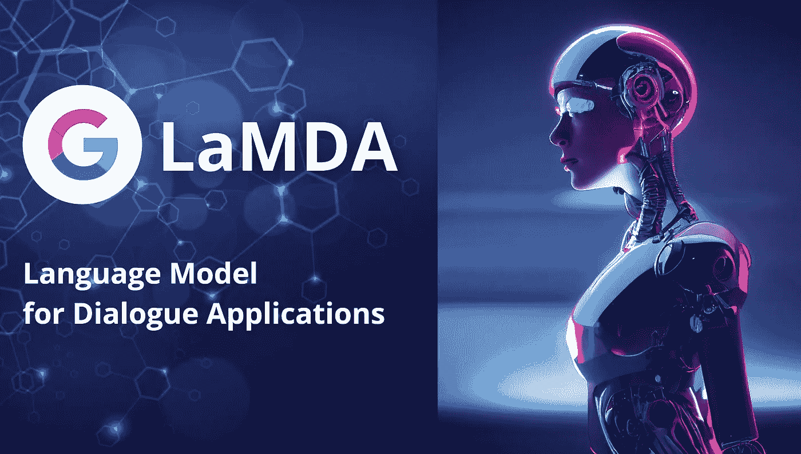

# 还记得谷歌的病毒式“感知”人工智能吗？它现在对候补名单开放

> 原文：<https://medium.com/mlearning-ai/remember-googles-viral-sentient-ai-it-s-now-open-for-waitlist-c01d46b9035e?source=collection_archive---------0----------------------->

Image by [Jim Clyde Monge](https://medium.com/u/819323b399ac?source=post_page-----c01d46b9035e--------------------------------). Made with Canva

三个月前，在谷歌研究员布雷克·莱莫因声称语言模型是有感知能力的之后，谷歌的 [LaMDA](https://blog.google/technology/ai/lamda/) 迅速走红。

你可以在这里阅读他对 LaMDA [的完整采访。](https://cajundiscordian.medium.com/is-lamda-sentient-an-interview-ea64d916d917)

不确定谷歌的 AI 聊天机器人有没有灵魂？试着自己和它说话。