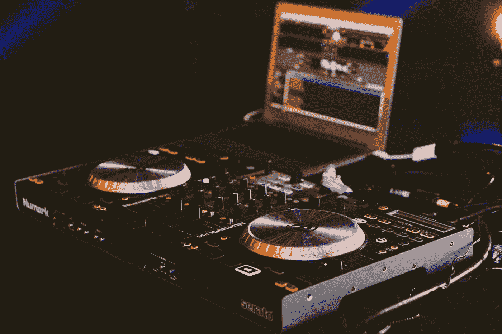

# 使用人工智能混音音乐

> 原文：<https://medium.com/mlearning-ai/remixing-music-using-ai-bcd81d887ba2?source=collection_archive---------1----------------------->

你是 DJ 还是喜欢音乐，尤其是混音和混搭？那太完美了，因为这篇文章是为你而作的！

Photo by [Gabriel Barletta](https://unsplash.com/@gabebarletta?utm_source=medium&utm_medium=referral) on [Unsplash](https://unsplash.com?utm_source=medium&utm_medium=referral)

在本文中，我们将使用人工智能创作以下歌曲: