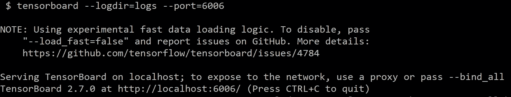

# 在本地浏览器上远程浏览 Tensorboard

> 原文：<https://medium.com/mlearning-ai/remote-tensorboard-viewing-on-your-local-browser-b0dc5c5a634a?source=collection_archive---------2----------------------->

张量流是流行的机器学习框架之一。缓解了 ML 开发者，尤其是深度学习开发者的生活。Tensorboard 是 TF 的可视化工具包。该工具包将准确性和损失、模型图(操作和层)以及许多您知道的其他度量可视化(如果您不知道，您可以从这里的[学习](https://www.tensorflow.org/tensorboard))。为了使用这个工具包，必须将一些代码行添加到用于**日志**的 Python 源代码中，如下所示:

```
**import datetime**# Create a TensorBoard callback**profile_logs = "logs/" + datetime.datetime.now().strftime("%Y%m%d-%H%M%S")****tboard_callback = tf.keras.callbacks.TensorBoard(log_dir = profile_logs, histogram_freq = 1, profile_batch = '500,520')**model.fit(training_data, training_labels, epochs=15,   **callbacks=[tboard_callback]**)
```

然后，通过下面的命令，Tensorboard 将在您正在连接的服务器的 **6006** 端口上启动，并与它建立 SSH 连接。

```
**$ tensorboard --log-dir=logs**
```

但是，您希望能够在本地机器浏览器上打开并查看 Tensorboard。为此，请遵循以下步骤:

1.  通过将远程服务器的端口 6006 转换到您想要查看 Tensorboard 的端口(如 16006)来连接到服务器。

```
**$** ssh **-L 16006:127.0.0.1:6006** user@server
```

2.启动冲浪板

```
**$ tensorboard --logdir="profile-logs" --port=6006**
```



3.打开浏览器，输入:

```
**127.0.0.1:16006**
```

或者

```
**localhost:16006**
```

# 参考和有用的链接

[](https://stackoverflow.com/questions/37987839/how-can-i-run-tensorboard-on-a-remote-server) [## 如何在远程服务器上运行 Tensorboard？

### 这不是一个合适的答案，但是一个疑难解答，希望能帮助像我一样的其他不太老练的社交者。在我的情况下…

stackoverflow.com](https://stackoverflow.com/questions/37987839/how-can-i-run-tensorboard-on-a-remote-server) [](https://www.tensorflow.org/tensorboard/tensorboard_profiling_keras) [## 张量流分析器:分析模型性能|张量板

### 机器学习算法通常计算量很大。因此，量化…的性能至关重要

www.tensorflow.org](https://www.tensorflow.org/tensorboard/tensorboard_profiling_keras) [](https://www.tensorflow.org/install/gpu#linux_setup) [## GPU 支持| TensorFlow

### 注意:GPU 支持适用于带有 CUDA 卡的 Ubuntu 和 Windows。TensorFlow GPU 支持需要…

www.tensorflow.org](https://www.tensorflow.org/install/gpu#linux_setup) [](https://www.tensorflow.org/guide/profiler) [## 使用 Profiler | TensorFlow Core 优化 TensorFlow 性能

### 本指南演示了如何使用 TensorFlow Profiler 提供的工具来跟踪您的性能…

www.tensorflow.org](https://www.tensorflow.org/guide/profiler) [](/mlearning-ai/mlearning-ai-submission-suggestions-b51e2b130bfb) [## Mlearning.ai 提交建议

### 如何成为 Mlearning.ai 上的作家

medium.com](/mlearning-ai/mlearning-ai-submission-suggestions-b51e2b130bfb)