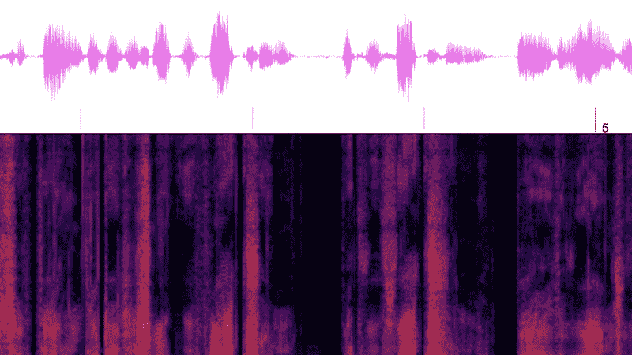

# 去除音频文件中的噪音

> 原文：<https://medium.com/mlearning-ai/remove-noise-from-audio-files-ceca3c37dcdb?source=collection_archive---------0----------------------->

## [机器学习艺术](https://mlearning.substack.com)

## 使用深度学习—演示+代码

[This demo denoises audio files using DeepFilterNet. Try it with your own voice!](https://mlearning.substack.com)

许多系统，如自动**语音识别**、**视频聊天**系统和辅助**听力设备**，都使用单耳语音增强。大多数**最先进的**技术使用深度神经网络来估计短时傅立叶变换(STFT)表示中的 TF 掩模，其中许多…