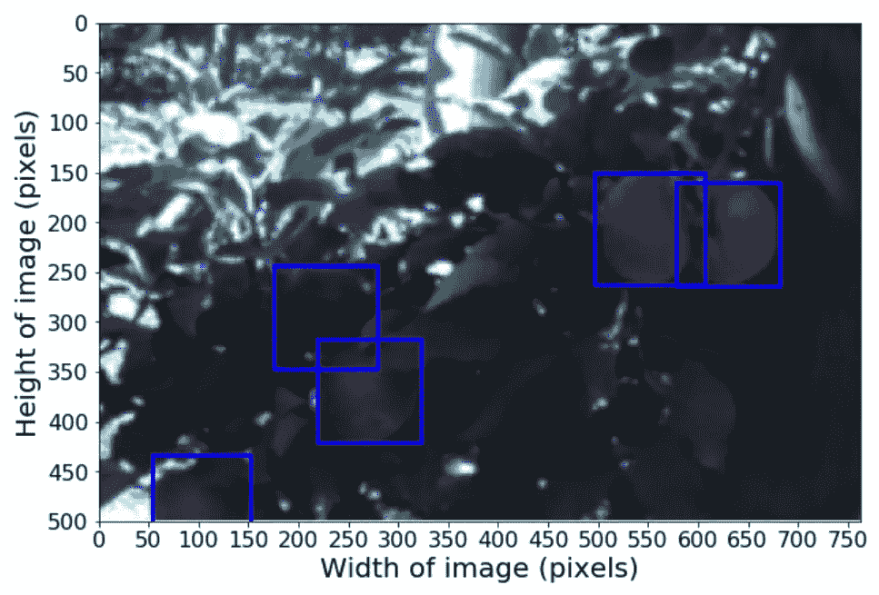
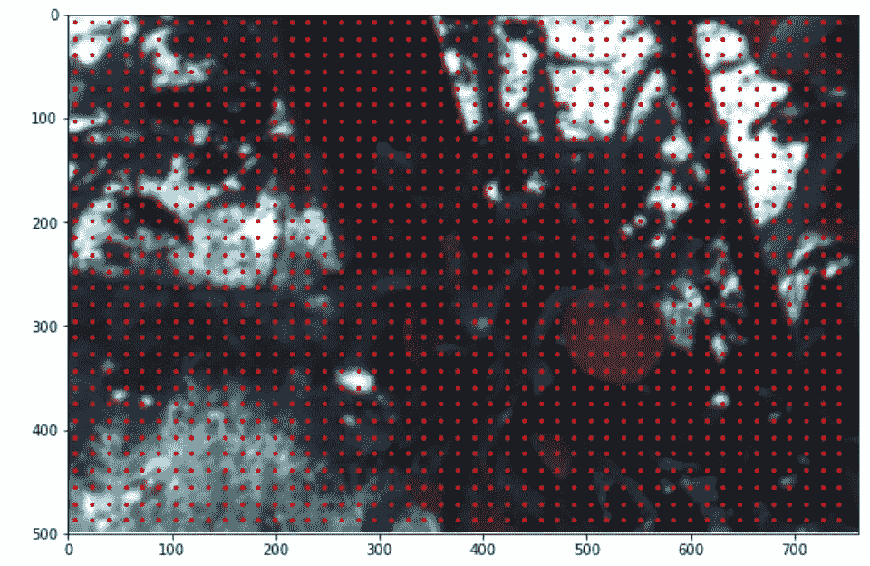
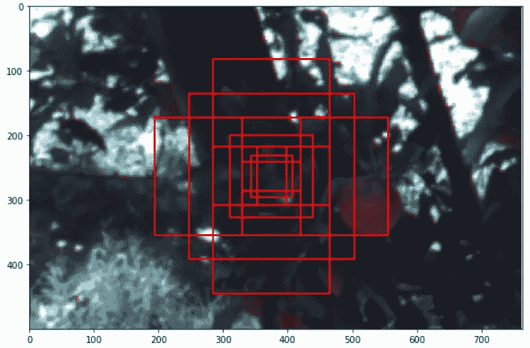
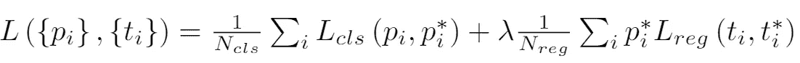
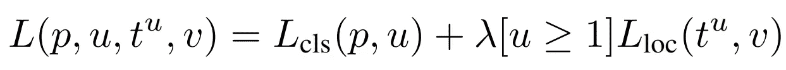

# 果园水果深度检测论文的复制

> 原文：<https://medium.com/mlearning-ai/reproducibility-for-deep-fruit-detection-in-orchards-e518367ccf35?source=collection_archive---------2----------------------->

这篇博客的作者是斯坦·兹温克尔斯、泰德·德·弗里斯·伦奇和 T2。

这篇博文旨在展示我们复制论文[果园深度水果检测](https://arxiv.org/abs/1610.03677)的尝试。该论文的作者创建了一个准确可靠的基于图像的水果检测系统，用于检测苹果、芒果和杏仁。在这篇博客中，我们解释了我们为复制论文中的图 2 所做的努力。我们将解释训练我们的模型和我们的思想所采取的步骤，以及与原始论文不同的实现步骤。作者没有公开他们的代码，因此 Python 代码完全是自制的。这篇博客强调了一些在原始论文中没有充分讨论的重要注意事项，这使得实现变得有点困难。本博客是代尔夫特大学深度学习课程(CS4240)的一部分。其他博文可以在这里[找到。](https://reproducedpapers.org)

# 1.介绍

有许多检测论文可用，但只有少数论文在真正适用的数据集上进行测试，而不是使用标准化数据集，如 ImageNet 或 CIFAR-10/100。论文《果园中的深层水果检测》试图为农业任务，如产量测绘和机器人收获，创建一个准确可靠的基于图像的水果检测系统。该网络的架构基于更快的 R- CNN。当时，当论文发表时(2016)，更快的 R-CNN 是一种最先进的对象检测框架(Ren 等人，2015)。为了验证这个框架的准确性和可靠性，作者在果园水果检测的背景下使用了更快的 R-CNN。目前，有其他更好的现有架构，其性能优于讨论中提到的更快的 R-Cnn。

在整个博客中，代码的小片段被呈现来充实文本。我们的代码可以在库 [DeepLearning_Group20](https://github.com/TedDeVriesLentsch/DeepLearning_Group20) 中找到。

## 资料组

论文的作者创建了一个包含数千张苹果、芒果和杏仁图像的数据集。这些图像是从澳大利亚不同的果园农场拍摄的。数据集中的图像已经用文本文件进行了注释和清晰的分隔，以指示训练集、验证集和测试集。值得注意的是，训练数据集包含一些没有正确注释的图像。这确实对准确度分数有影响，但是需要在进一步研究的基础上进一步调查。由于时间有限，只使用苹果数据集进行检测。不需要太多的调整，人们也应该能够在架构上训练和测试其他水果图像。

apple 训练数据集包含 1120 幅苹果树图像，大小为 202x308 像素。苹果的注释被构造为[center_x，center_y，radius]，它被转换为[x_min，x_max，y_min，y_max]坐标，因为更快的 R-CNN 框架使用矩形框。由于 VGG16 器件进行了二次采样(二次采样系数为 16)，所有图像的尺寸都调整为 500x764 像素。接下来，对于训练数据集，不包含任何苹果的图像被从数据集中移除。结果得到 846 个训练图像，然而，该论文指出应该有 729 个图像，因此我们使用更多的图像来训练网络。这种差异的原因不明。

Figure 1\. A training image after rescaling including the annotations for the apples.

# 2.更快的 R-CNN

这不是第一个讨论实现更快的 R-CNN 的博客，R-CNN 已经成为一种非常流行的方法，因为它可以实现对对象检测的高精度。快速 R-CNN 由三个部分组成，主干网络(VGG16 或 ZF)、区域提议网络(RPN)和快速 R-CNN。使用 VGG16 作为主干，因为该网络通过 PyTorch Torchvision(在 ImageNet 上培训)进行了预培训。在接下来的部分中，每个组件都将得到更详细的解释。

## 2.1.VGG16

VGG16 是一种卷积神经网络架构，用于提取每幅图像的特征。仅使用 VGG16 的前 30 层。尺寸为 3x500x762 的重新缩放图像作为输入给出。由于存在多个 max-pooling 图层，VGG16 网络会输出一个大小为 512x31x47 的要素地图。这些特征地图既用于 RPN，也用于快速 R-CNN 网络。获取 VGG16 前 30 层的代码如下所示。

Python implementation of VGG16.

## 2.2.区域提案网络(RPN)

VGG16 网络的输出用于区域建议网络(RPN)。RPN 的目标是创建盒子，并确定每个盒子包含对象的概率(二元分类:背景对前景)。由于跨度为 16，重新缩放的图像可以被分成边长为 16 的正方形。每个方块的中心如下所示。

Figure 2\. The center of every square is shown on the rescaled image.

对于每个正方形的每个中心，创建九个锚盒(三种不同的大小和三种比率)。导致整个图像上总共有 31*47*9=13.113 个锚定框。锚箱的尺寸没有在文件中规定，但是设置为[64，128，256 ]，宽/高比为[0.5，1，2]。锚箱尺寸的计算如下所示。

The calculation for computing the height and width of every anchor box.

Figure 3\. The 9 anchor boxes for only one center point.

13113 个锚盒覆盖了整个图像。位于图像外部的锚定框不用于训练并被移除。

下一步是将注释数据与创建的锚定框结合使用。对于每个锚定框，计算每个注释框的并集交集(IoU)。IoU 用于测量锚框与注释数据的重叠。

Python code to compute the Intersection over Union for every anchor box.

每个锚定框都有一个特定的分数，该分数指定了它与特定注释框的重叠程度。下一步是仅获得具有高于某个阈值的值的锚盒，并将它们标记为阳性。更快的 R-CNN 论文的作者使用 0.7 的阈值。IoU 小于 0.3 的锚框被标记为负锚框。所有其他锚盒都标记为-1，不能作为训练的一部分。

对于回归，使用回归参数创建一个数组，其中包含图像内锚定框的地面实况注释框参数。

Parameterization of the 4 coordinates.

最后，我们获得回归参数为 **regression_gt** 和一个数组，每个锚框有一个标签， **anchor_labels** 。

## 模型结构

锚盒的训练是用每个包含 256 个锚盒的小批量来完成的。对于每个小批量，使用一个图像，如果可能的话，一个批量包含 128 个阴性和 128 个阳性锚盒。如果具有正标签的锚盒少于 128 个，则取更多的负标签盒以达到 256 个盒。正负指数都是随机选取的。

在应用于分类和回归之前，特征图首先通过较小的卷积层。回归层给出一个提议框，可以用来分类里面有没有苹果。并且分类器用于检查背景或前景。

Convolutional layers for regression and classification.

下一步是计算分类器和回归的损失。使用交叉熵损失来计算分类损失。对于回归，使用平滑 L1 损失计算损失。更快的 R-CNN 论文指出，为了计算总损失回归，需要使用以下公式。

Figure 4\. Total loss for both classification and regression for training the RPN.

N_cls 是小批量的大小(256)，N_reg 是锚中心的总数(1457)。对于 lambda，作者没有指定他们的设置，所以它被设置为 10，如 fast R-CNN 论文中所述。

Losses for classification, regression, and total RPN loss.

有了损失函数，RPN 现在可以被训练来给出在预测的盒子中可能包含苹果的提议位置。在快速 R-CNN 可以用于预测所提出的盒子是否包含任何苹果之前，需要使用**convert _ to _ coordinates(…)**函数将回归参数转换回[x_min，x_max，y_min，y_max]坐标。

## 非最大抑制(NMS) — RPN

回归提出的坐标连同预测的标签被用于非最大值抑制，以去除重叠的建议锚框。对于非最大抑制，IoU 阈值为 0.7。因此，如果一个锚定框与另一个锚定框的 IoU 值大于 0.7，并且如果另一个锚定框具有更高的分数(更有可能它包含对象)，则移除该锚定框。

Non-maximum suppression after performing RPN.

## 2.3.快速 R-CNN

有了 RPN 创建的提案箱，下一步就是分类它们是否包含苹果。在第一步中，与 RPN 一样，将建议的锚框与注释数据进行比较，以再次使用 IoU 将这些框标记为负或正。然而，这一次使用了不同的阈值。如果某项提案的 IoU 值在区间[0.5，1]内，则该提案将获得正标签，如果 IoU 值在区间[0.1，0.5]内，则该提案将获得负标签。既不积极也不消极的建议会被贴上“无效”的标签。坐标被转移回建议的基本事实注释框的回归参数中，**建议 _ 标签**。

## 模型结构

建议标签用于创建小批量。这些小批各包含 128 个提案，来自两个不同的图像(各 64 个)。在这 64 个建议中，最多 16 个是正面的，最少 48 个是负面的，这取决于图像有多少正面标签。对于数据集，正框和建议框都是随机抽样的。

在分类和回归可以应用于小批量之前，建议的箱子经过自适应最大池，因为每个建议可以有不同的大小。每个建议的输出都是[7x7]的特征图。使用自适应最大池后，输出通过两个完全连接的层。然后，该输出将用于回归图层和分类图层。与 RPN 相同，回归预测框 ***y_reg*** 的回归参数。分类器对 ***y_cls*** 内是否有苹果进行分类。

Architecture for Fast R-CNN

分类器预测建议的盒子是否包含苹果。为了计算分类器和回归的损失，使用交叉熵损失来计算分类损失。对于回归，只有正面标记的建议框用于计算损失。使用平滑 L1 损耗来计算损耗。快速 R-CNN 的总损耗可以用与 RPN 类似的公式计算。只是这一次，lambda 被设置为 1。

Figure 5\. The loss function for an image, both classification, and regression.

如果作为苹果的得分高于 0.5，则用分类器生成的预测得分仅被标记为苹果。从集合中移除所有其他提议的盒子。接下来，只需要应用非最大抑制来移除重叠的建议框。

## 非最大抑制(NMS) — Fast-R-CNN

首先，需要使用**convert _ to _ coordinates(…)**函数将回归图层预测的坐标转换回[x_min，x_max，y_min，y_max]坐标。对于这些提议，应用非最大值抑制来移除阈值 0.2 以上的重叠框。这将删除大多数与其他框重叠过多的建议框。

# 3.培养

训练是实现更快的 R-CNN 网络的最后一步。RPN 和更快的 R-CNN 都用下面的设置分别训练。用于训练的优化器是随机梯度下降(SGD ),动量为 0.9，权重衰减为 0.0005，学习率为 0.001。这允许在 RPN 和 R-CNN 组件之间共享卷积层。在训练期间，VGG16 的前 10 层正在被冷冻。以避免过拟合并减少计算时间。此外，提前停止的停止次数为 10。最初的“水果”论文没有提到他们在训练数据时应用的任何其他方法。

# 4.结论

最终结果包含更快的 R-CNN 的完整实现。我们试图让我们的代码尽可能简单，让其他用户更容易复制或继续使用代码。然而，有一个问题。由于使用我们自己的 GPU 有问题，只能训练 RPN 网络。当运行整个代码时，我们都有一个内存不足的问题，我们不能及时解决。因此，我们推荐任何想要实现我们更快的 R-CNN 的人使用 google 的云计算。

尽管代码不能完全在标准的膝上型电脑上运行。该代码应该让其他用户更深入地了解更快的 R-CNN 的原理。我们确实有一些提示给将来想自己实现更快的 R-CNN 或其他网络的用户。

*   在使用 CPU 和 GPU 时保持一致，混合使用可能会导致错误。此外，从 GPU 中删除不使用的张量和模型。
*   请务必仔细检查您将要使用的数据集。
*   首先只在一个映像上实现您的网络，这将有助于您更容易地调试代码。

我们希望你能从我们的博客帖子和代码中学到一些东西。如果您有任何意见，请告诉我们，或者如果这篇文章有用，请鼓掌。谢谢大家！

# 5.参考

[1].任，孙，何，吉希克(2015)。更快的 r-cnn:用区域建议网络实现实时目标检测。 *arXiv 预印本 arXiv:1506.01497* 。

[2].吉尔希克河(2015 年)。快速 r-cnn。在*IEEE 计算机视觉国际会议论文集*(第 1440-1448 页)。

[3].巴尔戈蒂，s .，&安德伍德，J. (2017 年 5 月)。果园深度水果检测。在 *2017 IEEE 机器人与自动化国际会议(ICRA)* (第 3626–3633 页)。IEEE。

实现的代码可以在库 [DeepLearning_Group20](https://github.com/TedDeVriesLentsch/DeepLearning_Group20) 中获得。