# R-葡萄酒爱好者研究指南中的逻辑回归

> 原文：<https://medium.com/mlearning-ai/research-guide-with-logistic-regression-for-wine-lovers-f776a10fc163?source=collection_archive---------4----------------------->

这篇文章是为没有 R 中逻辑回归经验的人写的 ***。如果你熟悉这个理论，如果你正在寻找更高级的技术，我推荐你去搜索 Medium 上解释得更好的文章！***

research?

此外，这篇文章可能对那些在学术生活中从未从事过研究的本科生有所帮助。我试着把它说得非常简单，以便那些大一新生能掌握它的基本概念。

我想从头到尾非常简要地提供一个一般的研究方法。我将逐一解释，就像我介绍我自己的故事一样。所以，让我们开始吧！

# 你的爱好是什么？

你可能想知道我为什么问这个问题。原因很简单。我通常从自己的兴趣中寻找研究课题。数据科学家或任何其他研究人员都不应该认为我们有改变世界的巨大使命。我们可以从非常小的部分开始！

无论如何，让我们进入正题。我是**红酒**的超级粉丝。我甚至数不清自从疫情之后我喝了多少酒。

因此，我开始想知道是什么决定了红酒的味道。我不是专家，也没去过葡萄酒庄。

> 假设我们只是好奇。仅此而已。

你感觉到我为什么在这里加上这些词了吗？因为研究不需要成为可能影响整个世界的大规模项目。如果我们想画画，工作就从一个小点开始。这是本文的主要观点。

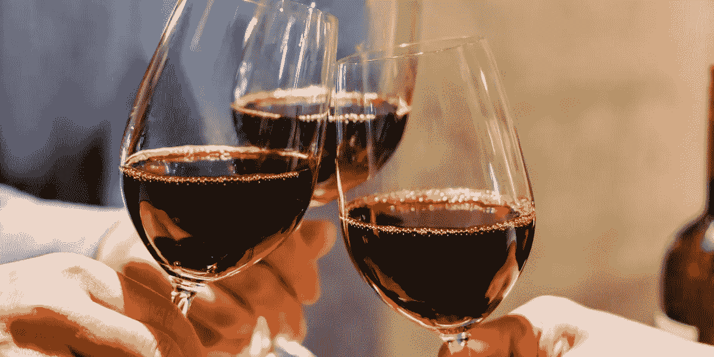

I am going to need a few more glasses to finish the article

在我们进入真正的分析之前(**意味着我们键入一些代码并可视化一些图形**)，完全掌握我们想要通过整个研究项目实现什么是非常重要的。虽然我用了 ***这个词实现了*** ，*并不需要像提到的那样巨大。*我想学的东西非常非常简单，可以表述为:

> **决定红酒品质的最重要因素是什么？**

简单明了。事实上，现在我们已经完成了你的定量研究项目中最重要的一步。让我们进入下一个程序。

# 文献评论

文献综述是什么意思？好吧，说实话，我们不应该是第一个试图在这个话题上加把劲的人。换句话说，应该有足够多的研究已经分析了红酒及其决定因素。这一信息肯定会有助于扩大我们的视野，并缩小我们对具体内容的关注。

为了节省我们的时间，我从发表的文章和期刊中收集了一些原始数据。

谈论葡萄酒的质量并不是一件容易的事情，因为每个人都有不同的标准来定义什么是质量。不仅化学物质很重要，葡萄酒法律法规在质量检测中也起着至关重要的作用。例如，葡萄种植区确实是全球优质葡萄酒生产的一个重要指标。在法国术语中，土壤和气候条件对于获得认证的优质葡萄酒标签非常重要。在化学方面，口感特征可以通过较高的酒精浓度来改善，硫酸奎宁也显示出对味道和口感属性的显著影响。

好吧！基于文献回顾，我们发现**酒精**和**硫酸盐**似乎对红酒的味道有着显著的决定作用！但是，**为什么重要？**因为在我们进行分析之前，了解**这一研究背景是非常重要的。换句话说，**

> 我们可以测试这些发现是否与我们数据集的分析相匹配，或者会有不同的结果吗？

# 搜索数据

现在是时候为研究寻找一个数据集了。

如果你曾经试图在 Kaggle 或其他网站上搜索免费数据集，你可能会遇到葡萄牙“Vinho Verde”葡萄酒的红色和白色变种。[链接](https://www.kaggle.com/uciml/red-wine-quality-cortez-et-al-2009)

# 探索性数据分析

在查阅数据概述之前，我们先导入一下！！

一旦我导入了数据，我要做的下一件事就是检查数据的外观。通常我使用这些又酷又方便的函数:*【head】**【str】**【summary】*

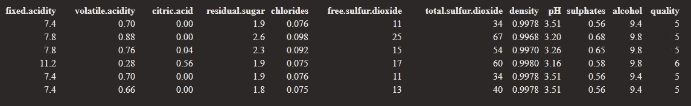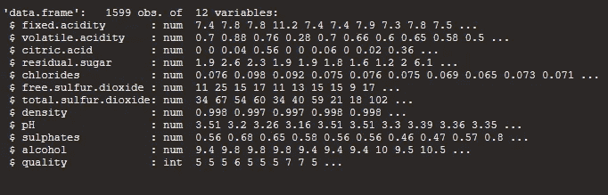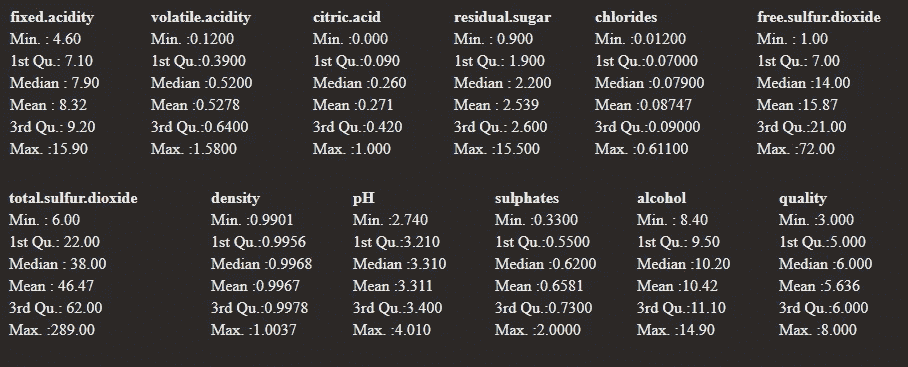

他们给了我们一个很好的数据集分类概览。现在我们对 ***质量*** 变量感兴趣，因为它无论如何都是**的因变量**！换句话说，我们想看看在给定其他变量的情况下，如何预测 ***质量*！**

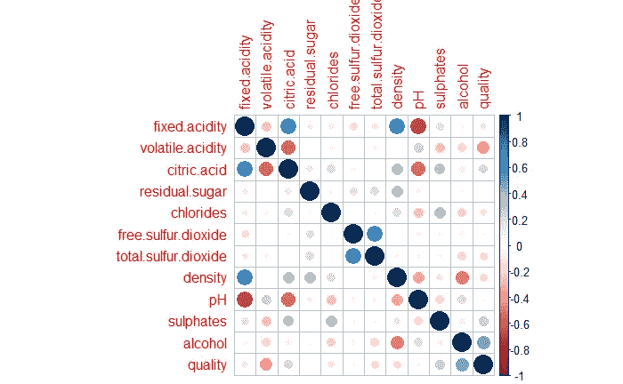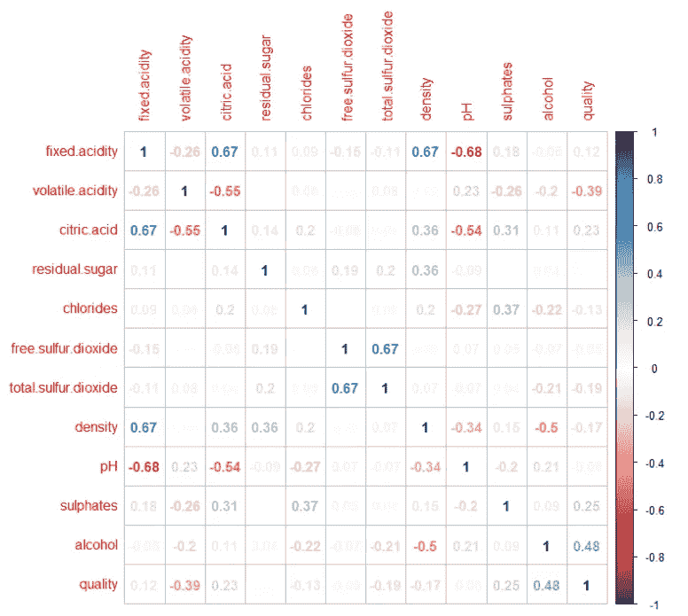

如果您想弄清楚，这些代码将有助于可视化**变量之间的相关性。**

现在，让我们决定我们将(并且能够)使用什么样的统计分析来进行进一步的统计分析。

> 你喜欢什么？什么方法最适合这种情况？

你们有些人可能会说**多元回归**，因为我们可能想*预测*质量得分？嗯，这实际上不是一个好主意。让我们检查一下 ***为什么***

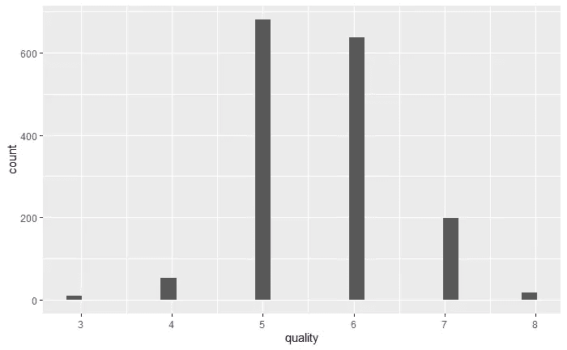

你明白原因了吗？在*质量*中只有 6 个可能的输出，这意味着它不是多元回归的合适的*因变量*。理想情况下，它至少应该超过 20 个值。那我们该怎么办？

# 逻辑回归？

逻辑回归是我们可以考虑的一种选择，也是我们在这项研究中将要使用的方法。我不打算解释逻辑回归的细节，但重要的是要知道它用于二元情况，我们将通过数据操作来创建。

记住！我们的数据集现在没有任何二进制变量！如何将当前的*质量*变量转换为二进制变量？

# 数据操作

您可能已经意识到，尽管我们甚至没有对数据集应用一些统计方法，但它已经花费了很多时间和精力。

实话实说吧。这就是数据科学家被称为*不性感*工作的原因，然而，我们必须享受这个过程，因为如果输入是垃圾，那么输出也将是垃圾，无论我们利用多么花哨的技术。

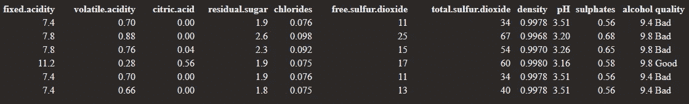

我想把*质量*的值分成两组:

1.  **“差”:质量从 3 到 5**
2.  **“好”:质量从 6 到 8**

*记住，你可以随时设定不同的标准*。一如既往的取决于你的选择。

太棒了。现在我们已经有了用于分析的经过清理和正确处理的数据。

# 逻辑回归！

我们需要做的第一件事是将数据集分成训练集和测试集。让我们检查一下我们是否以正确的顺序指定了训练和测试集。

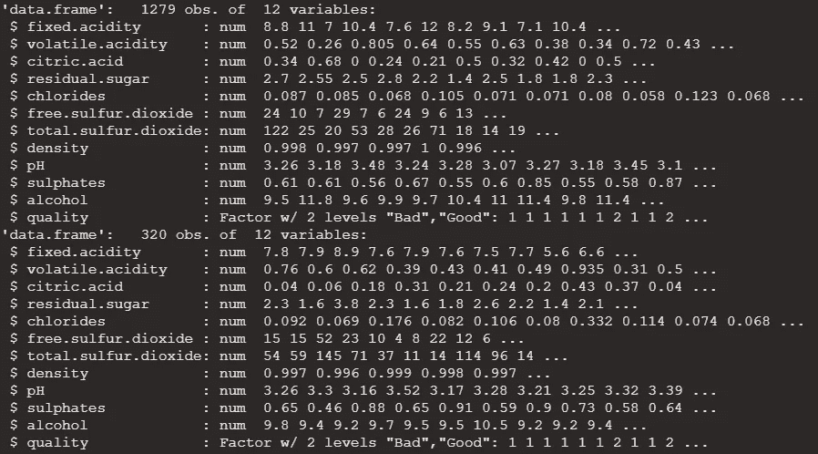

太好了！这些代码似乎做得很好。

我们将 ***glm*** 应用于*训练*集合，以检查预测器和因变量之间的相关性(*质量*)。如果你没有统计学知识，你可能会对这些奇怪的数字感到困惑，但没关系。我们将关注 p 值，以检查*哪些因素是重要的*。

> **统计学意义是什么意思？？**

**这意味着如果预测因子 A 显著(如果其 p 值在给定置信水平下足够低)，则其对因变量的影响不可忽略。**

正如我们从文献综述中已经知道的，酸度、硫酸盐和酒精对*质量*确实具有统计学意义。太好了！我们的发现与我们的初步研究相符。

现在是时候建立一个只包含重要因素的新模型了。(*注:氯化物和游离二氧化硫也很重要，因此如果包括它们，最好检查其差异。但是为了简单起见，这里我将只使用更重要的变量。*)

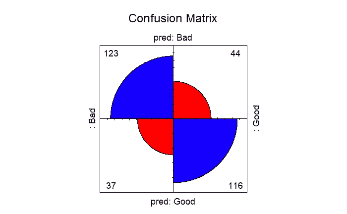

可视化帮助我们更好地理解混淆矩阵。我们必须记住，我们的读者将主要是那些没有统计学知识的人。

> 所以，让一切都简单，让连孩子都能领会我们想要传达的东西，是非常关键的。

准确性测试表明，我们的模型具有**大约 *74.687%*** 的准确性，这意味着**我们的列车组与测试集中的值 *74.687%* 相匹配。**

在统计学术语中，70%到 80%的结果被认为是可接受的。当然，我们有很多方法来改进模型，以获得更高的精度，但是，本教程没有涵盖开始时提到的更深入的分析。

# 结论

我们发现数据集中的一些因素确实是决定葡萄酒质量的决定性因素。然而，由于我们的准确性水平可以提高，我们可以说，有变量还不足以准确指出哪种葡萄酒被认为是好的、坏的。

根据我们的初步研究，我们可以猜测每种葡萄酒的产地之间应该有差异，每个地区的温度也有差异，等等。如果数据集也包含这些信息，那就更好了。姑且说是我们研究的局限，应该在以后的研究中解决。

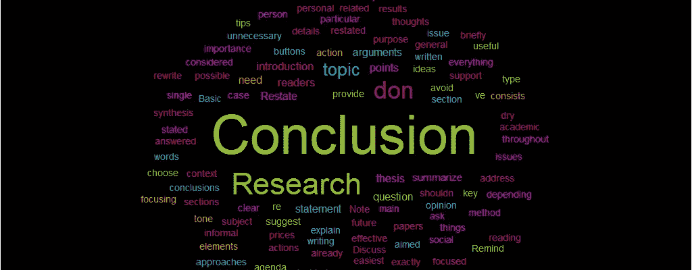

在本教程中，我们已经简要讨论了如何从头到尾进行研究。

让我总结一下到目前为止我们讨论的内容。

# 待办事项列表

1.  *在你的兴趣范围内寻找任何研究课题(音乐、运动、瑜伽，无论什么)*
2.  ****决定你想从研究中学习什么**据此制定一个研究问题****
3.  ****为您的研究寻找相关数据集****
4.  ****进行文献综述收集一手资料****

6.  ******运用适当的统计方法，仔细解读结果******
7.  ******得出你的结论，并指明局限性和对未来研究的建议******

***我真的希望你能从这篇文章中获得一点启发。如果是这样，我倾向于相信它会提醒你建立一个符合你兴趣的伟大研究方法的基本步骤。感谢您的宝贵时间！***

***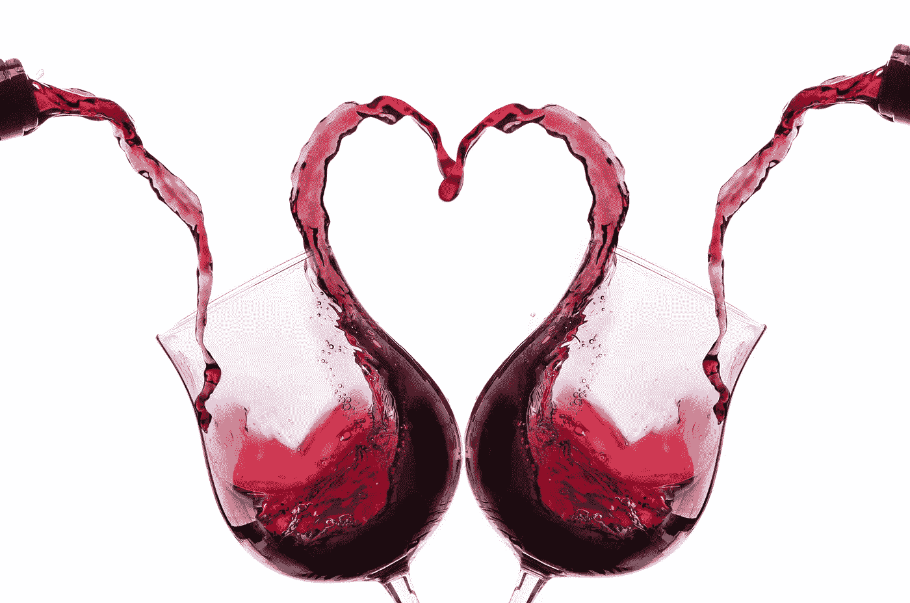***

***Enjoy a glass of wine!***

***请随时访问我的 Github 了解更多信息！***

## ****参考****

****雷诺兹公司(2010 年)。*管理葡萄酒质量*。爱思唯尔科技&科技。[https://doi.org/10.1533/9781845699284](https://doi.org/10.1533/9781845699284)****

****斯特克利，J . &斯特克利，B. (2020)。*对优质葡萄酒的追求，每一次*。斯普林格国际出版公司。[https://doi.org/10.1007/978-3-030-34000-1](https://doi.org/10.1007/978-3-030-34000-1)****