# 泰坦尼克号数据集上的负责任人工智能实现

> 原文：<https://medium.com/mlearning-ai/responsible-ai-implementation-on-titanic-dataset-f4c79508e23d?source=collection_archive---------4----------------------->

# 将负责任的人工智能应用于泰坦尼克号数据集

# 先决条件

*   Azure 帐户
*   Azure 存储帐户
*   Azure 机器学习服务
*   泰坦尼克号数据集

# 密码

*   包括 RAI 进口

```
from raiwidgets import ResponsibleAIDashboard
from responsibleai import RAIInsights
```

*   Scikit 包括

```
import shap
import sklearn
import pandas as pdfrom sklearn.model_selection import train_test_split
from sklearn.ensemble import RandomForestRegressor
```

*   现在配置 AML 工作区

```
import azureml.core
from azureml.core import Workspace
import pandas as pd# Load the workspace from the saved config file
ws = Workspace.from_config()
print('Ready to use Azure ML {} to work with {}'.format(azureml.core.VERSION, ws.name))
```

*   加载数据

```
df= pd.read_csv('./Data/titanic.csv')
print(df.shape)
print(df.columns)
```

# 特征工程

*   查找空值

```
df['Age'] = df.groupby(['Pclass', 'Sex'])['Age'].apply(lambda x: x.fillna(x.median()))
df.isnull().sum()
```

*   将缺失的客舱应用为 X

```
df['Loc']= df['Cabin'].apply(lambda x: x[0] if pd.notnull(x) else 'X')
```

*   在某个位置删除几列

```
df.drop(['Cabin', 'Ticket'], axis=1, inplace=True)
```

*   通过合并两列来创建新列

```
df.loc[:,'GroupSize'] = 1 + df['SibSp'] + df['Parch']
```

*   用价值填满空

```
df['Embarked'] = df['Embarked'].fillna('S')
```

*   分割要素和标签

```
LABEL = 'Survived'
columns_to_keep = ['Pclass', 'Sex','Age', 'Fare', 'Embared', 'Deck', 'GroupSize']
columns_to_drop = ['Name','SibSp', 'Parch', 'Survived']
df_train = df
df = df_train.drop(['Name','SibSp', 'Parch', 'PassengerId'], axis=1)df.head(5)
```

*   设置培训文件夹

```
import os
script_folder = os.path.join(os.getcwd(), "train_remote")
print(script_folder)
os.makedirs(script_folder, exist_ok=True)
```

*   保存上述特征工程数据集

```
df.to_csv('./train_remote/titanic.csv')
df.head(2)
```

# 培养

*   让我们建立数据集
*   预处理功能代码

```
def buildpreprocessorpipeline(X_raw):
    categorical_features = X_raw.select_dtypes(include=['object']).columns
    numeric_features = X_raw.select_dtypes(include=['float','int64']).columns categorical_transformer = Pipeline(steps=[('imputer', SimpleImputer(strategy='constant', fill_value="missing")),
                                              ('onehotencoder', OneHotEncoder(categories='auto', sparse=False, handle_unknown='ignore'))])
    numeric_transformer = Pipeline(steps=[('scaler', StandardScaler())])

    preprocessor = ColumnTransformer(
        transformers=[
            ('numeric', numeric_transformer, numeric_features),
            ('categorical', categorical_transformer, categorical_features)
        ], remainder="drop")

    return preprocessor
```

*   包括培训费用

```
import joblib
import pandas as pd
import numpy as npfrom azureml.core import Run, Dataset, Workspace, Experimentfrom sklearn.compose import ColumnTransformer
from sklearn.impute import SimpleImputer
from sklearn.linear_model import LogisticRegression
from sklearn.model_selection import train_test_split
from sklearn.pipeline import Pipeline
from sklearn.preprocessing import OneHotEncoder, StandardScaler
from sklearn.metrics import roc_auc_score,roc_curve
from interpret.ext.blackbox import TabularExplainer
from azureml.interpret import ExplanationClientfrom raiwidgets import ResponsibleAIDashboard
from responsibleai import RAIInsights# Calculate model performance metrics
from sklearn.metrics import confusion_matriximport matplotlib.pyplot as pltfrom azureml.core import Model
from azureml.core.resource_configuration import ResourceConfiguration
```

*   指定了标签

```
LABEL = 'Survived'
y_raw = df[LABEL]
X_raw = df.drop([LABEL], axis=1)
```

*   分割数据集

```
# Train test split
X_train, X_test, y_train, y_test = train_test_split(X_raw, y_raw, test_size=0.3, random_state=0)
```

*   现在运行模型

```
lg = LogisticRegression(penalty='l2', C=1.0, solver='liblinear')
preprocessor = buildpreprocessorpipeline(X_train)#estimator instance
clf = Pipeline(steps=[('preprocessor', preprocessor),
                           ('regressor', lg)])model = clf.fit(X_train, y_train)
```

*   计算 AUC

```
# calculate AUC
y_scores = model.predict_proba(X_test)
auc = roc_auc_score(y_test,y_scores[:,1])
print('AUC: ' + str(auc))
```

*   测量精度

```
# calculate test accuracy
y_hat = model.predict(X_test)
acc = np.average(y_hat == y_test)
print('Accuracy:', acc)
#run.log('Accuracy', np.float(acc))%matplotlib inline# plot ROC curve
fpr, tpr, thresholds = roc_curve(y_test, y_scores[:,1])
fig = plt.figure(figsize=(6, 4))
# Plot the diagonal 50% line
plt.plot([0, 1], [0, 1], 'k--')
# Plot the FPR and TPR achieved by our model
plt.plot(fpr, tpr)
plt.xlabel('False Positive Rate')
plt.ylabel('True Positive Rate')
plt.title('ROC Curve')
#run.log_image(name = "ROC", plot = fig)
plt.show()
```

*   现在为 RAI 工具包设置列

```
columns = ['Survived']
#df = df.drop('Survived', axis=1, inplace=True)
#df = df.drop(columns, axis=1)
#print(df.columns)
dfcolumns = ['Pclass', 'Sex', 'Age', 'Fare', 'Embarked', 'Loc', 'GroupSize']
print(dfcolumns)
#client = ExplanationClient.from_run(run)
# Explain predictions on your local machine
tabular_explainer = TabularExplainer(model, X_train, features=dfcolumns)
```

*   现在调用全局解释器

```
global_explanation = tabular_explainer.explain_global(X_test)
```

*   现在为敏感列设置变量

```
comment = 'Global explanation on regression model trained on boston dataset'
#client.upload_model_explanation(global_explanation, comment=comment, model_id=model)
categorical_features = X_raw.select_dtypes(include=['object']).columns
target_feature = LABEL
train_data = X_train.copy()
test_data = X_test.copy()
train_data[target_feature] = y_train
test_data[target_feature] = y_test
```

*   调用 RAI 洞察

```
rai_insights = RAIInsights(model, train_data, test_data, LABEL, 'classification', 
                               categorical_features=['Sex','Embarked','Loc'])
```

*   添加分析

```
# Interpretability
rai_insights.explainer.add()
# Error Analysis
rai_insights.error_analysis.add()
# Counterfactuals: accepts total number of counterfactuals to generate, the range that their label should fall under, 
# and a list of strings of categorical feature names
rai_insights.counterfactual.add(total_CFs=20, desired_class='opposite')
rai_insights.causal.add(treatment_features=['Sex', 'Embarked'])
```

*   运行 RAI 计算
*   计算需要时间来处理
*   将有一个 UI 限制，只能显示 5000 行

```
rai_insights.compute()
```

*   调用 RAI 洞察

```
ResponsibleAIDashboard(rai_insights)
```

# RAI 仪表板分析

*   误差分析
*   误差率误差分析

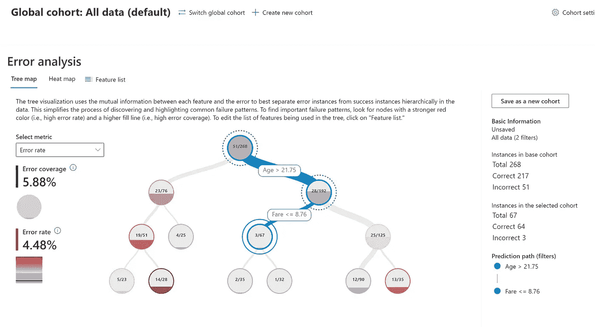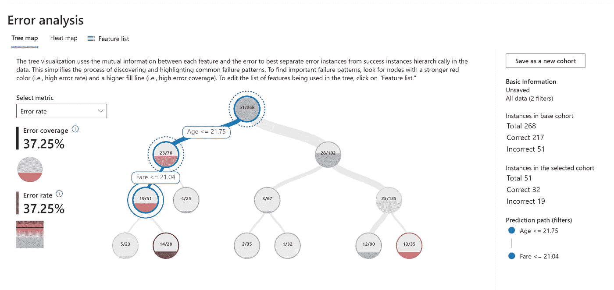

*   热图选项

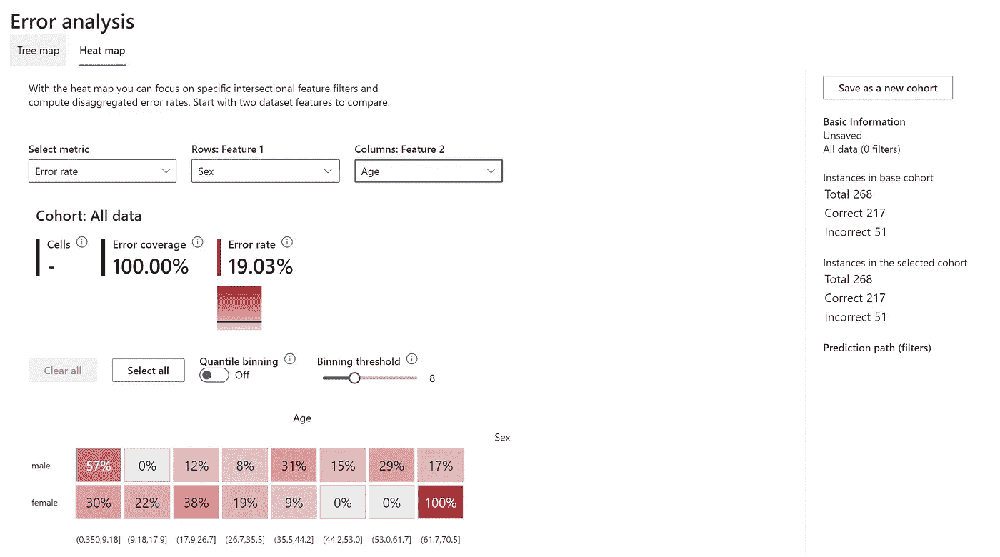

*   带准确度分数的误差分析

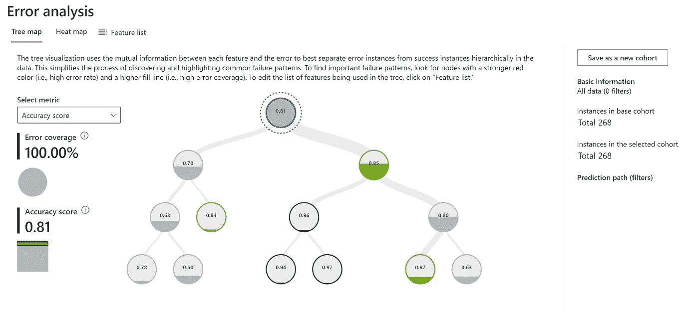

*   精确评分误差分析

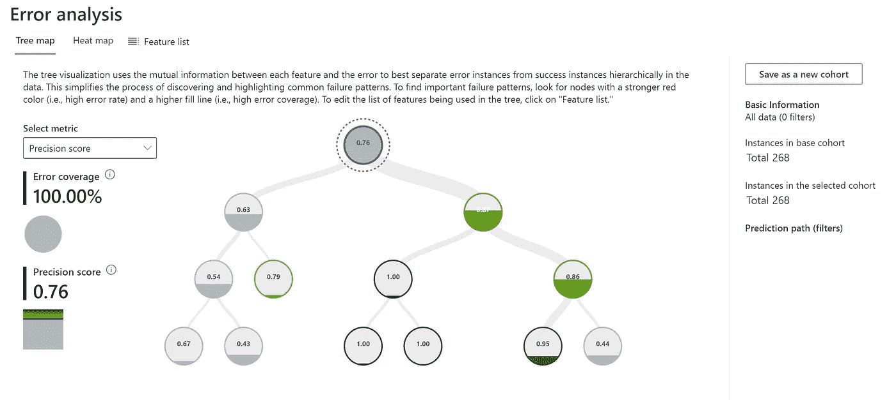

*   模型概述
*   具有列性别

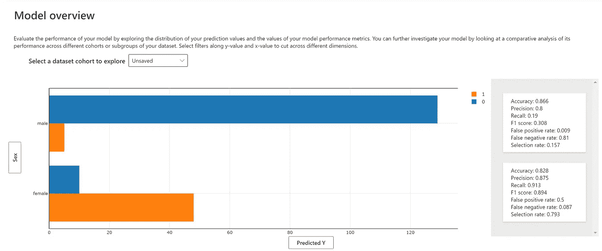

*   随着柱龄

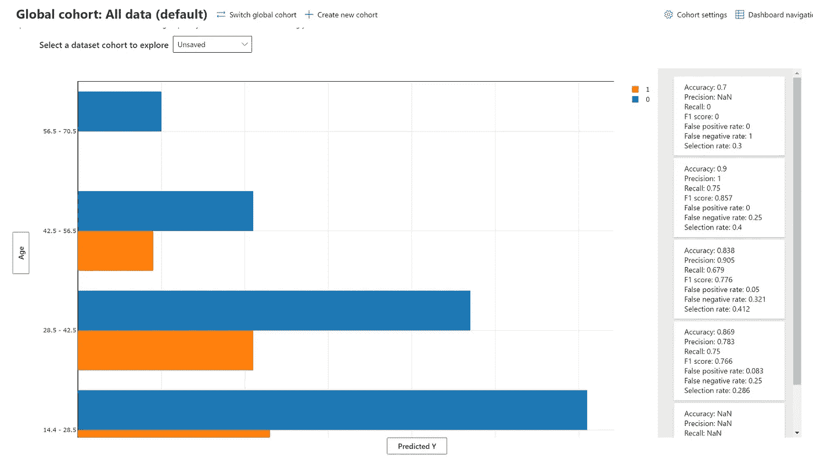

*   数据浏览器
*   使用 PClass

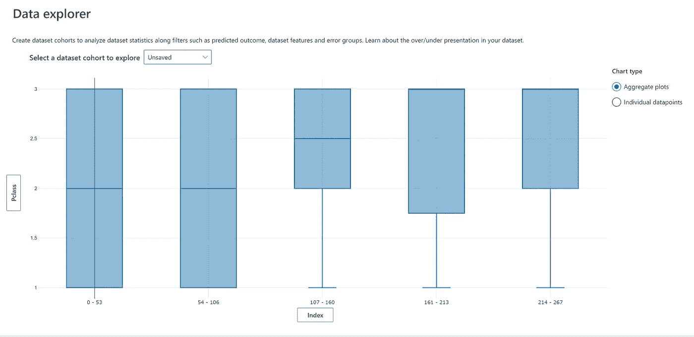

*   有性

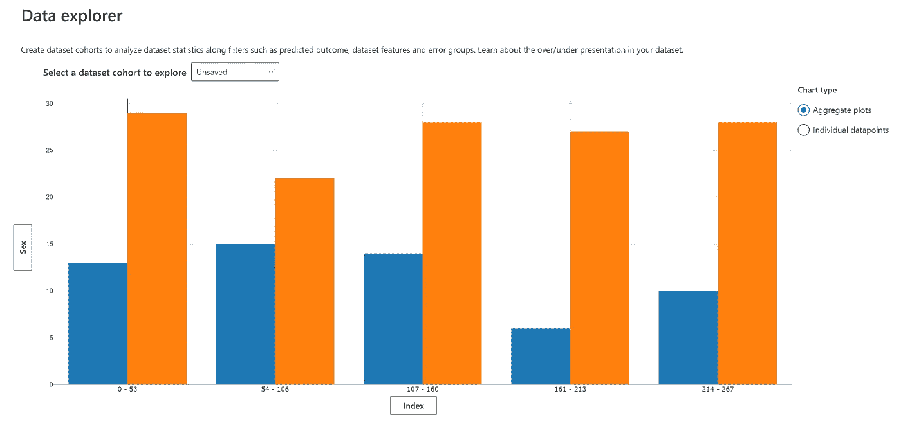

*   因年久

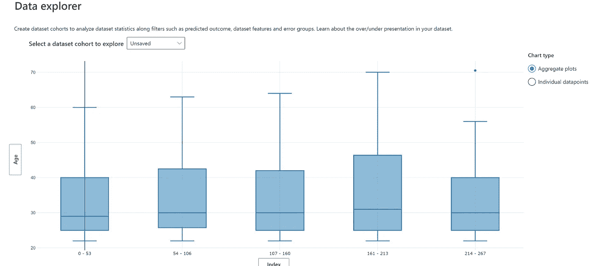

*   特征重要性
*   您可以分析预测结果，也可以基于预测结果分析数据集

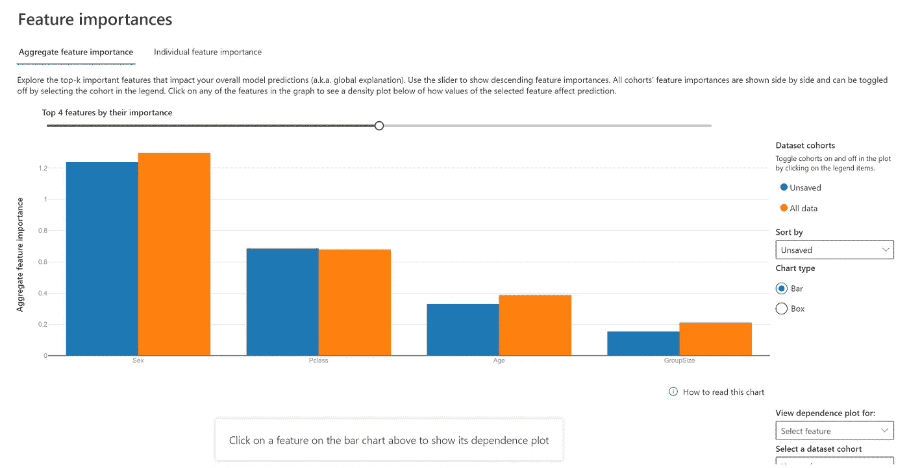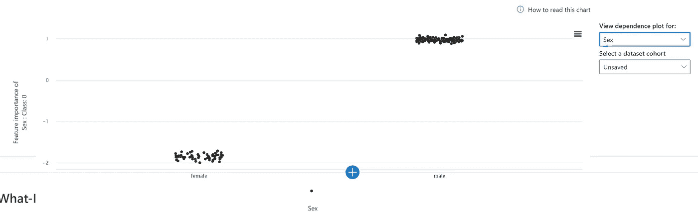

*   反事实分析

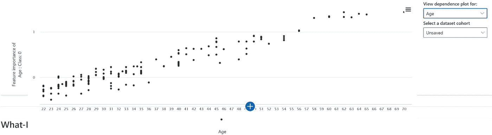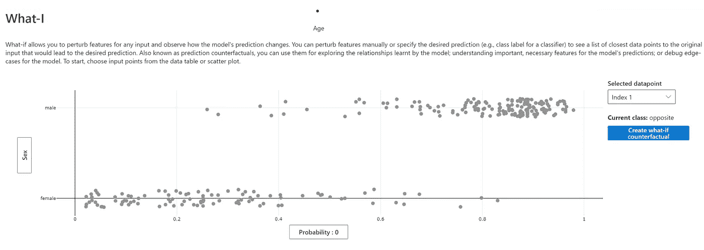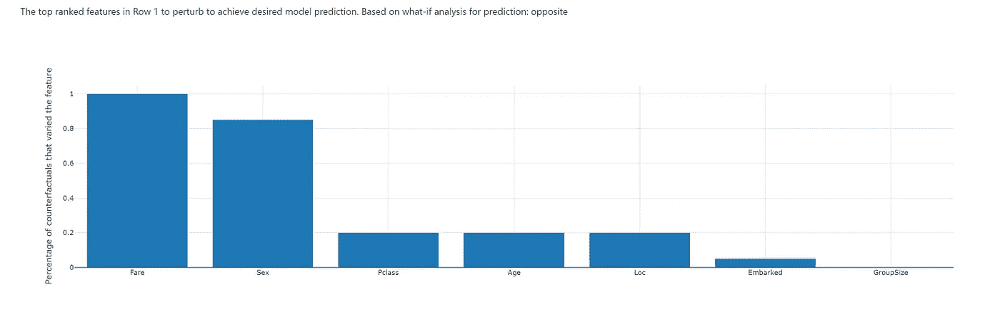

*   因果分析

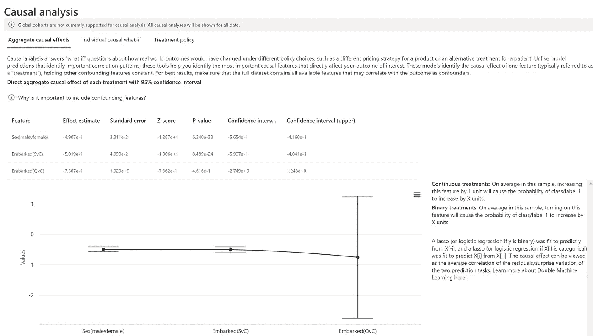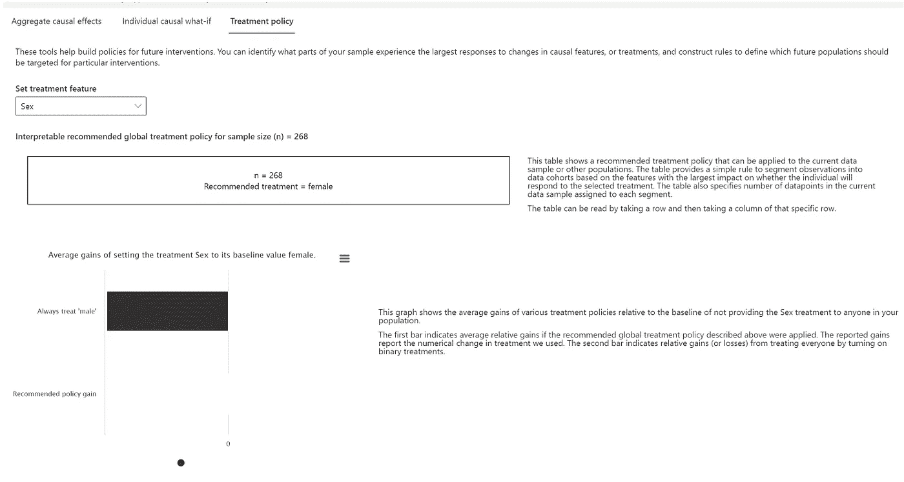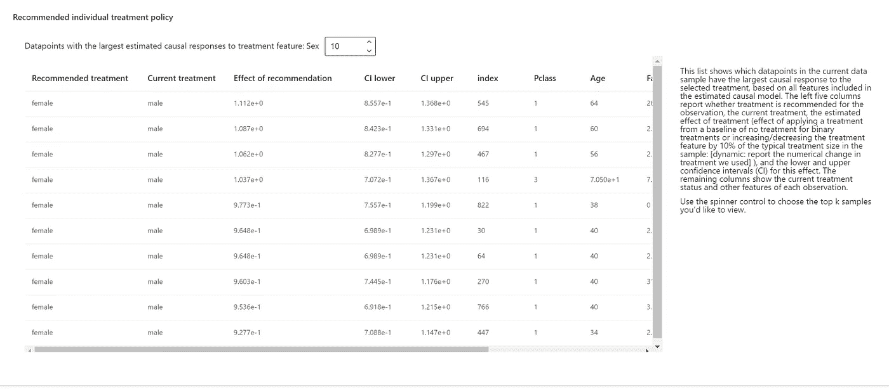

*最初发表于*[*【https://github.com】*](https://github.com/balakreshnan/Samples2022/blob/main/AzureML/titanicrai.md)*。*

[](/mlearning-ai/mlearning-ai-submission-suggestions-b51e2b130bfb) [## Mlearning.ai 提交建议

### 如何成为 Mlearning.ai 上的作家

medium.com](/mlearning-ai/mlearning-ai-submission-suggestions-b51e2b130bfb)