# 基于评论内容的餐馆推荐系统

> 原文：<https://medium.com/mlearning-ai/restaurant-recommendation-system-based-on-the-content-in-reviews-dfc3351004db?source=collection_archive---------1----------------------->

使用 Python 中基于内容的过滤创建推荐系统


午餐或晚餐时间，我们通常会和家人、朋友和同事出去玩。作为推荐应用的用户，人们更关心我们会如何喜欢一家餐馆。过去，人们从朋友那里获得餐馆的建议。尽管这种方法简单明了且用户友好，但它有一些严重的局限性。首先，朋友或其他普通人的推荐仅限于他们以前去过的地方。因此，用户不能获得关于他们的朋友很少去的地方的信息。除此之外，用户有可能不喜欢朋友推荐的地方。

印度的班加卢鲁就是这样一个城市，拥有超过 12000 家餐馆，供应来自世界各地的菜肴。每天都有新餐馆开业，这个行业还没有饱和，需求与日俱增。尽管需求不断增加，但新餐馆很难与老牌餐馆竞争。大多数都供应同样的食物。孟加拉鲁鲁是印度的 IT 之都。这里的大多数人主要依赖餐馆的食物，因为他们没有时间自己做饭。由于对餐馆的需求如此巨大，因此研究一个地方的人口统计学就变得非常重要。我们将使用来自 Zomatao 的数据集，其中包含 Banglore 市的数据。

其目的是创建一个基于内容的推荐系统，当我们写一个餐馆名称时，推荐系统将**查看其他餐馆的评论**，系统将向我们推荐与**相似评论的其他餐馆**，并从**最高评级**中进行排序。

从这个推荐系统中受益的主要是游客，他们是刚到一个城市的人。大多数游客在旅游期间总是喜欢去某个特定城市的著名餐馆。否则，它可以被属于同一城市的人大量使用，以根据他们的活动来查看是否有任何新餐馆被推荐。

# 我们开始吧

对于我们的分析，为了获得用户评论之间的相似性，以便向用户推荐相似的餐馆，我们需要一个数据源，从中我们可以获得最重要的特征，如餐馆名称、评级、成本及其评论。

因此，我们将使用 **Zomato** Bangalore [数据集](https://www.kaggle.com/himanshupoddar/zomato-bangalore-restaurants)进行分析，并使用内容过滤方法得出结论。这个数据集包括从 Zomato 收集的印度班加罗尔的餐馆。Zomato 是一个在线食品交付应用程序，Bengaluru 是印度数字化程度最高的城市之一，大量城市人口使用 Zomato 的服务来寻找一天中的下一顿饭。

这里我将使用**基于内容的过滤。**因此，让我们了解一下什么是**基于内容的过滤**

**基于内容的过滤:**这种方法仅使用关于用户先前消费的项目的描述和属性的信息来模拟用户的偏好。换句话说，这些算法试图推荐与用户过去喜欢的(或现在正在检查的)项目相似的项目。具体地，将各种候选项目与用户先前评级的项目进行比较，并推荐最匹配的项目。[2]

当向用户提供推荐时，推荐系统必须在两种信息传递方法之间做出决定:

*   **剥削。**系统选择与用户已经表达偏好的文档相似的文档。
*   **探索。**系统选择用户简档没有提供证据来预测用户反应的文档。

# **数据集**

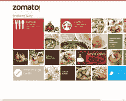

CSV 数据文件是从 Kaggle 网站收集的。该数据集包含来自 Zomato 的餐馆评论。数据包含**~ 51000 条记录和 17 列**。评论包括用户信息、评级和评论的纯文本。在我们的数据中，大约有 6500 家独特的餐馆。

数据集有**属性**像-网址，地址，利率，投票，位置，美食，大约费用和评论 _ 列表。但是，我们将主要利用像网址，美食，利率，评论 _ 列表等功能

我已经注意到在分析数据之前需要解决的一些问题——删除重复值、删除 NaN 值、更改列名、转换数据、清理文本列。这是一个庞大的数据集，很可能需要大量清理。

# 导入和加载库

你需要做的第一件事就是导入下面所有的库来进行我们的分析。

```
import numpy as np
import pandas as pd
import seaborn as sb
import matplotlib.pyplot as plt
import plotly.offline as py
import plotly.graph_objs as go
import seaborn as sns
import warnings
warnings.filterwarnings('always')
warnings.filterwarnings('ignore')

from nltk.corpus import stopwords
from sklearn.metrics.pairwise import linear_kernel
from sklearn.feature_extraction.text import CountVectorizer
from sklearn.feature_extraction.text import TfidfVectorizer
```

Pandas 和 NumPy 用于数据预处理和清洗。Seaborn、Plotly 和 Matplotlib 帮助创建了数据集的可视化图形和条形图。此外，由于还会清理文本数据(评论),因此我们将使用 nltk 和 sklearn 库。

## 加载数据

```
zomato_data=pd.read_csv("/Users/jasneekchugh/Desktop/DS_NJIT/IS688-WebMining/restaurant_reccomendation/zomato.csv")zomato_df=zomato_data.copy()
zomato_df.head(2)
```

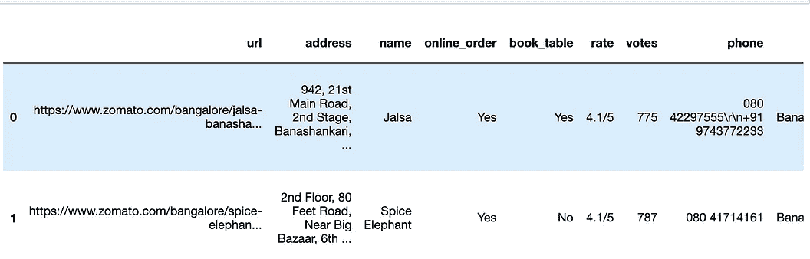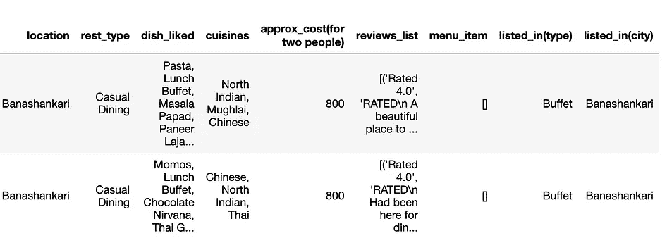

First two records of the data

**列描述**

1.  **URL** 包含 Zomato 网站上餐厅的 URL
2.  **地址**包含本加卢鲁的餐馆地址

**3。名称**包含餐馆的名称

**4。在线点餐**餐厅是否提供在线点餐

**5。book_table** 表书选项是否可用

**6。评分**包含餐馆的总体评分(满分为 5 分)

**7。投票**包含截至上述日期的餐厅评分总数

**8。电话**包含餐馆的电话号码

**9。位置**包含餐馆所在的街区

10。rest_type 餐厅类型

11。餐馆里人们喜欢的菜

12。菜系食物风格，用逗号分隔

13。approx_cost(供两人使用)包含两人用餐的大概费用

14。reviews_list 包含餐馆评论的元组列表，每个元组

15。menu_item 包含餐厅中可用菜单的列表

16 岁。所列 _ 在(类型)餐的类型

17。listed_in(city) 包含餐馆所在的街区

**获取每列的数据及其值的视图**

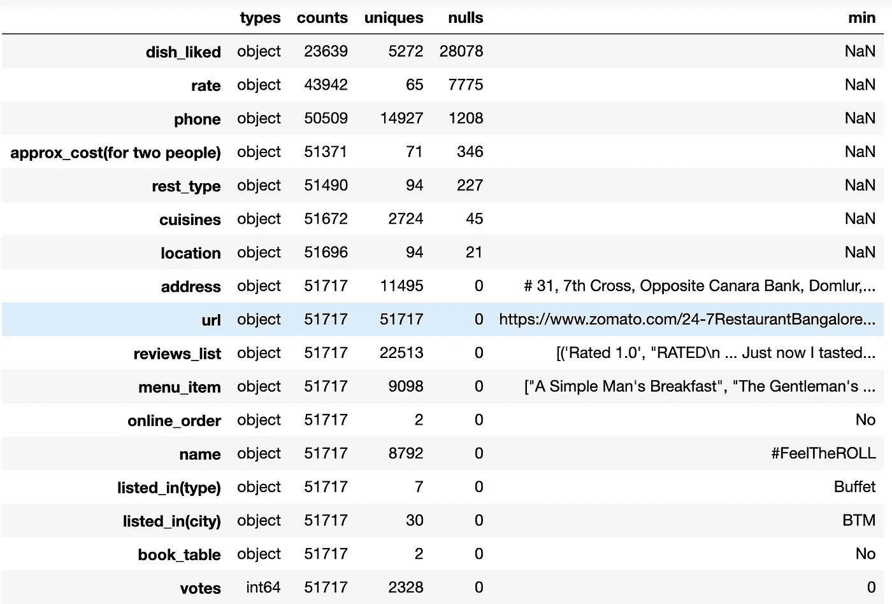

有许多列有空值，有一些列不是我们分析所需要的，我们还需要清除列名和文本列的值。

# 数据准备/数据清理

首先，我们需要清理数据，使其成为更有用的格式。

**执行的操作:**删除不必要的列、NaN 值、重复项等。根据需要更改列名和数据类型。

```
#Dropping the column "dish_liked", "phone", "url"
zomato_df=zomato_df.drop(['phone','dish_liked','menu_item'],axis=1)#Remove the NaN values from the dataset
zomato_df.dropna(how='any',inplace=True)#Removing the Duplicates
zomato_df.duplicated().sum()
zomato_df.drop_duplicates(inplace=True)#Changing the column names
zomato_df = zomato_df.rename(columns={'approx_cost(for two people)':'cost','listed_in(type)':'type', 'listed_in(city)':'city'})#Removing '/5' from Rates
zomato_df = zomato_df.loc[zomato_df.rate !='NEW']
zomato_df = zomato_df.loc[zomato_df.rate !='-'].reset_index(drop=True)
remove_slash = lambda x: x.replace('/5', '') if type(x) == np.str else x
zomato_df.rate = zomato_df.rate.apply(remove_slash).str.strip().astype('float')#Changing the cost to string
zomato_df['cost'] = zomato_df['cost'].astype(str) 
zomato_df['cost'] = zomato_df['cost'].apply(lambda x: x.replace(',','.'))
zomato_df['cost'] = zomato_df['cost'].astype(float)
```

**已清理数据**

清理后，数据的形状发生了变化。没有空记录，我们也有清洁率和成本列

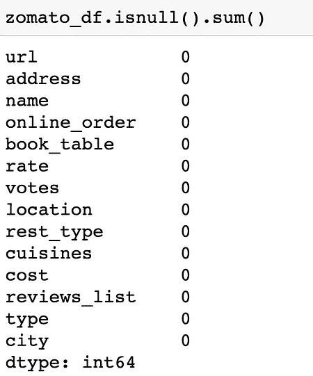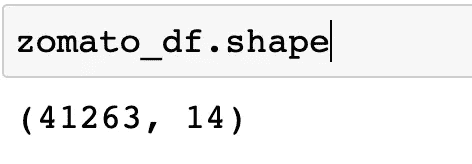

Data after cleaning

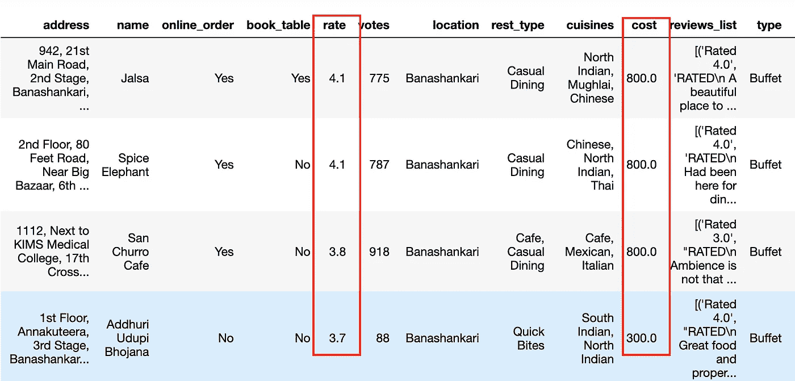

## 数据转换

让我们计算每个餐厅的平均评分的

```
## Computing Mean Rating
restaurants = list(zomato_df['name'].unique())
zomato_df['Mean Rating'] = 0for i in range(len(restaurants)):
    zomato_df['Mean Rating'][zomato_df['name'] == restaurants[i]] = zomato_df['rate'][zomato_df['name'] == restaurants[i]].mean() #Scaling the mean rating values
from sklearn.preprocessing import MinMaxScaler
scaler = MinMaxScaler(feature_range = (1,5))
zomato_df[['Mean Rating']] = scaler.fit_transform(zomato_df[['Mean Rating']]).round(2)
```

**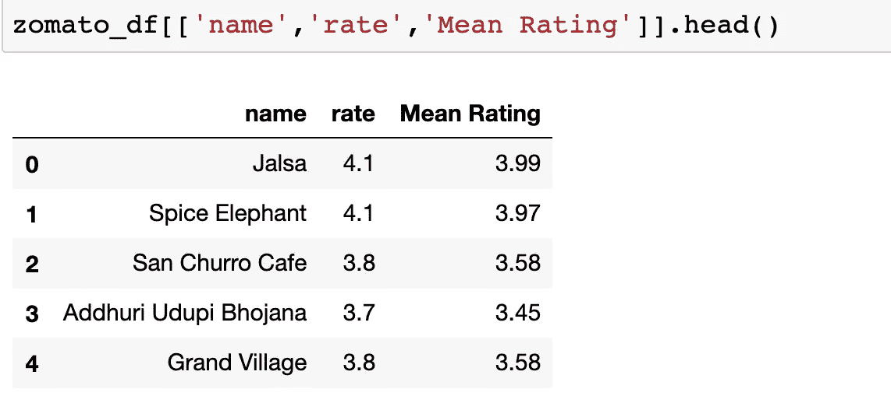**

**打印餐馆的平均评分。我们将利用这一点进行进一步的分析。**

## **文本预处理和清洗**

**我们将使用“评论”和“美食”功能来创建一个推荐系统。因此，我们需要准备和清理这些列中的文本。**

****执行的操作:**小写、删除标点、删除停用词、删除 URL、拼写纠正**

```
## Lower Casing
zomato_df["reviews_list"] = zomato_df["reviews_list"].str.lower()## Removal of Puctuationsimport string
PUNCT_TO_REMOVE = string.punctuation
def remove_punctuation(text):
    """custom function to remove the punctuation"""
    return text.translate(str.maketrans('', '', PUNCT_TO_REMOVE))zomato_df["reviews_list"] = zomato_df["reviews_list"].apply(lambda text: remove_punctuation(text))# Removal of Stopwordsfrom nltk.corpus import stopwords
STOPWORDS = set(stopwords.words('english'))
def remove_stopwords(text):
    """custom function to remove the stopwords"""
    return " ".join([word for word in str(text).split() if word not in STOPWORDS])zomato_df["reviews_list"] = zomato_df["reviews_list"].apply(lambda text: remove_stopwords(text))#Cleaning URLdef remove_urls(text):
    url_pattern = re.compile(r'https?://\S+|www\.\S+')
    return url_pattern.sub(r'', text)zomato_df["reviews_list"] = zomato_df["reviews_list"].apply(lambda text: remove_urls(text))
```

**打印已清理的点评 _ 列表和菜系栏。**

```
zomato_df[['reviews_list', 'cuisines']][:5]
```

**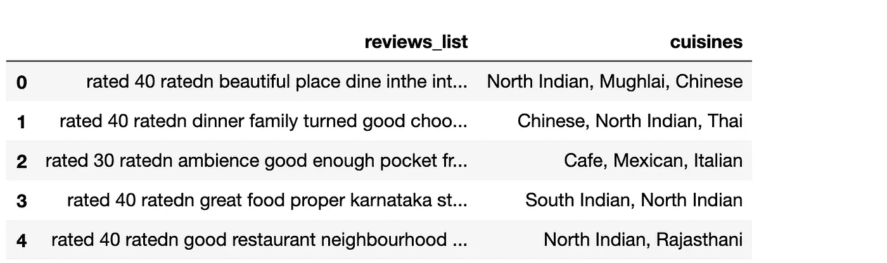**

**Cleaned Review list and Cuisines**

# **探索性数据分析**

*   ****餐厅类型****
*   ****餐厅评分分布****
*   ****排名前十的餐厅****
*   ****最受好评的 10 家餐厅****

```
#Most Famous restaurant chains in Bangloreplt.figure(figsize=(8,5))
chains=zomato_df['name'].value_counts()[:10]
sns.barplot(x=chains,y=chains.index,palette='deep')
plt.title("Most famous restaurants chains in Bangalore")
plt.xlabel("Number of outlets")#Types of Restaurantcounts = zomato_df["rest_type"].value_counts()[:10] 
p = counts.sort_values().plot.barh(figsize=(8,5), fontsize=18) 
p.set_xlabel("Number of Restaurant",fontsize=18) 
p.set_ylabel("Restaurant Type",fontsize=18)
p.set_title("Types of Restaurant", fontsize=20)#Distribution of Restaurant Rating fig, ax = plt.subplots(nrows=1, ncols=1, figsize=(15, 5))sns.distplot(zomato_df.rate,kde=False,color = 'g',ax =ax,bins=20);
ax.axvline(zomato_df.rate.mean(), 0, 1, color='r', label='Mean')
ax.legend();
ax.set_ylabel('Count',size=20)
ax.set_xlabel('Rate',size=20)
ax.set_title('Distribution(count) of Restaurant rating',size=20);# Top 10 Rated Restaurantsdf_rating = zomato_df.drop_duplicates(subset='name')
df_rating = df_rating.sort_values(by='Mean Rating', ascending=False).head(10)plt.figure(figsize=(7,5))
sns.barplot(data=df_rating, x='Mean Rating', y='Name', palette='RdBu')
plt.title('Top Rated 10 Restaurants');
```

**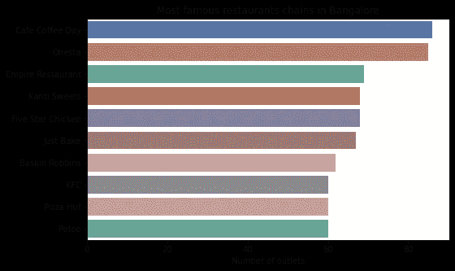****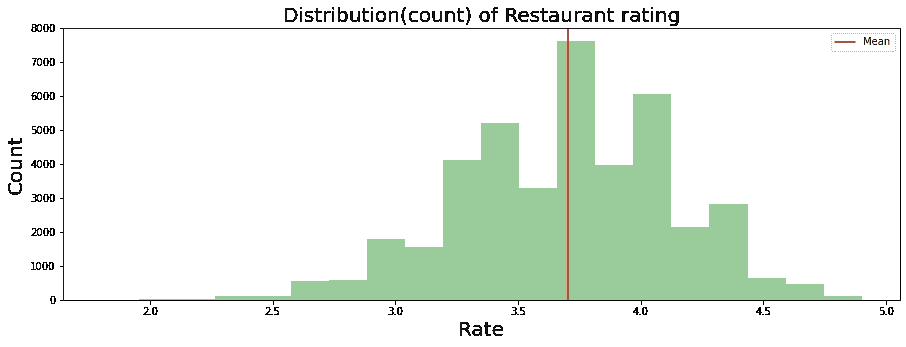**

**EDA on some of the columns of the Restaurant dataset**

**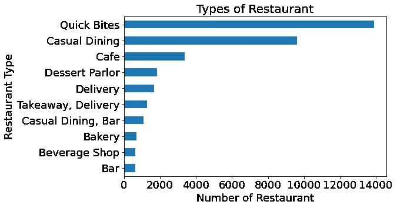****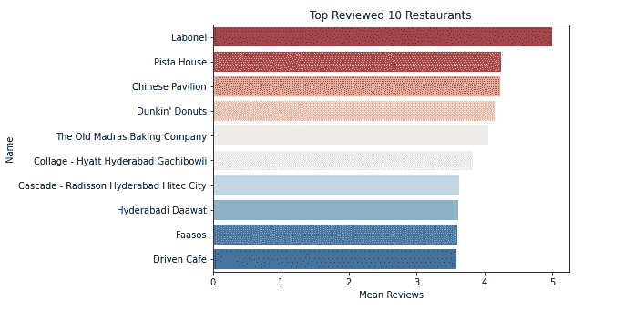**

**上面的**探索性数据分析图表**基于我们数据集最重要的列。根据评论、投票和最著名的餐厅，我们可以很容易地看到顶级餐厅。**

**从餐馆评分的分布中，我们可以看到，平均而言，我们数据集中的餐馆评分在 3.5 到 4.0 之间。很少有餐厅的评分低于 3.0**

## **EDA-词频分布**

```
def get_top_words(column, top_nu_of_words, nu_of_word):

    vec = CountVectorizer(ngram_range= nu_of_word, stop_words='english')

    bag_of_words = vec.fit_transform(column)

    sum_words = bag_of_words.sum(axis=0)

    words_freq = [(word, sum_words[0, idx]) for word, idx in vec.vocabulary_.items()]

    words_freq =sorted(words_freq, key = lambda x: x[1], reverse=True)

    return words_freq[:top_nu_of_words]
```

****美食 15 大词频****

```
# Top 15 two word frequencies for Cuisines
lst = get_top_words(zomato_df['cuisines'], 15, (2,2))df_words = pd.DataFrame(lst, columns=['Word', 'Count'])plt.figure(figsize=(7,6))
sns.barplot(data=df_words, x='Count', y='Word')
plt.title('Word Couple Frequency for Cuisines');
```

**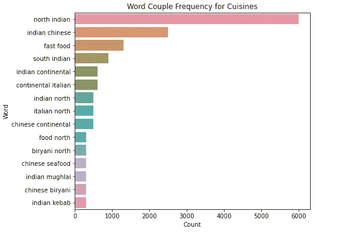**

**在这里，我们可以看到孟加拉人最喜欢的菜肴是“北印度菜”、“印度中国菜”和“快餐”**

# **基于内容推荐系统**

## **TF-IDF 矩阵(术语频率-逆文档频率矩阵)**

**TF-IDF 方法用于量化单词并计算它们的权重。换句话说，代表每个单词(或几个单词等)。)和一个数字，以便在我们的推荐系统中使用数学。简单来说，TF*IDF 得分(权重)越高，这个术语就越稀有，越重要，反之亦然**

**余弦相似性是一种度量，用于确定文档的相似程度，而不考虑它们的大小。**

```
df_percent.set_index('name', inplace=True)
indices = pd.Series(df_percent.index)# Creating tf-idf matrix
tfidf = TfidfVectorizer(analyzer='word', ngram_range=(1, 2), min_df=0, stop_words='english')
tfidf_matrix = tfidf.fit_transform(df_percent['reviews_list'])
```

**这里，`tfidf_matrix`是一个矩阵，它包含每个单词及其关于每个文档的 TF-IDF 分数，在本例中是指项目。此外，停用词只是对我们的系统没有显著价值的词，如“an”、“is”、“the”，因此被系统忽略。[3]**

***现在，我们有了每个项目的描述。接下来，我们需要计算一个文档与另一个文档的相关性或相似性。***

****计算余弦相似度****

**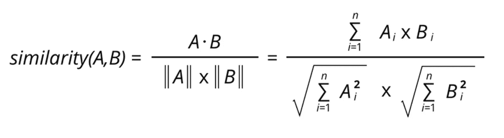**

**The formula for Cosine Similarity**

**我们希望计算数据集中每个项目与其他每个项目的余弦相似性。所以我们只是把矩阵作为参数传递。[4]**

```
cosine_similarities = linear_kernel(tfidf_matrix, tfidf_matrix)
```

**这里我们计算了数据集中每个项目与其他项目的余弦相似度**

# **提出建议**

**现在我们终于可以看到我们的推荐系统在运行了。[3]**

```
def recommend(name, cosine_similarities = cosine_similarities):

    recommend_restaurant = []

    # Find the index of the hotel entered
    idx = indices[indices == name].index[0]

    # Find the restaurants with a similar cosine-sim value and order them from bigges number score_series = pd.Series(cosine_similarities[idx]).sort_values(ascending=False)

    # Extract top 30 restaurant indexes with a similar cosine-sim value
    top30_indexes = list(score_series.iloc[0:31].index)

    # Names of the top 30 restaurants
    for each in top30_indexes:
        recommend_restaurant.append(list(df_percent.index)[each])

    # Creating the new data set to show similar restaurants
    df_new = pd.DataFrame(columns=['cuisines', 'Mean Rating', 'cost'])

    # Create the top 30 similar restaurants with some of their columns
    for each in recommend_restaurant:
        df_new = df_new.append(pd.DataFrame(df_percent[['cuisines','Mean Rating', 'cost']][df_percent.index == each].sample()))

    # Drop the same named restaurants and sort only the top 10 by the highest rating
    df_new = df_new.drop_duplicates(subset=['cuisines','Mean Rating', 'cost'], keep=False)
    df_new = df_new.sort_values(by='Mean Rating', ascending=False).head(10)

    print('TOP %s RESTAURANTS LIKE %s WITH SIMILAR REVIEWS: ' % (str(len(df_new)), name))

    return df_new
```

****

# **结果**

**查询 3 家餐厅的推荐:**

**对于餐厅**“玛瓦餐厅”****

**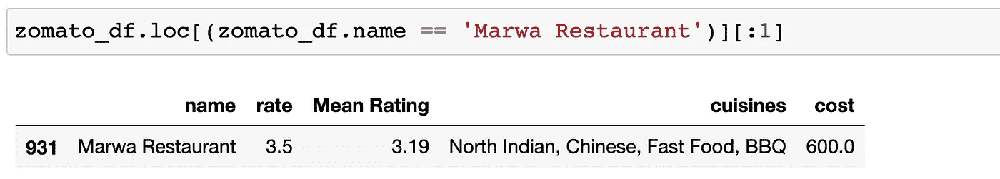**

**Printing the info about ‘Marwa Restaurant’**

**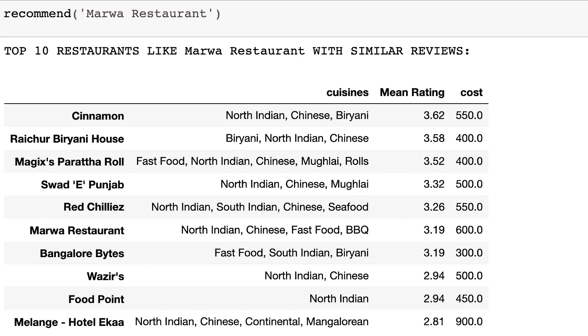**

**Recommendation for ‘Marwa Restaurant’**

**对于餐厅**“天篷”****

**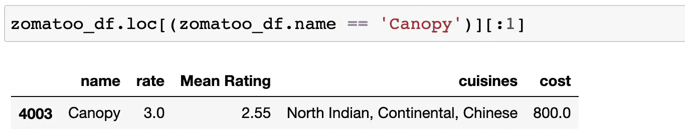****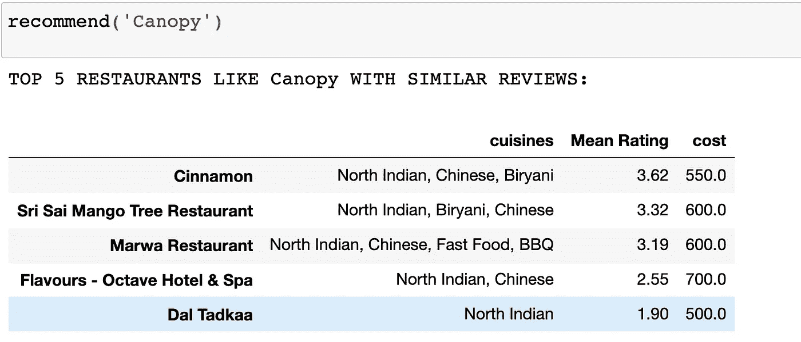**

**Recommendation for ‘Canopy Restaurant’**

**对于餐厅**“红辣椒”****

**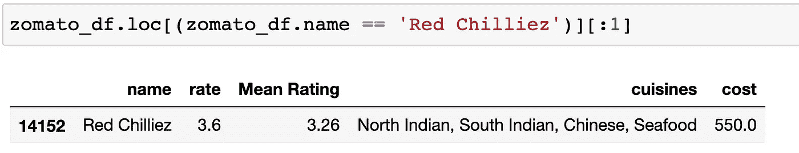****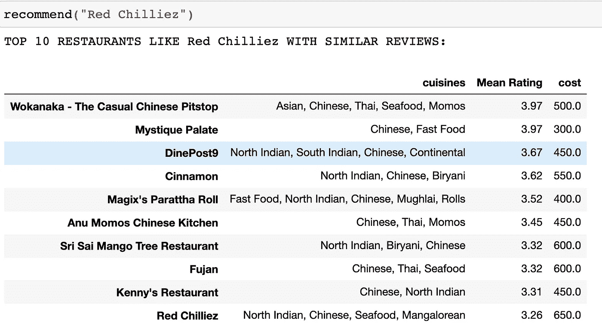**

**Recommendation for ‘**Red Chilliez****

## **估价**

**为了确定我们的推荐系统是否正确地推荐了餐馆，我们可以根据它推荐的结果进行检查。例如，在“Red Chilliez”餐厅的情况下，我们可以看到该餐厅的平均评分为 3.26，费用为 550 卢比，菜系类型为“北印度、南印度、中国、海鲜”。**

**现在，如果我们看到结果，它会推荐那些价格仅在 550 卢比左右的餐厅，评分也接近 3.26，并推荐具有类似美食类型的餐厅。所以，我们的建议大部分是正确的。**

**另一种方法是，我们可以在真实的基础上寻找不是来自用户历史数据的内容。然后，使用任何标准指标(如 RMSE、平均精度)将这些内容与建议中的非历史内容进行比较。这让我们知道我们的模型在推荐商品方面有多好[2]**

# **遇到的限制和缺陷**

*   **数据集主要包含提供“北印度”美食的餐厅，因此对于大多数推荐的餐厅，您将看到至少一家“北印度”餐厅。**
*   **数据集具有相同的餐馆名称，但在烹饪类型中具有不同的值。这使得数据有些不一致，也影响了推荐系统。**
*   **有限的内容——评论中的内容没有包含足够的信息来准确区分餐厅，推荐本身也有不准确的风险。**

# ****结论****

**基于内容是一个很好的开始为用户推荐餐馆的模型，但是它缺乏推荐餐馆的多样性。大多数被推荐的餐馆都是同一类型的。当我们想要找到相似的餐馆时，这是更好的用途，因为用户可以有非常不同的口味，并且可以喜欢具有完全不同的烹饪的不同类型的餐馆。但好处是你不需要其他用户的数据，所以没有冷启动的问题，即没有足够的数据来推荐商品。这通常是仍在收集数据的新应用程序面临的问题**

# **参考**

**[1][https://medium . com/analytics-vid hya/recommendation-system-content-based-part-1-8 F5 AC 093127 a](/analytics-vidhya/recommendation-system-content-based-part-1-8f5ac093127a)**

**[2][https://towards data science . com/recommendation-systems-models-and-evaluation-84944 a 84 fb8e](https://towardsdatascience.com/recommendation-systems-models-and-evaluation-84944a84fb8e)**

**[3][https://www . analyticsvidhya . com/blog/2018/06/comprehensive-guide-recommendation-engine-python/](https://www.analyticsvidhya.com/blog/2018/06/comprehensive-guide-recommendation-engine-python/)**

**[https://www.youtube.com/watch?v=i4a0Of22QRg](https://www.youtube.com/watch?v=i4a0Of22QRg)**