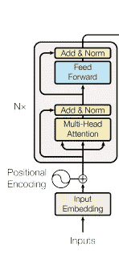
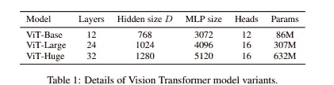
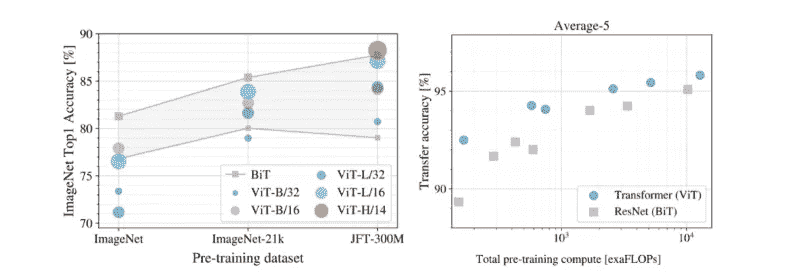

# 卷积的报废

> 原文：<https://medium.com/mlearning-ai/retirement-of-convolutions-c589d084c679?source=collection_archive---------0----------------------->

[theamitnikhade](https://medium.com/u/8cc2ede908a6?source=post_page-----c589d084c679--------------------------------) 访问:【amitnikhade.com】T2


Photo by [Ashim D’Silva](https://unsplash.com/@randomlies?utm_source=medium&utm_medium=referral) on [Unsplash](https://unsplash.com?utm_source=medium&utm_medium=referral)

## 介绍

“C[计算机视觉](https://www.sas.com/en_in/insights/analytics/computer-vision.html#:~:text=Computer%20vision%20is%20a%20field,to%20what%20they%20%E2%80%9Csee.%E2%80%9D)”[**人工智能**](https://www.investopedia.com/terms/a/artificial-intelligence-ai.asp#:~:text=Artificial%20intelligence%20(AI)%20refers%20to,as%20learning%20and%20problem%2Dsolving.) 的一个领域，帮助机器可视化这个美丽的世界。计算机视觉带来了增强人工智能的奇迹。从模式识别到人类姿态估计，从机器人导航到固态物理，计算机视觉有更多有用和有益的应用。利用计算机视觉和深度学习，我们成功地赋予机器可视化和理解图像、视频等的能力。但是革命是固定的。

更早的 [**卷积**](https://en.wikipedia.org/wiki/Convolutional_neural_network) 已经为医学研究、商业、技术和许多其他领域的计算机视觉和深度学习做出了最大的贡献。最后技术不能稳定，必须翻新。

CNN 于 20 世纪 80 年代由 Yann LeCun 首次推出。像素值与其权重的乘积之和是卷积背后的实际机制。CNN 主要专注于从图像中提取特征，如角、边缘、颜色梯度等等。它通常包括 3 层，即卷积层、池层和全连接层。2015 年，微软的研究制造了一个高度深度的 CNN 网络，其性能超过了 AlexNet，该网络大约有 200 层深。AlexNet 被认为是计算机视觉领域有史以来发表的最有影响力的论文。

## 让我们回顾一下 NLP。

在[自然语言处理(NLP)](https://becominghuman.ai/a-simple-introduction-to-natural-language-processing-ea66a1747b32#:~:text=Natural%20Language%20Processing%2C%20usually%20shortened,a%20manner%20that%20is%20valuable.) 的情况下，正如我们所知，它是人工智能的子分支，帮助人类和计算机相互交流，从技术上讲，它是赋予计算机理解人类语言并获取其本质的能力的技术。NLP 也是一个轻松处理文本数据的工具包。一些流行的自然语言处理应用包括情感分析、文本分类、语音到文本、神经机器翻译等。

> 但是 CNN 到底缺什么呢？

2017 年是[谷歌大脑](https://en.wikipedia.org/wiki/Google_Brain)、[谷歌研究](https://research.google/teams/brain/)和[多伦多大学推出变形金刚](https://www.utoronto.ca/)的一年，它突然将 NLP 带到了一个新的水平，它带来了 seq to seq 模型的嬗变。序列到序列模型(LSTM/GRU，即 RNN 模型)用于将序列从一种形式转换到另一种形式，但是它们也遭受一些不利的问题，例如消失梯度和用于逐字处理序列的模型，即它花费很多时间并且是并行化的障碍。注意力在从输入数据中提取显著特征的变压器架构中起着非常关键的作用。变形金刚我们就不深究了。我不会深入研究变形金刚，希望你一定知道让你阅读视觉变形金刚的**[**变形金刚架构**](https://jalammar.github.io/illustrated-transformer/) 。**

**各种模型建立在变压器的架构，如伯特，GPT，变压器 XL，XLNET 和有更多的赋予国家的艺术性能。**

**最近，谷歌的 BERT 刚刚对其编码器架构进行了轻微的改变，这使得 BERT 比以前更快更准确。如果你想了解更多，下面就是。**

**[](/analytics-vidhya/a-sudden-change-to-the-encoder-368fd9a72bc7) [## 编码器突然变了！

### theamitnikhade

medium.com](/analytics-vidhya/a-sudden-change-to-the-encoder-368fd9a72bc7) 

你可能想知道视觉转换器什么时候开始发挥作用，要理解视觉转换器，你需要理解独立转换器的工作原理。视觉变形金刚也是变形金刚的一个小改动。

## 视觉变压器

> 2020 年 10 月 22 日

[***一幅图像相当于 16×16 个字:按比例进行图像识别的变形金刚***](https://arxiv.org/pdf/2006.03677.pdf) 规定只需将图像分割成固定大小的小块，将它们线性嵌入加上位置嵌入，并将输出向量平行馈送到变形金刚编码器。

Vision transformer working and architecture [[source](https://ai.googleblog.com/2020/12/transformers-for-image-recognition-at.html)]

如上图所示，数据集中的图像被分成大小相同的 *n* 个小块，即

1.  大小为 H *W 的 2D 图像按顺序被分成 N 个小块，其中 N=H*W/P，并且通过连接小块中的所有像素通道，每个小块被展平为 1D 小块嵌入。
2.  它们从线性投影进一步传递，以获得所需的输入尺寸。
3.  然后向量被位置嵌入，并且额外的可学习嵌入被添加到其中，正如我们在 [**BERT**](http://jalammar.github.io/a-visual-guide-to-using-bert-for-the-first-time/) 中看到的我们添加分类标记的方式。
4.  最后，补丁嵌入向量的序列被馈送到变换器编码器，其中的工作与本地变换器编码器中的相同。
5.  输入被归一化，并通过 [**多头注意力**](https://www.csie.ntu.edu.tw/~miulab/s107-adl/doc/190409_Transformer.pdf) 从图像中学习局部和全局相关性，添加来自输入的残差，我们将其传递给来自归一化层的多层感知，并再次添加残差。

## 视觉转换器的代码实现

我们将尝试使用 Python 中的 PyTorch 来实现视觉转换器模型

> 导入库

```
import torchfrom torch._C import dtypeimport torch.nn as nnfrom torch.nn.modules.conv import Conv2dimport torch.nn.functional as F
```

> 定义要使用的设备对象

```
device = torch.device("cuda" if torch.cuda.is_available() else "cpu")
```

> 空缓存

```
torch.cuda.empty_cache()
```

定义图像大小、补丁大小、嵌入维度大小、多层感知器维度、层数、人头数、注意力丢失率、类别数等参数。

```
img_s = 224patch_s = 16emb_dim = 128mlp_dim = 128num_heads = 16num_layers = 5atten_dropout = .0num_classes = 2
```

> 构建视觉转换器类

VIT 类接受这些参数，并开始用一个定义的补丁大小分割整形后的图像。补丁数量的计算方法如下

n_patches =(图像高度*图像宽度)/(补丁高度*补丁宽度)

进一步的过程包括嵌入补丁，你可能会奇怪为什么我用卷积嵌入补丁。Lol，我的题目是反驳卷积。卷积提取特征更适合于适当的归纳基础，这导致性能的提高。CNN 用于提取图像中的低层特征，ViT 用于关联高层概念。ResNet 或 EfficientNet 也可以修剪到某些层，以提取特征。补丁嵌入也可以通过线性层来完成。这是许多人常用的。此外，我们在补丁序列中添加类标记，并通过丢失规则传递它们的位置嵌入。添加位置嵌入有助于模型理解图像的结构及其补丁位置。

rest 流程与原生 transformer 编码器相同。

```
class VIT(nn.Module): def __init__(self, img_size= (img_s,img_s),patch_size= (patch_s, patch_s), emb_dim = emb_dim, mlp_dim= mlp_dim ,num_heads=num_heads,n_classes=2, dropout_rate=0., at_d_r=atten_dropout): super(VIT, self).__init__() ih, iw = img_size ph, pw = patch_size num_patches = int((ih*iw)/(ph*pw)) self.cls_tokens = nn.Parameter(torch.rand(1, 1, emb_dim)) self.patch_embed = Conv2d(in_channels=3, out_channels=emb_dim, kernel_size=patch_size, stride=patch_size) self.pos_embed = nn.Parameter(torch.randn(1, num_patches + 1, emb_dim)) self.dropout = nn.Dropout(dropout_rate) self.enco = transencoder(emb_dim, mlp_dim, num_heads, at_d_r) self.mlp_head = nn.Sequential( nn.LayerNorm(emb_dim), nn.Linear(emb_dim, n_classes) ) def forward(self,x): x = self.patch_embed(x) x = x.permute(0, 2, 3, 1) b, h, w, c = x.shape x = x.reshape(b, h * w, c) cls_token = self.cls_tokens.repeat(b, 1, 1) x= torch.cat([cls_token, x], dim=1) embeddings = x + self.pos_embed embeddings = self.dropout(embeddings) enc = layer(embeddings) mlp_head = self.mlp_head(enc[:, 0]) return mlp_head
```



变压器编码器部分。该编码器层可以堆叠 n 次，以每次从每层提取一些新信息，这导致对变压器的良好预测能力

```
class transencoder(nn.Module): def __init__(self,emb_dim, mlp_dim, num_heads, at_d_r): super(transencoder, self).__init__() self.norm = nn.LayerNorm(emb_dim, eps=1e-6) self.mha = mha(emb_dim, num_heads, at_d_r) self.mlp = Mlp(emb_dim, mlp_dim) def forward(self, x): n = self.norm(x) attn = self.mha(n,n,n) output = attn+x n2 = self.norm(output) ff = self.mlp(n2) out = ff+output return out
```

变压器编码器由一个多头自关注和多层感知器组成。其中多头注意力通过关注输入序列来发挥关键作用。多头机制不是只计算一次注意力，而是并行地多次运行经缩放的点积注意力。

> 注意功能可以描述为将查询和一组键-值对映射到输出，其中查询、键、值和输出都是向量。输出被计算为值的加权和，其中分配给每个值的权重由查询与相应键的兼容性函数来计算

根据报纸报道

## 多头注意力

```
class mha(nn.Module): def __init__(self, h_dim, n_heads, at_d_r): super().__init__() self.h_dim=h_dim self.linear = nn.Linear(h_dim, h_dim, bias=False) self.num_heads = n_heads self.norm = nn.LayerNorm(h_dim) self.dropout = nn.Dropout(at_d_r) self.softmax = nn.Softmax(dim=2) def forward(self, q, k ,v): rs = q.size()[0] batches, sequence_length, embeddings_dim = q.size() q1= nn.ReLU()(self.linear(q)) k1= nn.ReLU()(self.linear(k)) v1= nn.ReLU()(self.linear(v)) q2 = torch.cat(torch.chunk(q1, self.num_heads, dim=2), dim=0) k2 = torch.cat(torch.chunk(k1, self.num_heads, dim=2), dim=0) v2 = torch.cat(torch.chunk(v1, self.num_heads, dim=2), dim=0) outputs = torch.bmm(q2, k2.transpose(2, 1)) outputs = outputs / (k2.size()[-1] ** 0.5) outputs = F.softmax(outputs, dim=-1) outputs = self.dropout(outputs) outputs = torch.bmm(outputs, v2) outputs = outputs.split(rs, dim=0) outputs = torch.cat(outputs, dim=2) outputs += outputs + q outputs = self.norm(outputs) return outputs
```

## 多层感知器

使用简单的神经网络来推断二进制结果。感知器是一个线性分类器，它通过分离两个类别来对输入进行分类。多层感知器由线性函数、GELU 激活*(高斯误差线性单元)、*和退出器组成。

```
class Mlp(nn.Module): def __init__(self, emb_dim, mlp_dim, dropout_rate=0.): super(Mlp, self).__init__() self.fc1 = nn.Linear(emb_dim, mlp_dim) self.fc2 = nn.Linear(mlp_dim, emb_dim) self.act = nn.GELU() self.dropout= nn.Dropout(dropout_rate) def forward(self, x): out = self.fc1(x) out = self.act(out) out = self.dropout(out) out = self.fc2(out) out = self.dropout(out) return out
```

让我们打印模型的流程

```
model = VIT()print(model)
```

[](https://github.com/AmitNikhade/Vision-Transformer) [## AmitNikhade/视觉转换器

### 使用视觉转换器 py torch-AmitNikhade/视觉转换器进行图像分类

github.com](https://github.com/AmitNikhade/Vision-Transformer) 

我已经使用 ViT 执行了一个分类任务，如果您觉得有帮助，请启动存储库，如果您发现任何问题，请创建一个新问题。

## 变体

本文发布了三种视觉转换器的变体，它们是从 BERT 中采用的，基本的有 12 层，大的有 24 层，大的有 32 层，参数为 632M。如面片数公式所示，输入面片越小，计算模型越大



[source](https://arxiv.org/pdf/2006.03677.pdf)

## 培训和微调

由于视觉转换器对图像数据的理解能力较低，因此需要较长的时间，因此需要更高的数量。该模型根据大型数据集进行预训练，并使用较小的数据进行微调。Vision-Transformer 在可持续的大型数据集上具有更高的准确性，同时减少了训练时间。

在微调过程中，如果与模型预训练的面片大小相比较，面片大小应该是相同的。使用更高分辨率的图像微调模型可以获得更好的性能。

## 表演



performance comparison [ [source](https://ai.googleblog.com/2020/12/transformers-for-image-recognition-at.html) ]

正如 [**谷歌博客**](https://ai.googleblog.com/2020/12/transformers-for-image-recognition-at.html) 所显示的，当用更少的数据量进行预训练时，视觉变形金刚表现不佳，而在足够大的训练数据下，它的表现优于 SOTA。

## 结论

> 当在足够的数据上进行训练时，Vit 表现出优异的性能，在计算资源减少四倍的情况下，胜过可比的最先进的 CNN。— [谷歌博客](https://ai.googleblog.com/2020/12/transformers-for-image-recognition-at.html)

视觉变压器假装是真实的，在缓解更好的性能，这击败了最先进的卷积神经网络。自我关注也是 ViT 中最重要的组成部分，它关注图像的主要特征。Vit 可用作卷积管道的替代品。Vit 是实现计算机视觉中可扩展体系结构的手段。随着数据和计算能力的增加，这是计算机视觉领域中一项必要的发明。

## 参考

[https://ai . Google blog . com/2020/12/transformers-for-image-recognition-at . html](https://ai.googleblog.com/2020/12/transformers-for-image-recognition-at.html)

[](https://jalammar.github.io/illustrated-transformer/) [## 图示的变压器

### 讨论:黑客新闻(65 分，4 条评论)，Reddit r/MachineLearning (29 分，3 条评论)翻译…

jalammar.github.io](https://jalammar.github.io/illustrated-transformer/) [](https://en.wikipedia.org/wiki/Transformer_%28machine_learning_model%29) [## 变形金刚(机器学习模型)-维基百科

### 变压器是一种深度学习模型，采用注意力机制，权衡不同因素的影响

en.wikipedia.org](https://en.wikipedia.org/wiki/Transformer_%28machine_learning_model%29) 

如果你觉得我的文章有帮助和有见地，请鼓掌。

[](https://www.linkedin.com/in/theamitnikhade/) [## Amit Nikhade - JSPM 拉贾什胡莎工程学院-马哈拉施特拉邦阿科拉

### 在我的杯子里装了很多咖啡，为普通智力革命而工作。我是一个热爱享受的人…

www.linkedin.com](https://www.linkedin.com/in/theamitnikhade/) 

谢谢，不要忘记对任何问题发表评论，并关注我的时事通讯以保持更新。**