# 回顾—董的 ICDSP'16:形态分析与深度学习(摄像头异常/篡改检测)

> 原文：<https://medium.com/mlearning-ai/review-dongs-icdsp-16-morphological-analysis-and-deep-learning-camera-anomaly-tampering-c685c4ddd3c7?source=collection_archive---------7----------------------->

## **形态分析和深度学习分别检测简单和复杂的摄像头异常**

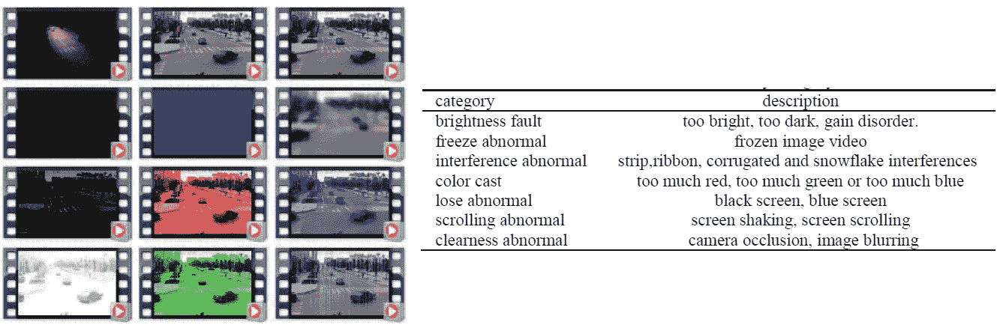

**Examples of anomaly to be detected**

在这个故事里，回顾了浙江工业大学和河北工业大学合作的**基于形态学分析和深度学习的摄像机异常检测**。在本文中:

*   提出了一种基于形态学分析和深度学习的摄像机异常检测方法，用于检测各种类型的异常。
*   **形态分析**(非深度学习方法)用于**检测简单的摄像头异常**以加快处理速度。
*   **深度学习**用于**检测复杂的摄像头异常**以提高准确性。

这是 **2016 ICDSP** 的一篇论文。( [Sik-Ho Tsang](https://medium.com/u/aff72a0c1243?source=post_page-----c685c4ddd3c7--------------------------------) @ Medium)上图显示了一些要检测的异常示例。

# 概述

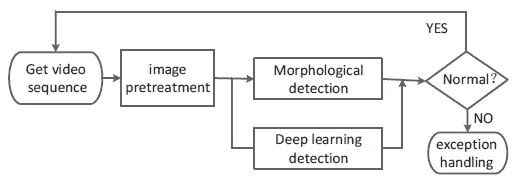

**Flowchart of the proposed method**

1.  **基于形态分析的异常检测**
2.  **基于深度学习的异常检测**
3.  **实验结果**

# **1。基于形态学分析的异常检测**

*   基于形态学分析的异常检测具有足够好的性能来**检测五个摄像机异常**。

## 1.1.亮度故障(太亮或太暗)

*   设置亮度阈值 *L* 和暗度阈值 *D* 。
*   然后，将视频图像中所有像素的灰度级与 *L* 和 *D* 进行比较。

> 如果灰度大于 *L* 的像素数大于阈值 *NL* ，则视频图像被识别为过亮异常。
> 
> 类似地，如果灰度级小于 *D* 的像素数量大于阈值 *ND* ，则视频图像被识别为太暗异常。

## 1.2.亮度故障(增益失调)

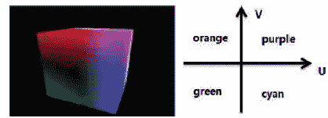

**YUV color space and U, V-dimensional coordinate diagram**

*   YUV 颜色空间用于检测增益紊乱。

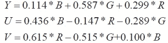

*   如图，**离原点距离越大，颜色越深**。通过设置**深色像素**阈值 *dcp* 分割视频图像。

> 当深度像素的数目大于所有像素数目的 1/2，并且如图所示的坐标系的每个分区和每个图像分区具有统一的深度像素数目时，当前视频图像是增益紊乱的图像。

## 1.3.冻结异常

## 当一定数量的**连续视频图像相同**时，出现冻结异常。

## 1.4.失去正常

*   当监控视频的屏幕画面丢失时，会出现蓝屏或黑屏。

> 因此，异常丢失检测是通过**统计蓝屏帧数或黑屏帧数来实现的。**

## 1.5.滚动异常

*   滚动异常时，相邻图像帧的内容变化很小，但其对应内容的位置是**晃动**。
*   如果相邻图像帧对齐，**会出现重影现象**，其内容会增加。
*   首先，计算当前图像的**梯度图**:

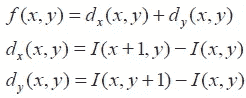

*   其中 *I* ( *x* ， *y* )是一个像素的像素值( *x* ， *y* )。

> 如果|| *fk* ( *x* ，*y*)|-|*fk*+2(*x*，*y*)|>*Tk*，像素( *x* ， *y* )被识别为滚动图像区域的一个**轮廓点**。

*   对于当前图像，**计算轮廓点数 *N* 1** 和**边缘点数 *N* 2** 。

> 如果|*N*2-*N*1 |大于当前图像面积的 1/10，则当前图像帧被识别为滚动图像。

## 1.6 色偏(太绿、太蓝、太红、太黄)

*   RGB 值首先被转换到 XYZ 色彩空间，然后 XYZ 值被转换到 Lab 色彩模型。

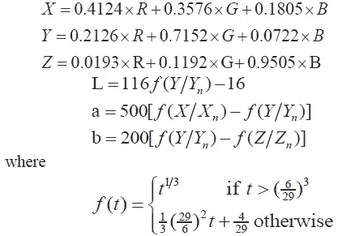

*   这里 *Xn* 、 *Yn* 和 *Zn* 的值分别为 95.047、100 和 108.883。
*   计算 Lab 值后，图像平均色度 *D* ，图像色度中心矩 *M.*

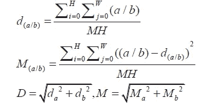

*   **计算色偏系数*K*=*D*/*M*。**

> 然后，根据色偏因子计算标准确定色偏:

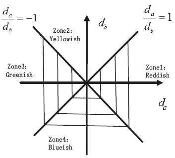

**Color cast factor calculation criteria**

# 2.基于深度学习的异常检测

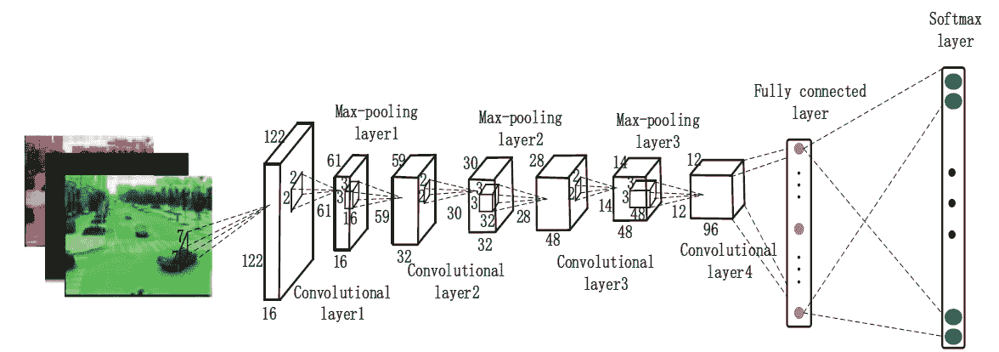

**The architecture of the convolutional neural network (CNN)**

*   有一些**复杂异常**，如**条纹干扰**、**相机遮挡**和**图像模糊**，这些异常很难用基于形态学分析的检测方法检测出来。
*   CNN 被用来探测如此复杂的异常现象。
*   它由 **4 个卷积层，3 个汇聚层，1 个全连接层**组成。Softmax loss 用于训练分类器。
*   (不确定，但是我相信单个当前帧被用作当前帧的异常检测的输入。要预测的类的数量或输出神经元的数量也不确定。论文中没有提供太多关于网络的信息。)

# 3.实验结果

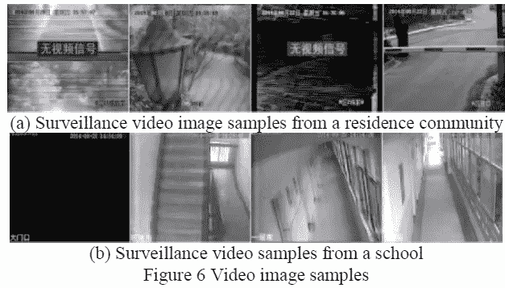

*   收集了一定量的两个真实应用场景的监控视频。
*   一个场景是住宅社区，其中 VSS 包括 10 台 16 通道海康威视 DVR 监控设备和 160 台摄像机。
*   另一所学校的 VSS 包括 14 台 16 通道海康威视 DVR 监控设备和 194 台摄像机。

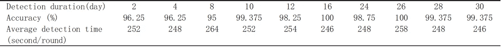

**Accuracy-time relation table for residence community test**

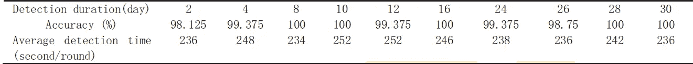

**Accuracy-time relation table for school test**

*   该方法在两个应用场景**中的**准确率**超过 95%** 。

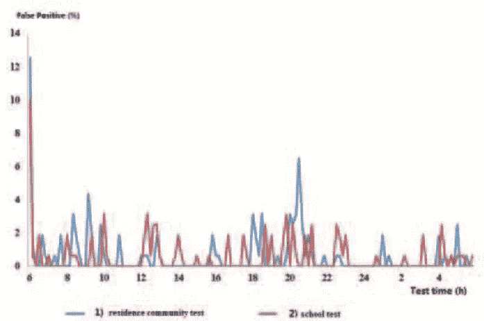

**False alarm rates**

*   一天中不同时间的误报率如上图所示。
*   当光线条件变化相对较大时，会出现错误警报。
*   **“检测-训练-检测”**策略，使用**导致虚警的视频图像作为训练样本，训练一个新的分类器**，用于后续的摄像机异常检测。
*   如上表所示，这些策略增强了异常检测方法的稳健性，并防止了相同错误警报的再次出现。

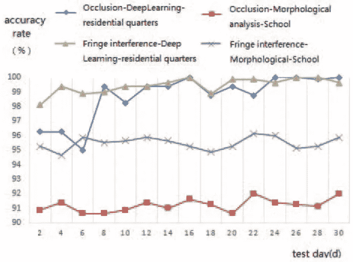

**Deep learning-based method vs. morphological analysis based method for strip interference and camera occlusion**

*   如上所示，**基于深度学习的检测方法对于复杂的异常具有更好的准确性。**
*   随着时间的推移，当添加足够多的导致虚警的样本作为训练样本时，我们基于深度学习的检测方法的准确性可以进一步提高。

## 参考

【2016 ICDSP】【董的 IC DSP ' 16】
[基于形态分析和深度学习的摄像头异常检测](https://ieeexplore.ieee.org/document/7868559)

## 摄像机篡改检测

**2016**【[董的 ICC DSP’16](https://sh-tsang.medium.com/review-dongs-icdsp-16-morphological-analysis-and-deep-learning-camera-anomaly-tampering-c685c4ddd3c7)】**2019**【[VFI-convltm](https://sh-tsang.medium.com/review-video-frame-interpolation-using-convlstm-camera-tampering-detection-5b07dec0fb52)】[UHCTD](https://sh-tsang.medium.com/review-uhctd-a-comprehensive-dataset-for-camera-tampering-detection-camera-tampering-detection-f2a132eb7aca)]

## [我以前的其他论文阅读材料](https://sh-tsang.medium.com/overview-my-reviewed-paper-lists-tutorials-946ce59fbf9e)