# 您可以使用 Review Manager 软件(RevMan 版本 5.4.1)完成的一件事

> 原文：<https://medium.com/mlearning-ai/review-manager-software-revman-version-5-4-1-933c3d9f7a2f?source=collection_archive---------0----------------------->

*【正在审核】*

RevMan 也被称为 *Cochrane's Review Manager* ，是一款免费软件，最初是为了简化 [Cochrane 组织](https://www.cochrane.org/)内的协议规划、综述撰写和信息存储而构建的。审查可以是系统的，也可以是非系统的。如果研究人员希望在其系统综述中包括定量分析，如荟萃分析，RevMan 5 可以很容易地完成这项工作，并可以额外产生一些有趣的输入数据的图形输出。

在这个关于这一点的简短教程和 click 软件 *RevMan* 中，我们打算绘制六(6)个已发表的随机对照试验的*偏倚风险汇总*和*偏倚风险图表*，汇总数据汇总如下表所示:

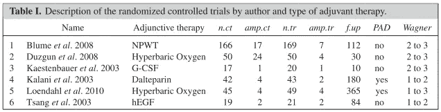

P. E. Verde et al. 2015, DOI: 10.1002/sim.6809

根据 RevMan 5.4.1 用户指南(您可以在网上找到)中详细描述的七(7)个项目，六项研究中每一项的方法学质量被判断为*低偏倚风险*、*不清楚偏倚风险*或*高偏倚风险*。

前两种被归类为*选择偏差*:随机序列生成不充分或分配前分配隐藏不充分，可能使分配偏向干预。接下来的两个被分类为*绩效偏差*和*损耗偏差*:这两个偏差都是由于在分配后对分配的干预措施的了解。第五种归因于不完整结果数据的数量、性质或处理，被归类为*流失偏倚*。由于选择性结果报告，第六项被归类为*报告偏倚*。最后一类偏差(*其他偏差*)，包括前面项目中其他地方未涉及的问题引起的所有偏差。

从 *P. E. Verde et al. 2015，*我们可以想象每一项研究偏倚风险的完整概况，然后尝试找出他们如何使用 *RevMan 软件获得偏倚风险图的摘要和图表。*

从[这里](https://training.cochrane.org/online-learning/core-software-cochrane-reviews/revman/revman-5-download/download-and-installation)下载并安装 RevMan 5.4.1。第一次打开时，它看起来像这样空白:

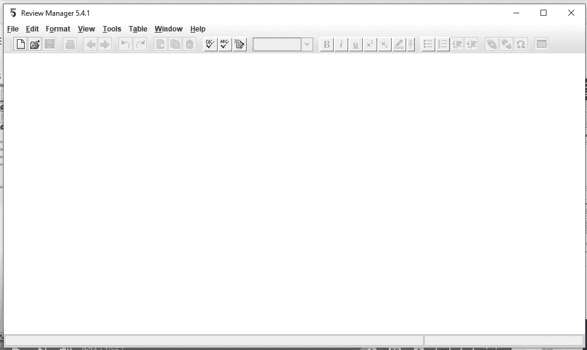

然后点击文件> >新建。弹出一个小窗口*【新审核向导】*:

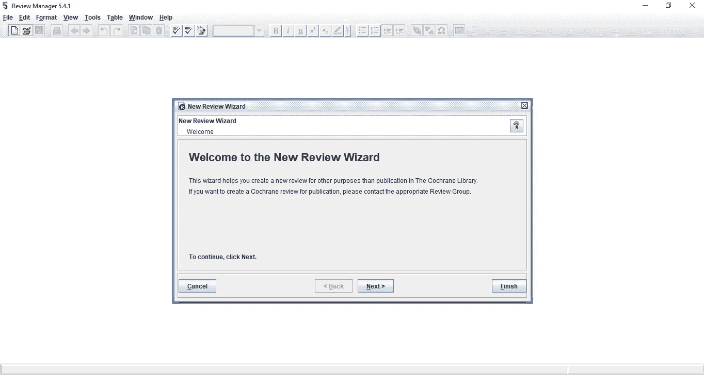

我们可以点击“*下一步”*按钮继续，但我们也可以只点击*“完成”*按钮，另一个页面将立即打开。这就是我们所用的。我们点击*“完成”*，我们得到这个:

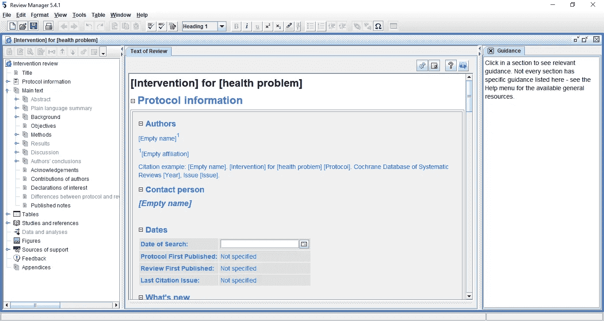

左侧面板包含我们可以探索的模块列表，但我们将只研究*“病历报告和参考文献”*。单击它，在中间面板上获得这些详细信息:

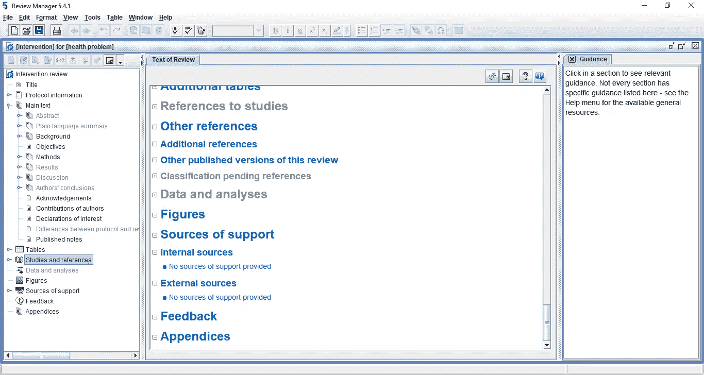

右键单击中间面板中*“病历报告参考文献”*

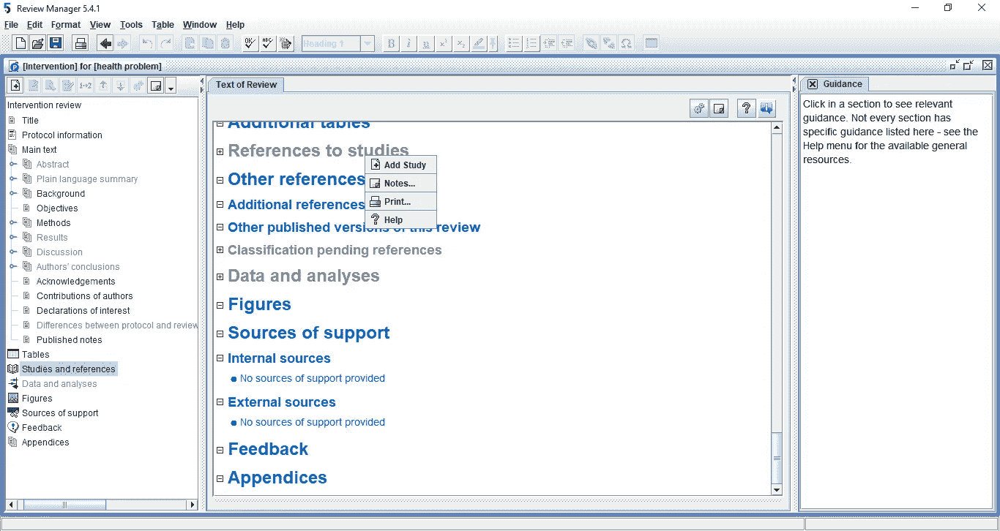

然后，我们有机会通过*“添加研究”*在软件中注册*“包含的研究”*。我们点击它，进入第一项研究*“Blume 2008”*简而言之。我们对其他五个有相应简称的人也这样做:

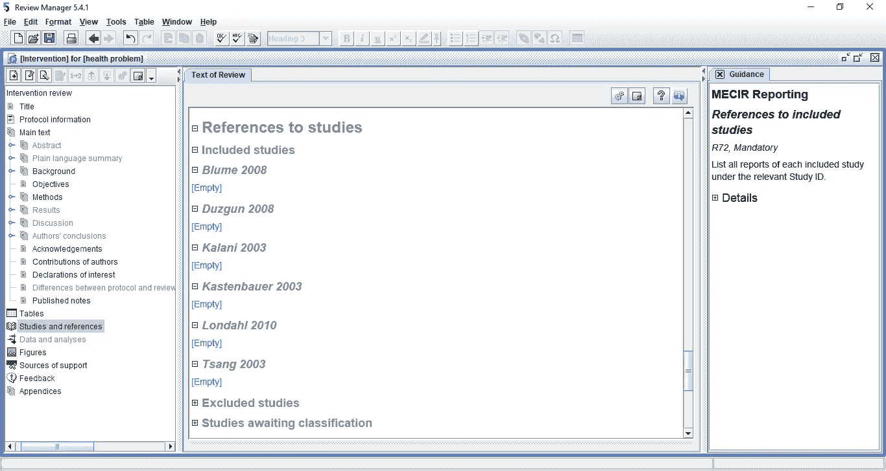

接下来，我们必须输入每项研究的方法质量信息。为此，右键单击每份病历报告，例如第一份病历报告，并获得以下选项:

然后点击*“编辑检查特征”*

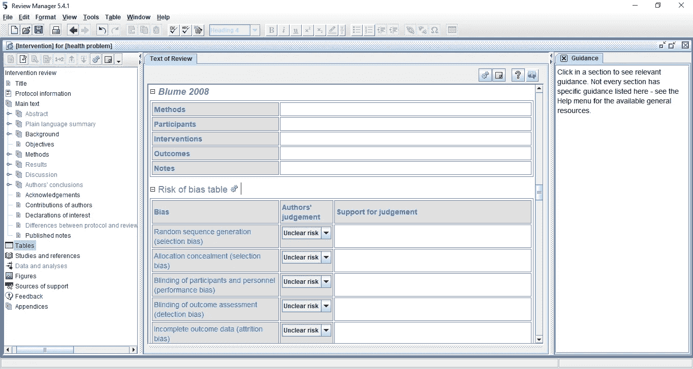

我们只对填写*【Blume 2008】*偏倚风险表感兴趣，分别为:*低低高低低低低*

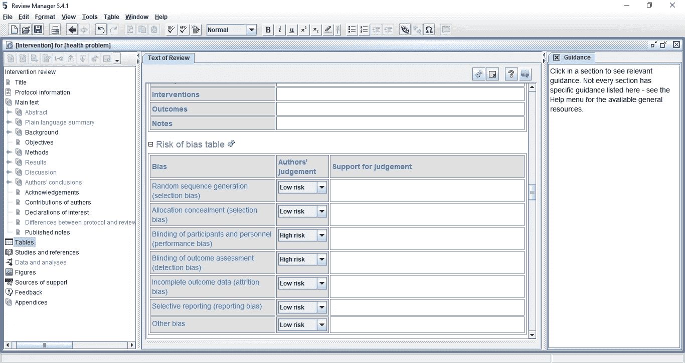

其他研究也以类似方式填写了这些信息:

> ***Duzgun 2008*** :低高高低不明高
> ***kalani 2003****:*低低低低不明高
> ***kastenbauer 2003****:*不明低高低不明低
> **Londahl 2010** :低全

我们已经准备好生成我们的图/曲线图。我们右击左边面板上的*【人物】*模块

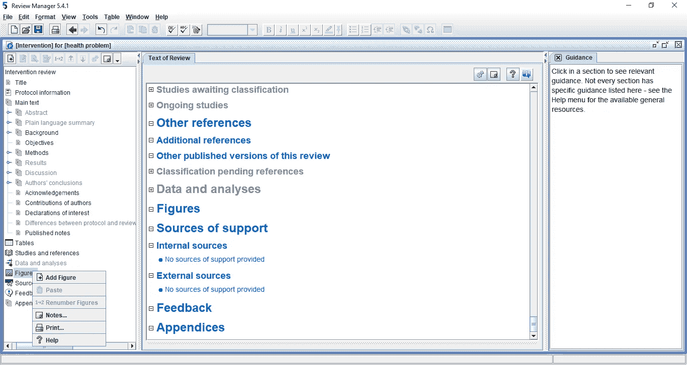

我们点击*“添加图”。*

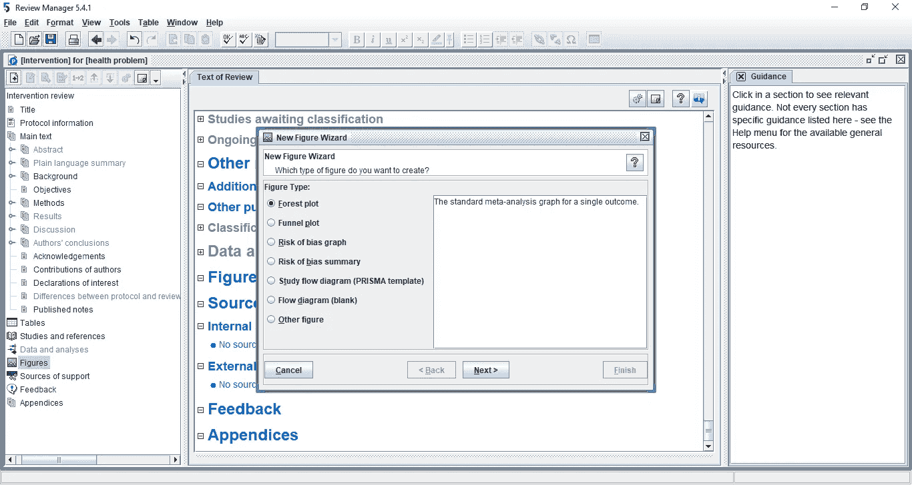

*【偏倚风险图】*和*【偏倚风险汇总】*是我们唯一感兴趣的两个选项。下面是第一张图，带有标题，是对*“偏差风险图”的简短描述。我*不知道为什么，*黄色*部分显示为*白色*。

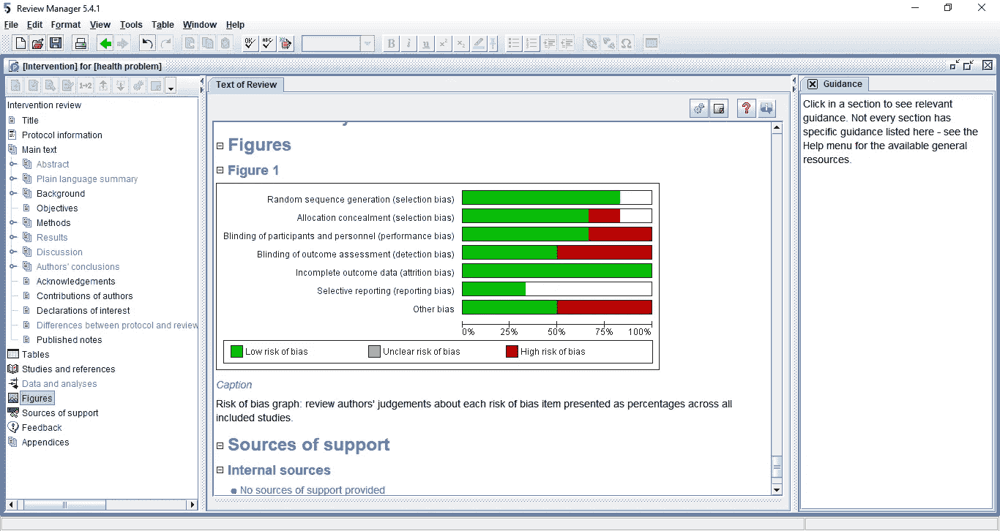

要保存图表，右击它，然后“编辑图表”。保存它，作为图像(。png)或 pdf，或您选择的其他理想格式:

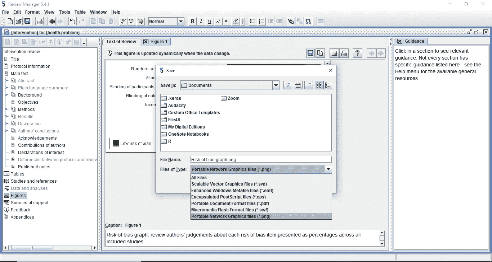

我们回过头来生成另一个感兴趣的图形:

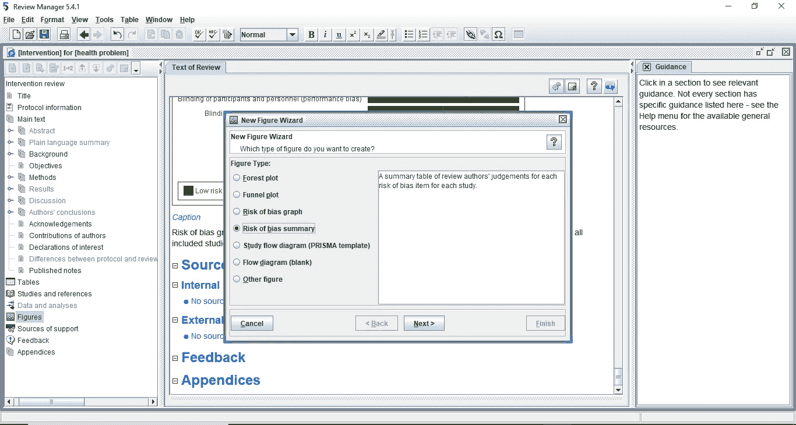

我们得到这个:

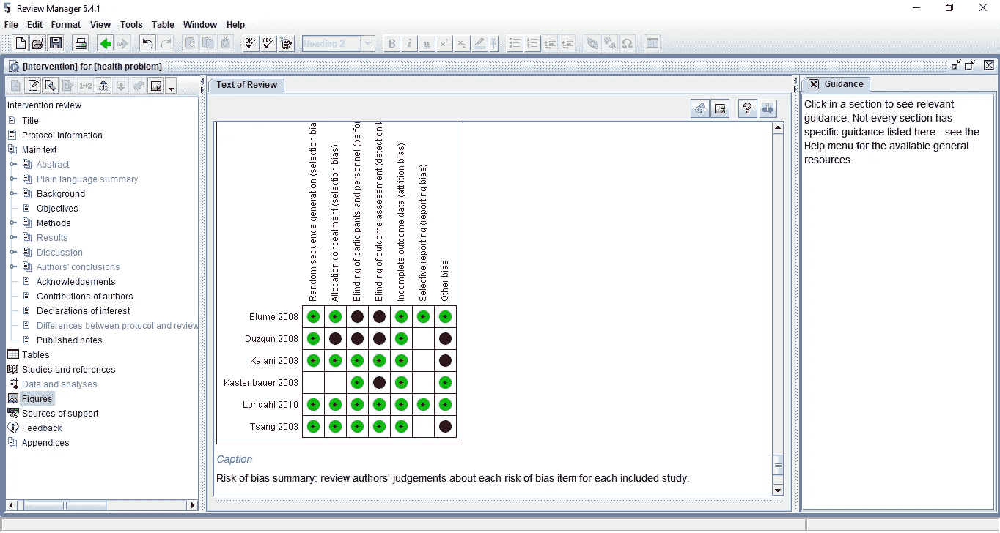

我们将其保存为图像，如下所示:

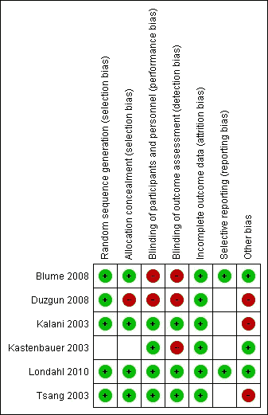

Risk of bias summary: review authors’ judgements about each risk of bias item for each included study.

教程到此为止。我想强调的是，我是以非 Cochrane 模式使用这个软件[。点击这个](https://training.cochrane.org/online-learning/core-software-cochrane-reviews/revman/revman-5-download/non-cochrane-reviews)[链接](https://training.cochrane.org/online-learning/core-software-cochrane-reviews/revman)了解更多关于 RevMan 的信息。

**练习:**七(7)个偏倚领域中的哪一个可以被认为是六(6)项纳入研究中偏倚的重要因素？。

## 参考:

Verde PE，Ohmann C. *结合临床研究中的随机和非随机证据:方法和应用综述。*研究合成方法 2015；6(1):45–62.