# 回顾— Mantini 的 VISAPP'19:生成参考模型和深度学习功能(相机篡改检测)

> 原文：<https://medium.com/mlearning-ai/review-mantinis-visapp-19-generative-reference-model-and-deep-learned-features-camera-f608371c9854?source=collection_archive---------5----------------------->

## 利用生成式对抗网络([干](/@sh.tsang/review-gan-generative-adversarial-nets-gan-e12793e1fb75))和连体网络进行摄像头篡改检测

在这个故事中，回顾了休斯顿大学的**利用生成参考模型和深度学习特征**进行的摄像头篡改检测。在本文中:

*   通过使用 [GAN](/@sh.tsang/review-gan-generative-adversarial-nets-gan-e12793e1fb75) ，**生成模型**被用于**从监视摄像机学习正常操作条件下的图像分布**。
*   **训练暹罗网络**将图像转换到特征空间，从而**最大化生成图像和篡改图像之间的距离**。基于该距离，监视摄像机图像被分类为正常或被篡改。

这是 **2019 VISAPP** 上的一篇论文。( [Sik-Ho Tsang](https://medium.com/u/aff72a0c1243?source=post_page-----f608371c9854--------------------------------) @中)

# 概述

1.  **拟议框架**
2.  **发电机作为参考型号**
3.  **作为特征提取器的连体网络**
4.  **培训策略**
5.  **实验结果**

# 1.拟议框架

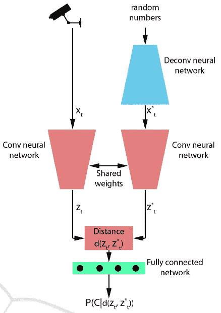

**Proposed framework for camera tampering detection**

*   提议的框架包括

1.  去卷积神经网络(生成器)。
2.  一对具有共享权重的卷积神经网络(CNN)(暹罗网络)。
3.  一个完全连接的神经网络。

*   **生成器**将随机数向量作为输入。它**生成一个代表正常工作状态下监控摄像机的图像。**
*   在时间 t 来自摄像机的图像以及生成的图像被用作**共享权重**的一对 CNN 的输入。该阶段充当**用于生成和测试图像的特征提取器。**
*   变换特征之间的距离被输入到**全连接神经网络**。输出是一个后验值**，估计给定两个输入之间的距离时选择类别 *C* 的概率。**

# **2。发电机作为参考型号**

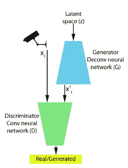

**Generator as a Reference Model**

*   **生成器 *G* 旨在创建视觉上类似于训练示例的图像 *x* *。**
*   **鉴别器 *D* 旨在将生成的图像 *x* *与原始训练图像 *x*** 区分开来。
*   假设 *D* 给一个图像分配一个高的分数，如果它是原始图像，如果它是生成的，则分配一个低的分数。

## 2.1.发电机

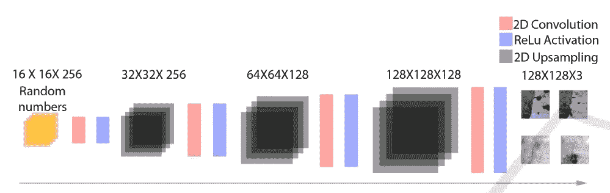

**The Generator: Network Architecture**

*   输入是一个大小为 16×16×256 的随机数矩阵，数字通过三个 2D 上采样层。
*   每个上采样层之后是 2D 卷积层。
*   [使用批次定额](https://sh-tsang.medium.com/review-batch-normalization-inception-v2-bn-inception-the-2nd-to-surpass-human-level-18e2d0f56651)和 ReLU。
*   输出是大小为 127×127×3 的矩阵。
*   生成器的目标是最大化*D*(*G*(*y*)(或者最小化 1-*D*(*G*(*y*))。发电机被训练以优化以下功能:

*   其中 *V* 是损失函数。

## 2.2.鉴别器

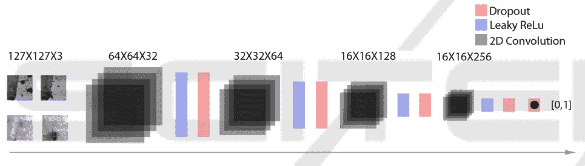

**The Discriminator: Network Architecture**

*   鉴别器由四个 2D 卷积层组成。
*   [使用批次定额](https://sh-tsang.medium.com/review-batch-normalization-inception-v2-bn-inception-the-2nd-to-surpass-human-level-18e2d0f56651)和漏 ReLU。
*   25% [下降](https://sh-tsang.medium.com/paper-dropout-a-simple-way-to-prevent-neural-networks-from-overfitting-image-classification-a74b369b4b8e)用于每次激活。
*   鉴别器优化了以下功能:

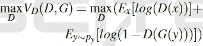

*   发生器和鉴频器的组合损耗函数为:

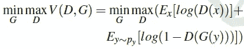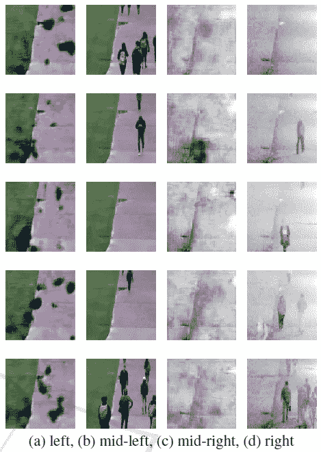

**a) generated image (daytime), b) original image (daytime), c) generated image (nighttime), and d) original image (nighttime).**

*   上图为[甘](/@sh.tsang/review-gan-generative-adversarial-nets-gan-e12793e1fb75) ((a)、(c))生成的图像，并与原始图像((b)、(d))进行对比。
*   这两组图像分别代表白天和黑夜。
*   对数缩放应用于夜间图像。

# 3.作为特征提取器的暹罗网络

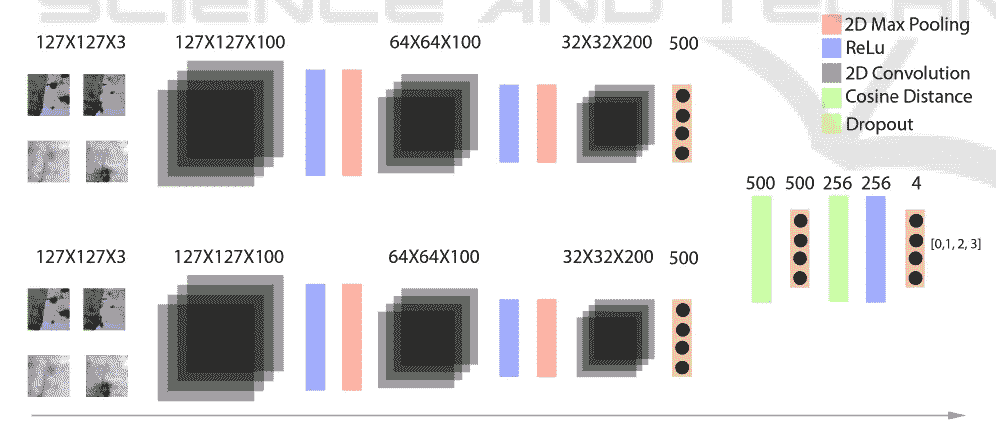

**Siamese Network: Network Architecture**

*   生成器合成参考图像( *x** )。
*   使用用于检测篡改的距离测量将来自摄像机的图像( *x* )与合成图像( *x* *)进行比较。

> 在连体网络中， *x* 和 *x* *被变换到另一个特征空间中，这样如果 *x* 被篡改，变换后的特征 *x* 和 *x* *之间的距离最大；和最小值，如果 *x* 正常。

*   基本 CNN 由两个卷积层组成，每个卷积层之后是 ReLU 激活和 2D 最大池层。
*   该网络由共享同一组权重的两个并行卷积网络组成。
*   距离向量作为输入被提供给一个全连接层，其后是一个[断开](https://sh-tsang.medium.com/paper-dropout-a-simple-way-to-prevent-neural-networks-from-overfitting-image-classification-a74b369b4b8e)和 ReLU 激活层。
*   最后通过另一个完全连接的层，其输出使用 softmax 激活被映射到四个类的后验值。
*   这四个等级代表相机的正常、被覆盖、散焦和移动状态。

# 4.培训策略

*   生成对抗网络和暹罗网络是分开训练的。
*   这些数据被分成两个集群，用于日夜训练个人[甘](/@sh.tsang/review-gan-generative-adversarial-nets-gan-e12793e1fb75)和暹罗网络。
*   GAN 和 Siamese 网络分别经过 5 个和 10 个时期的训练。

## 4.1.训练[甘](/@sh.tsang/review-gan-generative-adversarial-nets-gan-e12793e1fb75)

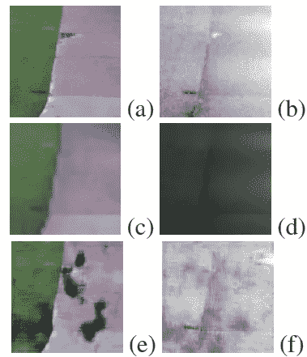

**(a) Day (b) Light (c,e) K=0, (d,f) K=1**

*   使用 K-means 基于它们的颜色特征将训练数据分割成多个聚类。( *K* =2，也许是昼光图像)
*   测试时，根据图像到聚类的距离选择合适的 [GAN](/@sh.tsang/review-gan-generative-adversarial-nets-gan-e12793e1fb75) 。
*   捕获的正常图像用于训练 [GAN](/@sh.tsang/review-gan-generative-adversarial-nets-gan-e12793e1fb75) 。

## 4.2.培训暹罗网络

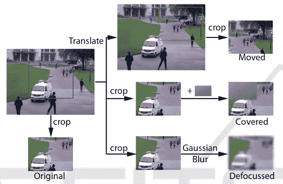

**Synthesis Procedure**

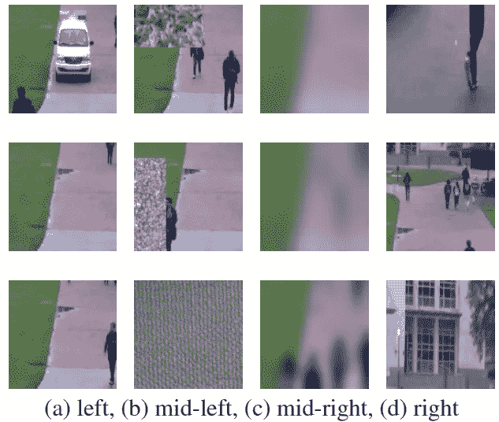

**a) Original, b) Covered, c) Defocused, and d) Moved images.**

*   训练暹罗网络需要四类数据。
*   空间平移、空间平滑和像素复制操作分别用于合成移动的、散焦的和覆盖的篡改。
*   包含四个类的均匀分布的合成数据被用于训练暹罗网络。
*   (合成程序应与 [UHCTD](https://sh-tsang.medium.com/review-uhctd-a-comprehensive-dataset-for-camera-tampering-detection-camera-tampering-detection-f2a132eb7aca) 相同或相似。请随时访问 [UHCTD](https://sh-tsang.medium.com/review-uhctd-a-comprehensive-dataset-for-camera-tampering-detection-camera-tampering-detection-f2a132eb7aca) 。)

# **5。实验结果**

## 5.1.性能赋值

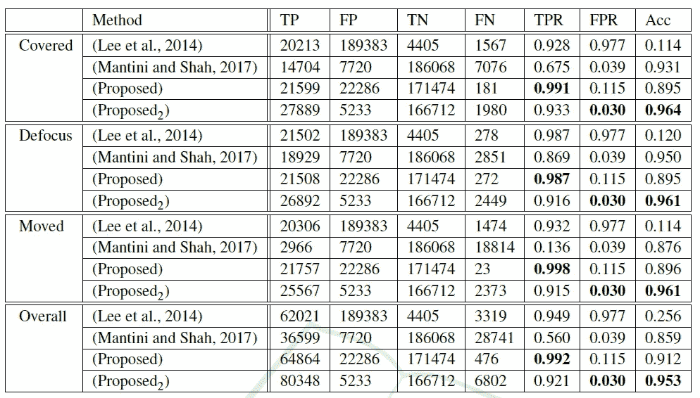

**Performance comparison, TP — true positives, FP — false positives, TN — true negatives, FN — false negatives, TPR — true positive rate, FPR, false positive rate, and Acc — accuracy**

*   提出 2 :一个简单的时间分析机制来抑制虚假的错误警报。它通过从先前的 *t* - *n* 实例中获取类别预测的模式，在时间 *t* 检测篡改。

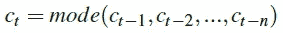

*   其中 *n* =3。
*   检测三类篡改的性能通过将数据集分为三组来量化，每组包含正常图像和仅一种篡改(覆盖、散焦和移动)。
*   结果显示**提出的方法 2 表现最好，总体准确率为 95%** ，其次是**提出的**方法，准确率为 **91%** ，曼蒂尼和沙阿(2017)的准确率为 85%，李氏(2014)的准确率为 25%。
*   lee(2014)无法以 97%的误报率应对场景的复杂性。
*   Mantini 和 Shah(2017)的方法能够比其他篡改者更好地检测散焦图像。
*   与提出的系统相比，Mantini 和 Shah(2017)显示了覆盖和散焦图像的更高准确性，并且产生了更少的假阳性。
*   **Proposed2 方法在准确率和假阳性率方面优于 Mantini 和 Shah(2017)的方法。**

> 所提出的方法具有很高的检测篡改的能力，它分别检测到 99%、98%和 99%的覆盖、散焦和移动篡改，而 Proposed2 检测到 93%、91%和 91%，Mantini 和 Shah(2017)检测到 67%、86%和 13%。
> 
> 时间分析降低了假阳性，但是影响了系统检测篡改的能力。

## 5.2.混淆矩阵

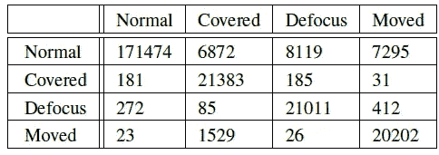

**Confusion matrix of Proposed System**

*   在三种篡改类别和正常图像之间存在明显的混淆。这些对应于假警报。
*   假阴性是最小的。百分之五的移动图像被分类为被覆盖，百分之二的散焦图像被分类为移动。

## 5.3.不足之处

*   提议的系统**需要一个大数据集来进行训练。**
*   所提出的方法没有正式引入在线机制来更新训练模型。因此，系统在**极端天气**条件下的性能是**不可预测的**。

> 在未来，作者希望探索使用**场景独立特征**的系统的性能，并验证学习是否可以转移到各种场景。

## 参考

【2019 VISAPP】【曼蒂尼的 VISAPP ' 19】
[利用生成式参考模型和深度学习特征的摄像头篡改检测](https://www.scitepress.org/Link.aspx?doi=10.5220/0007392100850095)

## 摄像机篡改检测

**2016** [ [董的 IC DSP ' 16](https://sh-tsang.medium.com/review-dongs-icdsp-16-morphological-analysis-and-deep-learning-camera-anomaly-tampering-c685c4ddd3c7)]**2019**[[VFI-ConvLSTM](https://sh-tsang.medium.com/review-video-frame-interpolation-using-convlstm-camera-tampering-detection-5b07dec0fb52)][[UHCTD](https://sh-tsang.medium.com/review-uhctd-a-comprehensive-dataset-for-camera-tampering-detection-camera-tampering-detection-f2a132eb7aca)][[曼蒂尼的 VISAPP'19](https://sh-tsang.medium.com/review-mantinis-visapp-19-generative-reference-model-and-deep-learned-features-camera-f608371c9854) ]

## [我之前的其他论文阅读](https://sh-tsang.medium.com/overview-my-reviewed-paper-lists-tutorials-946ce59fbf9e)