# 综述——潘:语义切分的金字塔注意网络(Semantic Segmentation)

> 原文：<https://medium.com/mlearning-ai/review-pan-pyramid-attention-network-for-semantic-segmentation-semantic-segmentation-8d94101ba24a?source=collection_archive---------0----------------------->

## 使用 FPA 和 GAU 模块，性能优于 [FCN](https://towardsdatascience.com/review-fcn-semantic-segmentation-eb8c9b50d2d1?source=post_page---------------------------) 、 [DeepLabv2](https://towardsdatascience.com/review-deeplabv1-deeplabv2-atrous-convolution-semantic-segmentation-b51c5fbde92d?source=post_page---------------------------) 、 [CRF-RNN](https://towardsdatascience.com/review-crf-rnn-conditional-random-fields-as-recurrent-neural-networks-semantic-segmentation-a11eb6e40c8c?source=post_page---------------------------) 、 [DeconvNet](https://towardsdatascience.com/review-deconvnet-unpooling-layer-semantic-segmentation-55cf8a6e380e?source=post_page---------------------------) 、 [DPN](/@sh.tsang/reading-dpn-deep-parsing-network-semantic-segmentation-2f740ced6edc) 、 [PSPNet](https://towardsdatascience.com/review-pspnet-winner-in-ilsvrc-2016-semantic-segmentation-scene-parsing-e089e5df177d?source=post_page---------------------------) 、 [DPN](/@sh.tsang/reading-dpn-deep-parsing-network-semantic-segmentation-2f740ced6edc) 、 [DeepLabv2](https://towardsdatascience.com/review-deeplabv1-deeplabv2-atrous-convolution-semantic-segmentation-b51c5fbde92d?source=post_page---------------------------) 、[refinent](https://towardsdatascience.com/review-refinenet-multi-path-refinement-network-semantic-segmentation-5763d9da47c1?source=post_page---------------------------)、 [DUC](/@sh.tsang/review-resnet-duc-hdc-dense-upsampling-convolution-and-hybrid-dilated-convolution-semantic-c4208227b1ca) 和 [PSPNet](https://towardsdatascience.com/review-pspnet-winner-in-ilsvrc-2016-semantic-segmentation-scene-parsing-e089e5df177d?source=post_page---------------------------)

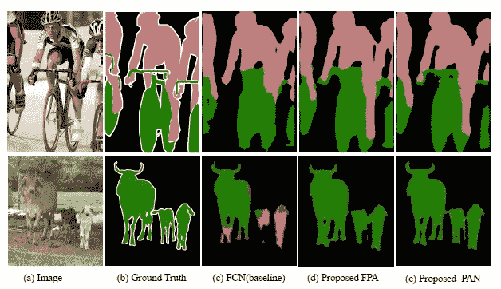

**Visualization results on VOC dataset**

在这个故事里，**由北京理工大学、(Face ++ Inc .)和北京大学的**、(潘)所做的用于语义分割的**金字塔注意力网络被评论。在本文中:**

*   **引入特征金字塔注意(FPA)** 模块，对高层输出进行空间金字塔注意结构，结合全局池学习更好的特征表示
*   **全局注意力上采样(GAU)** 在每个解码器层上引入模块，以提供全局上下文作为低级特征的指导来选择类别本地化细节。

这是一篇发表在 **2018 BMVC** 的论文，被**引用超过 200 次**。( [Sik-Ho Tsang](https://medium.com/u/aff72a0c1243?source=post_page-----8d94101ba24a--------------------------------) @ Medium)

# 概述

1.  **潘:网络架构**
2.  **特征金字塔注意力(FPA)模块**
3.  **全球关注样本(GAU)模块**
4.  **消融研究**
5.  **实验结果**

# 1.潘:网络架构

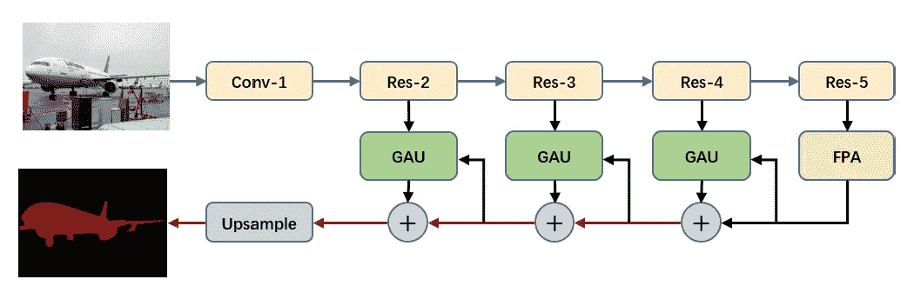

**PAN: Network Architecture**

*   ImageNet 预处理过的 [ResNet](https://towardsdatascience.com/review-resnet-winner-of-ilsvrc-2015-image-classification-localization-detection-e39402bfa5d8?source=post_page---------------------------) -101，带扩张卷积(最初来自 [DeepLab](https://towardsdatascience.com/review-deeplabv1-deeplabv2-atrous-convolution-semantic-segmentation-b51c5fbde92d?source=post_page---------------------------) ，或 [DilatedNet](https://towardsdatascience.com/review-dilated-convolution-semantic-segmentation-9d5a5bd768f5?source=post_page---------------------------) )，用作基线。
*   **对 res5b 块**应用了速率为 2 的膨胀卷积，因此 [ResNet](https://towardsdatascience.com/review-resnet-winner-of-ilsvrc-2015-image-classification-localization-detection-e39402bfa5d8?source=post_page---------------------------) 输出的特征图大小为输入图像的 **1/16，类似于 [DeepLabv3+](/@sh.tsang/review-deeplabv3-atrous-separable-convolution-semantic-segmentation-a625f6e83b90) 。**
*   **将原 [ResNet](https://towardsdatascience.com/review-resnet-winner-of-ilsvrc-2015-image-classification-localization-detection-e39402bfa5d8?source=post_page---------------------------) -101 **中的 7×7 卷积层**替换为类似 [PSPNet](https://towardsdatascience.com/review-pspnet-winner-in-ilsvrc-2016-semantic-segmentation-scene-parsing-e089e5df177d?source=post_page---------------------------) 和 [DUC](/@sh.tsang/review-resnet-duc-hdc-dense-upsampling-convolution-and-hybrid-dilated-convolution-semantic-c4208227b1ca) 的三个 3×3 卷积层**。
*   **FPA** 模块用于**从 [ResNet](https://towardsdatascience.com/review-resnet-winner-of-ilsvrc-2015-image-classification-localization-detection-e39402bfa5d8?source=post_page---------------------------) 的输出中采集密集像素级注意力信息**。结合**全局上下文**，最终的逻辑由 **GAU** 模块跟随生成最终的预测图。

# **2。特征金字塔注意力(FPA)模块**

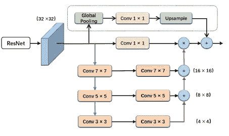

**Feature Pyramid Attention (FPA)**

*   FPA 通过实施类似特征金字塔网络的 U 形结构( [FPN](https://towardsdatascience.com/review-fpn-feature-pyramid-network-object-detection-262fc7482610?source=post_page---------------------------) )来融合三种不同金字塔尺度下的特征。
*   为了更好地从**不同的金字塔尺度**中提取上下文，我们在金字塔结构中分别使用 **3×3、5×5、7×7 卷积**。
*   由于高级特征图的分辨率较小，使用大的核大小并不会带来太大的计算负担。
*   然后金字塔结构逐步整合不同尺度的信息，这样**可以更精确地整合上下文特征的相邻尺度。**
*   此外，来自 CNN 的源特征在经过一个 **1×1 卷积**后，与金字塔注意力特征逐像素相乘。
*   **全局平均池分支**，起源于 [SENet](https://towardsdatascience.com/review-senet-squeeze-and-excitation-network-winner-of-ilsvrc-2017-image-classification-a887b98b2883?source=post_page---------------------------) ，也引入添加输出特性。

> 特征金字塔注意(FPA)模块可以**融合不同尺度的上下文信息**和**同时对高级特征地图产生更好的像素级注意**。

# **3。全球关注样本(GAU)模块**

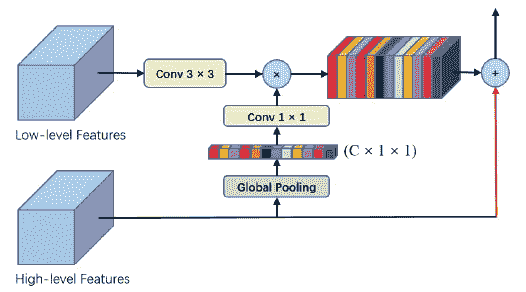

**Global Attention Upsample (GAU)**

*   GAU 执行全球平均池，以**提供全球上下文作为低级功能的指导，从而选择类别本地化细节。**
*   具体来说，在低层特征上执行 **3×3 卷积**，以减少来自 CNN 的特征图的通道。
*   从高层特征生成的全局上下文是通过 **1×1 卷积**与 [**批量归一化**](https://sh-tsang.medium.com/review-batch-normalization-inception-v2-bn-inception-the-2nd-to-surpass-human-level-18e2d0f56651) 和 **ReLU** 非线性，然后**乘以低层特征。**
*   最后，**高层特征与加权的低层特征相加**，并逐渐上采样。

> GAU 更有效地部署不同比例的特征地图，并使用高级特征以简单的方式向低级特征地图提供指导信息。

# **4。**消融研究

## 4.1.FPA 模块

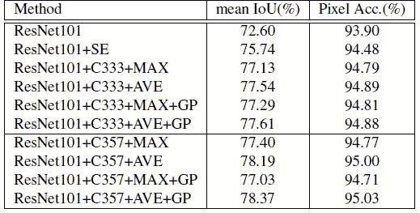

**Detailed performance of Feature Pyramid Attention with different settings on VOC 2012**

*   **C333** :表示所有卷积的核大小为 3×3。
*   **C357** :表示卷积的核大小分别为 3×3、5×5、7×7。
*   **最大**和**平均**:表示最大池化和平均池化操作。
*   **GP** :全球统筹分行。
*   对于使用具有 **3×3** 内核大小的所有卷积，**【AVE】**设置与【MAX】设置相比，将性能从 77.13%提高到 **77.54%** 。
*   与 [SENet](https://towardsdatascience.com/review-senet-squeeze-and-excitation-network-winner-of-ilsvrc-2017-image-classification-a887b98b2883?source=post_page---------------------------) 警示模块相比，“C333”和“AVE”设置将性能提高了近 1.8%。
*   **用大核卷积‘C357’**代替 3×3 的核大小，性能从 77.54%提高到 **78.19%。**
*   **通过进一步添加全局池分支**，最终，最佳设置在平均 IoU 和像素 Acc 方面产生结果 **78.37%** /95.03。(%).

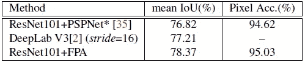

*   与 [PSPNet](https://towardsdatascience.com/review-pspnet-winner-in-ilsvrc-2016-semantic-segmentation-scene-parsing-e089e5df177d?source=post_page---------------------------) 和 [DeepLabv3](https://towardsdatascience.com/review-deeplabv3-atrous-convolution-semantic-segmentation-6d818bfd1d74?source=post_page---------------------------) 相比，FPA 模块分别比 [PSPNet](https://towardsdatascience.com/review-pspnet-winner-in-ilsvrc-2016-semantic-segmentation-scene-parsing-e089e5df177d?source=post_page---------------------------) 和 [DeepLabv3](https://towardsdatascience.com/review-deeplabv3-atrous-convolution-semantic-segmentation-6d818bfd1d74?source=post_page---------------------------) 高出约 1.5%和 1.2%。

## 4.2.GAU 模块

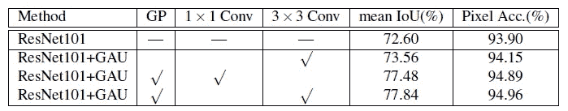

**Detailed performance with different settings of decoder module on VOC 2012**

*   在没有全球背景注意分支的情况下，GAU 仅将绩效从 72.60%提高到 73.56%。
*   利用全局池操作提取全局上下文注意信息，使性能从 73.56%提高到 77.84%。

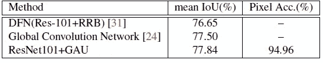

**Comparison with other state-of-art decoder module**

*   GAU 模块超过 RRB 1.2%。
*   值得注意的是，全局卷积网络( [GCN](https://towardsdatascience.com/review-gcn-global-convolutional-network-large-kernel-matters-semantic-segmentation-c830073492d2?source=post_page---------------------------) )使用额外的 COCO 数据集结合 VOC 数据集进行训练，获得了 77.50%，而 **GAU 模块在没有 COCO 数据集进行训练的情况下可以达到 77.84%。**

# 5.实验结果

## 5.1.帕斯卡 VOC 2012

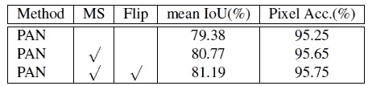

**Performance on VOC 2012 val set**

*   利用多尺度输入(尺度= {0.5，0.75，1.0，1.25，1.5，1.75})以及在评估中左右翻转图像，实现了 81.19%的 mIOU。

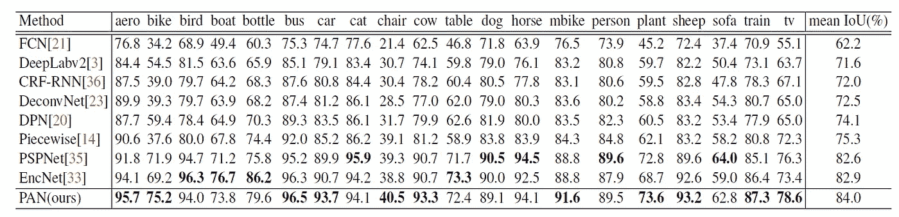

**Per-class results on PASCAL VOC 2012 test set.**

*   最后，**提出的 PAN 在没有 MS-COCO 和 Dense-CRF 后处理( [DeepLabv1](https://towardsdatascience.com/review-deeplabv1-deeplabv2-atrous-convolution-semantic-segmentation-b51c5fbde92d?source=post_page---------------------------) )的情况下实现了 84.0%** 的性能，优于 [FCN](https://towardsdatascience.com/review-fcn-semantic-segmentation-eb8c9b50d2d1?source=post_page---------------------------) 、 [DeepLabv2](https://towardsdatascience.com/review-deeplabv1-deeplabv2-atrous-convolution-semantic-segmentation-b51c5fbde92d?source=post_page---------------------------) 、 [CRF-RNN](https://towardsdatascience.com/review-crf-rnn-conditional-random-fields-as-recurrent-neural-networks-semantic-segmentation-a11eb6e40c8c?source=post_page---------------------------) 、 [DeconvNet](https://towardsdatascience.com/review-deconvnet-unpooling-layer-semantic-segmentation-55cf8a6e380e?source=post_page---------------------------) 、 [DPN](/@sh.tsang/reading-dpn-deep-parsing-network-semantic-segmentation-2f740ced6edc) 、分段、 [PSPNet](https://towardsdatascience.com/review-pspnet-winner-in-ilsvrc-2016-semantic-segmentation-scene-parsing-e089e5df177d?source=post_page---------------------------) 和 EncNet。

## 5.2.城市景观

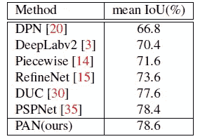

**Performance on Cityscapes testing set without coarse annotation dataset**

*   同样，潘的表现也优于的方法，比如的[、](/@sh.tsang/reading-dpn-deep-parsing-network-semantic-segmentation-2f740ced6edc)、 [DeepLabv2 的](https://towardsdatascience.com/review-deeplabv1-deeplabv2-atrous-convolution-semantic-segmentation-b51c5fbde92d?source=post_page---------------------------)、 [RefineNet 的](https://towardsdatascience.com/review-refinenet-multi-path-refinement-network-semantic-segmentation-5763d9da47c1?source=post_page---------------------------)、[、](/@sh.tsang/review-resnet-duc-hdc-dense-upsampling-convolution-and-hybrid-dilated-convolution-semantic-c4208227b1ca)PSPNet 的。

## 参考

【2018】【潘】
[金字塔注意力网络进行语义切分](https://arxiv.org/abs/1805.10180)

## 语义分割

)(我)(们)(都)(没)(想)(要)(到)(这)(里)(来)(,)(我)(们)(都)(不)(想)(要)(到)(这)(里)(去)(了)(,)(我)(们)(还)(没)(想)(到)(这)(些)(事)(,)(就)(是)(这)(些)(事)(,)(我)(们)(还)(没)(想)(要)(到)(这)(里)(来)(,)(我)(们)(就)(没)(想)(到)(这)(些)(事)(了)(。 )(他)(们)(都)(不)(在)(这)(些)(事)(上)(,)(她)(们)(还)(不)(在)(这)(些)(事)(上)(有)(什)(么)(情)(况)(呢)(?)(她)(们)(都)(不)(在)(这)(些)(情)(况)(下)(,)(她)(们)(还)(不)(在)(这)(些)(事)(上)(有)(什)(么)(情)(况)(?)(她)(们)(们)(都)(不)(在)(这)(些)(事)(上)(有)(,)(她)(们)(们)(还)(不)(在)(这)(些)(事)(上)(,)(她)(们)(们)(还)(不)(在)(这)(些)(事)(上)(有)(,)(她)(们)(们)(们)(还)(有)(什)(么)(好)(的)(事)(。

## [我以前的其他论文阅读材料](https://sh-tsang.medium.com/overview-my-reviewed-paper-lists-tutorials-946ce59fbf9e)