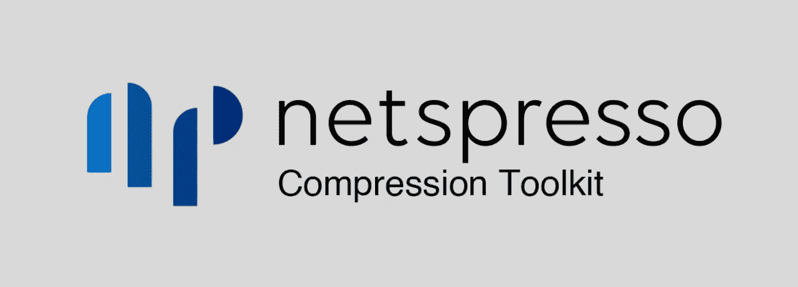

# 回顾 Nota AI 的 NetsPresso 压缩工具包

> 原文：<https://medium.com/mlearning-ai/reviewing-nota-ais-netspresso-compression-toolkit-47d0c3b4f89c?source=collection_archive---------4----------------------->

## 轻松的深度学习模型压缩

我被要求为 Nota AI 的 NetsPresso 压缩工具包(NPTK)写一篇评论。如果你不熟悉 NPTK，你可以在这里阅读对它的介绍和它支持的压缩方法[。](/mlearning-ai/compress-your-deep-learning-models-with-no-code-no-hassle-7ce02f61a5dc)

我对使用 Nota 的压缩工具包来压缩模型的简单性印象深刻…