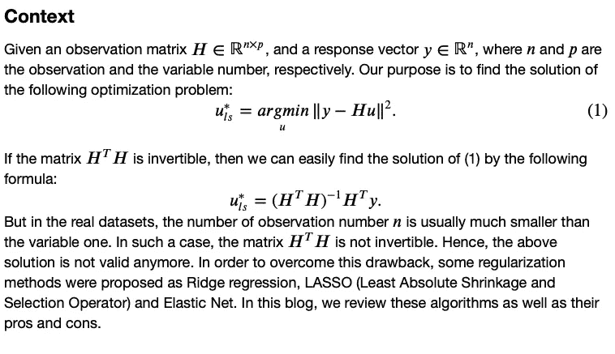
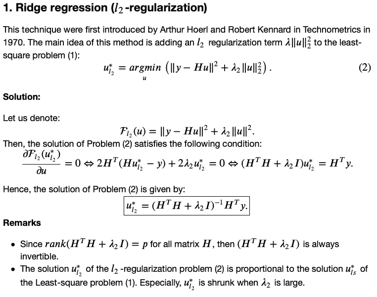
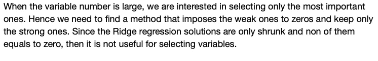
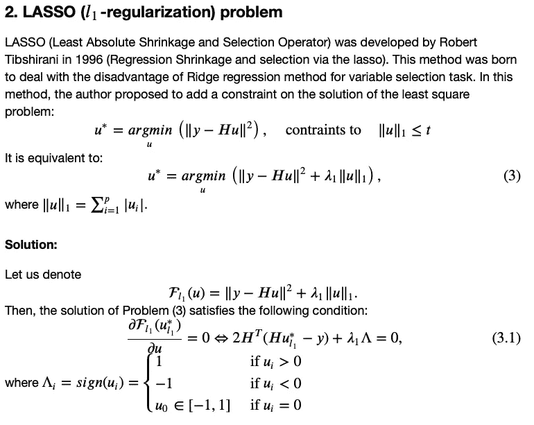
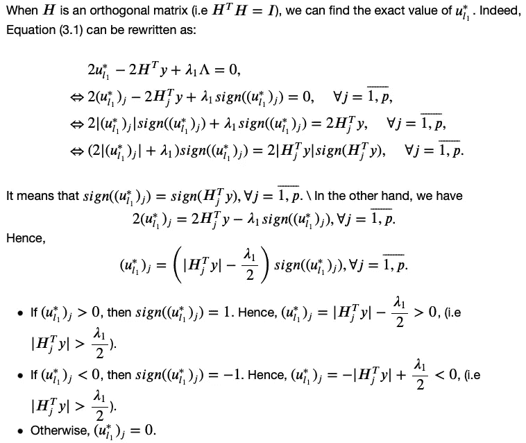
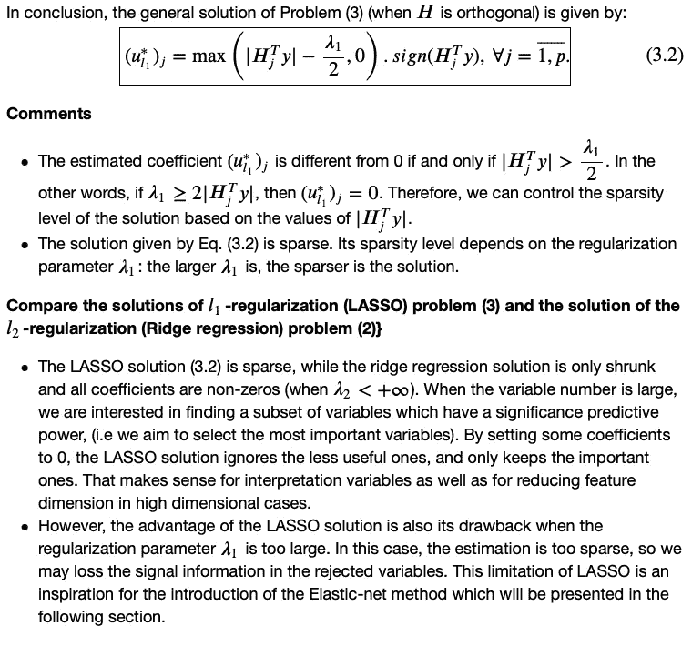
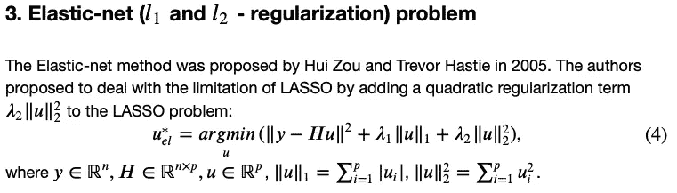
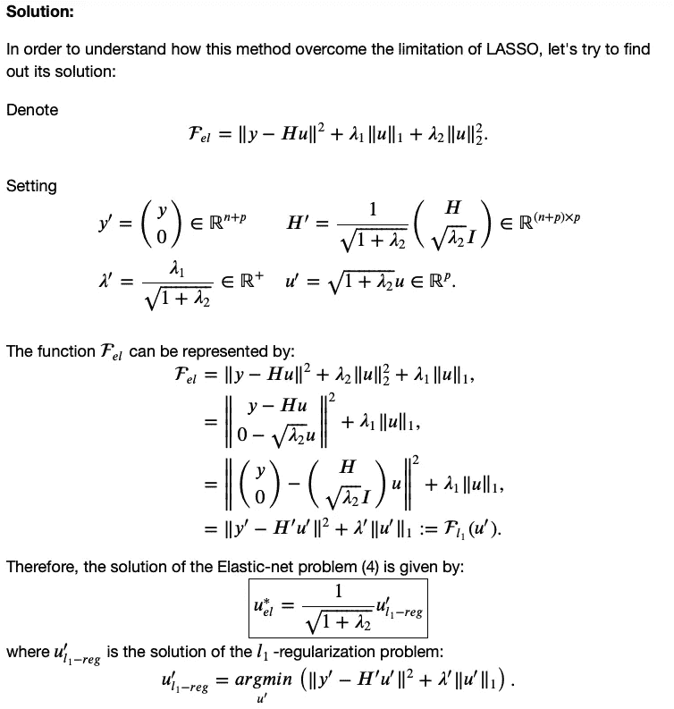
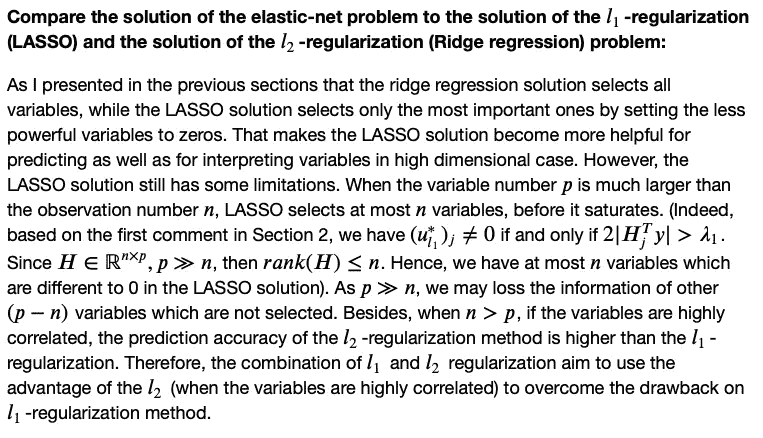
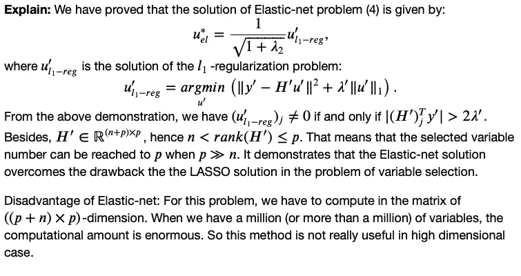

# 岭回归，套索，弹性网

> 原文：<https://medium.com/mlearning-ai/ridge-regression-lasso-elastic-net-75f898e50c43?source=collection_archive---------4----------------------->

**参考文献**

[1]霍尔，阿瑟 e .和罗伯特 w .肯纳德。"岭回归:非正交问题的有偏估计."技术计量学 12.1(1970):55–67。

[2]罗伯特·蒂布拉尼。"通过套索的回归收缩和选择."皇家统计学会杂志:B 辑(方法论)58.1(1996):267–288。

[3]邹，许，和特雷弗·哈斯蒂."通过弹性网的正则化和变量选择."皇家统计学会杂志:B 辑(统计方法学)67.2(2005):301–320。

 [## Mlearning.ai 提交建议

### 如何成为 Mlearning.ai 上的作家

medium.com](/mlearning-ai/mlearning-ai-submission-suggestions-b51e2b130bfb)