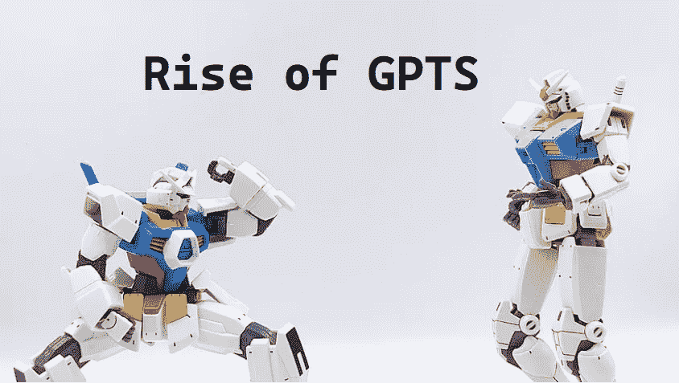

# GPT 的崛起或 ChatGPT 的根在哪里

> 原文：<https://medium.com/mlearning-ai/rise-of-gpts-b6f4b83a8e21?source=collection_archive---------4----------------------->

随着变形金刚涌入这个领域，研究巨头们正准备释放他们的潜力，他们来了:生成式预训练变形金刚，或者我们所知的 GPT。

Photo by [Jeffery Ho](https://unsplash.com/@jefferyho?utm_source=medium&utm_medium=referral) on [Unsplash](https://unsplash.com?utm_source=medium&utm_medium=referral)

自 2018 年以来 [OpenAI](https://openai.com/) 已经提交了几篇关于语言处理主题的文章，但最后一篇来自 2020 年，对全球各地的人们产生了如此大的影响。让我们看看它是如何开始的。