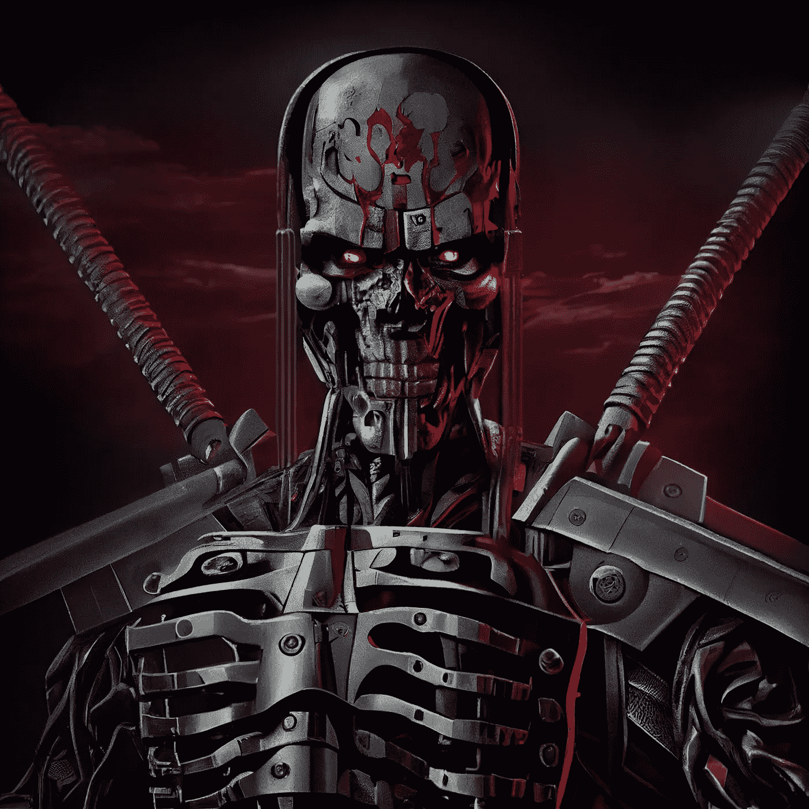

# 机器的崛起:人工智能与艺术的未来

> 原文：<https://medium.com/mlearning-ai/rise-of-the-machine-ai-and-the-future-of-art-ce6734c38a50?source=collection_archive---------3----------------------->

## 艺术中关于人工智能的争议:艺术家的担忧有效吗？

人工智能(AI)融入艺术世界在艺术界引发了很多争论和争议。虽然并非所有艺术家都反对人工智能艺术，但对其扩散的口头反对提出了关于艺术价值和技术在其创作中的作用的重要问题。

This is how AI-art is perceived by the most vocal opposition, but are their concerns justified ? (Image by Aron Brand)

为什么这些艺术家对 AI 艺术如此动摇？一个主要的担忧是人类创造的艺术的潜在贬值。

从经济学角度来看，和任何商品一样，艺术品的价值是由供求规律决定的。当艺术品的供给增加，而需求没有相应增加时，艺术品的价格就会下降。由于区分传统艺术和人工智能艺术变得越来越困难，因此提出人工智能辅助艺术将使艺术贬值的说法不无道理。在人工智能的帮助下创作艺术的成本，以及所需的技能和培训，远低于手工创作艺术的成本，这意味着人工智能艺术可能会充斥市场，甚至可能使手工创作的艺术在经济上不可行。

例如，想想有多少人更愿意从传统艺术家那里购买一幅版画来装饰他们的客厅，而以同样的价格，他们可以委托一位*原创*、*一种按照他们的规格和个人品味制作的*艺术品？我认为定制的艺术品对许多人来说更有吸引力。

这种对人类创造的艺术贬值的担忧在艺术界引起了很多争论。一些依靠艺术谋生的专业艺术家感到担忧是可以理解的，一些业余艺术家也是如此，他们可能觉得自己没有在一个公平的竞争环境中与人工智能的超人力量和速度竞争。

关于人工智能辅助艺术如何真正工作的错误信息的传播也助长了这些有效的经济担忧。一些更直言不讳的人工智能艺术反对者一直认为人工智能依赖于复制现有艺术品的一部分，导致了人工智能艺术家正在“窃取”艺术的误解。然而，事实并非如此。人工智能艺术从现有的图像和艺术作品中学习，就像人类为了获得灵感而研究其他艺术作品一样，而这些作品不是为了生成新的艺术作品而记忆或访问的。虽然在理论上“过度拟合”是可能的，即人工智能模型无意中记忆了他们的训练集的一部分，但现实世界的经验表明，图像生成模型，如 Midjourney，不能充分复制艺术作品。事实上，文本到图像的人工智能模型的大小只有几千兆字节，而它们是在数百万亿字节的源图像上训练的。从源图像到模型的这种极大的有损压缩，[将数据量减少了至少四个数量级](/p/883b25552636/)，这意味着忠实地记住特定艺术作品的“实质”部分的可能性极其渺茫。

人工智能艺术的反对者正在游说监管人工智能在艺术中的使用，例如，要求披露人工智能在艺术创作中的使用。但这忽略了[一个事实，即人工智能艺术是由人类和机器合作产生的，在某种程度上模糊了两者之间的界限](/p/78ed410673d3)。我们不可能确定一件艺术品是完全由人类创作的还是完全由机器创作的，在许多情况下，机器被用作一种工具来增强或完善由人类艺术家创作的作品。这意味着监管人工智能艺术的使用可能不切实际，最终也不可能。

总的来说，人工智能融入艺术世界提出了关于艺术价值、技术在其创作中的作用以及对人类艺术家生计的影响的复杂而有效的问题。人类艺术家创作艺术的经济激励对于保持艺术的多样性和真实性以及支持艺术家的生计至关重要。

艺术界必须继续就这些问题进行开放和诚实的讨论，并找到在艺术中拥抱人工智能的方法，同时找到认可和奖励手工艺术家独特贡献和技能的方法。

## W *你觉得怎么样？请在评论中告诉我。*

***想看更多？*** *关注我上* [*Twitter*](https://twitter.com/aron_brand) *或*[*LinkedIn*](https://www.linkedin.com/in/aronbrand/)*。*

 [## Mlearning.ai 提交建议

### 如何成为 Mlearning.ai 上的作家

medium.com](/mlearning-ai/mlearning-ai-submission-suggestions-b51e2b130bfb)