# 利用蒙特卡罗模拟对日常幻想棒球游戏的风险评估

> 原文：<https://medium.com/mlearning-ai/risk-assessment-of-daily-fantasy-baseball-games-using-monte-carlo-simulation-a82913809880?source=collection_archive---------8----------------------->

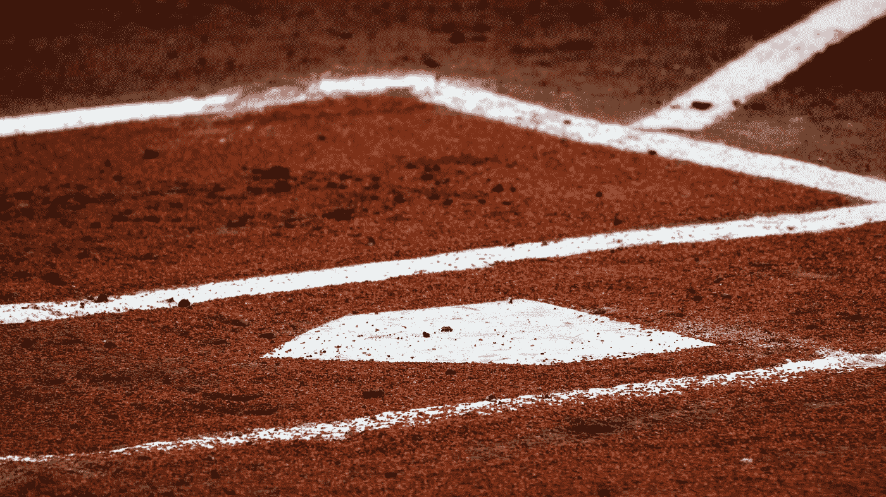

Photo by [Mark Duffel](https://unsplash.com/@2mduffel?utm_source=unsplash&utm_medium=referral&utm_content=creditCopyText) on [Unsplash](https://unsplash.com/s/photos/fantasy-baseball?utm_source=unsplash&utm_medium=referral&utm_content=creditCopyText)

今年夏天，我想就一个一直困扰我的问题测试一下我的运筹学技能。为什么我在线每日幻想棒球那么差？

如果你正在读这篇文章，你可能知道我在说什么。我假设你是那种想要做一些研究的人，可能无意中发现了这篇数据科学博客文章，寻找如何建立团队的技巧。

> 剧透:我有坏消息要告诉你。

在这个博客中，你将了解为什么在线幻想运动是困难的。你会看到这些网络游戏提供商创造的经济是高效的；如果你想利用这个系统，你需要投入大量的时间。

# 什么是网络幻想棒球？

如果你不熟悉我正在谈论的任何事情，那么这一段是给你的。根据一个匿名的在线赌博网站，在线体育博彩是一个 480 亿美元的产业。在幻想体育中，你选择当天正在比赛的球员，看看他们能否通过出色的表现为你赚钱。在棒球版本中，你选择 8 个位置球员和 2 个投手的花名册；而且他们的工资不能超过联盟的工资帽。他们那天的表现决定了你的得分。那天除了挑最好的选手，你什么都不用做。

简单吧？

Image by author: Fantasy baseball (classic rules)

# 我在线幻想棒球有什么不好的？

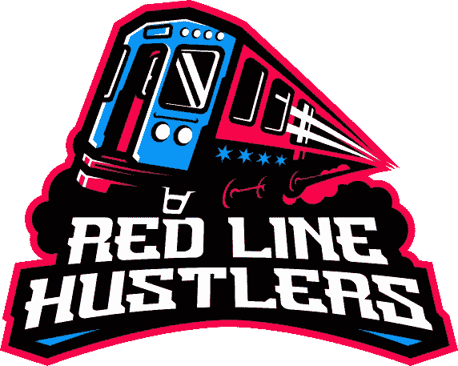

Image by Author. My fantasy baseball logo.

加入我的梦幻团队，芝加哥红线皮条客。是的，我为我的虚拟团队设计了一个标志。关你什么事？

我们没那么好。我玩了一个月左右，我的团队亏损了。不是很多，我不会拿一堆去冒险。但是，我不能辞掉白天的工作；我想知道为什么。

# 蒙特卡洛模拟帮助我们评估梦幻运动中的风险

为了理解我为什么如此不擅长这个游戏，我打开了我的决策分析工具包，重新使用了那个久经考验的投资组合分析工具——蒙特卡洛模拟。模拟将帮助我理解人事决策中的风险——特别是考虑到我们低于联盟工资帽的限制，应该挑选哪十名球员。

模拟将使用美国职业棒球大联盟球员从 2018 年到我们模拟的比赛前一天的真实结果。我通过从 MLB.com 的公共 API 获取所有活跃的主要会员的每日统计数据来实现这一点。(注意:数据工程超出了本博客的范围。)

一旦收集了统计数据，我们必须收集我们感兴趣的虚拟游戏中的合格玩家。我通过与专门从事日常幻想体育的在线体育赌博运营商的公共 API 进行交互来实现这一点。(注意:数据工程超出了本博客的范围。)

一旦数据被收集并且合格的玩家被识别，模拟可以进行穷尽搜索，通过新颖的约束传播来修改，以找到最佳表演阵容；或者用户可以定义阵容并评估其性能。

# 目标函数

模拟的目的是模拟由 2 个投手和 8 个位置球员的阵容进行的棒球比赛的潜在结果。这些结果使用在线提供商的每日幻想棒球比赛的经典规则来评分。

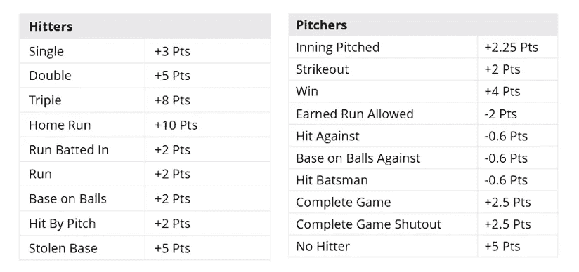

Image by Author: Typical classic scoring template used by online fantasy baseball providers.

# 蒙特卡洛模拟

有了可用的数据，我们就可以着手从现实世界的数据中试验和模拟预期的结果。我们的目标是确定 8 个位置球员(代表棒球中所有 8 个防守位置)和 2 个投手的幻想得分。我们的模型需要分别解决位置球员和投手的问题。

# 击球模拟:板的外观很重要

对于位置球员来说，得分高度偏向击球结果。对于位置玩家，我们的重点将是模拟板块外观和该板块外观的相应潜在结果。

我们通过模拟进攻的结果来实现这一点，我们只关心盘子的外观，因为这是玩家影响幻想游戏的唯一机会。我们的模拟流程图显示了我们的模型将如何识别板块外观及其潜在的结果。

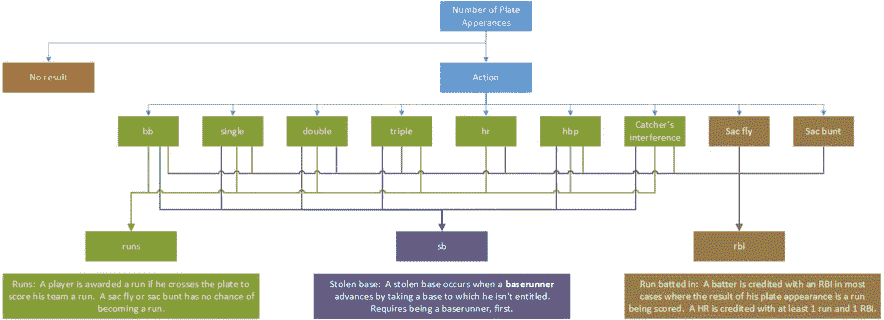

Image by Author: Batting simulation flowchart

## 板材外观

玩家可以在每场比赛中出现各种盘子，这主要与他们出现在阵容中的顺序有关。在阵容后面的位置球员往往比在阵容顶部(开始)的球员更少出场。我们的模型可以访问玩家历史上出现的盘子数量；但是不能访问他们在那场比赛中出现的阵容中的顺序。这是我们模拟准确性的第一个限制。我基于历史结果而不是基于即将到来的比赛的击球顺序的实际预期来模拟盘子外观。

为了完成我们的模拟，我们通过使用随机数生成器从每个位置玩家的历史盘子外观的有序列表中选择盘子外观，从过去的游戏中经验性地采样盘子外观。

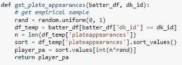

Image by Author: Python code to return plate appearances

对于每个模拟的游戏，随机选择盘子的外观。这种方法对于匹配每个玩家的预期结果非常准确。

Image by Author: Plate appearances actual performance vs simulated performance.

## 平板外观结果

一旦模拟了盘子的外观，我们现在需要确定模型来确定哪些结果是可能的，并利用嵌套概率来选择代表玩家预期实现的结果。我们嵌套或连锁概率的第一站是从玩家将盘子外观转化为进攻结果的能力中取样。该比率可以应用于模拟盘外观，以识别玩家在该游戏中获得了多少结果。

Image by Author: Python code to return outcome ratio

随着结果数量的确定，我们可以使用玩家的历史结果来模拟玩家的能力。例如，如果我们模拟一个以打出很多本垒打而闻名的球员，我们会在他的历史表现中看到很多本垒打。

Image by Author: Outcomes for two different MLB position players showing a unique outcome distribution.

该模拟将从玩家在过去取得的结果的分布中经验性地取样。然后，可以根据在线幻想提供商的记分卡对结果进行评分，并进一步处理，以基于该结果发生时的游戏状态来模拟额外的结果。

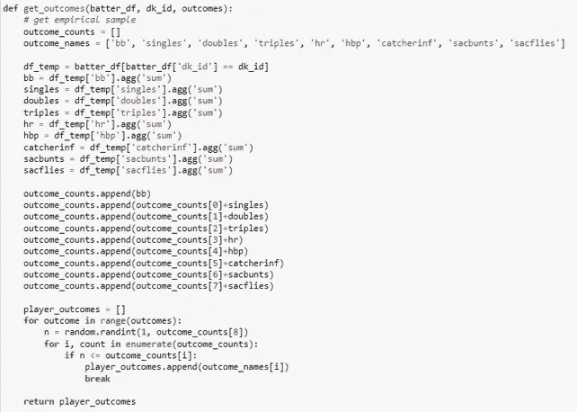

Image by Author: Python code to return player outcomes.

## 板材外观的基本状态和最终结果的模拟

结果发生时的游戏状态也会影响我们的模拟必须模拟的三个最终结果。这三个结果取决于玩家获得结果之前、期间和之后发生的事件。我们流程图的最后一层显示了跑垒、盗垒和打点只有在某些结果发生时才可能发生。

此外，这三个事件的数量也受结果的影响。例如，如果一名球员打了一个本垒打，他们至少会得到一分和一分。由于这种结果，他们也没有机会获得一个被盗的基地。我们在一个额外的嵌套概率层中对所有这些规则建模，并根据过去玩家的表现进行经验采样，以模拟玩家在其中表现的游戏状态。下面是这些结果的一个例子，建模运行。

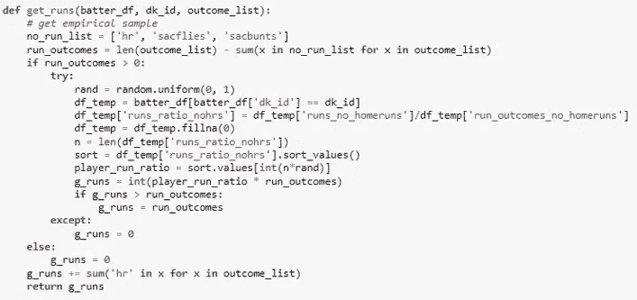

## 模拟击球结果

定义了所有的函数后，我现在可以为任何玩家模拟无限的游戏，并有足够的样本表演可供借鉴。结果表现很好。这里有一个洛杉矶道奇队的模拟特雷·特纳的例子。

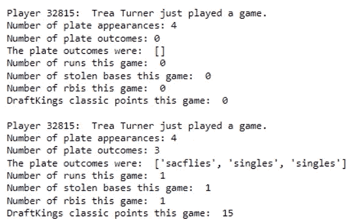

Image by Author: Trea Turner Simulation (2 games)

Image by Author: Boxplot of Trea Turner Fantasy Points (simulated) Vs. his actual performance (50 games)

# 投手模拟:投球局数

由于在模拟中考虑了击球手，该模型还必须能够模拟投手的结果。投手的幻想得分只考虑他们面对的击球手的得分结果。

Image by Author: Pitching simulation flowchart.

对于投手来说，这个模型从模拟投球局数开始。这很重要，因为我自己的新研究表明，投更多局的投手往往表现更好(通过减少跑分、安打，以及随着比赛的进行提高胜率等)。)

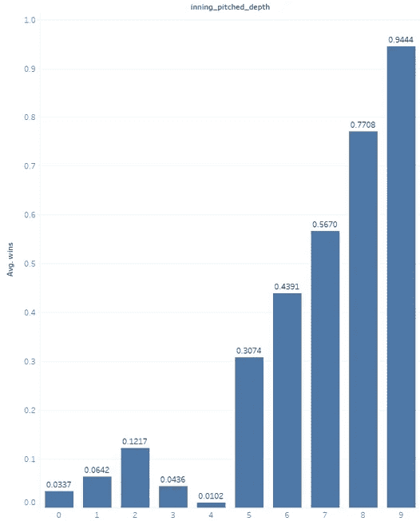

Image by Author: Pitcher’s win probability by innings pitched (rounded)

这种观察是直观的，因为经理不太可能从比赛中选择一名表现出色的强投手，而选择另一名投手。

## 投球局数

为了完成我们的模拟，我们通过使用随机数生成器从每个投手投出的历史局的有序列表中选择投出的局，从过去的比赛中经验性地采样投出的局。实现这一点的代码类似于击球手的盘子外观函数。对于每个模拟的游戏，都要进行随机选择。这种方法对于匹配每个投手的预期投球局数非常准确。

Image by Author: Innings pitched by a MLB pitcher simulation vs actual.

## 投球结果

投手的成绩是根据投出的局数来评估的。正如我之前指出的，我这样做是因为球员的表现取决于投手在比赛中的深度。

我们关心三个结果——胜利、跑垒、安打、保送和三振出局的数量。我通过对与投球局数相对应的投手数据子集进行经验采样来模拟这些结果。这个过程确保我们尊重投手的表现，作为投球局数的函数。

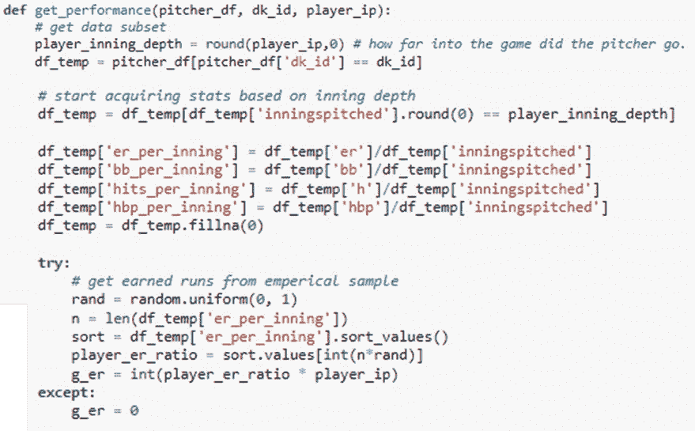

Image by Author: Python code to return earned runs as a function of innings pitched.

最终结果是每次运行后检查模拟状态。每当模拟投手投出 9 个完整局时，该模型就对完整的比赛进行评分。每当模拟投手投出完整的 9 局并且没有得分时，它就认为投手完成了一场比赛。最后，如果模拟产生的投手完成了所有 9 局并且没有安打，则该模型认为模拟的投手没有安打。

## 模拟投手游戏

定义了所有的投球函数后，我现在可以用足够的样本数据为任何投手模拟无限的比赛。模拟数据与我们所模拟的投手在 MLB 的实际表现非常相似。

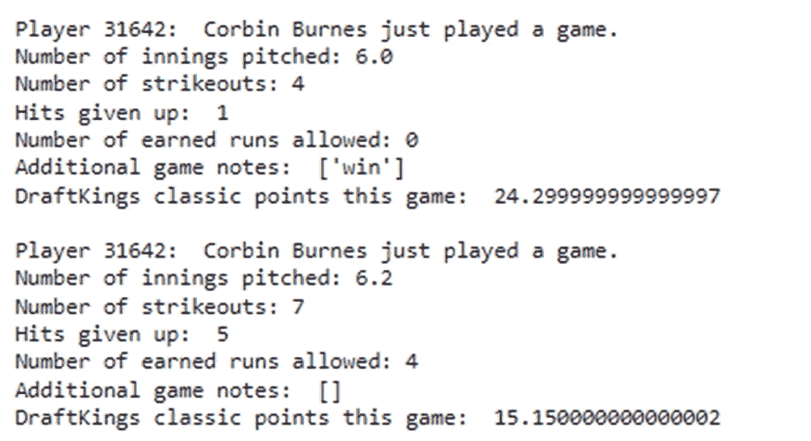

Image by Author: Corbin Burnes simulated pitching performances

Image by Author: Corbin Burnes Fantasy Points Actual vs Simulated

# 计算实验和结果:

这个项目的目标是评估选择日常幻想体育游戏阵容的风险。为了实现这一点，我构建了一个函数，通过花费高达 50，000 美元的工资帽来随机填充一个有效的阵容，这是一个梦幻棒球提供商的经典规则。我这样做了 500 次，创建了 500 个随机有效的阵容来模拟。有效阵容中的每名球员都接受了他们自己的模拟——每人模拟 50 场比赛。结果并不令人惊讶。

看来棒球比赛的结果有很大的随机性。

以下是根据点数与可变性之比选择的前 10 名随机阵容的模拟表现汇总，就像金融中的夏普比率。这些阵容代表了风险最小，但最有效的选择。

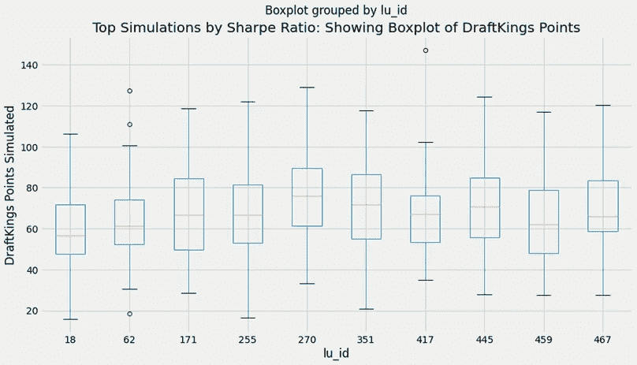

Image by Author: Top Sharpe Ratios acquired by random, valid lineups (top 10 performances viewed)

这是同样的视觉效果，但是选择了得分最高的有效阵容。

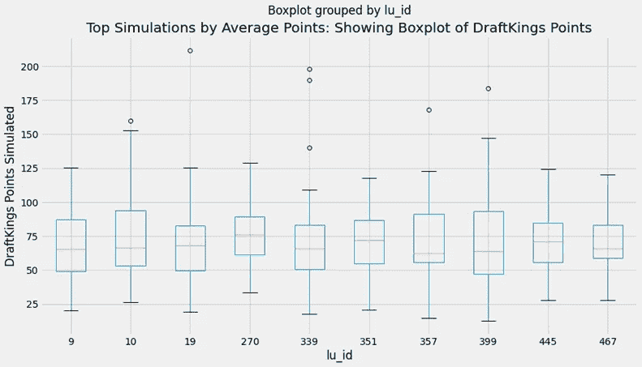

Image by Author: Top simulated fantasy random, valid lineups (top 10 performances viewed)

这些图像显示了具有强大性能的有效阵容；但所有这些阵容都有彼此非常接近的期望值。通过这种广泛的搜索，我们无法找到一个明显优于所有其他阵容的阵容。我们的模拟成功地表明，没有重要的详细玩家分析和评估的幻想棒球游戏，仅仅是碰运气的游戏。

# 讨论和结论

总之，模拟对于理解与决策相关的风险是一个非常有用的工具。它已成功应用于广泛的应用领域，包括产品设计、飞行员培训、排队研究以及现在的 fantasy sports。

这个特定模拟的结果表明，棒球在短期内是非常随机的。任何玩家，在任何一天，都可能有好的或坏的游戏。对决可以进场；游戏情境会影响玩家的决定。

我们有能力模拟一个非常复杂的系统，并得到非常真实的结果。从长远来看，我希望我的模拟能产生与现实生活中的玩家表现相似的玩家。

模拟可以改进。例如，我们没有任何性能结果的游戏状态数据。我们根据过去的成就进行模拟；但是一个改进的模型也可以模拟游戏状态。这将是重要的下一步，因为其他玩家的决定和游戏状态将影响玩家产生结果的能力。此外，该模型无法模拟比赛——这是幻想体育中的一个至关重要的话题。击球手的表现取决于他们面对的投手或他们正在比赛的球队。

最后，我希望安装新的改进，考虑比赛，并逐步提高我的能力，以评估短期球员的表现。

 [## Mlearning.ai 提交建议

### 如何成为 Mlearning.ai 上的作家

medium.com](/mlearning-ai/mlearning-ai-submission-suggestions-b51e2b130bfb)