# 河流可以阻止你的漂移！

> 原文：<https://medium.com/mlearning-ai/river-can-stop-your-drift-49f48f8570e3?source=collection_archive---------3----------------------->

Photo by [Aral Tasher](https://unsplash.com/@araltasher?utm_source=medium&utm_medium=referral) on [Unsplash](https://unsplash.com?utm_source=medium&utm_medium=referral)

前一分钟你的机器学习模型做得很好，然后下一分钟像新冠肺炎这样的疫情出现了，突然间你的模型的预测完全偏离了轨道。

看起来你已经陷入了一种叫做概念漂移的状态。

然而，不要为自己感到难过，因为这是一个常见的事情。

在不断变化的宇宙中，没有不变的东西。说到数据，记住这一点非常重要。从真相来源产生的数据会随着时间的推移改变其潜在的分布。

Photo by [Ross Findon](https://unsplash.com/@rossf?utm_source=medium&utm_medium=referral) on [Unsplash](https://unsplash.com?utm_source=medium&utm_medium=referral)

> ***希腊哲学家赫拉克利特说，“变化是生活中唯一不变的东西。”***

电子商务产品建议系统就是这种技术的一个很好的例子。如果新冠肺炎病毒爆发，你认为在爆发前开发的模型会同样有效吗？这些类型的意外事件极大地改变了用户行为。大多数顾客都专注于获得日常需求，而不是花哨的电子产品。因此，关于用户行为的数据也发生了变化。与此同时，由于在这种情况下市场上很多东西都缺货，我们见证了人们一种全新的购买行为。

这些数据的变化往往会使基于旧数据开发的模型与新数据不一致，这种现象被称为“[概念漂移](https://de.wikipedia.org/wiki/Concept_Drift)”。

## **什么是概念漂移？**

在机器学习模型中，当目标变量的统计特征(模型试图预测的内容)随时间变化时，就会发生概念漂移。也就是说，用于训练模型的输入数据的含义随着时间发生了巨大的变化，但是生产模型没有跟上这种变化，因此无法再生成可靠的预测。

**没有一个模型是永远存在的，只是衰变的速度不一。**

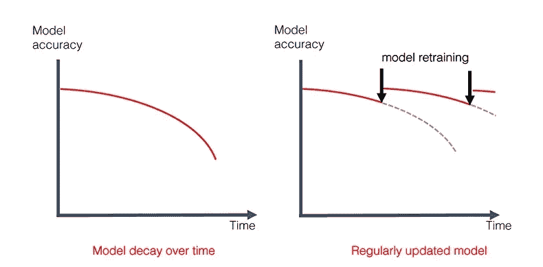

How accuracy is decays with [model decay](https://evidentlyai.com/blog/machine-learning-monitoring-data-and-concept-drift)

存在不同类型的概念漂移。

# 逐渐概念漂移

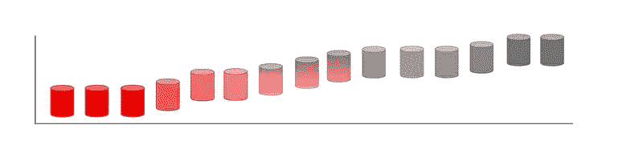

逐渐的漂移是我们预料到的。

这是一个新的世界，旧的模式正在变得陈旧。环境条件的逐渐变化会导致产品质量的下降。

例如，预测是我们预测未来趋势的一个调查主题。金融、天气和需求预测都大量使用它。在大多数情况下，历史数据用于构建这些类型的模型，这些模型旨在捕捉过去数据中包含的趋势和季节性，以便在未来遵循。但是由于未预料到的事件，这种趋势可能会改变，这可能会导致观念漂移。在天气数据中，有一个季节变化发生得非常缓慢。在其他种类的应用程序中，这种变化通常要慢得多。然而，随着时间的推移，它使目前的模式过时了。

任何一个人都不会有太大的改变。每个人只能影响一小部分。但最终，它们会累积起来。

有时在个体特征层面上注意到变化是可行的。

这就是它如何出现在二进制分类问题中，如流失预测。某个特征的分布是稳定的。在一定的取值范围内，目标类的比例随时间增加。一种新的预测模式出现了。但这只是单一特征:对模型性能的初始影响很小。

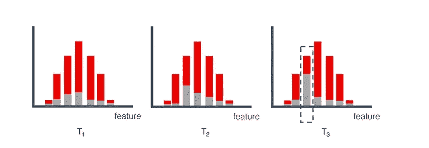

*A* [*change*](https://evidentlyai.com/blog/machine-learning-monitoring-data-and-concept-drift) *in the relationship between a given feature and the prediction target.*

# **突发概念漂移**

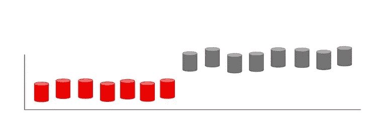

外部变化可能会更快或更极端。这些很难错过。当新冠肺炎锁定在 2020 年 3 月公开时，这影响了全球各地人们的行为。这是一个明显的例子。

几乎是瞬间，移动性和购买习惯发生了转变。它影响了所有类型的模型，包括通常“稳定”的模型。

需求预测方法不会预见到瑜伽裤的销量飙升 350%(就像 Stitch Fix 那样)，也不会预见到当边境关闭时大多数航班会被取消。

你是否努力在 x 光图像上识别肺炎？你突然获得了一个新的标签。

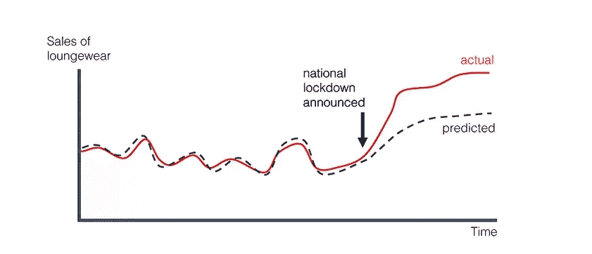

*Consumer demand changes* [*suddenly*](https://evidentlyai.com/blog/machine-learning-monitoring-data-and-concept-drift) *due to stay-at-home policy.*

如此迅速的变化通常不需要疫情或股市下跌

在一系列更典型的事件中，你可能会遇到这样的事情:
中央银行改变利率。模型无法适应新趋势，影响了金融和投资行为的方方面面。
生产线的技术重新设计。随着更新的设备出现新的故障机制(或缺少故障机制)(或缺少故障机制)，预测性维护变得无用。该应用的用户界面经历了一次重大改造。由于用户的路径发生了变化，点击和转化的历史数据不再有用。

# 重复概念漂移

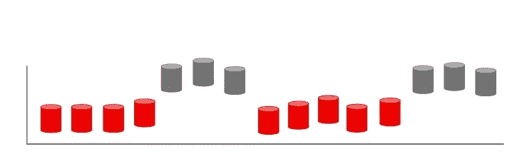

另一个值得表扬的是…

一些学者用“循环漂移”来描述反复变化。我们认为这里的事情有点混乱。

季节性是一个公认的建模概念。即使是短暂的，目标函数看起来确实有变化。

在黑色星期五，同样是那些在一年的剩余时间里节俭购物的人会以一种意想不到的方式行事。银行假日影响一切，从零售销售到生产故障。周末的流动性不同于工作日。诸如此类。

如果我们有一个健全的模型，它应该对这些模式作出反应。每年的黑色星期五都是上一个黑色星期五的翻版。我们可以考虑系统设计中的循环变化和异常事件，或者开发集合模型。我们可能会预料到“重复性漂移”，这对质量没有影响。

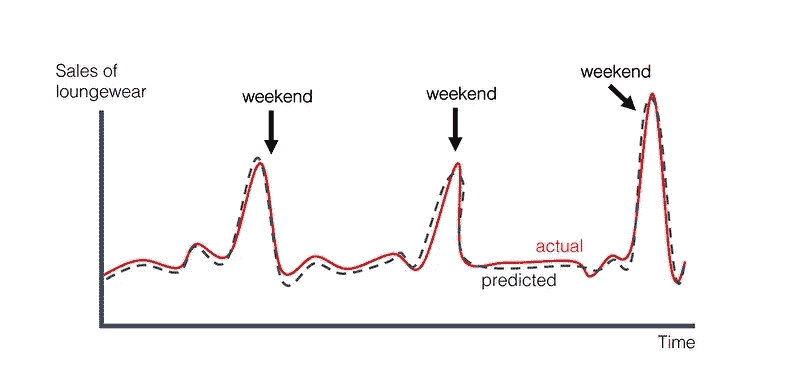

*Consumers shop more on the weekends. The* [*pattern*](https://evidentlyai.com/blog/machine-learning-monitoring-data-and-concept-drift) *is known, and the model forecast shows it.*

这个“**漂移**”在模型监控方面没有什么影响。周末每周都来，我们不需要闹钟。当然，除非我们发现了新的趋势。

# 概念漂移与协变量转移

考虑一个根据老年人看过的电影训练的电影推荐模型，当该模型用于为儿童推荐电影时，它会提供出色的准确性吗？不会的。之所以这样，是因为这两个群体的利益和活动非常不同。所以，这个模型在这些情况下会失败。训练集和测试集中数据分布的这种变化称为协变量移位。

样本选择偏差和不稳定的设置是协变量变化的主要原因。

**样本选择偏差**:指数据收集或标记过程中的系统性错误，导致训练样本从要一致建模的总体中不一致地选取。

**不稳定的固定环境**:当训练环境不同于测试环境时，就会出现这种情况，不管是由于时间上的变化还是地理上的变化。

模型性能可能会受到协变量转移和概念漂移的损害，但它们应该以不同的方式处理。因此，我们必须区分协变量转换和观念漂移，并根据协变量转换或观念漂移或两者的发生采取预防措施。

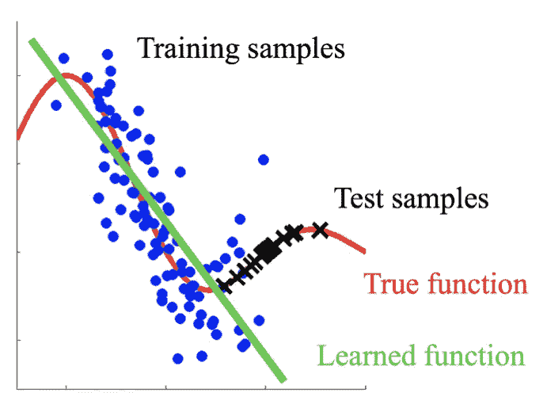

*Fig 4: Difference in distribution between train and test dataset in case of* [*Covariate Shift*](http://iwann.ugr.es/2011/pdf/InvitedTalk-FHerrera-IWANN11.pdf)

# 漂移对学习的影响

如果处理不当，概念漂移可能会对预测性能产生重大影响。因为它们基本上是在不同的数据上教授的，所以大多数批量学习模型在面临想法漂移时都会失败。另一方面，流学习方法总是在更新和适应新的想法。此外，漂移感知系统利用变化检测方法(又称漂移检测器)在发现性能变化时激活缓解机制。

# 检测概念漂移

检测漂移有许多不同的方法。漂移探测器的工作是在探测到任何移动时发出警报。在最大限度地减少假阳性的同时，有效的漂移检测器可以增加真阳性的数量。处理无限的数据流也需要资源效率。

使用三个 1000 样本的分布，我们将创建一个虚构的数据流用于演示目的。

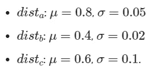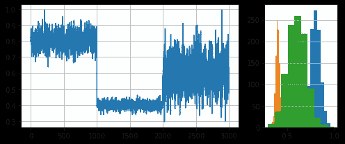

# 河流前来救援

批量训练是机器学习中的一种常见做法，在这种情况下，学习者被调整为一次处理大量数据的最佳状态。因此，我们有一个静态模型，其中自变量和因变量有一个固定的联系。因此，长期使用该模型可能需要重新训练，以便从新数据中学习新模式。

实时流数据馈送允许模型实时更新，而不是使用批处理模型。由于新数据被用来定期更新模型假设，这种方法被称为在线学习或增量学习，如 **River** 帮助模型避免想法漂移。

这种方法使我们能够从大量的数据流中学习，并可以顺利地用于时间序列预测、电影或电子商务推荐系统、垃圾邮件过滤等应用。

我们将采用**自适应窗口(ADWIN)** 漂移检测方法。请记住，合成数据流的目的是显示样本 1000 和 2000 后发生的漂移。

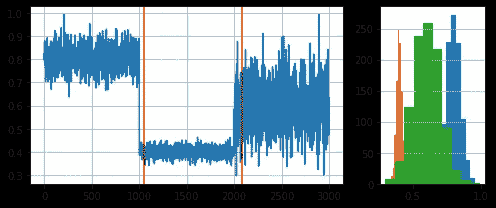

You can notice the drift

我们用一些关于概念漂移检测器及其用法的评论来结束这个例子:

1.  当在现实世界中使用时，漂移检测器增强了流学习系统对想法漂移的弹性。漂移检测器通常使用性能测量来监控模型。
2.  单变量数据集是漂移探测器的基础。模型的性能是他们用来跟踪的东西，而不是数据本身。概念漂移是事实和你试图学习的东西之间关联的改变(在监督学习中)。
3.  漂移检测器确定其对输入数据的预期。了解这些预期对于为特定的漂移检测器提供正确的数据至关重要。

# 最后的想法

概念漂移是机器学习和数据挖掘中的一个基本问题，River 很容易处理。

关键的挑战是如何确定想法漂移的存在，因为没有放之四海而皆准的方法。它出现在几个难以发现的隐藏组件中。大多数使用“想法漂移”的解决方案都非常依赖于当前的具体情况。尽管如此，考虑到本文中所述的方法，可能是开发基线系统以识别和避免想法漂移的合适参考。

在这个问题上已经进行了大量的研究，其中大部分集中在检测显著变化的标准的发展上。需要更多的研究来构建一个鲁棒的系统，该系统可以基于各种形式的想法漂移和变化的噪声量来触发警报。

 [## Mlearning.ai 提交建议

### 如何成为 Mlearning.ai 上的作家

medium.com](/mlearning-ai/mlearning-ai-submission-suggestions-b51e2b130bfb)