# 用于序列间分类的 RNN

> 原文：<https://medium.com/mlearning-ai/rnn-for-sequence-to-sequence-classification-5d41a2b6d8fd?source=collection_archive---------1----------------------->

# 介绍

为了理解一系列信息，我们需要在理解之前数据的基础上理解每一个输入的数据。我们不能抛弃一切，开始处理另一个序列。这是 RNNs 背后的主要思想。

传统的神经网络不能做到这一点，这似乎是一个重大的限制。假设你想对电影中每一点发生的事件进行分类。目前还不清楚传统的神经网络如何利用电影中之前的事件来通知后续的事件。

递归神经网络解决了这个问题。它们是带有环路的网络，允许信息持续存在。rnn 最初是在论文“通过错误传播学习内部表征”(1984)中介绍的，它们彻底改变了我们进行语音识别、语言建模、翻译、图像字幕等的方式。在本文中，我们将介绍如何对简单的 RNNs、GRUs、LSTM 和双向 LSTM 进行建模，以预测序列数据的心脏病(二元分类)。

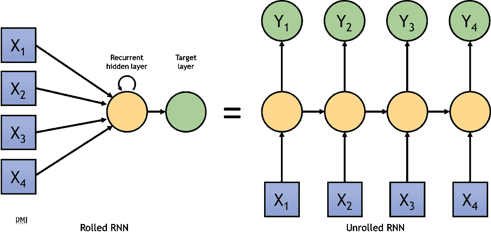

Architecture

# 数据准备和导入

我们的数据集已经标准化，如**图 1** 所示。它总共有 140 列和 1621 行。


Figure 1

下面的代码块显示了我们如何将数据存储在独立字典中的数据帧中。

```
transformed_df = {"X_train": [], "Y_train": [], "X_test": [], "Y_test": []}
transformed_df["X_train"] = dataset_train.drop("1", axis=1)
transformed_df["Y_train"] = dataset_train["1"]

transformed_df["X_test"] = dataset_test.drop("1", axis=1)
transformed_df["Y_test"] = dataset_test["1"]
```

虽然我们还没有对我们的数据进行任何规范化或标准化(因为数据已经标准化)，但对于递归神经网络来说，这样做很重要。为什么有必要对我们的数据进行标准化或规范化？这是因为特性的数量级会影响某些模型的性能。例如，如果一个要素的数量级等于 1000，而另一个要素的数量级等于 10，则一些模型可能“认为”一个特征比另一个特征更重要。数量级没有告诉我们任何关于预测能力的信息，因此它是有偏差的。我们可以通过改变变量使它们具有相同的数量级来消除这种偏差。

标准化和规范化是这些转换中的两种，它们将每个变量转换为 0-1 区间(将每个变量转换为 0 均值和单位方差变量)。理论上，标准化优于规范化，因为它不会导致变量的概率分布在异常值出现时缩小

# 构建模型:简单的 RNN

rnn 首先在论文“通过错误传播学习内部表征”(1984)中介绍。这个模型中的第一层将是一个简单的 RNN 层。然后是一个脱落层，后面是另外两组相同的架构。我们在接近末端的地方有一个平坦而致密的层。模型如下所示。

```
model = keras.Sequential([
 keras.layers.SimpleRNN(units=50, return_sequences= True),
 keras.layers.Dropout(0.2),
 keras.layers.SimpleRNN(units=50, return_sequences= True),
 keras.layers.Dropout(0.2),
 keras.layers.SimpleRNN(units=50, return_sequences= True),
 keras.layers.Dropout(0.2),
 keras.layers.Flatten(),
 keras.layers.Dense(10, activation='relu'),
 keras.layers.Dense(1, activation='sigmoid')
])

model.compile(loss='binary_crossentropy',
 optimizer='adam',
 metrics=['accuracy'])
model.build(X_train.shape)

callback = keras.callbacks.EarlyStopping(monitor="val_loss",
 min_delta=0,
 patience=3,
 verbose=1,
 mode="auto",
 baseline=None,
 restore_best_weights=True)
history_gru = model.fit(x=X_train,y=Y_train, validation_split=0.20, batch_size=32, epochs=30, verbose=2, callbacks=[callback])
```

第一层的 SimpleRNN 层的输入形状是 32，输出形状也是 32。我们使用二进制交叉熵损失函数、“adam”优化器和精确度指标编译了该模型。我们还使用早期停止来最小化验证损失。早期停止是一种用于正则化机器学习模型的创新方法。它通过在验证误差最小时停止训练来实现这一点。

在 12 个时期之后，训练准确度变为 98.84，而验证准确度达到 98.85。这显示在**图 2.2** 中。

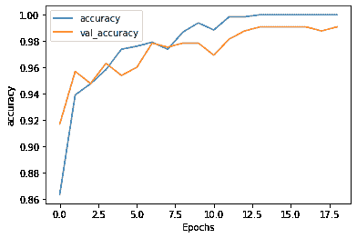

Figure 2

同时，训练损失降低到 0.3034，验证损失降低到 0.2796。这显示在**图 3 中。**

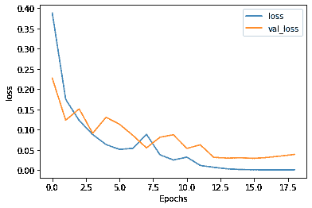

Figure 3

## 模型评估

**图 4** 显示了我们的最后一个模型，即简单 RNN 的表现，以及它通过使用混淆矩阵对患病和未患病之间的关系的近似程度。

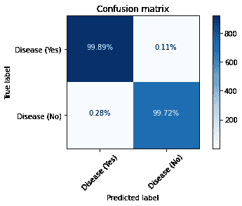

Figure 4

**图 5** 显示了 ROC 曲线，**图 2.6** 报告了模型在一系列指标上的表现，如精确度、召回率、准确度和 F1 分数。

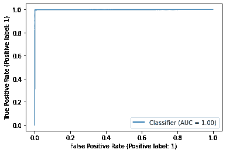

Figure 5

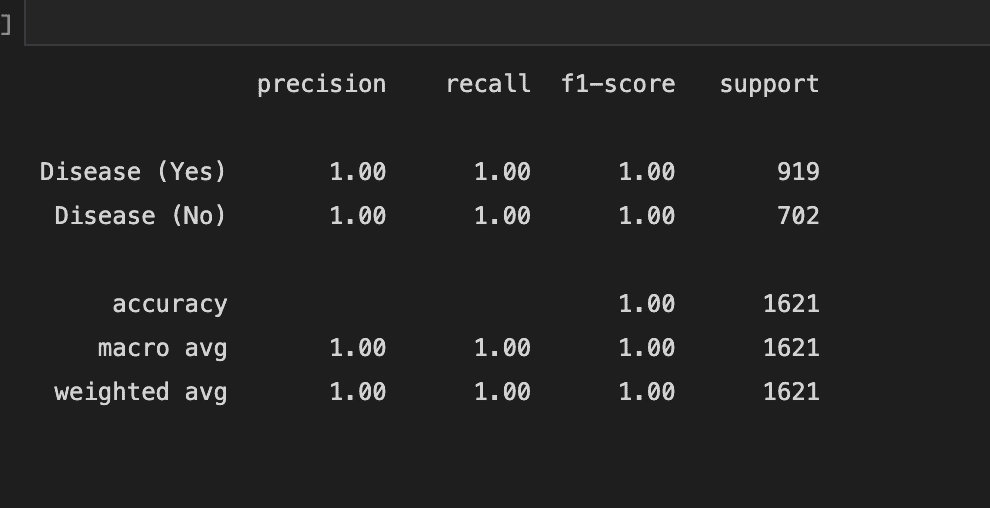

Figure 6

# 建立模型:GRU

我们开发的第二个模型是门控循环单元，它是 LSTM 的变体。由 Cho 等人(2014 年)介绍。它将遗忘门和输入门合并成一个“更新门”该模型中的第一层将是双向 GRU 层。然后是一个脱落层，后面是另外两组相同的架构。我们在接近末端的地方有一个平坦而致密的层。模型如下所示。

```
model = keras.Sequential([
 keras.layers.Bidirectional(keras.layers.GRU(units=50, return_sequences= True)),
 keras.layers.Dropout(0.2),
 keras.layers.Bidirectional(keras.layers.GRU(units=50, return_sequences= True)),
 keras.layers.Dropout(0.2),
 keras.layers.Bidirectional(keras.layers.GRU(units=50, return_sequences= True)),
 keras.layers.Dropout(0.2),
 keras.layers.Flatten(),
 keras.layers.Dense(10, activation='relu'),
 keras.layers.Dense(1, activation='sigmoid')
])

model.compile(loss='binary_crossentropy',
 optimizer='adam',
 metrics=['accuracy'])

model.build(X_train.shape)

callback = keras.callbacks.EarlyStopping(monitor="val_loss",
 min_delta=0,
 patience=3,
 verbose=1,
 mode="auto",
 baseline=None,
 restore_best_weights=True)

history_rnn = model.fit(x=X_train,y=Y_train, validation_split=0.20, batch_size=32, epochs=30, verbose=2, callbacks=[callback])
```

第一层中 GRU 层的输入形状是 32，输出形状也是 32。我们使用二进制交叉熵损失函数、“adam”优化器和精确度指标编译了该模型。这个模型中也使用了早期停止。

经过 13 个周期后，训练准确率达到 98.84%，验证准确率达到 98.15%。如图 7 中的**所示。**

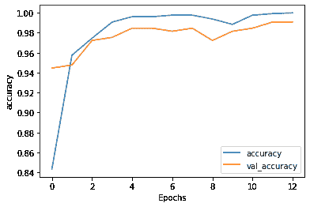

Figure 7

同时，训练损失降低到 0.03，验证损失降低到 0.05。如图 8 中的**所示。**

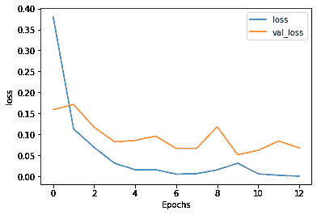

Figure 8

## 模型评估

**图 9** 显示了我们的最后一个模型，即 GRU 的表现，以及通过使用混淆矩阵，它对患病和未患病之间的关系的近似程度。

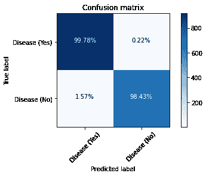

Figure 9

**图 10** 显示了 ROC 曲线，而**图 11** 报告了该模型在精确度、召回率、准确度和 F1 分数等一系列指标上的表现。

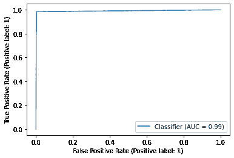

Figure 10

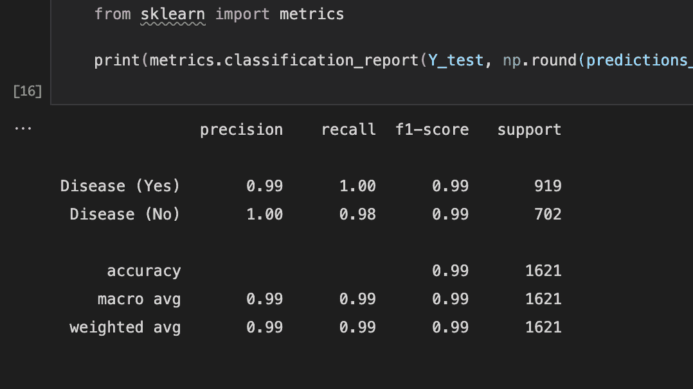

Figure 11

# 构建模型:双向 LSTM

我们开发的第三个也是最后一个模型是双向 LSTM，它也是 LSTM 的变体。长短期记忆网络，也称为“LSTMs”，是一种可以学习长期依赖性的 RNN。Hochreiter 和 Schmidhuber (1997)介绍了它们，许多人在随后的工作中对它们进行了改进和推广。它们在广泛的问题上表现得非常好，现在被广泛使用。

该模型中的第一层将是双向 LSTM 层。然后是一个脱落层，后面是另外两组相同的架构。我们在接近末端的地方有一个平坦而致密的层。模型如下所示。

```
model = keras.Sequential([
 keras.layers.Bidirectional(keras.layers.LSTM(units=50, return_sequences= True)),
 keras.layers.Dropout(0.2),
 keras.layers.Bidirectional(keras.layers.LSTM(units=50, return_sequences= True)),
 keras.layers.Dropout(0.2),
 keras.layers.Bidirectional(keras.layers.LSTM(units=50, return_sequences= True)),
 keras.layers.Dropout(0.2),
 keras.layers.Flatten(),
 keras.layers.Dense(10, activation='relu'),
 keras.layers.Dense(1, activation='sigmoid')
])

model.compile(loss='binary_crossentropy',
 optimizer='adam',
 metrics=['accuracy'])

model.build(X_train.shape)
```

第一层中 LSTM 层的输入形状是 32，输出形状也是 32。我们使用二进制交叉熵损失函数、“adam”优化器和精确度指标编译了该模型。这个模型中也使用了早期停止。

经过 13 个周期后，训练准确率达到 99.69%，验证准确率达到 99.08%。如图 12 中的**所示。**

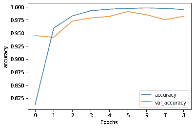

Figure 12

同时，训练损失降低到 0.03，验证损失降低到 0.05。这显示在**图 13 中。**

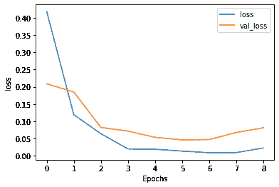

Figure 13

## 模型评估

**图 14** 显示了我们的最后一个模型，即 LSTM 的表现，以及它通过使用混淆矩阵对患病和未患病之间的关系的近似程度。


Figure 14

**图 15** 显示了 ROC 曲线，**图 16** 报告了模型在一系列指标上的表现，如精确度、召回率、准确度和 F1 分数。

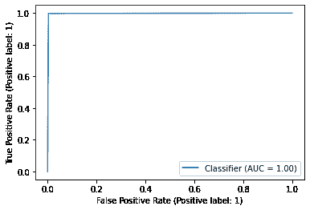

Figure 2.15

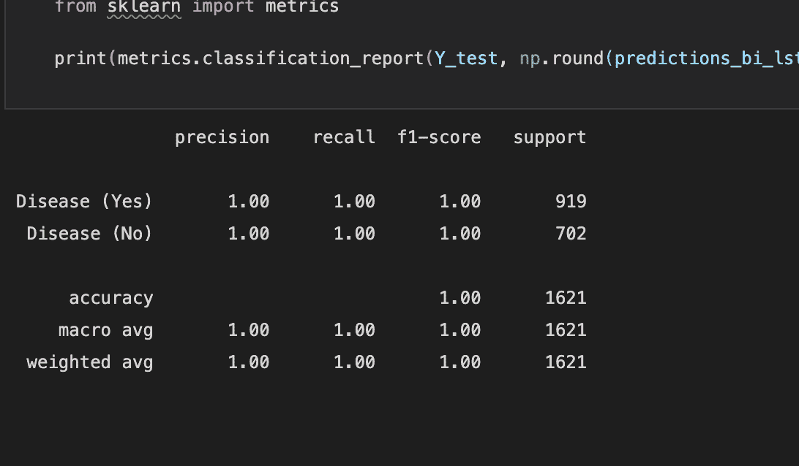

Figure 16

# 理由和模型评估

## 短期记忆是个问题

短期记忆是递归神经网络的一个问题。如果序列足够长，他们将很难将信息从较早的时间步骤传递到较晚的时间步骤。因此，如果你试图从一段文字中预测什么，RNNs 可能会在开始时遗漏重要的信息。

消失梯度问题影响反向传播过程中的递归神经网络。梯度是用于更新神经网络权重的值。当梯度随着时间向后传播而收缩时，出现消失梯度问题。当梯度值变得非常小时，它对学习没有显著贡献。

## LSTMs 和 GRUs 作为解决方案

作为短期记忆的解决方案，LSTMs 和 GRUs 被开发出来。它们有被称为“门”的内部机制，允许它们控制信息的流动。这些门可以知道序列中的哪些数据应该被保留或丢弃。这使得它能够将相关信息传递到长长的序列链中，以便进行预测。几乎所有最新的递归神经网络结果都是通过这两个网络实现的。总的来说，rnn 对于处理序列数据进行预测是很好的，但是有短期记忆的问题。LSTMs 和 GRUs 是利用被称为 gate 的机制来减轻短期记忆的。门是简单的神经网络，它控制着序列链中的信息流。

## 评价:RNN vs GRU vs LSTM

正如我们可以从实验结果中看到的，当用相似的网络架构训练时，所有的模型给出了接近 100%的准确度。我们注意到的一个很大的区别是，与 GRU 和 LSTM 模型相比，训练简单 RNN 所需的训练时间要多得多。

根据 RNN、LSTM 和 GRU 的所有模型的工作原理，GRU 使用的训练参数更少，因此使用的内存更少，执行速度也比 LSTM 快，而 LSTM 则更准确。另一方面，RNN 使用的内存最多，执行速度最慢。我们可以得出结论，当处理大序列并且准确性很重要时，应该使用 LSTM；当可用内存较少且需要更快的结果时，应使用 GRU。

# RNNs 与集成学习

正如我们在[的**图 1** 和**图 4** 本文](/mlearning-ai/learning-based-models-for-classification-c21513e14621)**中所示的实验结果中所看到的，我们的集成分类器的准确度勉强击败了我们的 RNN 模型的准确度。与此同时，训练 RNN 模型所需的时间和 CPU 资源的数量大大多于为集成学习任务创建的投票分类器。相比之下，RNN 总共 19 个历元，每个历元平均花费 400 毫秒。另一方面，我们的投票分类器几乎不需要一秒钟来训练和拟合数据。**

**构建和分析这两个模型的一些关键要点是**

****更容易解释**:因为经典的 ML 采用直接特征工程，所以投票分类器中使用的所有算法都易于解释和理解。此外，由于我们对数据和底层算法有了更好的理解，调整超参数和改变模型设计变得更加容易。另一方面，RNN 是一个“黑匣子”,在这个意义上，我们甚至现在也没有完全理解深层网络的“内部”。由于缺乏理论基础，超参数和网络设计也相当困难。**

****训练时间和计算成本:** RNNs 要求高端 GPU 在合理的时间内用大数据进行训练，无论是财务上还是计算上。这些 GPU 非常昂贵，但没有它们，将深度网络训练到高性能是不可能的。快速 CPU、固态硬盘存储和快速大容量 RAM 都是有效使用此类高端 GPU 所必需的。经典的 ML 算法，如 BN，KNN，EL 和 SVM，可以用一个像样的 CPU 来训练，而不需要尖端的硬件。因为它们的计算成本更低，所以允许我们更快地迭代，在更短的时间内尝试更多的技术。**

****集成学习在小数据集上表现更好**:深度网络需要极大的数据集来实现高性能。对于许多应用来说，这样大的数据集并不容易获得，并且获取起来将是昂贵且耗时的。虽然我们提供的数据集非常小，但我们仍然可以看到经典的最大似然算法，即 BN，KNN，EL 和 SVM 在更小的数据集上优于 RNN。**

****适应性**:就领域和应用而言，RNNs 远比集成学习算法更具适应性和可移植性。我们建立的 RNN 可以很容易地转移到许多不同的任务，如语音识别，语言建模，翻译，图像字幕等。集成学习和其他经典的机器学习算法不太灵活，在将其应用于新领域之前需要大量的学习和知识。不同领域和应用的经典 ML 知识库是非常不同的，并且经常需要在每个单独的领域内进行广泛的专业研究。**

# **结论**

**RNN、GRU 和 LST 被用于开发我们的二元分类模型。当在相似的架构上训练时，所有的模型都给出了大约 99%的相似的高精度。虽然与较新的 LSTMs 和 GRUs 相比，RNNs 被证明是较慢的，但是我们的二元分类器的准确性没有受到影响。**

# **参考**

1.  **GitHub:[https://github.com/nandangrover/blood-cell-detection-cnn](https://github.com/nandangrover/blood-cell-detection-cnn)**
2.  **舒斯特，m .，，帕利瓦尔，K. K. (1997)。双向递归神经网络。 *IEEE 信号处理汇刊*， *45* (11)，2673–2681。[https://doi.org/10.1109/78.650093](https://doi.org/10.1109/78.650093)**
3.  **戴伊和塞勒姆。*门控循环单元(GRU)神经网络的门控变量*。**
4.  **瑞内哈特，D. E .，Hint，G. E .，，威廉姆斯，R. J. (1985)。*学习内部表示错误传播二*。**

**[](/mlearning-ai/mlearning-ai-submission-suggestions-b51e2b130bfb) [## Mlearning.ai 提交建议

### 如何成为 Mlearning.ai 上的作家

medium.com](/mlearning-ai/mlearning-ai-submission-suggestions-b51e2b130bfb)**