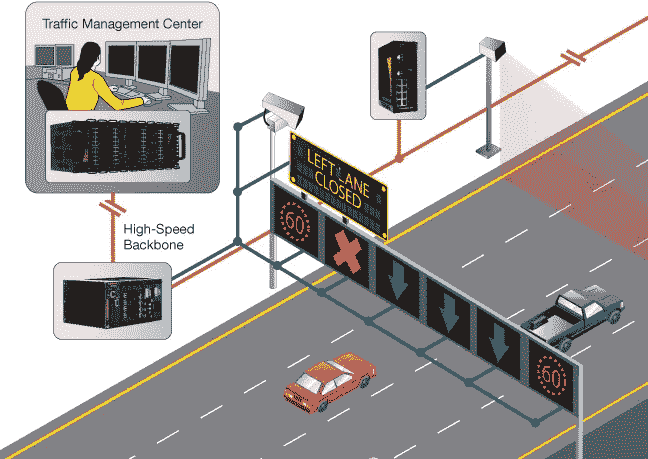
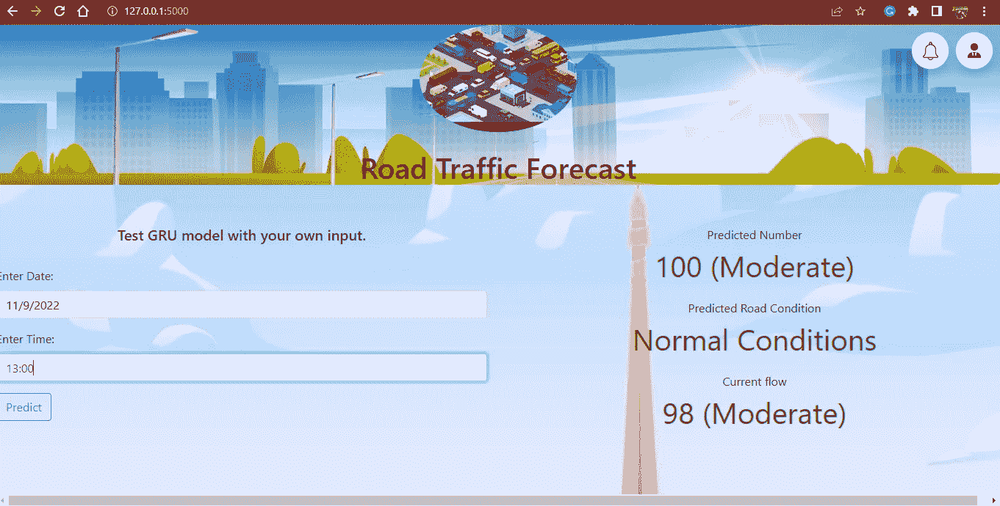
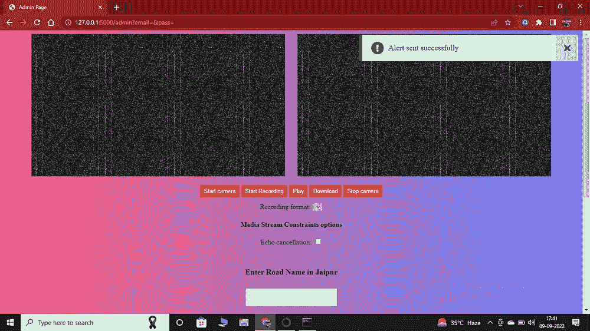

# 基于机器学习(GRU 模型)的道路交通预测

> 原文：<https://medium.com/mlearning-ai/road-traffic-forecasting-using-gru-model-aa2e8114b157?source=collection_archive---------3----------------------->

**动机或想法** —本博客的全部和唯一目的是解决我们当今面临的普遍问题，即交通堵塞。我试图创建一个简单的机器学习应用程序来解决这个问题。
在我的 GSoC 阶段，我必须选择一个业务垂直领域，因此我选择了 smart 作为我的垂直领域，并试图解决这个垂直领域中非常常见的问题

**聪明如竖**——我们很多人都非常熟悉**聪明**这个词。在我看来，一切有能力、有理智去做某事的事物都属于聪明的范畴。
Smart 现在已经成为一个后缀，用来象征一个人和任何类型的商品。
适用于前智能手机、智能电视、智能城市以及更多应用……

更具体地说，这个项目属于智慧城市。

**应用概述**
应用有两个界面

1.**消费者界面** -在这个界面中，我们作为用户可以输入通勤的日期和时间，以获得特定时间的交通流量，这将帮助用户计划他们的行程
2。**管理界面** —在该界面中，交通部(DOT)可以访问安装在道路上的摄像机，并查看交通的实时流
他们还可以下载视频并在视频上实现车辆计数，以更好地了解交通状况并获得更多数据

我们将在稍后的博客中探讨这两种界面！！！

***先决条件***

首先，我们必须安装以下导入到 model.py 中的库

使用 pip 命令在 model.py 中安装上述库

之后，从下面给出的 Kaggle 数据集链接下载数据集

Kaggle 数据集—[https://www . ka ggle . com/datasets/sampanacharya 1/traffic-Dataset](https://www.kaggle.com/datasets/sampanacharya1/traffic-dataset)

然后在中指定训练和测试 CSV 文件的路径

***#从文件中读取数据到 ***model.py*** 中的数据帧***

GRU 是我用来预测交通的模型。

我为 GRU 推荐的博客—

 [## 了解 GRU 网络

### 在这篇文章中，我将试图给出一个相当简单和易懂的解释，一个真正迷人的类型…

towardsdatascience.com](https://towardsdatascience.com/understanding-gru-networks-2ef37df6c9be) 

从这里你可以更多地了解 GRU！！！

所创建的 GRU.h5 用于下一步的道路交通预测。

下一步，我们将使用 flask 创建一个消费者界面，用户可以在其中与我们的模型进行交互，并获得他们输入的预测，并相应地计划他们的通勤

**消费者界面**

首先，使用 pip 命令下载 app.py 中需要的所有库

app.py 使用许多 HTML 和 CSS 文件来创建 web 应用程序的前端

我在 webapp 文件夹中打包了运行 app.py 所需的所有文件和文件夹

你可以从我最后提到的 github repo 下载 webapp 文件夹

Consumer interface

我们可以输入日期和时间来预测特定道路的交通状况。

当我们点击右上角的钟形图标按钮时，如果由于某些特定原因出现交通拥堵，我们可以获得关于特定道路的一般通知

到目前为止，我只有一条道路的有限数据集，所以我不接受用户关于特定路线的输入。

但是我想到了一个解决方案，通过它我们可以解决特定道路的有限数据集问题，我们可以在我们的管理界面中讨论这个问题。

***管理界面***

**我们先来讨论一下问题:**

我有一个非常有限的数据集，也是单一的道路。

**方法:**

我们可以生成更多这种数据集，并为不同的道路创建模型，然后我们可以从用户那里获得输入，并向他们展示特定道路的预测。

**解决方案:**

让我们在 web 应用程序中实现这种方法，并更进一步！！！

> 注意—管理员可以通过单击消费者界面右上角的按钮来访问管理面板，并且可以通过他们的管理员 ID 和密码来访问

为此，我们可以在道路上安装一个网络摄像头，全天候不间断地监控道路交通

Webcam access from the admin panel

交通部有一组人可以通过网络摄像头访问直播流，并且可以做几件事-

***任务 1 —***

1.  他们可以记录那条路上的交通视频
2.  通过在<城市> 列中输入**道路名称来指定道路名称，录制该特定道路的视频，并在最后运行时，在该特定视频上运行 vehiclecounter.py 脚本**
3.  **vehiclecounter.py** 脚本将视频作为输入，并输出由该视频创建的每 5 分钟车流量的 CSV 文件

这样，我们可以解决特定道路的数据集问题

***任务二—***

他们可以从网络摄像头访问实时流，检查道路，并分享特定道路上交通的原因，作为对用户的一般通知

这个项目代码的链接可以在这里找到:

**Github 回购**——[https://github.com/akshat5302/GSoC_TrafficApp](https://github.com/akshat5302/GSoC_TrafficApp/)

***结论—***

交通管理的主要目标是使货物和人员的流动尽可能高效、有序和安全。

交通管理是任何国家的主要问题，尤其是在印度，每天都有大量的交通流量

在这篇博客中，我展示了我对如何解决交通问题的理解

 [## Mlearning.ai 提交建议

### 如何成为 Mlearning.ai 上的作家

medium.com](/mlearning-ai/mlearning-ai-submission-suggestions-b51e2b130bfb)