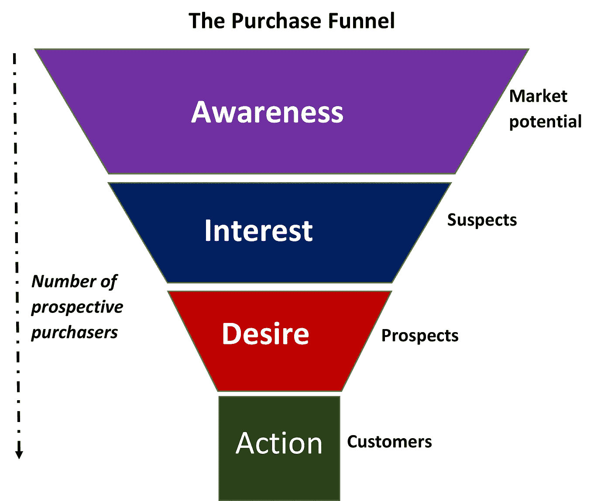
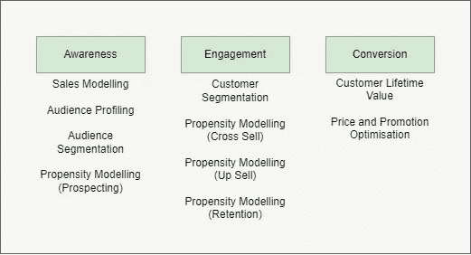

# 路线图:创建简单的营销数据科学路线图

> 原文：<https://medium.com/mlearning-ai/roadmap-creating-a-simple-marketing-data-science-roadmap-5ce360d3123a?source=collection_archive---------8----------------------->

**阿依达**也被称为转换漏斗。这是营销人员在整个过程中培养客户的过程，最终目标是购买/转化/行动。
**—这通常是某种形式的品牌营销，其战略目标是提高潜在客户对品牌的认识。例如，展示广告以引起
**兴趣** —在此阶段，有一组客户的注意力已经被抓住。例如，有人点击展示广告并登陆网站
**Desire**——一旦客户表现出兴趣，接下来的任务就是展示所提供服务/产品的优势。使用能引起顾客共鸣的语言是很正常的
**行为** —这是通过无缝结账过程转化顾客的过程。例如，使用 PayPal 的一键在线结账，节省了客户填写姓名、地址、支付细节等的时间。**

**这对营销数据科学家来说意味着什么？
如果你正在与营销部门的同事合作，那么理解营销计划、意图以及如何利用数据做出明智的选择是必不可少的。通过相关的模型进一步增强这一点可以增加更多的价值。例如，如果营销团队的目标是提高知名度，那么使用 XGBoost 来寻找客户进行再营销是好的，但并不相关。相反，使用聚类技术(如 k-means)可以帮助识别客户群，然后使用调查数据进行相似性分析或回归/驱动模型分析，以了解哪一组客户认为广告带来的认知度提高最大。因此，对于营销和数据科学职能部门来说，联系并了解营销计划的目标、数据科学的用途以及可以利用哪些其他数据科学功能来提高营销效果和效率非常重要。**

**路线图是一个活生生的文档，随着业务的发展而扩展。有些功能可以在多个场景中使用，其他时候可能需要使用多种功能来最大化影响。正如我在之前的[帖子](/mlearning-ai/roadmap-3-reasons-why-a-data-science-team-needs-one-5407f89df05b)中提到的，三个主要好处是:**

1.  **它是一颗北极星**
2.  ****它向企业展示了团队将从事的工作、依赖关系和预期的到期日。****
3.  ****这给了团队关注的焦点****

**那么，数据科学路线图是什么样的呢？**

****

**Basic Data Science Roadmap**

**上面我们有一个非常简单的数据科学路线图，显示了组织对成功/KPI 的衡量以及所需的数据科学模型和能力。一旦确定了能力范围，数据科学团队将需要创建一个工作积压，并与 scrum master 联系进行冲刺规划等。随着业务的发展和挑战的变化，路线图会不断扩展。记录已经取得的成果可以防止重复劳动。团队应该通过在尽可能多的相关地方使用它来尝试和最大化这种能力。这将有助于提高数据科学项目的投资回报率。**

** [## Mlearning.ai 提交建议

### 如何成为 Mlearning.ai 上的作家

medium.com](/mlearning-ai/mlearning-ai-submission-suggestions-b51e2b130bfb)**