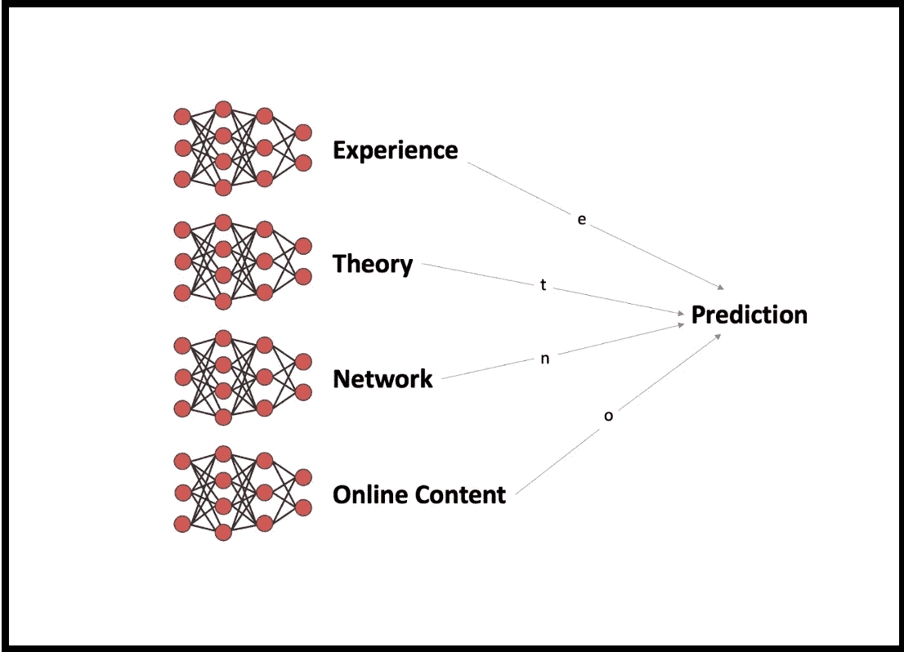

# 机器学习中的强大知识

> 原文：<https://medium.com/mlearning-ai/robust-knowledge-711b5364aa2b?source=collection_archive---------7----------------------->

在机器学习和数据科学中，有一个永无止境的争论。成为一个高水平的表演者需要多少数学知识？在这篇文章中，我使用机器学习逻辑试图找到一个合理的中间立场和框架来思考这个问题。

机器学习中最简单的快速胜利之一是集成一组略有不同的模型。为了从这个过程中获得性能提升，模型中必须有一些多样性。最重要的是，他们不能都犯同样的错误。

作为一名从事数据工作的专业人员，您在任何给定时间都有大约 4 个知识来源:

1.  **经验**(可靠但获取缓慢)
2.  **理论**(低噪音但难以获得)
3.  **网络与教师**(高度具体高效)
4.  **在线内容**(更新快但噪音大)

与技术面试的工作方式相反，我非常坚定地认为，与你现在面临的任何问题做最相似工作的经验是迄今为止最有价值的知识来源。ML 发展如此之快，以至于你根本无法假设理论对你的工作适用，最相似或最相关的理论通常有一长串不可能适用于你的任何问题的假设。最后，一些优秀的和通用的技术仍然没有坚实的理论基础，所以你不能为了成为一个高效的工程师而等待理论赶上来。

经验的缺点是获取起来很慢，如果你工作很快，谁又能说你自己的实验有多大的可重复性呢？你确定保持了足够的固定变量吗？您的发现是特定于数据集或模型的属性，还是更具普遍性？在一个典型职位的 1-2 年时间框架内，以回答所有这些问题的方式工作通常不是最有效的，即使当你考虑将知识传递给未来的员工时。特别是在初创企业的背景下，花时间进行彻底的实验可能意味着，当你对实验教给你的东西充满信心时，别人已经解决了问题。

**我夸大了，但绝对是这样，这种*学习速度的不确定性*权衡并不简单。**

我的理论是，这些知识来源最好用与模型集合相同的逻辑来思考。多样性很重要，每次你对两个或更多知识来源的解释不一致时，这可能是一个很好的领域，可以加倍努力提高你自己的理解(其中一个解释肯定是错误的，这种方法是大多数现代主动学习的基础)。

如果你不投资于理论，你会让自己变得脆弱。容易受到教科书中的一句话的伤害，这句话可以保护你免受一个非常错误但不明显的情况。

Small letters denote weights of the different sources of knowledge. Image by author. Looks weirdly framed because Medium doesn’t know how to crop icons.

作为机器学习(或任何知识产业)的专业人士，你的责任是执行元学习任务，知道如何在你的职业生涯中前进并面临不同问题时，为每个类别分配正确的权重。

让我知道你的想法。

 [## Mlearning.ai 提交建议

### 如何成为 Mlearning.ai 上的作家

medium.com](/mlearning-ai/mlearning-ai-submission-suggestions-b51e2b130bfb)