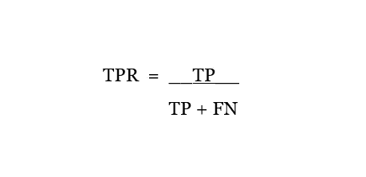
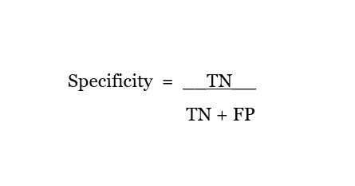
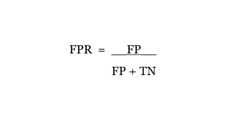
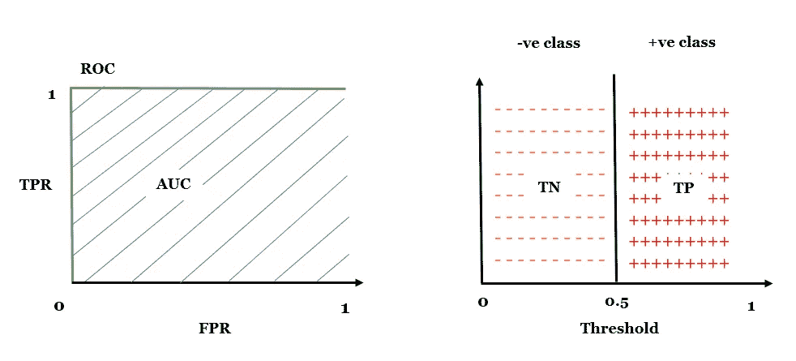
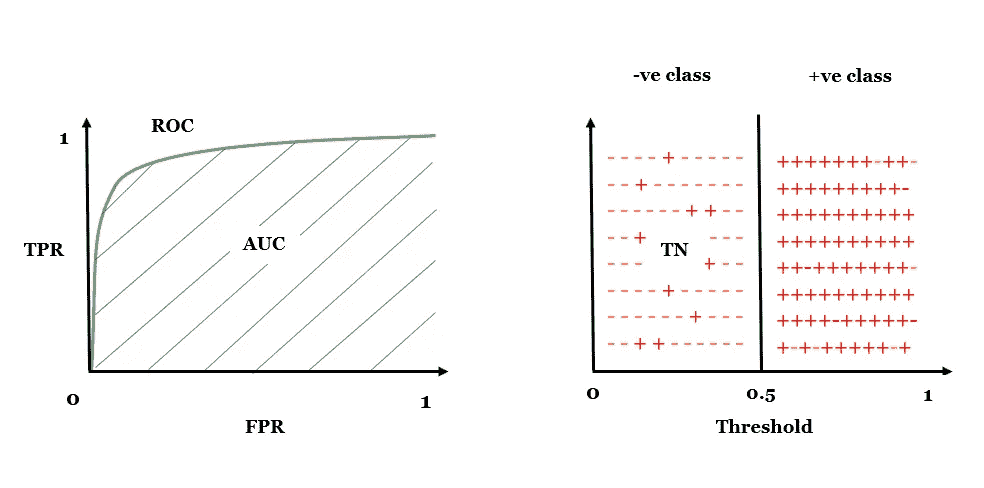
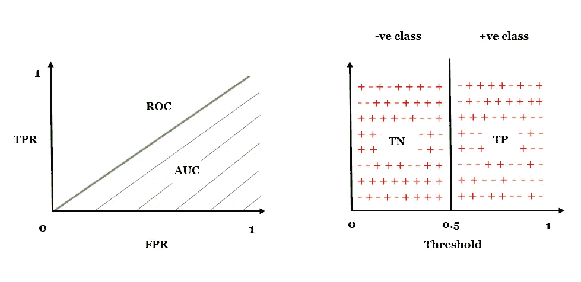
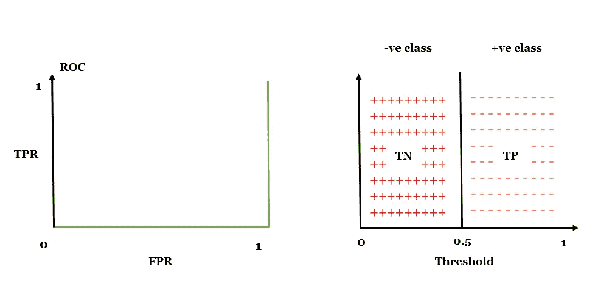
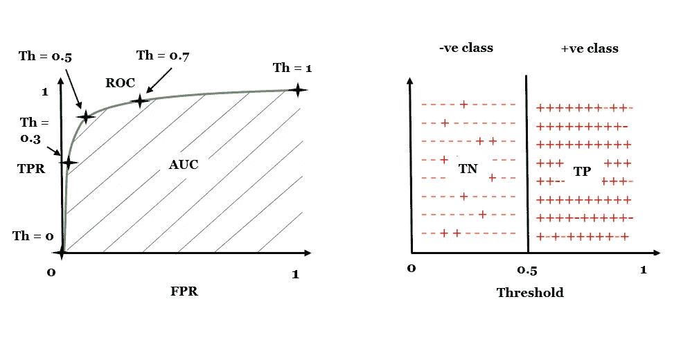
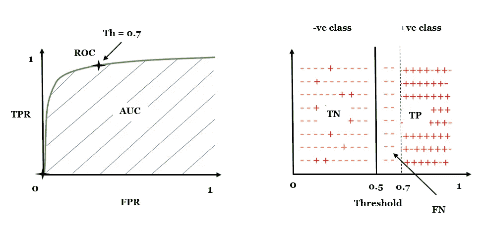
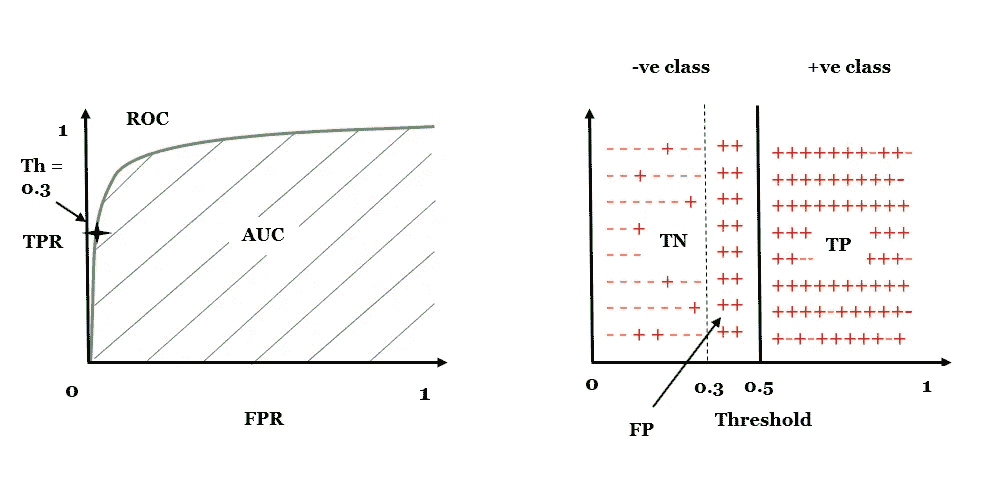

# ROC 和 AUC 去神秘化

> 原文：<https://medium.com/mlearning-ai/roc-auc-demystified-b2b0f3e87123?source=collection_archive---------1----------------------->

Photo by [Elijah Hail](https://unsplash.com/@elijahhail?utm_source=medium&utm_medium=referral) on [Unsplash](https://unsplash.com?utm_source=medium&utm_medium=referral)

## 如果你是第一次接触这些看起来可怕的概念，不要惊慌；我很肯定，如果你们相处融洽，你会对这些概念评价更高。

注意:

在继续之前，我强烈建议您看一下我关于[混淆矩阵](/mlearning-ai/confusion-matrix-no-more-confusion-7f64dcd9e804)的文章，以便更好地理解这些概念。

> ROC =接收器工作特性
> 
> AUC =曲线下面积

*ROC-AUC 是在真阳性率(TPR) &假阳性率(FPR)的帮助下绘制的，是一种评估用于解决分类问题的 ML 模型性能的图形方式。虽然这个度量只能从二进制类中导出，但是我将向您展示 ROC-AUC 如何也可以实现多类分类。*

我将在本文中讨论以下主题:

1.  什么是 ROC & AUC？
2.  不同 ROC-AUC 值的图表
3.  ROC-AUC 用于具有真实生活用例的二元分类
4.  多类分类的 ROC-AUC

# 什么是 ROC-AUC？

接收机工作特性(ROC):顾名思义，它告诉我们有关接收机工作条件的特性(质量)。在机器学习中，这些特征被称为分类器的性能。ROC 曲线是一条**概率曲线** ( *一条描述随机变量*的值的概率分布的曲线)，X 轴是假阳性率(FPR)，Y 轴是真阳性率(TPR)。

TPR =召回=灵敏度

Fig 1: TPR

> FPR = 1 —特异性

Fig 2: Specificity

Fig 3: FPR

AUC 是 ROC 曲线下的面积。它显示了我们的模型能够正确分类输出类的强度/强度。这个区域越高，我们的模型对输出进行正确分类的能力就越高。

> 注意:
> 
> ROC 是曲线，AUC 是曲线下的面积
> 
> 只用一个点是画不出曲线的。考虑到这一规则，ROC 曲线通过多个分类阈值点绘制，每个阈值点对应于 TPR 和 FPR 的不同值。AUC 是包含在 ROC 曲线和横轴(X 轴)之间的面积。话虽如此，请记住 ROC-AUC 并不仅仅针对单一的分类阈值，而是针对多个分类阈值。

# 不同 ROC-AUC 值的图表

*为了将上述理论与您的视觉效果联系起来，以下是一些 ROC 和 AUC 值不同的图表:*

## 1.AUC = 1

Fig 4: AUC = 1

*   获得 1 的 AUC 分数类似于达到 100%的准确性。
*   我们型号的性能不可能比这更好了。
*   在这种情况下，应用 0.5 的分类阈值将为我们提供一个完美的模型，它将能够映射所有的 0 到 0 和 1 到 1。

## 2.AUC = 0.7

Fig 5: AUC = 0.7

*   AUC 分数为 0.7 的分类器声称它能够正确地分类 70%的总记录，但未能提供其余 30%的记录。
*   请注意，在您右侧的图中，对应于 **-ve** 类的低于分类阈值 0.5 的一些值被预测为 **+ve** 。类似的现象对于 **+ve** 级也是如此。
*   0.7 的 AUC 分数仍然是相当好的成绩。

## 3.AUC = 0.5

Fig 6: AUC = 0.5

*   0.5 的 AUC 分数可能是我们的分类器需要的最差的分数。
*   它说模型完全不知道哪个记录被分配给哪个输出类。
*   右图是这种情况的一些图像。

## 4.AUC = 0

Fig 6: AUC = 0

*   考虑 AUC = 0 的一种方法是，我们的模型表现最差，因为它将所有 0 映射到 1，将所有 1 映射到 0；一个不同的观点是，我们的模型能够做出*完美的逆向预测*。
*   一种方法是不微调和重新训练模型，我们可以将 **0** 分配给 **+ve 类**，将 **1** 分配给 **-ve 类**。

# ROC-AUC 用于具有真实生活用例的二元分类

考虑一个真实的用例，我们需要预测一个人是否患有癌症。在这种情况下，我们有两个输出类: **0 (-ve 类)**和 **1 (+ve 类)**

在数据集上训练分类器后，我们得到 0.7 的 AUC 分数。该分类器的 ROC-AUC 图如下图所示:

Fig 7: Threshold = 0.5

通常，用于分类输出类别的阈值是 0.5，即，

如果 y <= 0.5, then y corresponds to **类 0** ，并且

如果 y > 0.5，则 y 对应于**类 1**

其中，y =二元分类器的输出

但是在某些情况下，我们可能需要修改这个分类阈值。

*以下是两种情况，在这两种情况下，阈值的修改对输出分类非常有帮助。*

## 案例 1:

考虑这样一种情况，只有当我们足够自信时，我们才需要告诉患者他/她患了癌症。因为告诉某人他/她患有癌症可能会扰乱那个人的精神状态。

为此，我们需要将分类阈值从 0.5 提高到 0.7，即，

如果 y <= 0.7, then the patient is not affected with Cancer, and

If y >为 0.7，则患者患有癌症

下图显示了与这种情况相关的 ROC-AUC 图:

Fig 8: Threshold = 0.7

*将分类阈值从 0.5 提高到 0.7* 将**降低**我们的 **TPR** ，因为我们将一些可能患有癌症(在 0.5-0.7 范围内)的患者分类为未受影响。换句话说，我们将一些 **+ve** 记录分类为 **-ve，**，这样做将*影响真阳性率(TPR)* ，因为我们*增加了 FN 值的数量*；并根据公式计算出 TPR，*增加 FN 值的个数会降低 TPR。*

假阳性率( **FPR** )不会受到**的影响**至于所有的实际 **-ve** 记录，由于实际 **-ve** 记录位于低于 0.5 的*之下，而我们当前的分类阈值为 0.7，所以我们仍然会像以前一样预测它们。*

此外，计算 FPR 的公式不依赖于 FN 值；因此，FPR 不会受到 FN 值计数的任何变化的影响。

在这种情况下，我们需要在 TPR 上妥协，以增加分类的阈值。

## 案例二:

现在考虑另一种情况，我们需要告诉患者他/她患有癌症，即使他/她有轻微的癌症症状。在这种情况下，我们不想鲁莽行事，因为忽视像癌症这样的可怕疾病的轻微症状会非常危险。

为此，我们需要将分类阈值从 0.5 降低到 0.3，即，

如果 y <= 0.3, then the patient is not affected with Cancer and,

If y >为 0.3，则患者患有癌症

对应于这种情况的 ROC-AUC 图可以在下图中看到:

Fig 9: Threshold = 0.3

将分类阈值从 0.5 降低到 0.3 将**增加**我们的假阳性率( **FPR** )，因为我们将一些可能没有患癌症的低风险患者(即在 0.3 到 0.5 范围内的患者)分类为患癌症的患者。换句话说，我们将一些 **-ve** 记录分类为 **+ve** 、**、**，这样做*会影响假阳性率(FPR)* ，因为我们*增加了 FP 值*的数量；并根据公式计算出 FPR，*增加 FP 值的个数会增加 FPR。*

真正的阳性率( **TPR** )将不会**受到影响**至于所有实际的 **+ve** 记录，我们将仍然像以前在分类阈值为 0.5 时一样预测它们，因为实际的 **+ve** 记录位于超过 0.5 的*处，而我们当前的分类阈值是 0.3。*

此外，计算 TPR 的公式不依赖于 FP 值；因此，TPR 不会受到 FP 值计数的任何变化的影响。

在这种情况下，我们需要在 FPR 上妥协，以降低分类的阈值。

> 通过这种方式，我们可以针对不同的分类阈值绘制 TPR 对 FPR 的曲线图，这将产生称为受试者工作特性(ROC)曲线的曲线；这条曲线会告诉我们，选择什么样的阈值会给我们什么样的 TPR & FPR 值。曲线下面积(AUC)将告诉我们我们的模型正确区分输出类别的能力。
> 
> 现在，根据我们的折衷因素，即我们是否要在 TPR 或 FPR 上折衷，我们需要为我们的问题陈述选择最佳阈值。

# 多类分类的 ROC-AUC

是的，ROC-AUC 确实只能针对二元类导出，但也可以针对多类分类器计算。这可以借助于'**一个对所有**'方法来完成。

该方法类似于使用逻辑回归来解决多类分类问题的方法。

假设我们需要解决一个有 4 个输出类的多类分类问题: **A，B，C** & **D**

ROC-AUC 将首先通过将类别 **A** 视为一个类别来计算，其余的所有类别: **B** 、 **C** & **D** 将被组合在一起，作为一个整体被视为另一个类别。

在下一次迭代中，类 **B** 将被视为一个类，其余的所有类: **A** 、 **C** 、&、 D 将被组合在一起，作为一个整体被视为另一个类。

将对类别**C**类别**d**重复相同的程序

希望这个解释为你解开 ROC-AUC 之谜！如果这篇文章对你有用，请告诉我。此外，如果有任何问题或疑虑，我也渴望解决它们。

快乐学习！

您可以通过以下方式联系我:

电子邮件:gauravkamble9@gmail.com

领英:[https://www.linkedin.com/in/gaurav-kamble-data-science-101](https://www.linkedin.com/in/gaurav-kamble-data-science-101)

GitHub:[https://github.com/GauravK1997](https://github.com/GauravK1997)