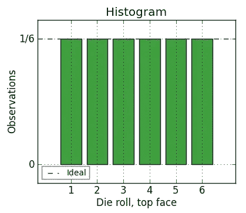
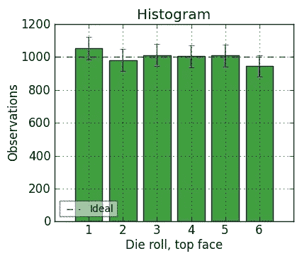
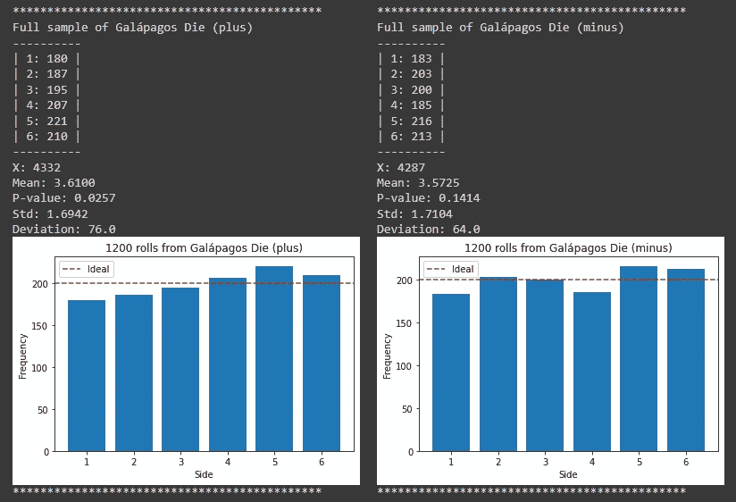

# 滚动两个骰子 1200，看它们是否公平

> 原文：<https://medium.com/mlearning-ai/rolling-two-dice-1200-each-to-see-that-they-are-fair-37a2577a6c2f?source=collection_archive---------6----------------------->


葡萄牙语。

我有这两个骰子是一个朋友送给我的，我很喜欢它们。但我想知道骰子是否足够公平，可以玩一些棋盘游戏，并向人们展示我使用这些骰子是因为我喜欢它们，而不是因为一些赢得更多游戏的不正当方式。

于是，我开始滚动！我用同一张桌子来掷骰子，试图用同样的方法来做这件事，因为虽然真正公平的骰子在任何表面上都应该是公平的，但某些类型的偏见可能只出现在某些表面上。

## 理想骰子

当你掷骰子时，理想情况下你是**随机**选择骰子的一个面。每一次掷骰子都是独立于前一次掷骰子的**，也就是说，获得特定牌面的几率不应该取决于你过去掷出的点数。而面的概率分布应该是**等于**，或者甚至，得到任意面的概率应该是 1/6，或者更一般的是 1/ *f* ，其中 *f* 是骰子上的面的个数。**

因此，如果你掷一个公平骰子**很多次，**计算每个面出现的次数，并绘制成柱状图，你的图应该看起来是平的，就像这样:



Ideal histogram ([https://timothyweber.org/](https://timothyweber.org/))

但当你实际掷骰子时，你的直方图更像这样:



Real histogram ([https://timothyweber.org/](https://timothyweber.org/))

问题是，我们需要掷骰子多少次，才能确信真实直方图足够接近理想直方图，才能看到公平性或最常见的顶面？

## 统计测试

对于统计测试[皮尔森χ](https://en.wikipedia.org/wiki/Pearson's_chi-squared_test) ，一个常见的经验法则是至少有五倍于骰子边数的**个骰。因此，对于六面模具，你需要*至少* 30 次滚动，测试才有效。**

现在对于安德森-达林测试，你应该只有 20 卷可以看到一些结果。

显然，如果你有耐心，多掷几次不会有什么坏处，你累计的次数越多，测试就能更好地检测出细微的偏差，我们可以提高测试的**统计功效**，它决定的不是测试结果有多准确，而是*有多有用*。

因此，为了提高测试的可用性，我将每个骰子滚动 30 次，并写下如下内容:

```
# Sample 0plus[0] = [2, 6, 6, 5, 4, 3, 6, 6, 4, 3, 6, 4, 1, 5, 3, 2, 6, 6, 4, 4, 5, 4, 6, 3, 5, 4, 3, 2, 4, 5]minus[0] = [3, 1, 6, 6, 6, 5, 2, 2, 1, 3, 2, 3, 5, 5, 6, 3, 1, 6, 6, 1, 4, 1, 5, 5, 2, 2, 1, 4, 3, 3]
```

重复 40 次，叠在一起开始测试！

这就是我的直方图的样子:



My histograms

## 试验结果

对于皮尔逊的χ检验，我们想看看我是否有一个足够接近的理想直方图，换句话说，如果每一边的频率都相同，因此我们有如下假设:

*   H0:骰子每一面的频率都是一样的。
*   H1:骰子的一面或多面的频率明显不同于另一面。

测试的代码:

```
critical = [0.85, 0.9, 0.95, 0.975, 0.99]
statistic, p_value = stats.chisquare(freq_plus)
print(f'Χ² = {statistic}')for crit in critical:
  print('')
  if statistic < stats.chi2.ppf(crit, 5):
    print(f'Fail to reject H0 by critical value with {100*crit}% confidence.')
  else:
    print(f'Reject H0 by critical value with {100*crit}% confidence.')
  if p_value < (1-crit):
    print(f'Reject H0 by p-value with {100*crit}% confidence.')
  else:
    print(f'Fail to reject H0 by p-value with {100*crit}% confidence.')
```

**加死:**

> Χ² = 5.92
> 
> 未能以 85.0%的置信度拒绝 H0 的临界值。
> 
> 未能以 85.0%的置信度通过 p 值拒绝 H0。
> 
> 未能以 90.0%的置信度通过临界值拒绝 H0。
> 
> 未能以 90.0%的置信度通过 p 值拒绝 H0。
> 
> 未能以 95.0%的置信度拒绝 H0 的临界值。
> 
> 未能以 95.0%的置信度通过 p 值拒绝 H0。
> 
> 未能以 97.5%的置信度拒绝 H0 的临界值。
> 
> 未能以 97.5%的置信度拒绝 H0 的 p 值。
> 
> 未能以 99.0%的置信度拒绝 H0 的临界值。
> 
> 未能以 99.0%的置信度拒绝 H0 的 p 值。

**减死:**

> Χ² = 4.74
> 
> 未能以 85.0%的置信度拒绝 H0 的临界值。
> 
> 未能以 85.0%的置信度通过 p 值拒绝 H0。
> 
> 未能以 90.0%的置信度通过临界值拒绝 H0。
> 
> 未能以 90.0%的置信度通过 p 值拒绝 H0。
> 
> 未能以 95.0%的置信度拒绝 H0 的临界值。
> 
> 未能以 95.0%的置信度通过 p 值拒绝 H0。
> 
> 未能以 97.5%的置信度拒绝 H0 的临界值。
> 
> 未能以 97.5%的置信度拒绝 H0 的 p 值。
> 
> 未能以 99.0%的置信度拒绝 H0 的临界值。
> 
> 未能以 99.0%的置信度拒绝 H0 的 p 值。

对于 Anderson-Darling 检验，我们想看看顶面之和是否是正态分布的，一旦每个顶面之和的概率不同。测试将这些值标准化，因此我们期望平均值为 0，标准偏差为 1。因此，我们有以下假设:

*   H0:每个骰子样本值的标准化总和是正态分布的。
*   H1:骰子每个样本的标准化数值总和遵循另一种分布。

测试的代码:

```
statistic, crit, sign = stats.anderson(Z_plus, 'norm')
print(f"A² = {'%.4f' % statistic}")
print('')for i in range(len(sign)):
  if statistic < crit[i]:
    print(f'Fail to reject H0 with {100-sign[i]}% confidence.')
  else:
    print(f'Reject H0 with {100-sign[i]}% confidence.')
```

**加死:**

> A = 0.4785
> 
> 未能以 85.0%的信心拒绝 H0。
> 
> 未能以 90.0%的信心拒绝 H0。
> 
> 未能以 95.0%的信心拒绝 H0。
> 
> 未能以 97.5%的信心拒绝 H0。
> 
> 未能以 99.0%的信心拒绝 H0。

**减模:**

> A = 0.3270
> 
> 未能以 85.0%的信心拒绝 H0。
> 
> 未能以 90.0%的信心拒绝 H0。
> 
> 未能以 95.0%的信心拒绝 H0。
> 
> 未能以 97.5%的信心拒绝 H0。
> 
> 未能以 99.0%的信心拒绝 H0。

## 结论

有了统计的力量，现在我可以在我的桌游和 RPG 部分使用我可爱的骰子，而不会被人认为我在作弊！

你可以在这里看到一个笔记本，上面有所有的成绩、图表和测试[。](https://github.com/brunoras/galapagos_dice/blob/main/Fairness_of_my_Gal%C3%A1pagos_Dice.ipynb)

## 参考

[https://timothyweber.org/node/254](https://timothyweber.org/node/254)

https://timothyweber.org/node/255

[https://RPG . stack exchange . com/questions/70802/how-can-I-test-a-die-are-fair](https://rpg.stackexchange.com/questions/70802/how-can-i-test-whether-a-die-is-fair)

# 在更多的地方找到我！

[**我的 linktree**](https://linktr.ee/brunoras)

[](/mlearning-ai/mlearning-ai-submission-suggestions-b51e2b130bfb) [## Mlearning.ai 提交建议

### 如何成为 Mlearning.ai 上的作家

medium.com](/mlearning-ai/mlearning-ai-submission-suggestions-b51e2b130bfb) 

[成为 ML 写手](/mlearning-ai/mlearning-ai-submission-suggestions-b51e2b130bfb)