# 使用机器学习基于防火墙日志路由网络流量

> 原文：<https://medium.com/mlearning-ai/routing-network-traffic-based-on-firewall-logs-using-machine-learning-dc5e5c8c6bb3?source=collection_archive---------0----------------------->

Image by [Tumisu](https://pixabay.com/users/tumisu-148124/?utm_source=link-attribution&utm_medium=referral&utm_campaign=image&utm_content=3194286) from [Pixabay](https://pixabay.com/?utm_source=link-attribution&utm_medium=referral&utm_campaign=image&utm_content=3194286)

> 互联网是当今我们生活中如此重要的一部分，以至于它可以被认为是过上更好生活的必需品之一。然而，尽管如此，它也必须不被用于非法活动，尤其是在大学校园或公司办公室等专用网络中，以保护机密数据。这就是防火墙的用武之地。防火墙是一种网络安全系统，它根据预定义的安全规则监控传入和传出的网络流量。因此，它可以被视为在可信网络(即校园或办公室)和不可信网络(即互联网)之间建立屏障的安全措施。

**业务问题:**
防火墙系统的重要部分显然是管理网络流量的安全规则
。流量的正确路由确保
网络符合安全策略，用户在访问允许的网页时不会遇到任何不必要的麻烦。建立防火墙系统是一项复杂且容易出错的任务，因为它是由网络管理员执行的，因此可能会出现人为错误，而且随着时间的推移，可能需要修改安全规则以保持符合安全策略。

例如，如果一个人想访问网络上被禁止的网站，防火墙应该能够阻止网络上的特定网站。就此而言，公司或大学网络可能会对员工或学生不应访问的欺诈网站有严格的保留。考虑到互联网的巨大规模，对于防火墙管理员团队来说，维护这些规则确实是一项繁琐的任务，因为他们的任何错误都可能招致重大处罚，甚至将机密数据暴露给外部网络。为了消除这些错误并提供稳定的互联网流量，对于这些网络来说，防火墙的正确维护变得非常重要。由于网络流量的历史数据可以很容易地从防火墙日志报告中获得，机器学习模型可以很好地帮助解决这个问题，这就是本案例研究的全部内容。听起来很有趣？然后系好安全带。

**业务约束:**

设计的机器学习模型应该能够快速预测要采取的行动，以避免对网络延迟的不必要的阻碍，因为这可能对网络性能产生反作用。简而言之，不管训练时间复杂度如何，测试时间复杂度必须要短。此外，网络管理员可能希望通过模型对预测的动作类进行某种形式的解释，因此该模型还应该能够在预测中提供特征的重要性。

**早期作品:**

无论如何，使用机器学习实现防火墙并不是不断增长的机器学习奇迹列表的新生应用。已经有一些研究工作在进行，但是还没有突破。

1.  [使用多类支持向量机对防火墙日志文件进行分类](https://www.researchgate.net/publication/324006304_Classification_of_Firewall_Log_Files_with_Multiclass_Support_Vector_Machine):

上述研究论文已由 Fatih Ertam 等人在 2018 年 3 月的会议论文中发表，他也是我们将在本案例研究中使用的数据集的作者。该团队使用线性、多项式和 RBF 核的支持向量机对与本案例研究相同的数据集上的行为进行分类。评估是通过使用精确度、召回率、F1 分数等指标来完成的。使用 RBF 核的分类器获得了最好的结果，F1 得分为 76.4%。似乎研究团队没有使用任何预处理或特征工程技术来训练模型。因此，这项工作确实有改进的余地，这也是本案例研究的重点。

[2。机器学习驱动的 Web 应用防火墙:](https://github.com/faizann24/Fwaf-Machine-Learning-driven-Web-Application-Firewall)

这个知识库是由 Faizan Ahmad 在 Github 上发布的。作者使用的数据集是 web 应用程序中查询的集合。该数据集包含大约 1000000 个肯定查询和 50000 个否定查询。然而，作者确实提到数据集是由他使用自动化脚本标记的。作者使用 TF-IDF 矢量器对查询进行了预处理，其 ngrams 的范围高达三元组。使用逻辑回归训练模型，表明准确率为 99%，然而，作者没有明确报告最终 F1 分数或对数损失。

[3。使用
随机森林回归进行网络流量分析的机器学习方法:](https://acet.ecs.baylor.edu/journal/ACETJournal_Vol13/Machine%20Learning%20Approach%20for%20Network%20Traffic%20Analysis_09_2019.pdf)

该论文由 Shilpa Balan 等人发表，旨在通过在加拿大网络安全研究所(CIC)生成的数据集(称为 CICDS2017)上训练随机森林来构建网络入侵检测系统(NIDS)，该数据集包含实时捕获的各种网络流量以及网络攻击，如暴力安全外壳(SSH)和文件传输协议(FTP)攻击。0.965 的 F1 分数表明网络流量可以通过训练机器学习算法来控制。

**数据集:**

本案例研究中使用的数据集由土耳其 Firat 大学的 Fatih Ertam 编制，可从[此处](https://archive.ics.uci.edu/ml/datasets/Internet+Firewall+Data)下载。该数据集包含 65532 个实例，具有由大学防火墙系统的日志收集的 12 个特征。这些功能的概要如下-

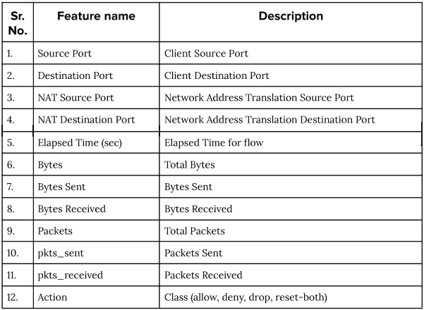

Image by author

作为我们的响应变量的动作被分为四类。也就是

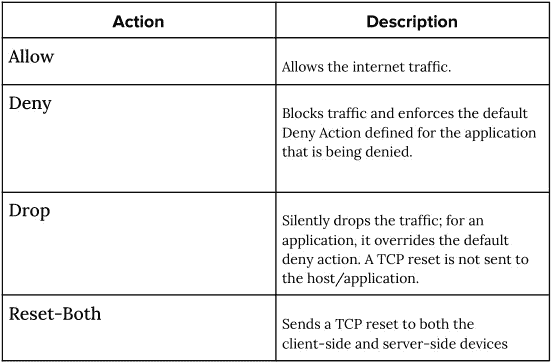

Image by author

**探索性数据分析(EDA):**

首先，我们可以尝试一些重要特征的单变量分析。让我们看看行动类的分布，这是我们的目标变量。

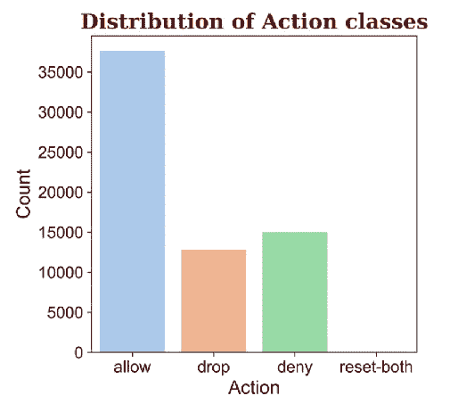

Image by author

正如我们所见，这是一个不平衡数据集的例子。重置-与其他三个类相比，这两个类出现的次数很少。

现在，让我们看看字节特性。为了更好地理解，我们可以绘制与动作类相关的散点图和箱线图。

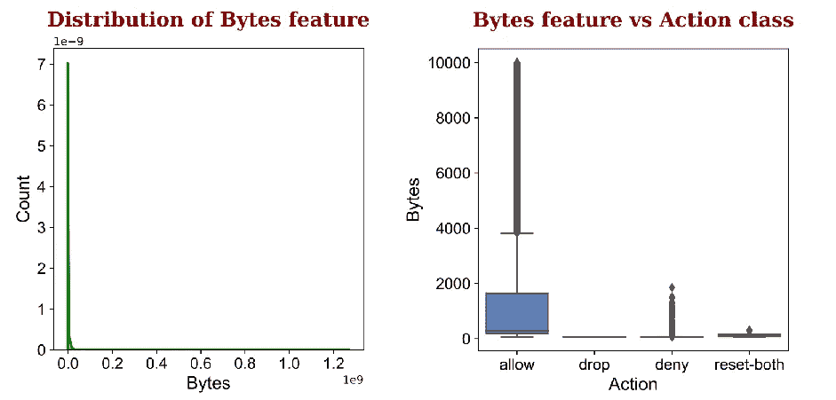

Image by author

正如我们所看到的，字节特性是非常右偏的。这可能是由于异常值的存在。箱线图还显示，流量中包含的字节数越多，防火墙就越有可能允许流量。同样，从数据包和运行时间(秒)特征图中也可以得出同样的见解

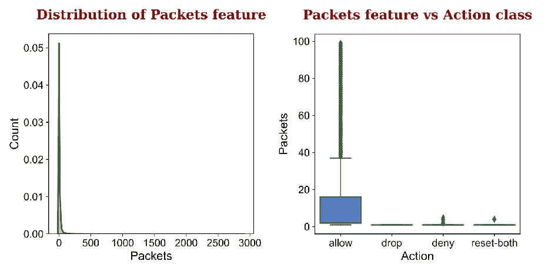

Image by author

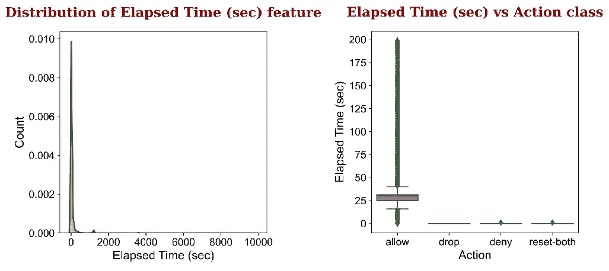

Image by author

根据单变量分析，可以说“允许”动作类可以根据其特征值与其他三个类分开。但是，其他三个动作类就没什么可说的了。为此，让我们尝试在同一组特征之间进行双变量分析。

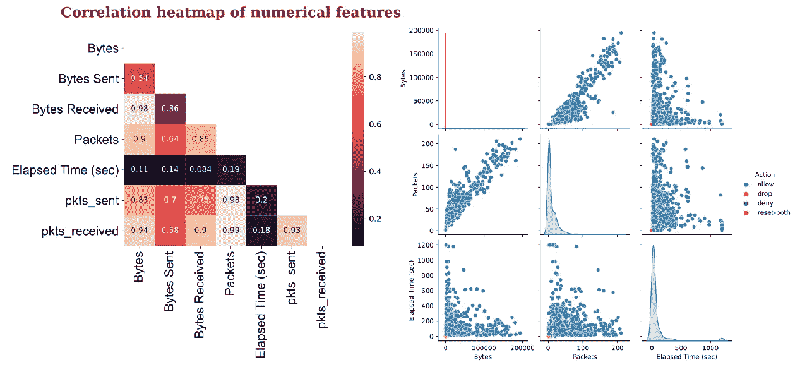

Image by author

该图显示了字节和包特征之间的强线性关系。由于特征的随机分布，动作“允许”主导了情节。但是，可以推断出，较高的字节、数据包和运行时间(秒)值通常会导致允许的流量。然而，当这些类重叠时，这些特性的较低值就无从谈起了。

我们还可以使用 T-sne 在二维嵌入空间中可视化特征。这将使我们对 Action 类的可分性有一个更好的了解。

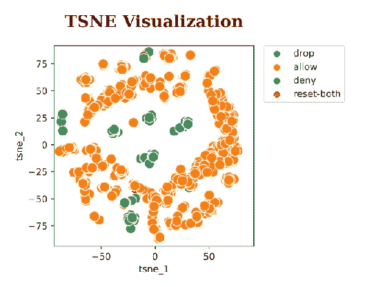

Image by author

可视化支持我们从早期分析中得出的结论。动作类“allow”可与其他三个动作类分开。但是，仅数字特征不足以区分动作类别。为了更好地分类，我们应该对港口特征采用特征工程技术。

**特色工程:**

如探索性数据分析所示，数字特征本身不足以对所有行动类别进行分类。但是，我们可以使用流量中涉及的端口号信息来设计一些功能，这可能有助于我们更好地对操作类别进行分类。首先，让我们了解数据集中的端口号。网络术语中的端口号是指分配给特定服务的编号，有助于识别每个数据包的服务目的。总共有 65535 个端口可用于执行任何网络通信。例如，使用端口 20 传输文件的文件传输协议(FTP)、使用端口 110 的邮局协议(POP3)等电子邮件传递服务以及使用端口 143 的互联网消息访问协议(IMAP)。

虽然端口号表示所请求的服务类型，但它并不表示主机设备的任何信息。主机设备由 IP(互联网协议)地址标识，IP 地址只是该设备在互联网上的地址。有两种类型的 IP 地址。私有 IP 地址是由路由器分配的访问互联网的设备的 IP 地址，公共 IP 地址是由互联网服务提供商(ISP)提供的，用于连接到互联网。IP 地址由互联网协议第 4 版(IPv4)定义，这是一个全球惯例，使用唯一的 32 位数字。因此，对可用的唯一地址的数量仍有限制。更具体地说，有 2 个唯一的 IP 地址可用。

Photo by [Stephen Phillips — Hostreviews.co.uk](https://unsplash.com/@hostreviews?utm_source=unsplash&utm_medium=referral&utm_content=creditCopyText) on [Unsplash](https://unsplash.com/?utm_source=unsplash&utm_medium=referral&utm_content=creditCopyText)

但一个重要的警告是，没有连接到互联网的设备，如只通过 TCP/IP 相互通信的工厂机器，不需要有全球唯一的 IP 地址。这些类型的专用网络被广泛使用，我们的大学网络就是一个很好的例子。为这些专用网络保留了三个不重叠的近 1800 万个 IP 地址范围。这使得连接到共享网络环境的设备能够使用相同的公共 IP 地址连接到互联网。为此，路由器或网络集线器采用了一种称为网络地址转换(NAT)的技术。基本上，NAT 允许单个设备(如路由器)充当互联网(或公共网络)和本地网络(或专用网络)之间的代理，这意味着只需要一个唯一的 IP 地址就可以向网络外的任何设备(即互联网)代表整个计算机组。虽然 NAT 可以更好地利用 IP 地址空间，但它并不总是在路由器级别的每次通信中发挥作用。这意味着，有时端口号可以在互联网上使用，也不需要翻译。

我们正在使用的数据集记录了私有设备上的端口号以及由 NAT 转换的端口号。因此，如果在传递流量时需要端口转换(NAT ),我们可以根据信息为源和目的地创建两个功能。如果设备和 NAT 上的端口号不同，表明需要 NAT，则功能源端口转换和目的端口转换可以编码为 1。否则，它们将被编码为 0，表示不需要转换。

我们还可以在 networkx 库的帮助下，通过构建源端口和目的端口的网络来提取更多的功能。在确定流量行为时，可能会隐含涉及特定端口的重要性。通过建立一个网络，我们可以探索这些特征。在数据集中，我们在两台主机设备以及 NAT 的两端都有源端口和目的端口。因此，我们可以从这些端口号构建两个网络。

其中一些特征可以解释为-

***1。公共邻居:*** 源端口和目的端口之间的公共端口数量。可以使用主机设备和 NAT 的通用端口。设γ(p)表示直接连接到端口 p 的端口数量，也称为 p 的度数，Pₛ和 Pᵈ分别是源端口和目的端口。然后，公共端口可以计算为-

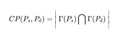

**2*。JAC card Index:***JAC card Index 是通过将源端口和目的端口之间的公共端口的数量除以连接到源端口和目的端口中的每一个的端口总数来计算的。

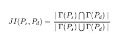

***3。索尔顿指数:*** 索尔顿指数又称余弦相似度。它计算源端口和目的端口之间的共享端口数量与它们度数乘积的平方根之比。

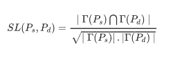

***4。索伦森指数:*** 类似于 Jaccard 指数，除了分母是净和与并集相反。

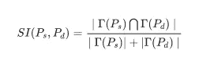

***5。Adamic/Adar Index:***Adamic-Adar Index 是专门为比较两个网页而设计的。它类似于常见的端口，但它通过记录日志来惩罚罕见的网页，在我们的情况下，这些日志可能是欺诈性的。

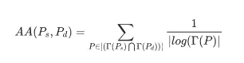

***⑥。PageRank:*** PageRank 根据输入链路的结构计算网络图 G 中端口的等级。它最初是作为一种算法设计的，用于在谷歌搜索引擎中对网页进行排名。我们可以从主机和 NAT 网络计算源端口和目的端口的页面等级。

**选择绩效指标:**

为了评估任何机器学习模型的性能，选择正确的度量是非常重要的。这个模型只有在指标显示的情况下才是好的。但是，度量本身并不能保证模型在实时情况下也能正常工作。因此，对于任何底层任务，度量必须适合其实时应用。
这里的任务是对防火墙日志数据的 Action 类进行分类。这是一个多类分类任务，因为 Action 类属于四个不同的类。这些类之间的分布也不相等，这意味着这是一个不平衡的数据集。因此，不能使用简单准确度或 AUC，因为它未考虑类别不平衡。此外，正确预测每一堂课也同样重要。此外，实现的模型应该能够预测预测类的可解释性概率，而不是直接对类进行硬约束预测。
这就给我们留下了多类对数损失作为度量。通常情况下，即使模型将其解释为一种误差度量，我们也可以将其用作一种度量来评估模型，即认为具有较低 log-loss 的模型性能更好。这是因为它惩罚了不自信的预测。它被定义为-

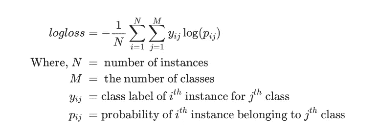

**造模:**

***1。基线模型:***

我们选择的性能指标(即多类日志丢失)本身是不可解释的，因为它只是一个数字。因此，要对我们的模型进行基准测试，我们必须了解随机基线模型的对数损失。由于我们数据集中的`**Action**`类具有不相等的分布，我们可以通过生成与其在数据集中的权重成比例的每个`**Action**`类的随机概率来构建预测`**Action**`类的随机模型。

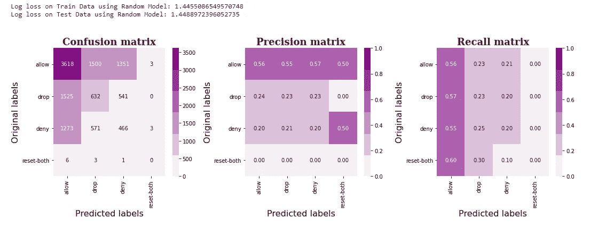

基线模型的对数损失率为 1.45。因此，为了能够部署我们的模型，我们必须让日志损失远低于 1.45。

***2。KNeighborsClassifier:***

我们可以从`**KNeighborsClassifier**`开始，这是目前最简单的机器学习模型之一。它通过考虑距离最近的 k 个邻居的标签来生成输出概率。利用超参数整定技术可以找到最佳 k 值。

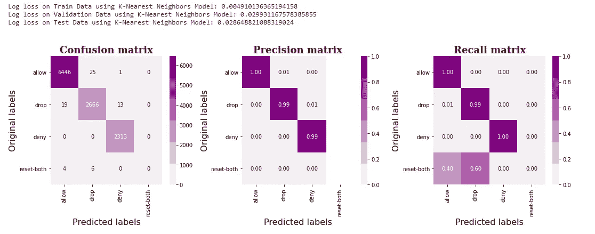

Image by author

如我们所见，该模型的测试对数损失为 0.028，与基线模型的 1.45 相比非常低。但是，即使模型在除了 reset-both 之外的所有`**Action**`类中分类得非常好。这可能很困难，因为在测试数据中只有 10 个该类的实例。

***3。物流回归:***

`**LogisticRegression**`是一个分类模型，它明确地试图最小化日志损失。参数“C”控制正则化的量，值越小正则化越多。“惩罚”参数控制正则化的类型。

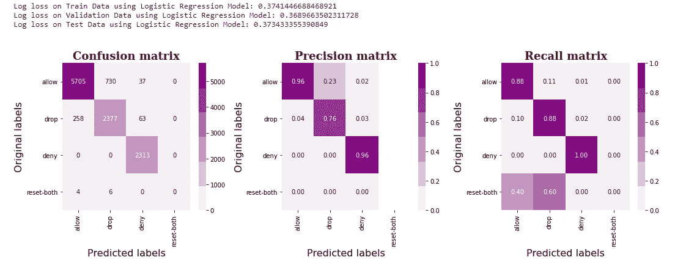

Image by author

如我们所见，该模型的测试对数损失为 0.38，低于基线模型的 1.45，但高于 K-neighbors 模型的 0.028。此外，类似于 k-neighbors，该模型在除了 reset-both 之外的所有`**Action**`类中分类非常好。这可能很困难，因为在测试数据中只有 10 个该类的实例。

***4。支持向量分类器:***

`**SGDClassifier**`是一个分类模型，明确尝试最小化铰链损耗。因此，它主要是一个具有线性核的支持向量分类器。由于大量的训练样本，我们没有使用支持向量和 RBF 核。参数“alpha”控制正则化的量，较小的值具有较小的正则化。“惩罚”参数控制正则化的类型。

Image by author

如我们所见，该模型的测试对数损失为 0.09，低于基线模型的 1.45，但高于 K-neighbors 模型的 0.028。此外，类似于 k-neighbors，该模型在除了 reset-both 之外的所有`**Action**`类中分类非常好。这可能很困难，因为在测试数据中只有 10 个该类的实例。

***5。RandomForestClassifier:***

`**RandomForestClassifier**`是一个集成模型，它训练一个大的决策树集成。参数‘n _ estimators’控制要训练的决策树的数量。“标准”控制分割树所依据的信息增益度量。“max_depth”是决策树构造中允许的最大树层数。

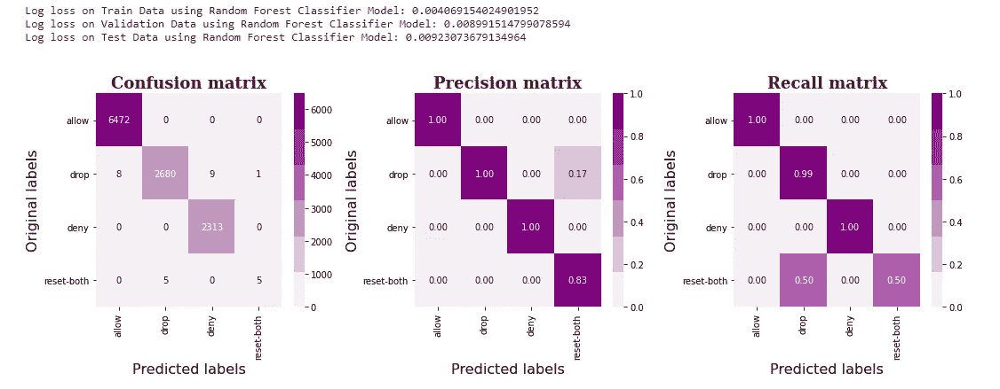

Image by author

正如我们所看到的，该模型的测试对数损失为 0.009，与基线模型的 1.45 和 K 近邻模型的 0.028 相比非常低。此外，与 k 邻居相比，该模型在所有`**Action**`类中分类得非常好，包括重置-两者。这似乎是迄今为止最好的模型。

***6。***

`**LGBMClassifier**`也是一个训练大量决策树的集成模型。参数“n _ estimators”控制要训练的决策树的数量。“目标”指定了学习任务，在我们的案例中是“多类”。“max_depth”是构造决策树时允许的最大树级别数。

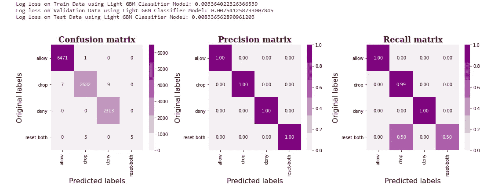

Image by author

正如我们所看到的，该模型的测试日志损失为 0.008，与基线模型的 1.45 相比非常低，也低于随机森林模型的 0.009。此外，该模型在对所有`**Action**`类(包括重置两者)进行分类方面做得很好。因为这似乎是最好的模型，所以让我们检查特征在预测`**Action**`类中的重要性。

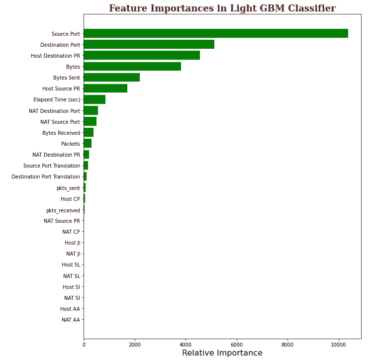

Image by author

值得注意的是，许多工程特征在日志分类中非常重要。也就是说，页面排名和翻译特征非常重要。

***7。*** 堆叠分类器

`**StackingClassifier**`是一种通过元分类器组合多个分类模型的集成学习技术。我们可以使用性能良好的模型(如 KNeighbors、RandomForest、LightGBM 和 Adaboost)作为基本模型，使用后勤分类器作为元分类器，以最大限度地减少日志丢失。`**StackingClassifier**`的超参数可使用随机化搜索 CV 技术进行调整。

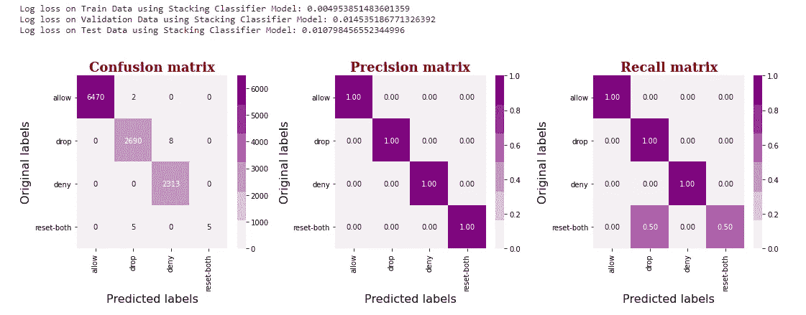

Image by author

正如我们所看到的，该模型的测试对数损失为 0.0107，与基线模型的 1.45 相比非常低，但并不比 Light GBM 模型的 0.008 好。此外，该模型在对所有`**Action**`类进行分类(包括重置-两者)方面做得很好。因此，可以通过计算运行时复杂性来选择更好的模型。

**模型性能总结:**

我们现在可以在预测`**Action**`类时比较所有模型在属性上的性能，例如列车损失、测试损失和运行时间。为了准确测量运行时间，我们可以采用 100 个预测的平均运行时间。

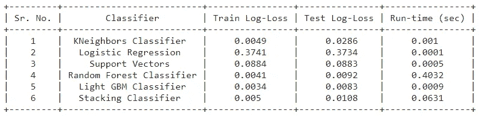

Image by author

从结果可以清楚地看出， **Light GBM 分类器**是最佳模型，其测试对数损失为 0.0083，运行时间仅为 0.0009 秒。因此，该模型满足低延迟要求，并且能够对防火墙流量日志进行可靠的预测。

**未来工作:**

该模型能够在不影响网络延迟的情况下对实时防火墙流量日志进行分类。该模型唯一的小警告来自于 0.5 的 reset-both 动作类召回。也可以通过使用具有给定类别的更好分布的大样本数据来改进。这种基于路由器的防火墙系统可以通过在路由器上提供固件更新来轻松部署。类似于这种基于路由器的防火墙，其他防火墙框架也可以通过使用类似的机器学习技术来改进。

**参考文献:**

> [托管在 UCI 机器学习知识库上的数据集](https://archive.ics.uci.edu/ml/datasets/Internet+Firewall+Data)
> 
> [网络管理:包过滤防火墙](https://www.dummies.com/programming/networking/network-administration-packet-filtering-firewall/)
> 
> [关于学习和提取用于链接预测的图形特征的综述](https://arxiv.org/pdf/1901.03425.pdf)
> 
> [使用监督学习预测好的概率](https://www.cs.cornell.edu/~alexn/papers/calibration.icml05.crc.rev3.pdf)
> 
> [应用人工智能课程](http://appliedaicourse.com)

该案例研究由 GitHub 主持。参见此处的。找我@ [LinkedIn](http://www.linkedin.com/in/shubham859) 。