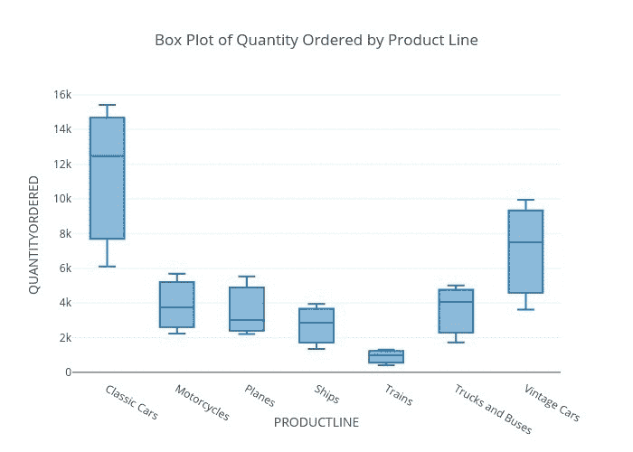

# 使用 Plotly 构建交互式可视化

> 原文：<https://medium.com/mlearning-ai/sales-data-visualization-with-plotly-cad0166c7d5c?source=collection_archive---------1----------------------->

## 创建具有出版物质量的交互式图表。请随意放大、缩小、播放、暂停图表！

Image by [Rishabh Sharma](/@rishabhnsharma) — All Rights Reserved ©

数据的重要性与日俱增。作为商业智能流程中的重要步骤之一，数据分析和可视化流程允许我们捕获原始数据，对其建模，并…