# 使用线性回归模型进行销售预测。

> 原文：<https://medium.com/mlearning-ai/sales-prediction-using-a-linear-regression-model-ffeec84eede1?source=collection_archive---------0----------------------->

***分析和预测电视、广播和报纸给定预算的销售情况。***

Photo by [Carlos Muza](https://unsplash.com/@kmuza?utm_source=unsplash&utm_medium=referral&utm_content=creditCopyText) on [Unsplash](https://unsplash.com/s/photos/sales?utm_source=unsplash&utm_medium=referral&utm_content=creditCopyText)

奥拉，在这个项目中，我创建了一个用于销售分析的预测模型。在这个模型中，我们需要将电视、广播和报纸的广告预算输入到模型中，模型将预测可能的销售额。为了设计模型，我选择的机器学习方法是简单的线性回归，编程是在 Jupyter notebook 中完成的。

**数据集描述:**

广告数据集捕捉与广播、电视和报纸等众多平台的广告成本相关的销售收入。在这里 **找到我的 Kaggle 笔记本 [**。**](https://www.kaggle.com/code/arnavsaxena03/advertisement-sales-budget-prediction)**

**数据:**

**特征变量:**

*   电视:花在电视上的广告费。
*   广播:花在广播上的广告费。
*   报纸:花在报纸上的广告费。

**目标变量:**

销售预算。

> 步骤 1:导入所需的库和数据集。

我为这个练习或程序选择的数据集是 CSV 格式的，因此，我使用了**PD . read _ CSV from****panda 的模块，如下图所示。数据集包含名为电视、广播、报纸和销售的 4 列。**

**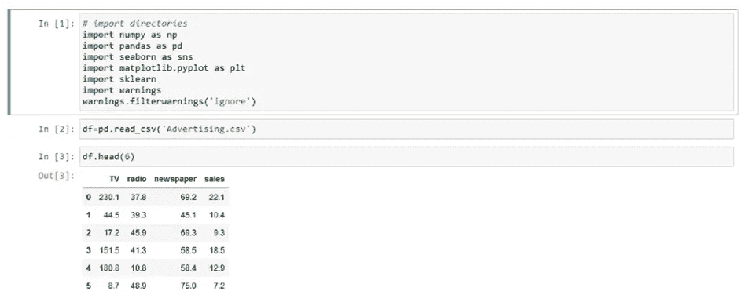**

> ****第二步:检查数据集中的空值和数据检查。****

**提取数据后，就该检查数据集的空值和重复值了。**

**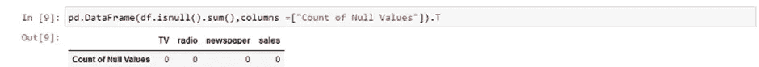**

****Checking for null values in the dataset.****

**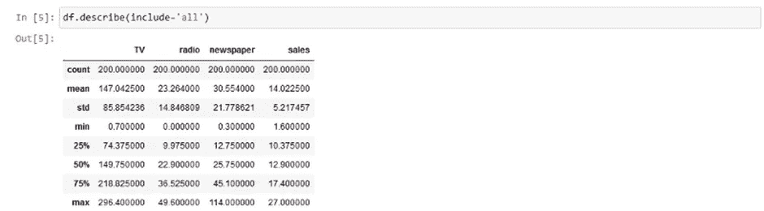**

****Data description****

**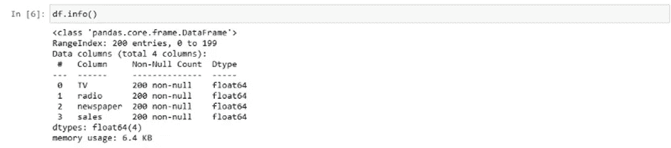**

****Data Information****

> **第三步:探索性数据分析(EDA)。**

**在 EDA 中，我们将找到特征和目标变量之间的关系。**

**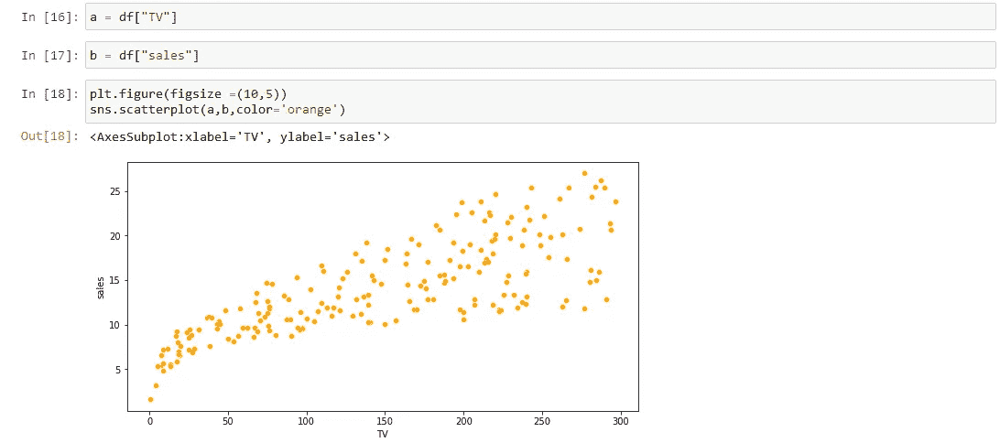**

****Scatterplot between TV and sales (EDA)****

**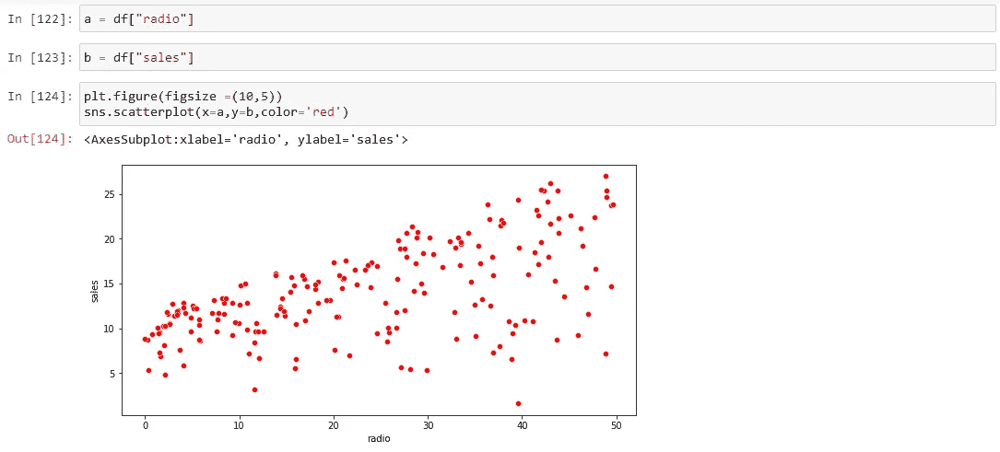**

****Scatterplot between radio and sales (EDA)****

**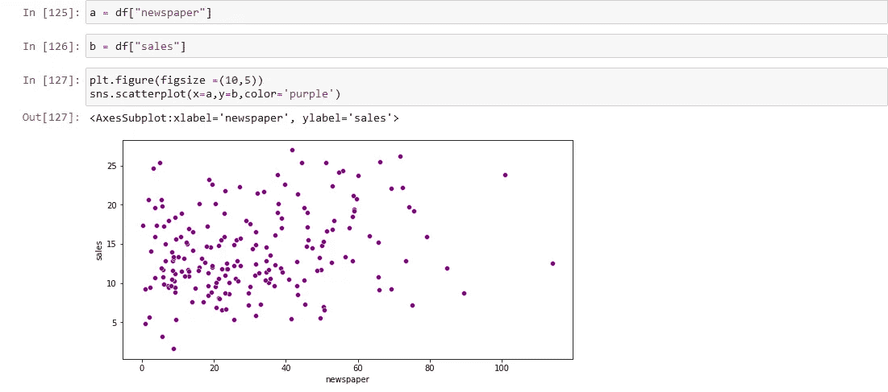**

****Scatterplot between newspaper and sales(EDA)****

## ****距离图:****

**Displot 用于表示数据的单变量分布(涉及一个变量或变量)与密度的关系。**

**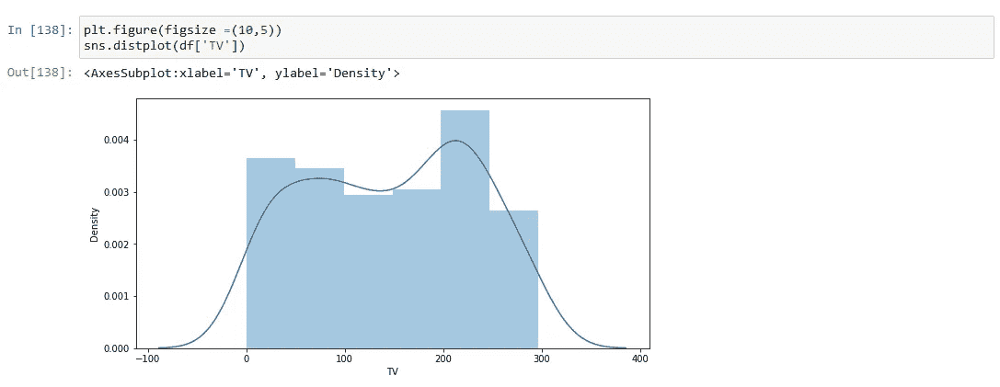**

****Distplot for TV (EDA)****

**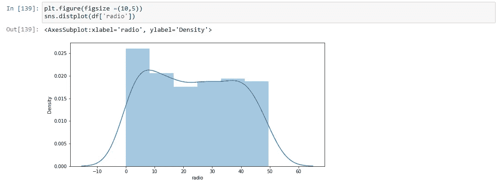**

****Distplot for radio (EDA)****

**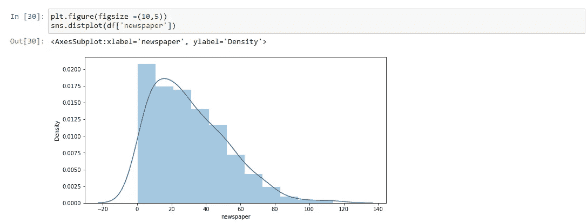**

****Distplot for the newspaper (EDA)****

**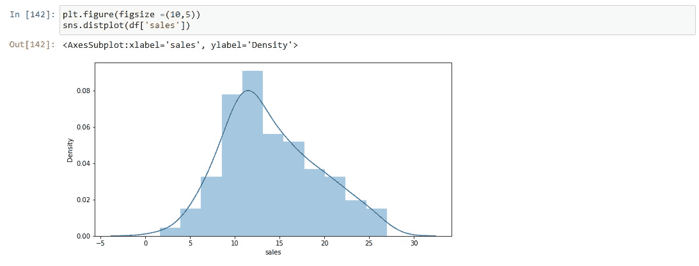**

****Distplot for the sales (EDA)****

**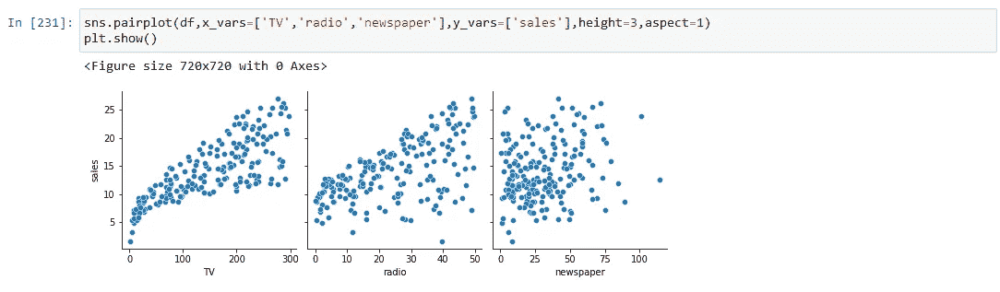**

****Pair plot between TV, radio, and newspaper with respect to sales (EDA)****

****

****Heatmap (EDA)****

> ****第四步:统计任务****

**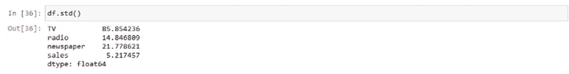**

****Standard Deviation****

**标准差(std)是一个函数，用于描述偏离平均值的程度。**

**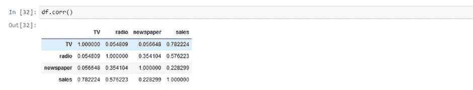**

****Correlation****

**相关性(corr)是用于确定变量之间关系的函数。**

**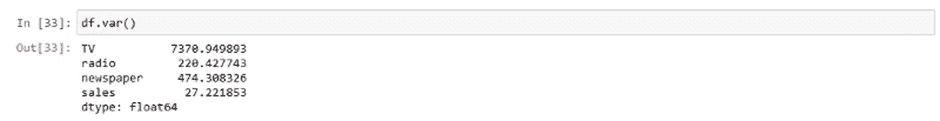**

****Variance****

**方差(var)是一个用于检查离差的函数，它考虑了数据集中所有数据点的分布。**

**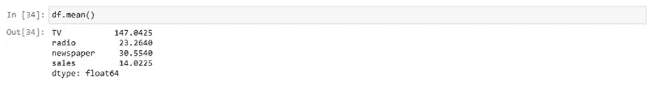**

****Mean****

**Mean 返回数据集的平均值。**

**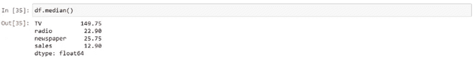**

****Median****

**中位数计算数据集的中间值。**

> ****第五步:线性回归模型建立和预测。****

**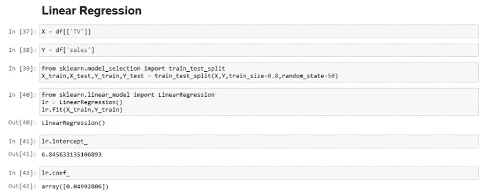**

****Model Building and splitting dataset.****

**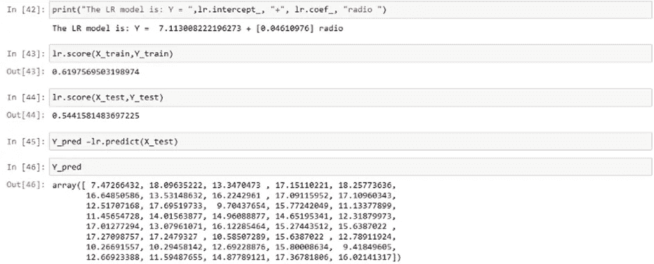**

****Linear Regression output for test and train data.****

**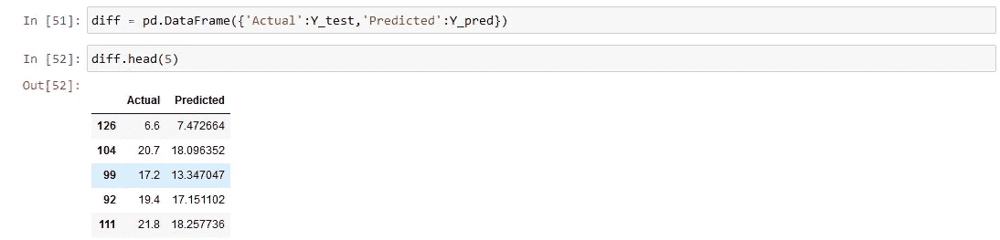**

****difference between actual data and predicted data****

**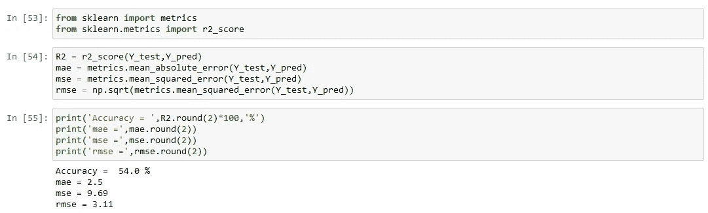**

****Accuracy of linear regression on the dataset.****

**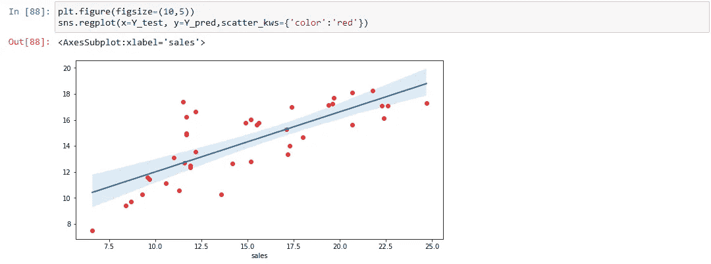**

****Regression graph.****

**线性回归图由训练数据创建，模型线由使用测试数据和预测数据创建的蓝线显示，因为我们可以看到大部分红点都在线上，因此我们可以说模型产生了最佳拟合线。**

****我以前的文章:****

** [## Python 简介

### 对于那些想要对 Python 语言有简要和基本了解的读者来说，这是一本终极指南。

medium.com](/geekculture/what-is-python-9a3902a66cb3)  [## 数据分析师 vs 数据科学家。

### 为该领域的进一步分析和研究奠定了基础！！

medium.com](/codex/data-analyst-vs-data-scientist-dd0f009f2ca1)  [## 数据科学、数据分析和机器学习之间有什么区别

### 陈述数据科学、数据分析和机器学习之间主要差异的终极指南。

medium.com](/illumination/data-science-vs-data-analytics-vs-machine-learning-fc51682ace7) 

# **结论:**

简而言之，电视广告是最好的销售预测。这是一个很好的起点，尤其是在试图理解 python 和统计学的相关性时。

# **终于……**

我真的希望这篇文章是一个很好的阅读材料，也是每个想在数据科学领域从事职业的人的灵感来源。

建议和反馈请**评论**。我还在学习。请帮助我提高，这样我可以通过提升我的写作技能和知识来帮助你，并通过我随后的文章发布以更好的方式向你展示我自己。

谢谢大家，编码快乐:)

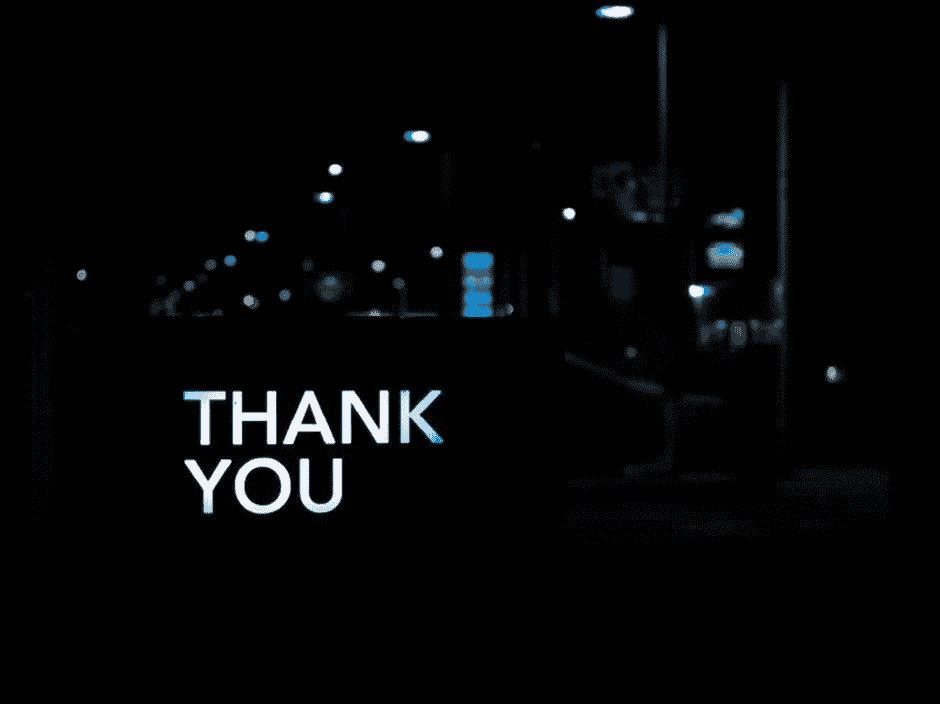

Photo by [Pete Pedroza](https://unsplash.com/@peet818?utm_source=unsplash&utm_medium=referral&utm_content=creditCopyText) on [Unsplash](https://unsplash.com/s/photos/thank-you?utm_source=unsplash&utm_medium=referral&utm_content=creditCopyText)

 [## Mlearning.ai 提交建议

### 如何成为 Mlearning.ai 上的作家

medium.com](/mlearning-ai/mlearning-ai-submission-suggestions-b51e2b130bfb)**