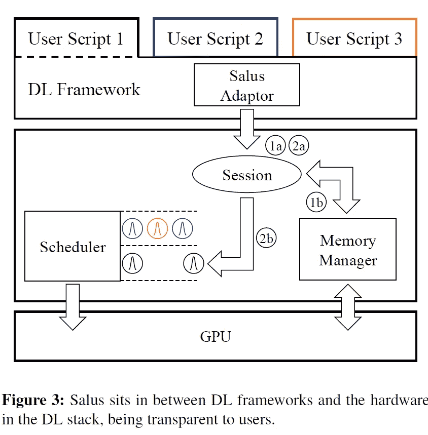
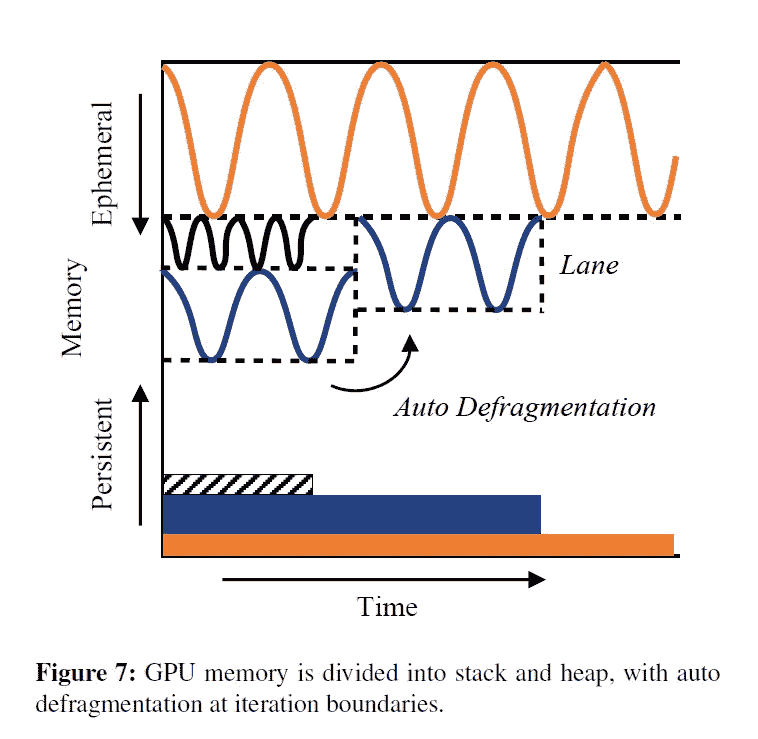

# “Salus:面向深度学习应用的细粒度 GPU 共享原语”摘要

> 原文：<https://medium.com/mlearning-ai/salus-fine-grained-gpu-sharing-primitives-for-deep-learning-applications-49c0fbb5c5f7?source=collection_archive---------5----------------------->

# 介绍

自从 GPU 证明其在深度学习(DL)工作负载方面比传统 CPU 有显著的性能提升以来，GPU 计算一直很受欢迎。然而，对于这些工作负载，GPU 未得到充分利用。这是因为 DL 工作负载的性质和 GPU 缺乏对细粒度共享原语的支持。Yu、裴峰等人[1]提出的机制实现了**快速作业切换** ( **实现分时抢占**)和**内存共享**实现多个 DL 应用间细粒度的 GPU 共享。关键思想是以迭代粒度进行调度，并利用 DL 模型的持久内存。结果显示，完成时间和 GPU 利用率都有显著提高。

# 观察和研究激励

1.  GPU 调度粒度是每个应用一个 GPU。
2.  第一个事实导致**H**EAD-**O**f-**L**ine(**HOL**)阻塞问题。DL 应用通常是长时间的任务，尤其是培训。
3.  DL 作业通常不会完全利用 GPU。作者的观察显示，GPU 内存利用率往往低于 **50%** 。
4.  DL 模型的自动超参数调整并行生成许多训练作业。很多都是因为质量差被杀的。
5.  他们观察到模型和框架内部内存分配明显少于用作暂存区的空间。

# 拟议机制

下图显示了 Salus 的架构概述。当用户创建 DL 作业时，Salus 采纳者创建相应的会话( **1a** )。DL 作业的计算图也传输到 Salus。然后，会话继续向存储器管理器请求通道( **1b** )。根据系统中的当前作业，此进程可能会阻塞，会话将排队。在作业运行期间，无论是训练还是干扰，迭代都由用户脚本生成，并转发给 Salus 中的相应会话( **2a** )。迭代调度器( **2b** )根据它们相关的 GPU 通道对它们进行调度，并发送到 GPU 执行。

***注意 Salus 执行服务通过 DL 作业的迭代粒度调度实现 GPU 共享。***

[1]

根据观察结果(5)，可以在 GPU 中保留多个作业的持久内存，同时仍然有足够的空间来容纳其中任何一个超热内存。

***请注意，Salus 旨在通过保留持久内存来实现显著更快的挂起/恢复操作，然后迭代粒度作业调度程序(例如，分时或基于抢占)决定接下来应运行哪个作业的迭代。***

记住**更细粒度的调度也会给执行服务**增加更多的开销。更精细的粒度是内核级调度，它可能会在每个内核不断增长的短暂内存上导致死锁。此外，这个级别打破了 DL 框架中常见的效率优化，如内核批处理和流水线。相反，迭代粒度允许避开渐进记忆的问题。这是因为所有短暂的分配都是在每次迭代后由框架释放的，而模型和框架内部的分配在迭代中保持不变。

## GPU 通道

作者使用 lane 来指代每个 GPU 的短期内存块。永久存储器被设置并放在一边。短暂区域被分成通道，这些通道是可以包含用于迭代的短暂内存分配的连续内存空间。

车道不仅仅关乎记忆。迭代执行在通道内序列化，并行性在通道间实现，这是使用 GPU 流(并发)实现的。碎片整理发生在每次迭代结束时，这是选择迭代粒度的结果。下图显示了当小型作业停止时，它的通道在迭代边界处被分配到它下面的作业快速回收。

[1]

Salus 使用启发式算法来确定 GPU 中通道的大小和数量，以及如何将通道分配给作业。从最高级别开始，该算法尝试打开新的通道，使用现有的通道，重新组织现有作业的通道分配，以减小短暂区域的大小。你可以查一下文[1]里的算法。

## Salus 中的调度策略

Salus 使用 PACK 来提高资源利用率，使用 SRTF 来防止 HOL 阻塞问题，使用 FAIR 来均衡并发作业的资源份额。在包策略中考虑安全条件以防止崩溃，确保持久和短暂区域永远不会碰撞。作者提到他们认为执行时间是已知的，因此实现 STRF 是可能的。其他方法试图估计执行时间[ **2** ]。

# 估价

Salus 与 TensorFlow 集成，并使用一组训练、超参数调整和推理工作负载进行评估。

基线:集群和 MPS 中使用的 FIFO 调度。

*   使用 SRTF 策略的性能优于 FIFO 3.18 倍
*   通过在超参数调优期间运行多个 DL 作业，GPU 利用率提高了 2.38 倍。
*   GPU 利用率比不共享和 MPS 分别提高了 42 倍和 7 倍。

他们在英特尔 CPU 和两个英伟达 P100 GPU 上运行。

# Salus 的开销

作者提到，所提出的机制的开销是，一些 DL 模型，如自动编码器和超分辨率，除了繁重的 GPU 计算之外，还执行大部分 CPU 处理。由于 Salus 实现了它的执行引擎，所以 CPU 计算也被重定向并发送给 Salus 执行，这一点没有得到很好的优化。

# 结论

虽然 GPU 在 DL 应用中无处不在，但它们的利用率很低。这是因为 DL 应用程序的性质和 GPU 缺乏细粒度的共享原语。Salus 提出了一种新的机制来缓解这些问题，它通过在迭代粒度上进行调度并保存每个模型的持久数据来实现快速作业切换。对于要求高 CPU 计算和 GPU 计算的应用程序来说，它以一些开销实现了相当大的改进。

# 参考

[1]余、裴峰和莫沙拉夫·乔杜里。" **Salus:面向深度学习应用的细粒度 GPU 共享原语**" *arXiv 预印本 arXiv:1902.04610*(**2019**)。

彭，等。 **Optimus:一种高效的深度学习集群动态资源调度器。***第十三届 EuroSys 会议记录*。 **2018** 。

 [## Mlearning.ai 提交建议

### 如何成为 Mlearning.ai 上的作家

medium.com](/mlearning-ai/mlearning-ai-submission-suggestions-b51e2b130bfb) 

🔵 [**成为作家**](/mlearning-ai/mlearning-ai-submission-suggestions-b51e2b130bfb)