# 从先前的例子中，想象你当前的知识基础。

> 原文：<https://medium.com/mlearning-ai/sample-from-the-prior-and-visualize-your-current-knowledge-base-3b3c89db997d?source=collection_archive---------6----------------------->

## 使用威布尔模型的案例研究。

我最近发了几个关于贝叶斯统计的帖子，看了看[纵向数据](/mlearning-ai/mixed-models-of-chicks-weight-a41413c99b51)、[临床数据](/mlearning-ai/ivermectin-covid-19-and-death-355114059c41)、[零膨胀数据](https://pub.towardsai.net/fishing-d25617f988ac)和[小数据集](https://blog.devgenius.io/bayesian-analysis-of-small-sample-mixed-models-8d40ff01a887)。在每一篇文章中，我都把先验放在最后。在这篇文章中，我将反其道而行之，把所有的注意力都放在先验上。因为这是院长应得的。

贝叶斯统计是人类如何学习的数学框架，可以说它与信息论有着紧密的联系。数据只是数据，但从数据到信息再到知识的转变至少可以说是迷人的。

对贝叶斯统计最大的反对仍然是先验的使用，它对后验密度有很大的影响。那些反对贝叶斯推理的人，先验是主观的，是一种将模型推向你自己信念的数学方式。

幸运的是，这不是它的工作方式(尽管理论上，人们可以做到这一点)。事实上，先验是防止错误或不完整数据的最佳保障。这是因为在先的成立需要得到彻底的辩护。没有人可以不假思索地说，他们不知道先选择哪一个。这样的推理几乎会主张推理首先是不存在的。总有一些知识可以应用，而这些知识会使先前选择的信息变得有用。当然，在很多情况下，人们会对设置高度信息性的先验持怀疑态度，因为当前的知识不容易转化为新的情况。然而，不确定性是科学的核心。

在这篇博文中，我将遍历 R 中的一个标准数据集，定义一个先验，然后从这个先验中抽取样本。这样做的原因是因为我想在我现有的知识基础上审视我的信念——可视化。没有建立先验的最佳方法，也不可能集合世界上所有已知的知识，但一个简单的方法是:

1.  搜索到目前为止的可用数据
2.  对数据建模
3.  使用模型中的参数作为新数据集的先验。

现在，要定义和辩护一个先验，你需要有信息，或者缺乏信息，但即使缺乏信息也是信息。所以，我要做的是拿一个合成数据集，从我在这里做的开始([https://medium . com/dev-genius/going-beyond-the-Cox-8503 B6 d 358 b 6](/dev-genius/going-beyond-the-cox-8503b6d358b6))，带你通过选择一个体面的先验的心理练习。

请记住，这与其说是一个技术练习。这是一个检验信念和先验知识的适用性的练习。这很主观，但科学是主观的。统计和建模也是如此。

很好，那么让我们先从贝叶斯模型开始。在下面的代码中，你可以看到制作的模型和使用的先验。现在是时候评估这些先验的有效性了。如你所见，我做了一个威布尔模型。

威布尔模型是参数生存建模中经常使用的模型，但它很少是最佳模型。它有两个参数需要优化——形状和比例。下面你可以看到形状为 *1.64* 和比例为 *3220* 的威布尔函数。

```
weifun<-function(shape,scale){
  t   = seq(0,4000,1) 
  h   = shape/scale*(t/scale)^(shape-1)
  cdf = 1-exp(1)^-(t/scale)^shape
  pdf = shape/scale*(t/scale)^(shape-1)*exp(1)^-(t/scale)^shape
  St  = 1 - cdf
  h2 = pdf/St
  c   = (t/scale)^shape
  dataFrame <- as.data.frame(do.call(cbind, 
                                     list(t,shape,scale,h,h2,cdf,
                                          pdf,St,c)))
  colnames(dataFrame)<-c("Time","Shape",  
                         "Scale","Hazard","Hazard2","CDF","PDF","Survival", "Cumulative")
  return(dataFrame)}
df<-weifun(1.64, 3220)
g1<-ggplot(df, 
           aes(x=Time))+
  geom_line(aes(y=Survival))+
  theme_bw()+
  labs(x="Time", 
       y="Survival Probability", 
       col="Function")
g3<-ggplot(df, 
           aes(x=Time))+
  geom_line(aes(y=Hazard))+
  theme_bw()+
  labs(x="Time", 
       y="Hazard Rate", 
       col="Function")
g2<-ggplot(df, 
           aes(x=Time))+
  geom_line(aes(y=PDF))+
  theme_bw()+
  labs(x="Time", 
       y="Density")
g4<-ggplot(df, 
           aes(x=Time))+
  geom_line(aes(y=Cumulative))+
  theme_bw()+
  labs(x="Time", 
       y="Cumulative Hazard")
gridExtra::grid.arrange(g1,g2,g3,g4, ncol=2)
```

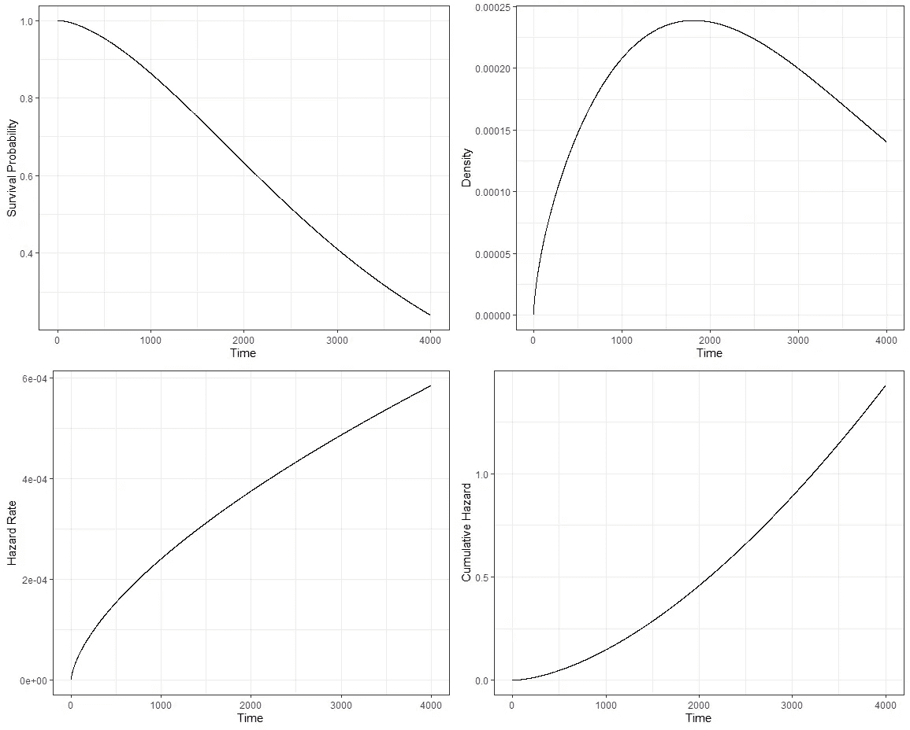

回到贝叶斯模型。下面你可以看到一个模型，在这个模型中，我试图按阶段对乳腺癌的生存概率进行建模。priors 也在这里。它们是来自具有均值和 sigma 的正态分布的样本，但是记住，结果的分布是威布尔分布！这意味着，尽管超参数将从正态分布进行 MCMC 采样，但参数必须符合威布尔模型。

```
fit_BRM_factor <- brms::brm(vit_stat_int | cens(vit_stat) ~ 
                              stadium, 
prior = c(
prior(normal(2.68e-06,0.033), class = Intercept), prior(normal(1.378,0.004), class = shape),
prior(normal(0,0.005),     class = b,  coef=stadium1A), prior(normal(0.255,0.078), class = b,  coef=stadium1B), prior(normal(0.634,0.206), class = b,  coef=stadium2A), prior(normal(0.634,0.206), class = b,  coef=stadium2B), prior(normal(0.618,0.328), class = b,  coef=stadium3A), prior(normal(0.618,0.328), class = b,  coef=stadium3B), prior(normal(0.618,0.328), class = b,  coef=stadium3C), prior(normal(0.618,0.328), class = b,  coef=stadium4),  prior(normal(0.618,0.328), class = b,  coef=stadiumM)),
                            data = df2c, 
                            family = weibull(),
                            sample_prior = TRUE,
                            chains = 4, 
                            cores = 6,
                            iter = 6000, 
                            warmup = 3000,
                            seed = 2)
```

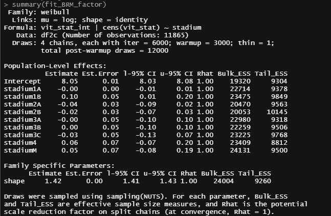

As you can see, the Weibull in BRMS has two parameters: mu and shape. The mu is the scale parameter, but it is on the log scale. Hence, why it is often transformed via an exponential to get it semi on the same scale as the shape parameter.

现在，在我们对模型做任何事情之前，让我们应用已经显示的威布尔函数，作为一种快速和粗略的方法，一次查看一个参数。

```
df<-weifun(1.378, exp(0.00000268))
g1<-ggplot(df, 
           aes(x=Time))+
  geom_line(aes(y=Survival))+
  theme_bw()+
  labs(x="Time", 
       y="Survival Probability", 
       col="Function")
g3<-ggplot(df, 
           aes(x=Time))+
  geom_line(aes(y=Hazard))+
  theme_bw()+
  labs(x="Time", 
       y="Hazard Rate", 
       col="Function")
g2<-ggplot(df, 
           aes(x=Time))+
  geom_line(aes(y=PDF))+
  theme_bw()+
  labs(x="Time", 
       y="Density")
g4<-ggplot(df, 
           aes(x=Time))+
  geom_line(aes(y=Cumulative))+
  theme_bw()+
  labs(x="Time", 
       y="Cumulative Hazard")
gridExtra::grid.arrange(g1,g2,g3,g4, ncol=2)
```

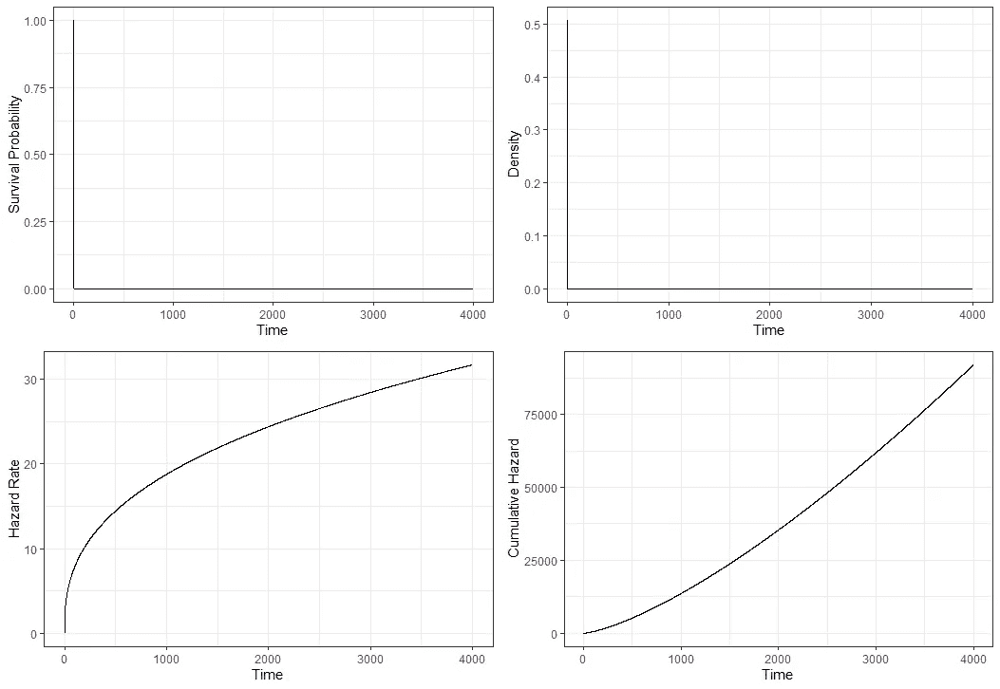

Does not make any sense.

使用之前的截距和形状，理论上可以得到体育场 0 的曲线。

```
table(df2c$stadium)
```


但是如果我们看看数据，这不是我所期望的，即使零组与其他组非常不同。

```
WeiSurv<-SurvRegCensCov::WeibullReg(Surv(vit_stat_int,vit_stat) ~ 
                               stadium,
                             data=df2)
SurvRegCensCov::WeibullDiag(Surv(vit_stat_int,vit_stat) ~ 
                              factor(stadium),
                            data = df2)
```

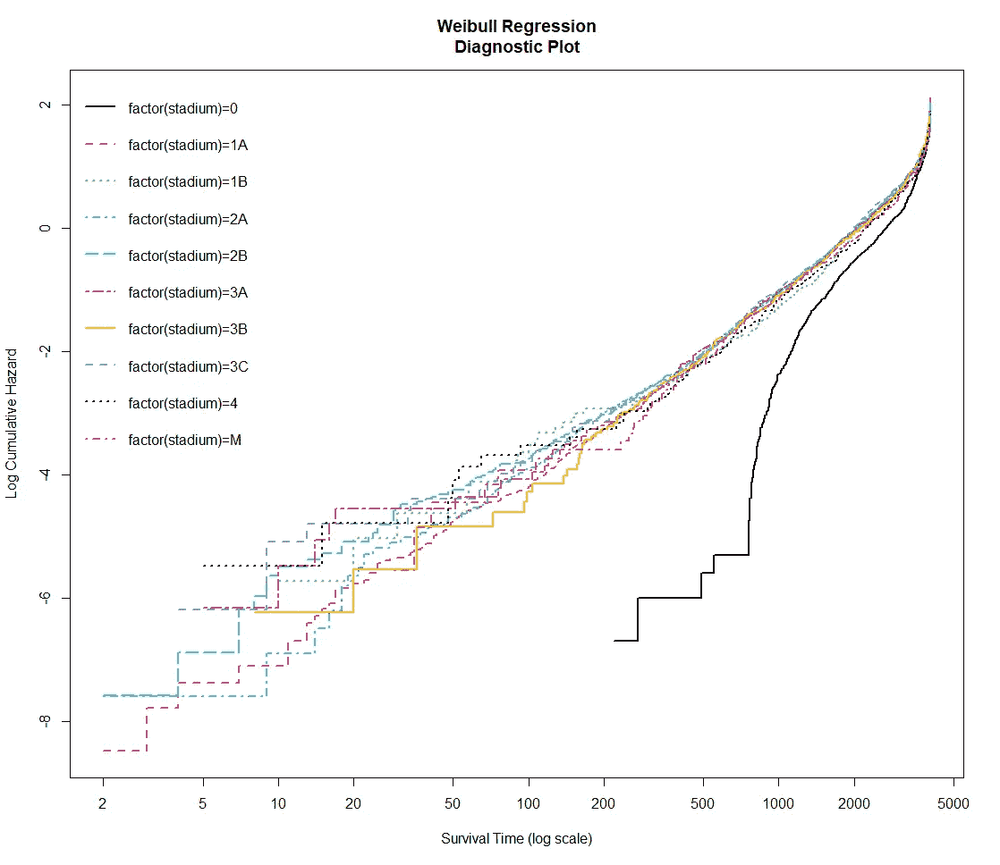

让我们使用 survreg 包中的比例和形状参数。这两个参数都需要进行指数运算，才能用于威布尔函数。

```
Model0 = survreg(DayOfEvent~stadium,
                 dist='weibull', 
                 data=df2)
summary(Model0)
df<-weifun(exp(-0.51232), exp(7.78644))
g1<-ggplot(df, 
           aes(x=Time))+
  geom_line(aes(y=Survival))+
  theme_bw()+
  labs(x="Time", 
       y="Survival Probability", 
       col="Function")
g3<-ggplot(df, 
           aes(x=Time))+
  geom_line(aes(y=Hazard))+
  theme_bw()+
  labs(x="Time", 
       y="Hazard Rate", 
       col="Function")
g2<-ggplot(df, 
           aes(x=Time))+
  geom_line(aes(y=PDF))+
  theme_bw()+
  labs(x="Time", 
       y="Density")
g4<-ggplot(df, 
           aes(x=Time))+
  geom_line(aes(y=Cumulative))+
  theme_bw()+
  labs(x="Time", 
       y="Cumulative Hazard")
gridExtra::grid.arrange(g1,g2,g3,g4, ncol=2)
```

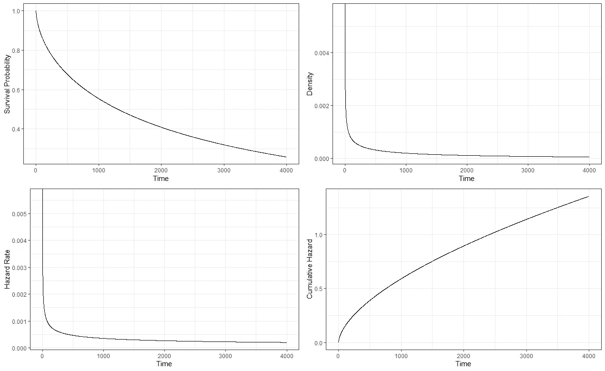

This looks more like it. For sure, my own prior does not make sense in the least.

让我们更深入地研究我用过的先验知识。就像后验一样，我们也可以从先验中取样。记住，它们是发行版。

```
priorsamps<-prior_draws(fit_BRM_factor)
priorsamps
```

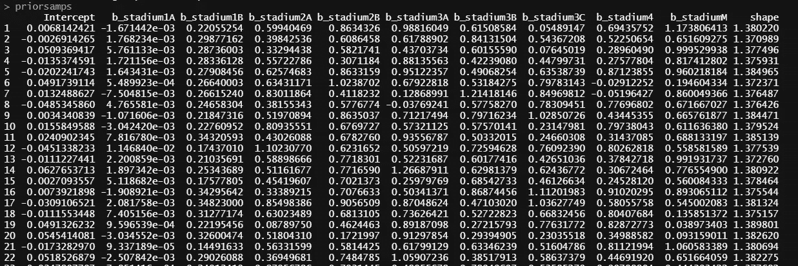

Here you can all the samples coming from the prior. This is not rocket science and I would not have needed the Bayesian model to sample from the prior. I could have done so by using the built-in R functions that allow me to sample from distributions like the Normal.

但不管怎样，让我们努力吧。我将从截距开始，并将其转换为进一步建模所需的比例。

```
prior_draws(fit_BRM_factor)%>%
  dplyr::mutate_at(vars(Intercept), exp) %>%
  ggplot(aes(x = Intercept, y = shape)) +
  geom_point(alpha = 0.1) +
  geom_density_2d(colour = "red", size = 1) +
  xlab("Scale") +
  ylab("Shape") +
  ggtitle("Priors(shape, scale)") +
  theme_bw()
```

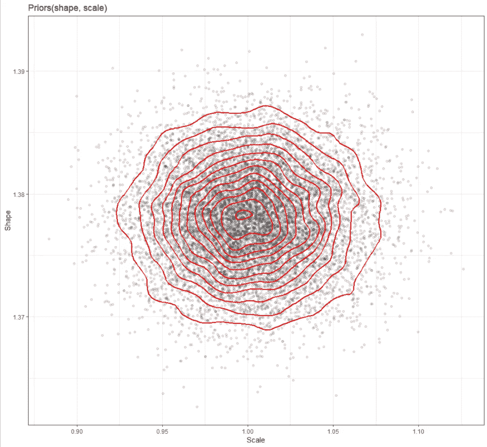

A shape and a scale, nicely sampled.

让我们应用这个形状和尺度来得到 0 期乳腺癌的生存概率。

```
df<-weifun(1.378, exp(8))
g1<-ggplot(df, 
           aes(x=Time))+
  geom_line(aes(y=Survival))+
  theme_bw()+
  labs(x="Time", 
       y="Survival Probability", 
       col="Function")
g3<-ggplot(df, 
           aes(x=Time))+
  geom_line(aes(y=Hazard))+
  theme_bw()+
  labs(x="Time", 
       y="Hazard Rate", 
       col="Function")
g2<-ggplot(df, 
           aes(x=Time))+
  geom_line(aes(y=PDF))+
  theme_bw()+
  labs(x="Time", 
       y="Density")
g4<-ggplot(df, 
           aes(x=Time))+
  geom_line(aes(y=Cumulative))+
  theme_bw()+
  labs(x="Time", 
       y="Cumulative Hazard")
gridExtra::grid.arrange(g1,g2,g3,g4, ncol=2)
```

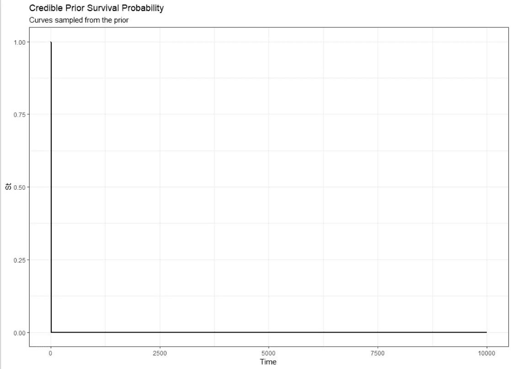

Not good. that looks like nothing compared to what I have seen in the data. Now, the prior does not have to be exactly like the data, but at the very least one would expect a survival curve. This looks like instant death.

从几篇论文中，我发现了不同的威布尔形状和尺度。形状和比例的最佳选择基于数据与现在使用的数据的相似程度。由于这是合成数据，这是一个很难确定的机器人。还因为合成数据更加密集并且是在更长的时间内积累的。但是，出于探索的目的，让我们看看那些其他参数，并评估概率曲线。

```
df1<-weifun(1.0633, 8.1270)
df1$Model  = paste("Shape", df1$Shape, "Scale", df1$Scale)df2<-weifun(1.067, 28.39)
df2$Model    = paste("Shape", df2$Shape, "Scale", df2$Scale)df3<-weifun(0.932 , 8.525)
df3$Model   = paste("Shape", df3$Shape, "Scale", df3$Scale)combined<-rbind(df1,df2,df3)g1<-ggplot(combined, 
           aes(x=Time))+
  geom_line(aes(y=Survival, color=Model), size=1)+
  theme_bw()+
  labs(x="Time", 
       y="Survival Probability", 
       col="Function")+
  theme(legend.position = "bottom")
g3<-ggplot(combined, 
           aes(x=Time))+
  geom_line(aes(y=Hazard, color=Model), size=1)+
  theme_bw()+
  labs(x="Time", 
       y="Hazard Rate", 
       col="Function")+
  theme(legend.position = "bottom")
g2<-ggplot(combined, 
           aes(x=Time))+
  geom_line(aes(y=PDF, color=Model), size=1)+
  theme_bw()+
  labs(x="Time", 
       y="Density")+
  theme(legend.position = "bottom")
g4<-ggplot(combined, 
           aes(x=Time))+
  geom_line(aes(y=Cumulative, color=Model), size=1)+
  theme_bw()+
  labs(x="Time", 
       y="Cumulative Hazard")+
  theme(legend.position = "bottom")
```

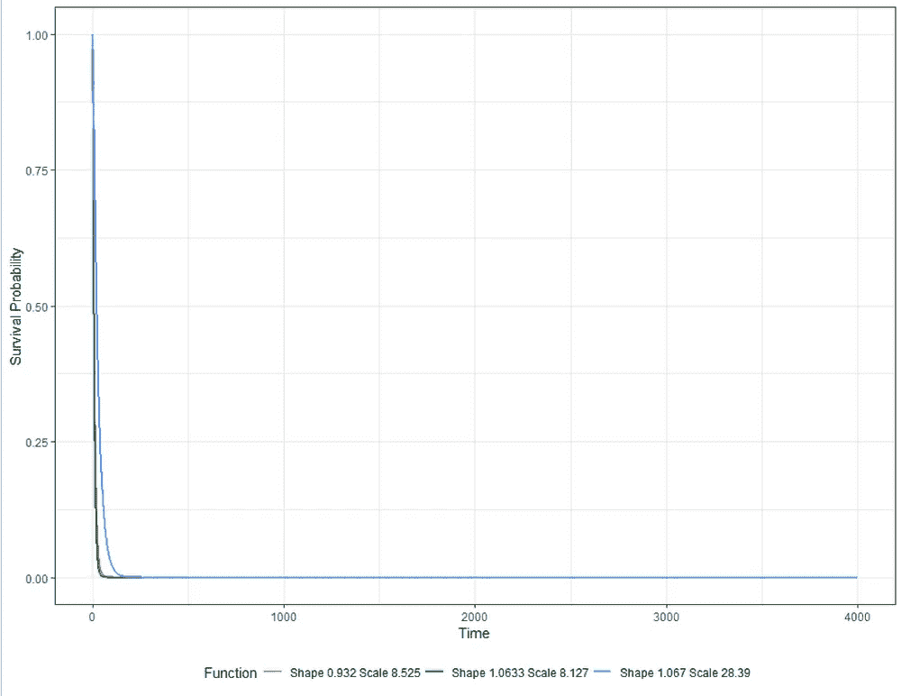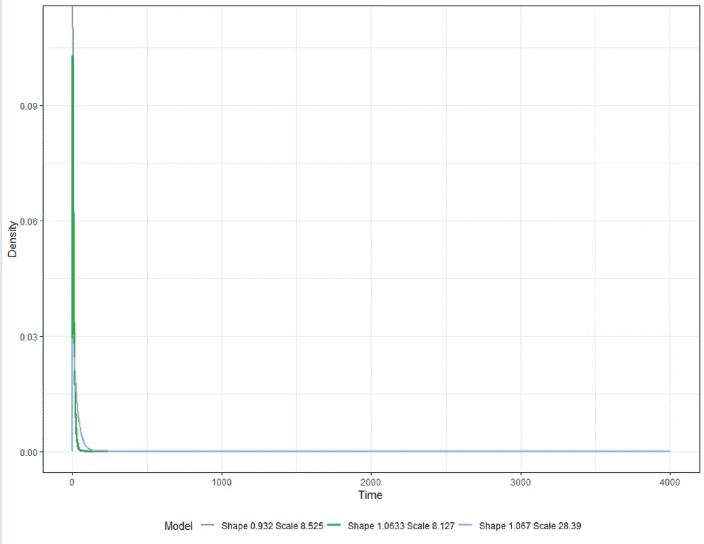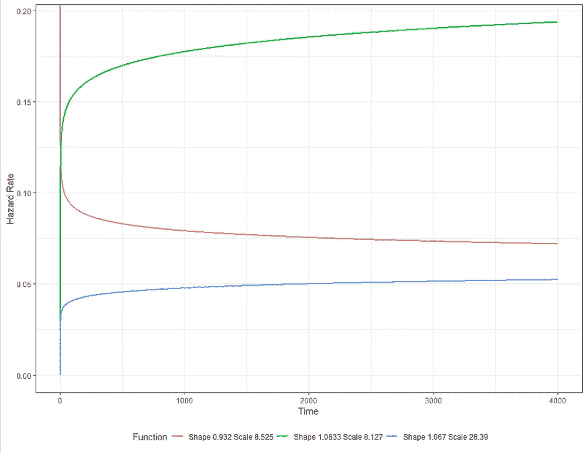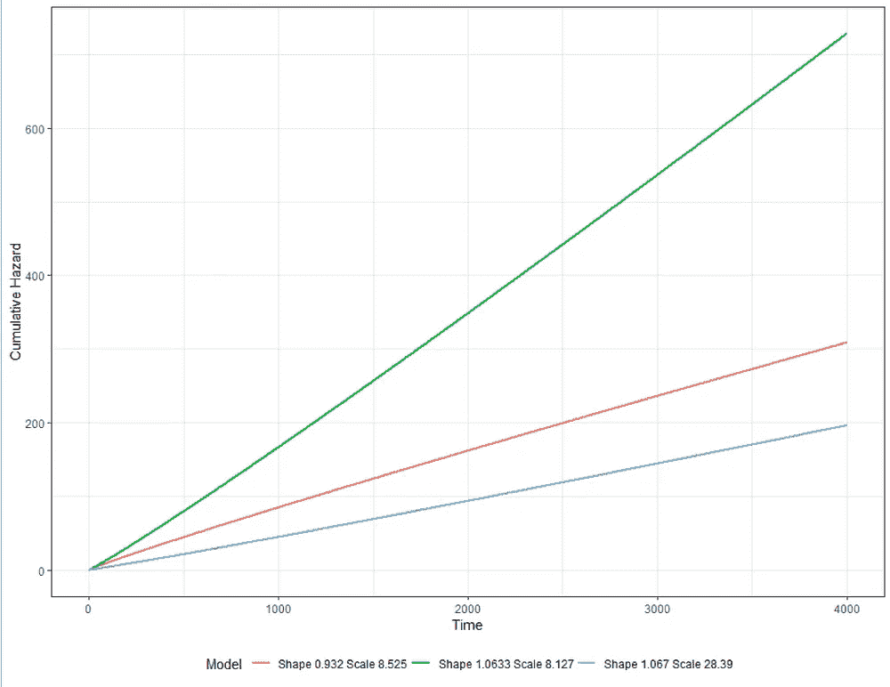

Not much better, the shape and scale of the Weibull used here do not amount to where I need to go.

现在，我发现了一件事(这也会发生在你身上),那就是超参数的参数化会发生变化。从威布尔模型构建生存概率有不同的方法，而且并不总是清楚参数是以什么尺度构建的(对数，指数)。因此，让我们将指数函数应用于比例部分。

```
df1<-weifun(1.0633, exp(8.1270))
df1$Model  = paste("Shape", df1$Shape, "Scale", df1$Scale)df2<-weifun(1.067, exp(28.39))
df2$Model    = paste("Shape", df2$Shape, "Scale", df2$Scale)df3<-weifun(0.932 , exp(8.525))
df3$Model   = paste("Shape", df3$Shape, "Scale", df3$Scale)
combined<-rbind(df1,df2,df3)g1<-ggplot(combined, 
           aes(x=Time))+
  geom_line(aes(y=Survival, color=Model), size=1)+
  theme_bw()+
  labs(x="Time", 
       y="Survival Probability", 
       col="Function")+
  theme(legend.position = "none")
g3<-ggplot(combined, 
           aes(x=Time))+
  geom_line(aes(y=Hazard, color=Model), size=1)+
  theme_bw()+
  labs(x="Time", 
       y="Hazard Rate", 
       col="Function")+
  theme(legend.position = "none")
g2<-ggplot(combined, 
           aes(x=Time))+
  geom_line(aes(y=PDF, color=Model), size=1)+
  theme_bw()+
  labs(x="Time", 
       y="Density")+
  theme(legend.position = "none")
g4<-ggplot(combined, 
           aes(x=Time))+
  geom_line(aes(y=Cumulative, color=Model), size=1)+
  theme_bw()+
  labs(x="Time", 
       y="Cumulative Hazard")+
  theme(legend.position = "none")
gridExtra::grid.arrange(g1,g2,g3,g4, ncol=2)
```

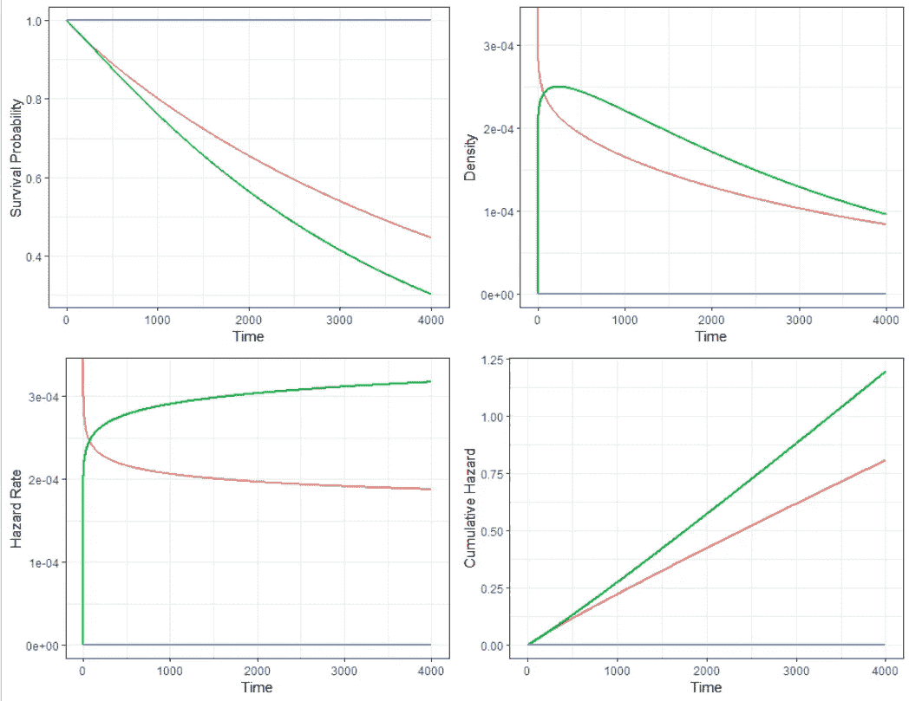

Looking much much better!

现在，让我们应用形状(1.0633)和比例(8.1270)的第一个组合，将其应用于模型，然后从先前的样本(你会看到它会有相同的曲线如上)。

```
fit_BRM_factor <- brms::brm(bf(vit_stat_int | cens(vit_stat) ~ 
                              stadium,
                            family = weibull()),
prior = c(
prior(normal(8.1270,0.405), class = Intercept),
prior(normal(1.0633,0.004), class = shape),
prior(normal(0,0.005),      class = b,  coef=stadium1A), 
prior(normal(0.255,0.078),  class = b,  coef=stadium1B), 
prior(normal(0.634,0.206),  class = b,  coef=stadium2A), 
prior(normal(0.634,0.206),  class = b,  coef=stadium2B), 
prior(normal(0.618,0.328),  class = b,  coef=stadium3A), 
prior(normal(0.618,0.328),  class = b,  coef=stadium3B), 
prior(normal(0.618,0.328),  class = b,  coef=stadium3C), 
prior(normal(0.618,0.328),  class = b,  coef=stadium4),
prior(normal(0.618,0.328),  class = b,  coef=stadiumM)),
                            data = df2c, 
                            family = weibull(),
                            sample_prior = TRUE,
                            chains = 4, 
                            cores = 6,
                            iter = 6000, 
                            warmup = 3000,
                            seed = 2)
reps=1000
prior_draws(fit_BRM_factor) %>%
  dplyr::rename("mu" = Intercept)%>%
  mutate(scale = exp(mu) / (gamma(1 + 1 / shape))) %>%
  dplyr::select(shape, scale)%>%
  dplyr::slice_head(n = reps)%>%
  dplyr::mutate(plotted_y_data = 
                  purrr::map2(
                    shape, scale,
                    ~ tibble::tibble(
                      t = seq(0, 10000, length.out = 1000)))) %>%
  tidyr::unnest(plotted_y_data) %>%
  mutate(model = "Prior Model", 
         h   = shape/scale*(t/scale)^(shape-1),
         cdf = 1-exp(1)^-(t/scale)^shape,
         pdf = shape/scale*(t/scale)^(shape-1)*exp(1)^-(t/scale)^shape,
         St  = 1 - cdf,
         c  = -log(St))%>%
  ggplot(., aes(x=t)) +
  geom_line(aes(y=St, group=(scale)),alpha = 0.2, size = 1) +
  labs(
    x = "Time",
    y = "St",
    title = "Credible Prior Survival Probability",
    subtitle = "Curves sampled from the prior") +
  scale_color_viridis_d(end = .8) +
  theme_bw()+
  theme(legend.position = "none")
```


Looking good! Quite some spread, but that is fine.

让我们使用威布尔函数再次检查。

```
weifun<-function(shape,scale){
  t   = seq(0,10000,1) 
  h   = shape/scale*(t/scale)^(shape-1)
  cdf = 1-exp(1)^-(t/scale)^shape
  pdf = shape/scale*(t/scale)^(shape-1)*exp(1)^-(t/scale)^shape
  St  = 1 - cdf
  h2 = pdf/St
  c   = (t/scale)^shape
  dataFrame <- as.data.frame(do.call(cbind, 
                                     list(t,shape,scale,h,h2,cdf,
                                          pdf,St,c)))
  colnames(dataFrame)<-c("Time","Shape",  
                         "Scale","Hazard","Hazard2","CDF","PDF","Survival", "Cumulative")
  return(dataFrame)}
df1<-weifun(1.0633, exp(8.1270)); df1$Model  = paste("Shape", df1$Shape, "Scale", df1$Scale)
ggplot(df1, 
       aes(x=Time))+
  geom_line(aes(y=Survival, color=Model), size=1)+
  theme_bw()+
  labs(x="Time", 
       y="Survival Probability", 
       col="Function")+
  theme(legend.position = "none")+
  xlim(0,10000)+
  ylim(0,1)
```

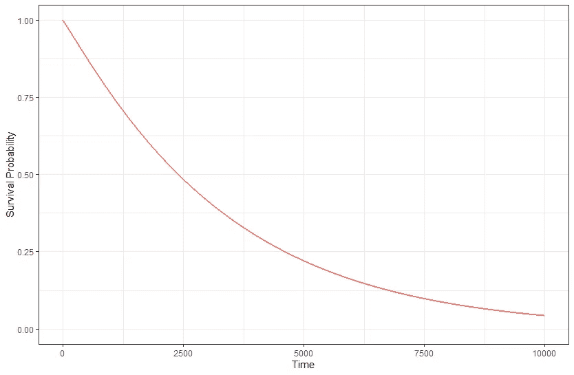

Looking good as well. At least, the function, but the prior has a much more accelerate decline than the data is showing us.

我们可以把频率主义者和贝叶斯模型放在一起。我现在要做的是，在阶段=0 的贝叶斯模型上绘制总生存曲线。

```
surv_obs = fortify(survfit(Surv(vit_stat_int,vit_stat) ~ 
                             1,
                           data = df2c)) %>% 
  dplyr::select(tstart=time, surv) %>% 
  tibble::add_case(tstart = 0, 
                   surv = 1)
reps=100
prior_draws(fit_BRM_factor) %>%
  dplyr::rename("mu" = Intercept)%>%
  mutate(scale = exp(mu) / (gamma(1 + 1 / shape))) %>%
  dplyr::select(shape, scale)%>%
  dplyr::slice_head(n = reps)%>%
  dplyr::mutate(plotted_y_data = 
                  purrr::map2(
                    shape, scale,
                    ~ tibble::tibble(
                      t = seq(0, 10000, length.out = 1000)))) %>%
  tidyr::unnest(plotted_y_data) %>%
  mutate(model = " OS [Baseline Weibull]", 
         h   = shape/scale*(t/scale)^(shape-1),
         cdf = 1-exp(1)^-(t/scale)^shape,
         pdf = shape/scale*(t/scale)^(shape-1)*exp(1)^-(t/scale)^shape,
         St  = 1 - cdf,
         c  = -log(St))%>%
  ggplot(., aes(x=t)) +
  geom_line(aes(y=St, group=as.factor(scale)), col="black", alpha=0.4) +
  geom_line(data = surv_obs, aes(x=tstart, y=surv), col="red")+
  labs(
    x = "Time",
    y = "St",
    title = "Credible Prior Survival Probability",
    col= "Model",
    subtitle = "Curves sampled from the Prior and the Likelihood") +
  scale_color_viridis_d(end = .8) +
  theme_bw()+
  theme(legend.position = "bottom")
```

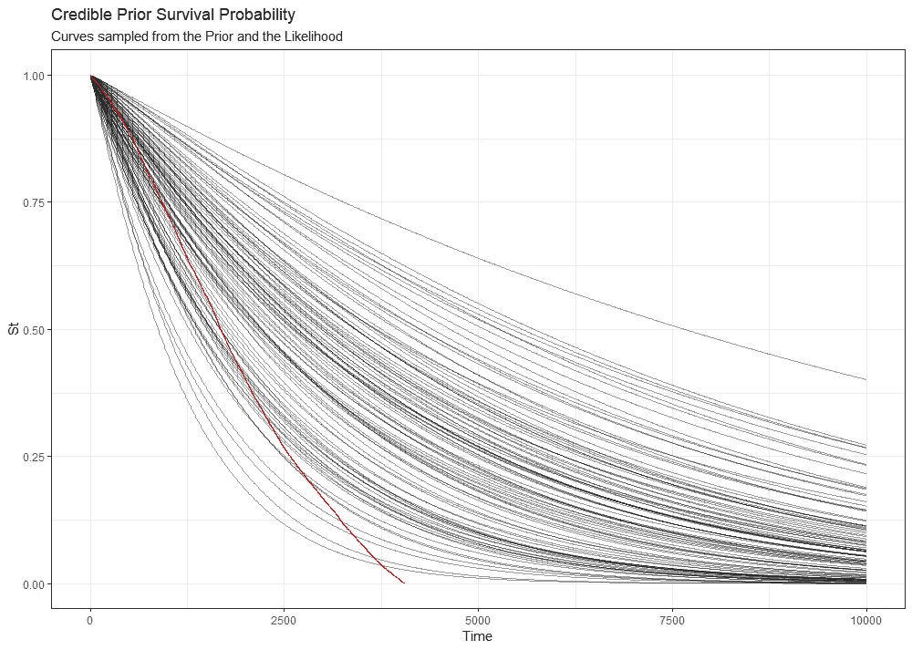

Not that bad, but I am not really interested in the overal survival plot.

我们可以做同样的事情，但是对两种类型的模型都只使用 stage=0。这更符合我们的关注点。你会看到 stage=0 曲线有一些奇特的属性，至少可以这么说。

```
df2d<-df2c%>%dplyr::filter(stadium=="0")surv_obs = fortify(survfit(Surv(vit_stat_int,vit_stat) ~ 
                             1,
                           data = df2d)) %>% 
  dplyr::select(tstart=time, surv) %>% 
  tibble::add_case(tstart = 0, 
                   surv = 1)reps=100
prior_draws(fit_BRM_factor) %>%
  dplyr::rename("mu" = Intercept)%>%
  mutate(scale = exp(mu) / (gamma(1 + 1 / shape))) %>%
  dplyr::select(shape, scale)%>%
  dplyr::slice_head(n = reps)%>%
  dplyr::mutate(plotted_y_data = 
                  purrr::map2(
                    shape, scale,
                    ~ tibble::tibble(
                      t = seq(0, 10000, length.out = 1000)))) %>%
  tidyr::unnest(plotted_y_data) %>%
  mutate(model = " OS [Baseline Weibull]", 
         h   = shape/scale*(t/scale)^(shape-1),
         cdf = 1-exp(1)^-(t/scale)^shape,
         pdf = shape/scale*(t/scale)^(shape-1)*exp(1)^-(t/scale)^shape,
         St  = 1 - cdf,
         c  = -log(St))%>%
  ggplot(., aes(x=t)) +
  geom_line(aes(y=St, group=as.factor(scale)), col="black", alpha=0.4) +
  geom_line(data = surv_obs, aes(x=tstart, y=surv), col="red")+
  labs(
    x = "Time",
    y = "St",
    title = "Credible Prior Survival Probability",
    col= "Model",
    subtitle = "Curves sampled from the Prior and the Likelihood") +
  scale_color_viridis_d(end = .8) +
  theme_bw()+
  theme(legend.position = "bottom")
```

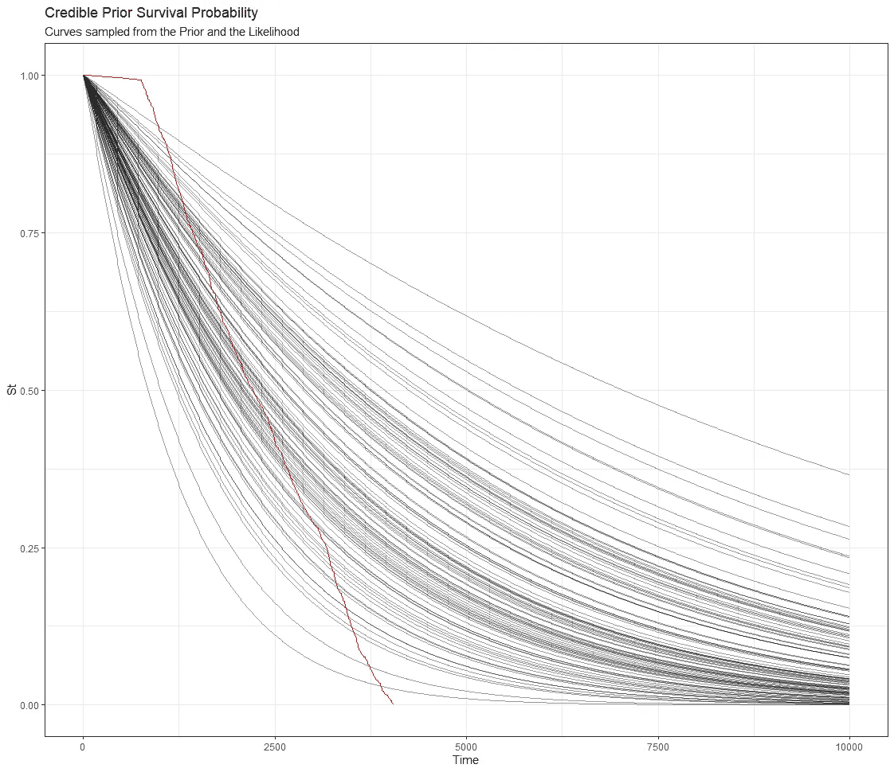

This time, the Weibull models do not look that strange anymore, and what we have is quite a strange dataset to say the least. We already saw this [here](/dev-genius/going-beyond-the-cox-8503b6d358b6).

从上面可以看到，stage=0 组有一个非常奇怪的生存概率曲线。它开始平淡，然后采取了严重的跳水。我们将在后面看到这种奇怪的俯冲将如何导致非常奇怪的行为。我们也将看到如何从其他数据调谐先验永远无法适应这个数据。要构建这样的曲线，双参数模型是不够的。

然而，我们能做的是让威布尔模型为每一个阶段提供单独的形状和比例参数。它仍然是一个双参数分布，但也许我们可以更好地确定数据。

对于那些拥有慢速电脑的人(我的是第 11 代 i7–11800h)，这可能需要相当长的时间才能工作。尤其是如果你一开始就不交出前科。

```
fit_BRM_factor <- brms::brm(bf(vit_stat_int | cens(vit_stat) ~  
                            stadium,
                            shape ~ stadium,
                            family = weibull()),
                            data = df2c,
                            sample_prior = TRUE, 
                            chains = 4, 
                            cores = 6,
                            iter = 4000, 
                            warmup = 2000,
                            seed = 2)df2d<-df2c%>%dplyr::filter(stadium=="0")
surv_obs = fortify(survfit(Surv(vit_stat_int,vit_stat) ~ 
                             1,
                           data = df2d)) %>% 
  dplyr::select(tstart=time, surv) %>% 
  tibble::add_case(tstart = 0, 
                   surv = 1)reps=100
prior_draws(fit_BRM_factor) %>%
  dplyr::rename("mu" = b_Intercept)%>%
  mutate(scale = exp(mu) / (gamma(1 + 1 / b_shape_Intercept)), 
         shape = b_shape_Intercept) %>%
  dplyr::select(shape, scale)%>%
  dplyr::slice_head(n = reps)%>%
  dplyr::mutate(plotted_y_data = 
                  purrr::map2(
                    shape, scale,
                    ~ tibble::tibble(
                      t = seq(0, 10000, length.out = 1000)))) %>%
  tidyr::unnest(plotted_y_data) %>%
  mutate(model = " OS [Baseline Weibull]", 
         h   = shape/scale*(t/scale)^(shape-1),
         cdf = 1-exp(1)^-(t/scale)^shape,
         pdf = shape/scale*(t/scale)^(shape-1)*exp(1)^-(t/scale)^shape,
         St  = 1 - cdf,
         c  = -log(St))%>%
  ggplot(., aes(x=t)) +
  geom_line(aes(y=St, group=as.factor(scale)), col="black", alpha=0.4) +
  geom_line(data = surv_obs, aes(x=tstart, y=surv), col="red")+
  labs(
    x = "Time",
    y = "St",
    title = "Credible Likelihood Survival Probability",
    col= "Model",
    subtitle = "Curves sampled from the Likelihood of BRMS and Survreg") +
  scale_color_viridis_d(end = .8) +
  theme_bw()+
  theme(legend.position = "bottom")
```

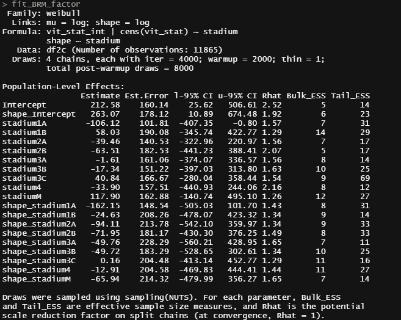

As you can see, a different shape and scale per stage.

由于 stage=0 是参考虚拟对象，我可以使用 Intercept 和 shape_Intercept 的先验知识作为开始。如果我绘制贝叶斯可信区间(CI)和*生存概率*,那么下图就是我得到的结果。

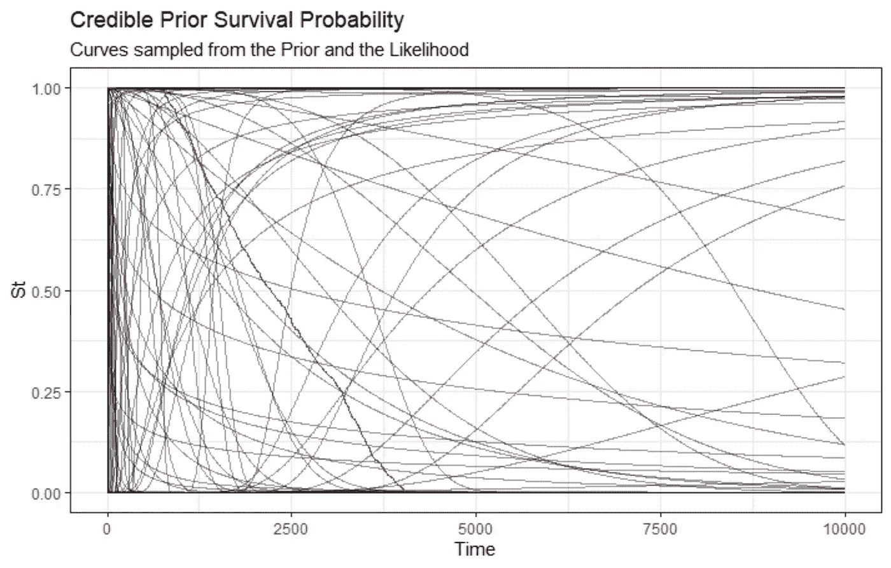

The priors are all over the place!

请记住，我还没有具体说明任何真正的前科。我在这里所做的是所谓的经验贝叶斯的一个例子，在这个例子中，我以一种频繁的方式从数据中估计后验概率。这是不可靠的，因为数据现在构成了先验和可能性，模型变成了一种自我实现的预言。从 stage=0 的先验数据判断，这些数据并没有真正的帮助。

让我们用一些信息丰富的先验知识来扩充这个模型。并且看一看它们是否真的是信息丰富的(它们是信息丰富的，但是它们与之前通过经验贝叶斯发现的参数有很大的不同)。我预计结果将与我之前看到的大不相同。

```
fit_BRM_factor <- brms::brm(bf(vit_stat_int | cens(vit_stat) ~ 
                                 stadium,
                               shape~stadium,
                               family = weibull()),
prior = c(
prior(normal(8.1270,0.405), class = Intercept),
prior(normal(1.0633,0.045), class = Intercept, dpar=shape),
prior(normal(0,0.005),      class = b,  coef=stadium1A), 
prior(normal(0.255,0.078),  class = b,  coef=stadium1B), 
prior(normal(0.634,0.206),  class = b,  coef=stadium2A), 
prior(normal(0.634,0.206),  class = b,  coef=stadium2B), prior(normal(0.618,0.328),  class = b,  coef=stadium3A), 
prior(normal(0.618,0.328),  class = b,  coef=stadium3B),
prior(normal(0.618,0.328),  class = b,  coef=stadium3C), 
prior(normal(0.618,0.328),  class = b,  coef=stadium4),
prior(normal(0.618,0.328),  class = b,  coef=stadiumM)),
                            data = df2c, 
                            family = weibull(),
                            sample_prior = TRUE,
                            chains = 4, 
                            cores = 6,
                            iter = 6000, 
                            warmup = 3000,
                            seed = 2)
```

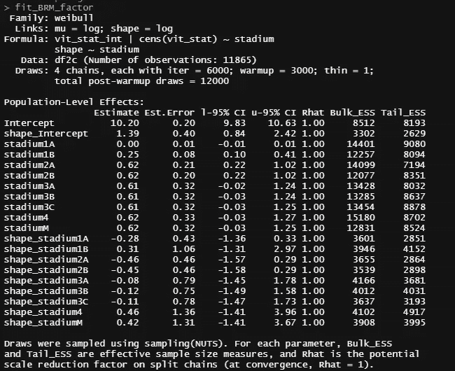

This is heavily different from what we have seen in the previous summary, using Emperical Bayes.

让我们取 stage=0 的标度和形状，因为它们是对数标度，所以对它们进行转换，并在威布尔函数中绘制它们。

```
df<-weifun(exp(1.39), exp(10.20))
```

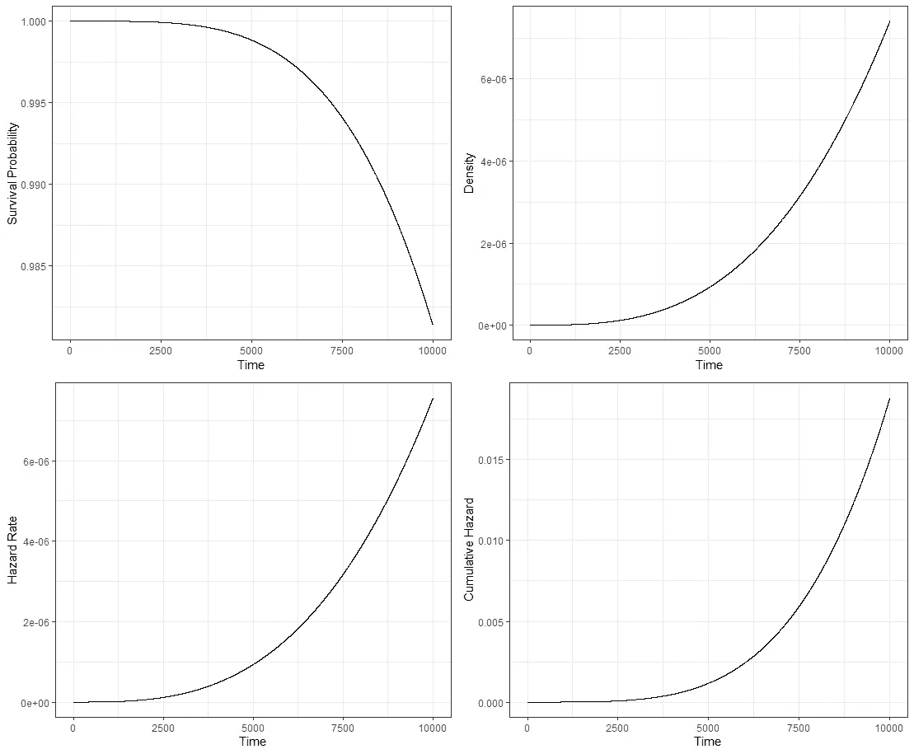

It seems the parameters take the first part of the survival curve, which sloooowly decreases, but it does not take the instant decrease that follows after a number of days. Hence, the Weibull does not mimic the data in the least.

如果我画出一个函数，在这个函数中，我保持形状不取指数，并对比例取指数，生存概率看起来像这样。


This looks more like what I would expect, but then I am not sure why **brms** places both parameters on the log scale in their initial output.

不模拟数据的先验不一定是问题，但它确实给了思考的空间。其实你需要深思，因为强烈的偏离也会需要强烈的防守。老实说，我现在没有，除了我从报纸上看到的前科。

让我们看看之前从模型中得出的结论。我将保持比例的非指数化，因为这没有什么意义。

```
reps=100
prior_draws(fit_BRM_factor) %>%
  dplyr::rename("mu" = Intercept)%>%
  dplyr::rename("shape" = Intercept_shape)%>%
  mutate(stage0 = exp(mu),
         stage1A = exp(mu + b_stadium1A),
         stage1B = exp(mu + b_stadium1B),
         stage2A = exp(mu + b_stadium2A),
         stage2B = exp(mu + b_stadium2B),
         stage3A = exp(mu + b_stadium3A),
         stage3B = exp(mu + b_stadium3B),
         stage3C = exp(mu + b_stadium3C),
         stage4  = exp(mu + b_stadium4),
         stageM  = exp(mu + b_stadiumM)) %>%
  dplyr::select(shape, stage0, stage1A,
                stage1B,stage2A,stage2B,stage3A,
                stage3B,stage3C,stage4,stageM)%>%
  dplyr::slice_head(n = reps)%>%
  tidyr::pivot_longer(!shape, names_to="Stage", values_to = "scale")%>% 
  dplyr::mutate(plotted_y_data = 
                  purrr::map2(
                    shape,scale,
                    ~ tibble::tibble(
                      t = seq(0, 10000, length.out = 1000)))) %>%
  tidyr::unnest(plotted_y_data) %>%
  dplyr::group_by(Stage)%>%
  mutate(model    = "OS [Weibull]", 
         h   = shape/scale*(t/scale)^(shape-1),
         cdf = 1-exp(1)^-(t/scale)^shape,
         pdf = shape/scale*(t/scale)^(shape-1)*exp(1)^-(t/scale)^shape,
         St  = 1 - cdf,
         c  = -log(St))%>%
  ggplot(., aes(x=t, y=St,
                group=shape,
                color=as.factor(Stage))) +
  geom_line(alpha=0.3) +
  labs(
    x = "Time",
    y = "Survival Probability",
    title = "Credible Prior Survival Probability",
    subtitle = "Curves sampled from the prior",
    col="Treatment") +
  theme_bw()+
  facet_wrap(~Stage, ncol=2)
```

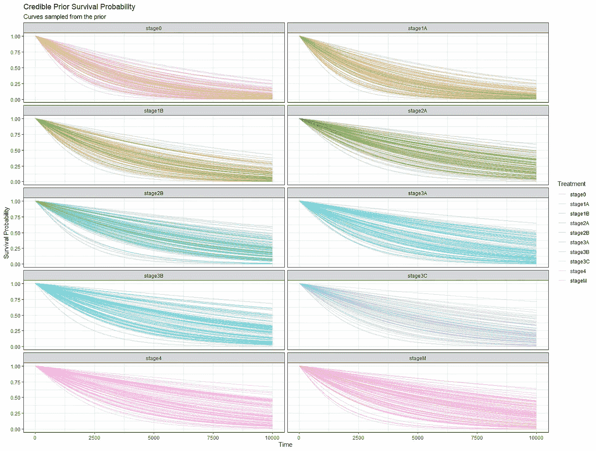

And here we have the output. You do see a difference per stage, but it is not crystal clear.

如果你看看数据，也许这是可以预料的。正如您所看到的，只有 stage=0 是奇怪的(奇怪的意思是，它确实与其他的有很大的不同！)


我暂时就说到这里。检查先验知识的适用性并不是一个纯粹的数学过程。它涉及批判性思维、评估和大量的绘图和取样。从理论上讲，你的先验总是在某种程度上不同于你的可能性，这就是贝叶斯更新的本质。

如果我遗漏了什么，或者有错误，请告诉我！

[](/mlearning-ai/mlearning-ai-submission-suggestions-b51e2b130bfb) [## Mlearning.ai 提交建议

### 如何成为 Mlearning.ai 上的作家

medium.com](/mlearning-ai/mlearning-ai-submission-suggestions-b51e2b130bfb)