# 使用β-二项式分布计算样本量

> 原文：<https://medium.com/mlearning-ai/sample-size-calculation-using-the-beta-binomial-distribution-7adca91035a9?source=collection_archive---------1----------------------->

下面这篇文章的目的是向你展示我是如何满足一项研究的要求的，在这项研究中，一项干预措施将导致活产小猪增加 3%。现在，我在这个项目中遇到的挑战，也是我想与你们分享的，是模拟一群母猪，然后预测出生的小猪数量(活的或静止的)需要一个混合分布。在这种情况下，[贝塔-二项式](https://en.wikipedia.org/wiki/Beta-binomial_distribution)。

贝塔二项分布是由贝塔部分和二项部分组成的。二项式部分是最直接的，因为它用于计算比例和概率。给定一个已知的二项式分布，我们可以从出生的小猪样本中估计出活产婴儿的比例。然而，这种分布在母猪之间是变化的，所以存在差异。为了解释这种差异，我们假设一个贝塔分布。最后，我们将得到一个从贝塔抽样的二项式分布。

让我们完成这个项目，让我们正确看待以上问题。代码通过 SAS 提供，但是当然可以通过任何编程语言运行。我不能分享数据集，因为它是商业的。相反，你可以使用下面的[博客文章](https://blogs.sas.com/content/iml/2017/11/20/simulate-beta-binomial-sas.html)来模拟贝塔二项分布的数据。正如你所看到的，这是我手头的数据集和项目的一部分。

需要记住的是，我使用不同的数据集来模拟一个采用新处理方法的新数据集。

让我们开始吧。

Code to import the data, and run simple distribution graphs.

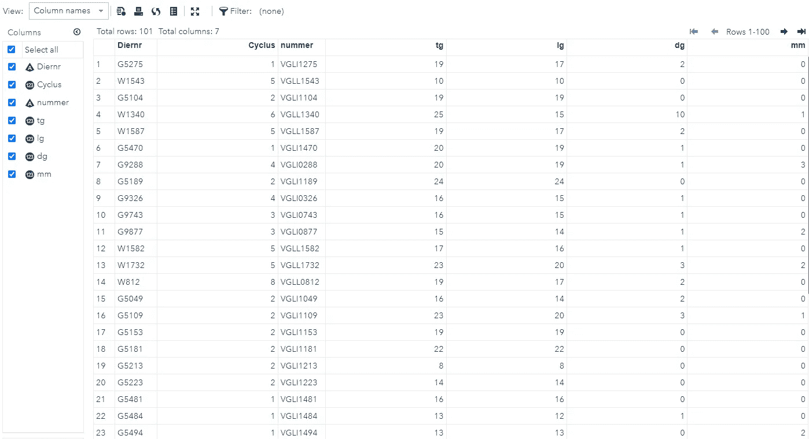

Per sow we have TG (total born), LG (life birth) and DG (still birth).

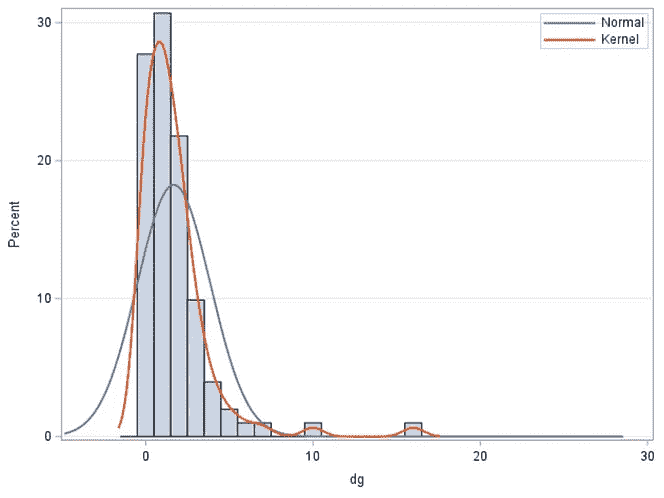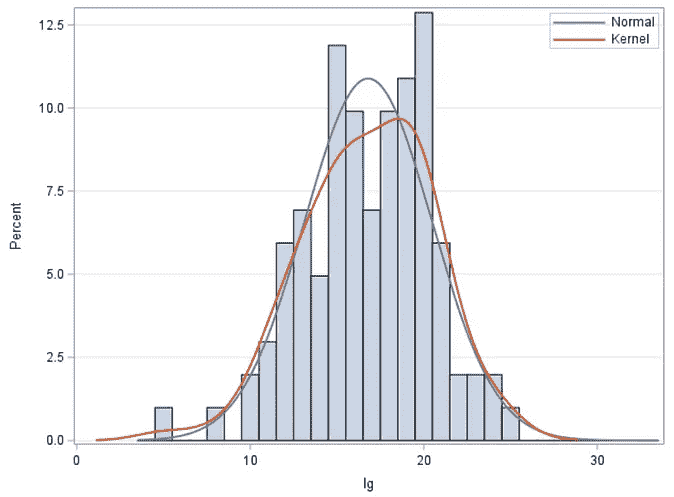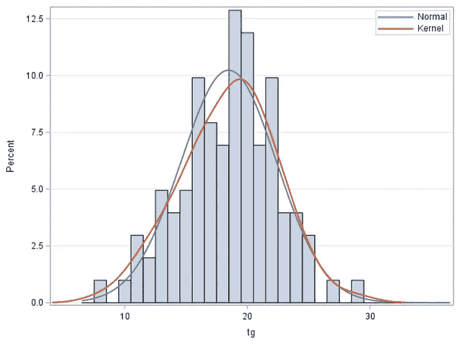

The distribution of still birth mimics a Poisson distribution whereas both life birth and total born look like they could be modeled using a normal distribution. However, since the values are discrete, a normal distribution can never be appropriate as it will underestimate the standard errors of any estimates provided.

现在，让我们看看总出生数、活产数或死产数的比例(这里我用的是平均值)。人们可以看到 1/10 的小猪仍然出生，不管你如何看待时间上的数据。记住，我们的目标是增加 3%的活产婴儿。

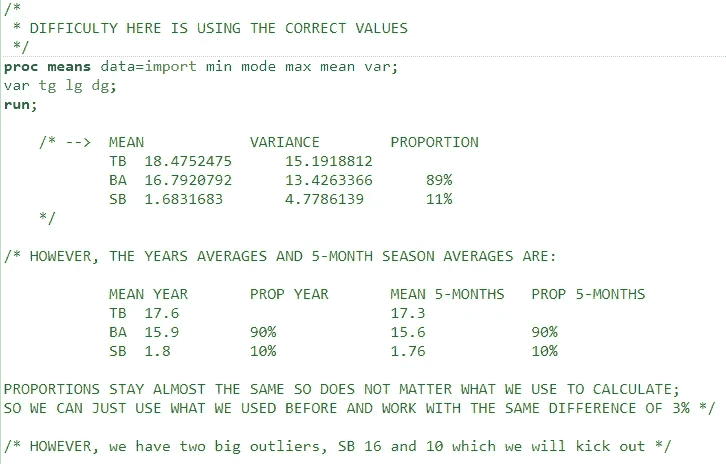

在去除一些异常值和没有意义的值后，我再看一下这个比例，现在看起来大约是 1/11 的小猪出生时是静止的。

在该数据集中，每次治疗的出生存活比率相差约 6%。当然，计算是不合理的，因为我使用的是平均值，而不是实际比例。该数据集中死胎的比例和方差分别为 7.5%和 0.5%。

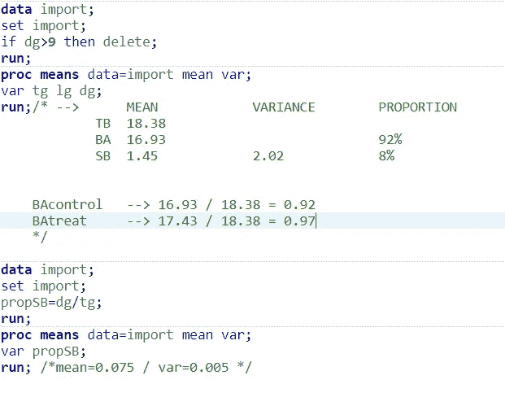

Pre-calculations to make some sense of the proportion and variance of each of the important categories necessary for the simulation: born, born alive, and still birth.

现在我知道了出生的、活产的或死产的小猪的平均数，我需要找到一种方法来估计构成β分布的α和β值。SAS 有一些内置的公式可以帮助估计。

Code to use [**PROC UNIVARIATE**](https://stats.idre.ucla.edu/sas/output/proc-univariate/)and estimate the fit of a beta distribution for still birth (DG).

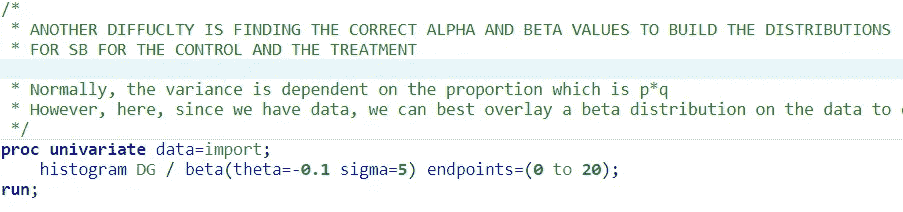

Code is quite simple.

First try did not go as planned. Luckily, SAS also provides us with values that would be more plausible, so lets try it again.

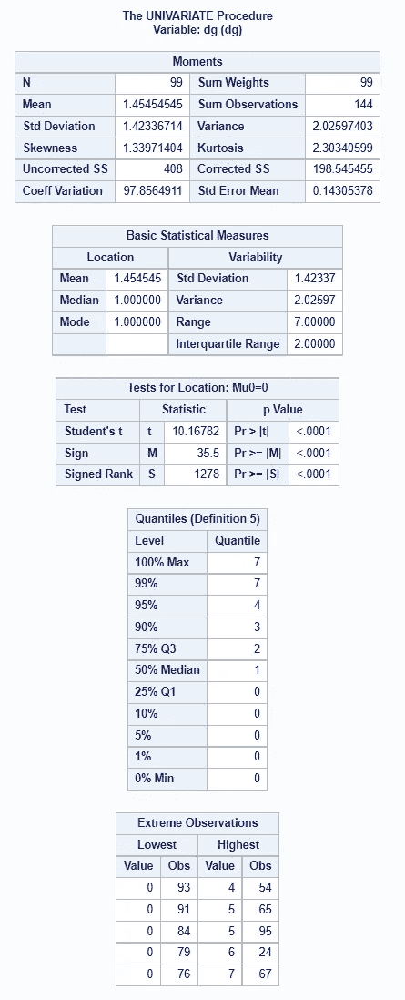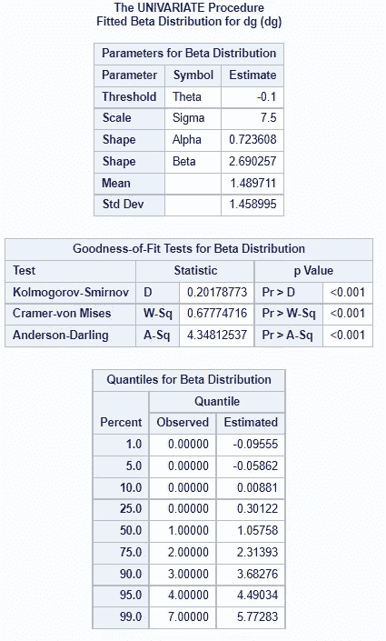

Lots of information provided.

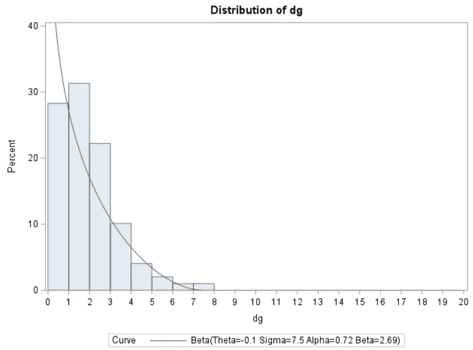

And a plot of a beta-distribution that does seem to do the trick with alpha and beta at 0.72 and 2.69 respectively. However, I am not completely happy with the curve which ends too soon. This is due to the high number of zero’s in the data I suspect.

I added a small number to the zero still born group to amplify it and reran the analysis. Now, the tail of the beta distribution is much longer, which is what I want. As a result, the alpha and beta values completely change.

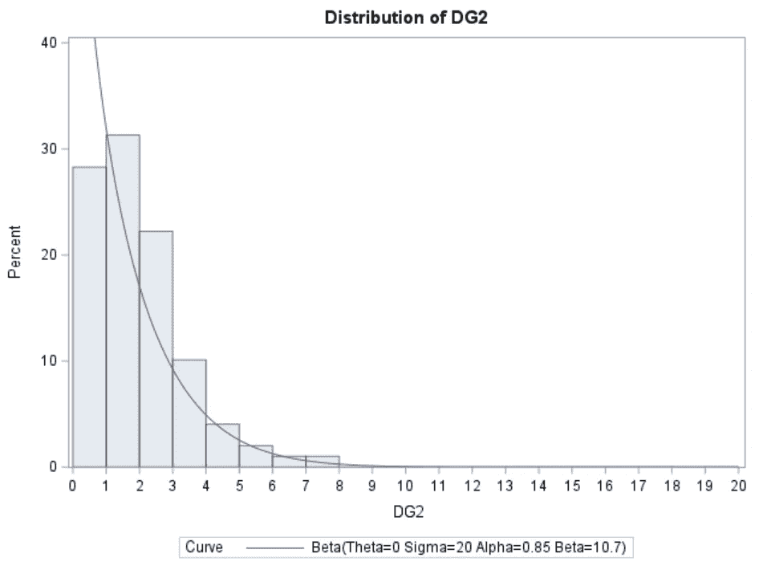

A curve that is much better as it has a longer tail. Of course, the distribution is not perfect but they never are. They are merely assumptions.

在项目的这一点上，我仍然非常纠结于实际建模的结果。现在，目标是增加 3%的活产小猪比例，但这 3%实际上是基于平均值。出于某种原因，动物科学中出生的小猪数量是平均的，这很奇怪，因为你不可能有 18 1/3 只小猪。该值始终是一个整数。此外，出生的小猪数量仍然是一个零和游戏——如果你知道出生的小猪总数和出生时存活的小猪数量，你也知道出生时的小猪数量。因此，除了模拟死产，我还可以选择模拟活产，它有更好的分布。最后，我坚持使用死胎。

因此，我希望死胎减少 3%,我想知道，考虑到母猪死胎比例的自然变化，我需要在两个处理中包括多少头母猪才能发现这 3%的差异。

因此，给定我所拥有的 alpha en beta 值，它与给定的比例和方差相关，我可以估计出 3%增长的 alpha 和 beta 值。总之，我所做的是为对照组和干预组创建α和β值，这需要产生 3%的差异，同时考虑到我在两组中观察到的变化。

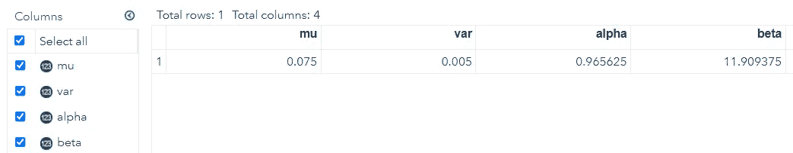

现在，是权力的时候了。您在下面看到的是:

1.  对照组和治疗组的β-二项式分布的α和β值-这将产生每头母猪的 SB 比例。
2.  模拟每组动物数量的代码
3.  模拟的次数
4.  模拟活产小猪数量的泊松分布
5.  β-二项式，由出生的小猪比例的β分布组成，作为出生小猪数量的函数。

The code to simulate a beta-binomial distribution for two treatments with the intent to model the number of still born as a function of total born and sow variation.

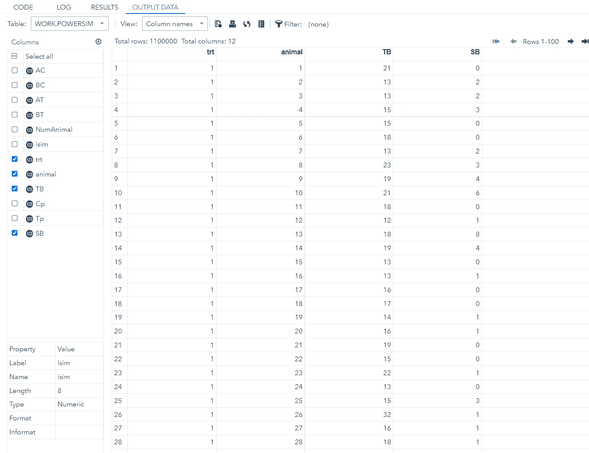

The dataset obtained — per treatment and per animal we get a number of total born and a number of still born.

Code to check the simulation and see which model will best mimic the data we simulated to pick up the the 3% difference in still birth we implemented.

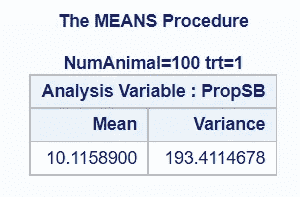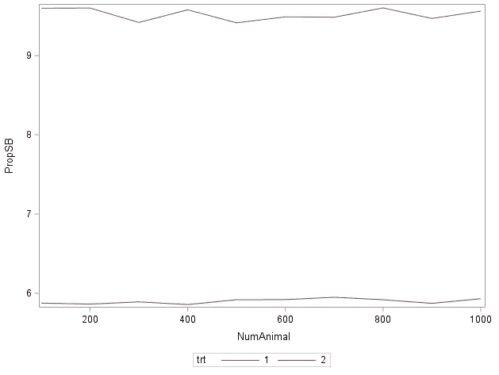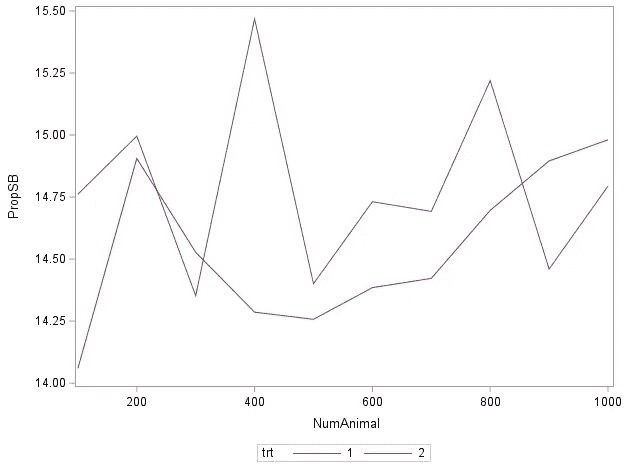

Mean and Standard Deviation Summarized by Treatment and Number of Animals. As you can see, the difference is always around 3%. Variation does change, as it should, given the nature of the beta-distribution.

为了寻找估计死产比例差异的最佳模型，我研究了正态分布、准二项分布和负二项分布的可行性。后者表现最好。

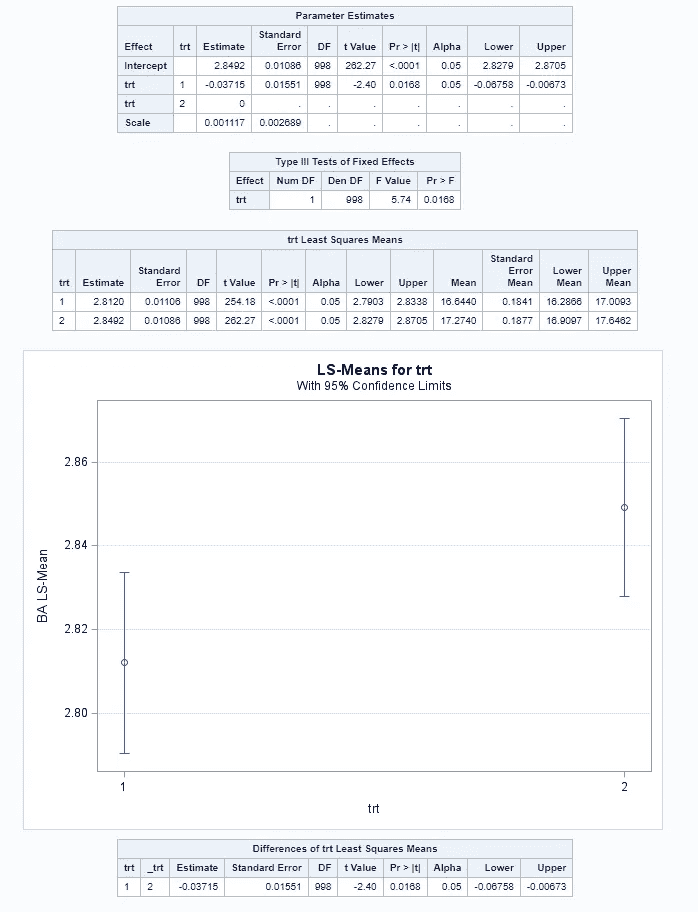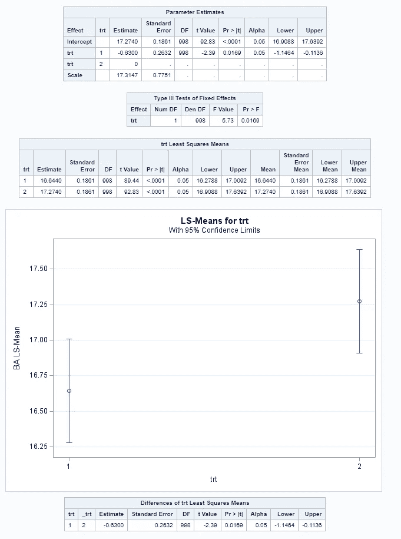

Results from Negative Binomial and Gaussian Distribution. Quasi-Binomial did not run. As you can see, the difference is 3% between the groups, as envisioned.

Code to run the power calculation.

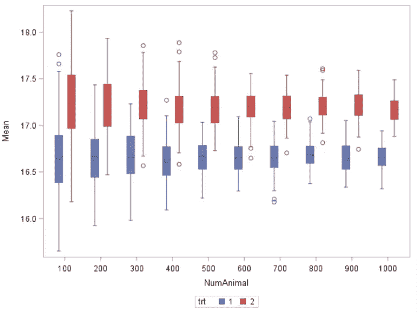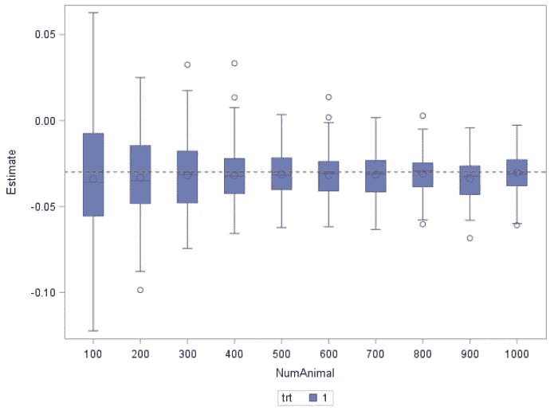

As you can see, the difference was always around 3%, but the variance decreased as a function of the sample size.

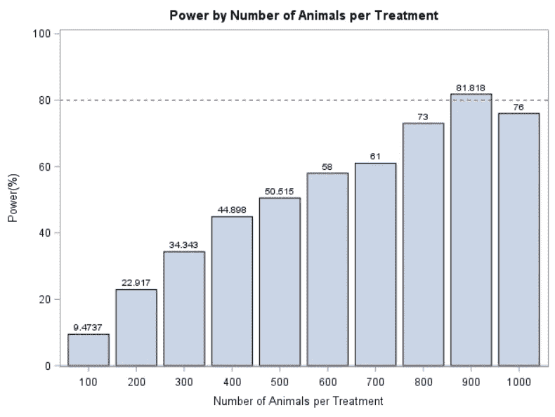

Number needed per treatment which is quite a lot. This is not surprising given the % increase needed when already working on the boundary of a distribution.

我希望这个例子显示了通过使用不同的分布将二项分布中的水平 2 方差包括在内的可能性。和往常一样，[模拟](/@marc.jacobs012/simulations-in-sas-some-random-stuff-c5bc66303b37)的强度取决于假设。

享受吧。

 [## Mlearning.ai 提交建议

### 如何成为 Mlearning.ai 上的作家

medium.com](/mlearning-ai/mlearning-ai-submission-suggestions-b51e2b130bfb)