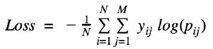
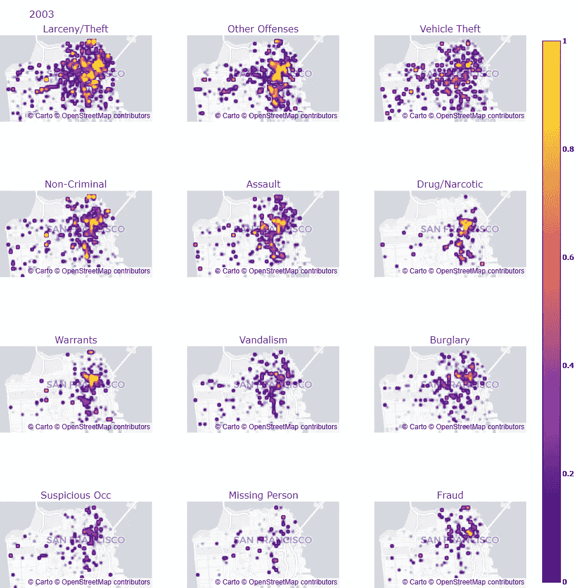

# 旧金山犯罪分类

> 原文：<https://medium.com/mlearning-ai/san-francisco-crime-classification-ffa2cd02a1bf?source=collection_archive---------4----------------------->

端到端机器学习案例研究

Photo by [Maxim Hopman](https://unsplash.com/@nampoh?utm_source=medium&utm_medium=referral) on [Unsplash](https://unsplash.com?utm_source=medium&utm_medium=referral)

# 旧金山——城市

旧金山是美国加利福尼亚州的文化、商业和金融中心。它是美国第 17 大人口城市，也是著名的旅游胜地，以凉爽的夏天、金门大桥和一些世界上最好的餐馆而闻名。尽管旧金山是一个以发展而闻名的城市，但由于犯罪活动的增加，它仍然是最危险的居住地之一。

San Francisco — Golden Gate

旧金山的开放数据目录提供了从 2003 年 1 月 1 日到 2015 年 5 月 13 日的 12 年犯罪数据。这些犯罪记录大多来自 SFPD 犯罪事件报告系统。他们已经在 [Kaggle](https://www.kaggle.com/c/sf-crime/data) 上发布了这个数据集。

整个案例研究的主要议程是预测未来可能发生的事件的犯罪类别。因此，帮助他们减少组织数据的时间和精力。

# ML 问题公式化

## 数据概述

1.  来源→[kaggle.com/c/sf-crime/data](https://www.kaggle.com/c/sf-crime/data)
2.  我们总共有 3 个文件

*   ***train.csv.zip***
*   ***test.csv.zip***
*   ***sample submission . CSV . zip***

3.定型数据有 9 列，其中也包括目标列。

4.测试数据有 6 列，不包括目标列(这是我们需要预测的)。

## 问题类型

*   有不同种类的犯罪需要分类。
*   因此，这导致了多类分类问题。

## 绩效指标

因为这是一个分类问题，我们坚持的标准是-

*   多重对数损失——任何机器学习模型的最终目标都是减少损失。对于这个问题，完美的分类器应该是将多类对数损失减少到`0`的分类器。

*   混淆矩阵——是对分类问题预测结果的总结。正确和错误预测的数量用计数值汇总，并按每个类别细分。

## 目标和限制

1.  预测每个数据点属于每个`39`类别的概率。
2.  约束条件:

*   可解释性
*   需要类别概率
*   惩罚类概率中的错误= >度量是对数损失
*   没有延迟限制

# 探索性数据分析

给出的原始训练数据-

给出的原始测试数据-

显然，从`Dates`列中，我们可以提取基于时间的特性，例如-

*   ***日期***
*   ***年份***
*   ***月***
*   ***日***
*   ***小时***
*   ***分钟***
*   ***季节***
*   ***小时 _ 类型***
*   ***时间 _ 周期***

此外，从`Address`列中，我们可以提取地址类型，例如-

提取基于时间和地址类型的特征后的训练数据。

提取基于时间和地址类型的特征后测试数据。

# 单变量分析

所以，我们得到了一些重要的特征。我们可以考虑每一列执行单变量分析，并了解数据是如何分布的。

## 目标分布

*   以上是`category`栏目的班级分布。
*   显然，我们可以看到`Larceny/Theft`是历年来发生最多的犯罪类型。
*   最后的`5`到`6`犯罪可以忽略不计，这意味着它们很少发生。
*   数据不平衡。因此，在构建模型时，最好进行基于分层的分割。

## 地址型分布

*   从上面的情节可以看出，大部分的犯罪都发生在`Streets`和`Crosses`两天。
*   `St`代表街道。
*   `Cross`表示连接点。

## 警察局分布

*   湾区是大多数犯罪被报道的地方。

## 年份分布

*   我们知道数据是从**2003 年 1 月 1 日**到**2015 年 5 月 13 日**记录的。
*   2015 年**的数据没有完全记录。**
*   2013 年数字犯罪较多。其他的也有类似的发生范围。

## 月份分布

*   在所有月份中，我们可以观察到犯罪的发生大致在`60k`到`80k`之间。

## 工作日分布

*   `Friday`是大部分犯罪发生的日子。
*   `Sunday`是犯罪发生较少的一天(与其他日子相比)。
*   这种可能性比较大，因为是节假日。
*   这个分布差不多。

## 小时分布

*   从上面可以看出，大多数犯罪发生在晚上或午夜。

## 时间段分布

*   我们可以观察到大多数犯罪通常发生在晚上或夜间。

## 小时型分布

*   `Morning`、`Mid-Night`、`Night`被认为是适合犯罪发生的时间段。
*   事实上，它们有相似的分布。
*   `Evening`和`Noon`是业务通常持续的时间段。

## 每年发生的次数

*   上面是一个动画图，展示了每年发生的事情。
*   以上是在警察局发生的每种事件类型的计数。
*   最常见的犯罪是`Larceny/Theft`。
*   这是我们在所有年份的总体事件图中观察到的。

## 地图可视化每年

*   以上显示了每个警察局发生的犯罪类型的确切位置。
*   这是一个全年的计划，选择的警察部门是`Richmond`。

## Choropleth 可视化月刊

*   以上是基于每个警察局的事件数的 choropleth 地图。
*   南区是大部分罪案报案的警局。
*   这是今年`2015`的月图。

## 地理密度图

Image by Author

*   GIF 图[展示了每年发生的最高`12`犯罪的密度图。](https://bit.ly/3qFfJqM)
*   这里面最需要观察的是`Larency/Theft`一开始总是存在的。
*   第二个是`Other Offenses`。
*   密度按降序排列，因此保留了最高的犯罪。

# 多变量分析

为了进行多元分析，我们必须要求基于现有列的其他特性。我们可以按照以下步骤获取它们。

1.  分类列可以编码为`One-Hot-Encoding`。

*   跟进程序— [此处为](https://jovian.ai/msameeruddin/00-cs1-eda-mv-tsa-bow-tfidf-final#C146)。

2.我们可以通过考虑旧金山的所有警察局并计算每个警察局与数据中所有坐标值之间的哈弗线距离来提取空间距离特征。

*   跟进程序— [此处为](https://jovian.ai/msameeruddin/00-cs1-eda-mv-tsa-bow-tfidf-final#C150)。

3.我们可以在纬度和经度之间进行一些算术运算。这些被称为基于位置的功能。

*   跟进程序— [此处为](https://jovian.ai/msameeruddin/00-cs1-eda-mv-tsa-bow-tfidf-final#C155)。

4.地址栏可以转换成`Bog of Words`和`TF-IDF`表示。

*   跟进程序— [此处为](https://jovian.ai/msameeruddin/00-cs1-eda-mv-tsa-bow-tfidf-final#C159)。

5.这样做，我们最终拥有了`130`的特性。从数据中学习这一点非常好。早先我们有大约`7`的特性。

我们将想象一个 *TSNE* 图，看看我们是否能完全分离这些类。由于数据很大，我只考虑了`10%`通过执行分层分割的整个数据。这样做的原因是 *TSNE* 花费更多的时间来接受训练。整个数据的`10%`几乎是`87804`个数据点。

## TSNE——10%

*   目前，数据集由`39`类组成。
*   从上面的图中，我们可以清楚地看到，数据是高度不平衡的。
*   集群没有正确分离。

## TSNE——10%(前 12 种犯罪)

*   与我们考虑所有类别时相比，上述情况更好。
*   集群也以更好的方式形成。
*   簇的分离也更好。

## TSNE——10%(前五大犯罪)

*   上面的情节比起之前所有的情节要好得多。
*   我们可以清楚地看到分离。

# 建模和培训

既然我们已经获得了这些特性，是时候应用各种分类模型并检查每个模型的性能了。对于这个问题，我们就用以下几款。

*   ***逻辑回归***
*   ***决策树***
*   ***随机森林***
*   ***XGBoost 分类器***

我们也可以试试

*   ***KNN***

我没有实现它，因为它消耗更多的时间来训练，由于系统的低效率，我选择跳过它。

> 让我们训练一些模型…

## 虚拟分类器

也称为随机模型。该模型为每个数据点分配一个随机的类别标签。这有助于检查其他重要模型是否比这做得更好。我们由此获得的损失—可以设置为阈值，从而旨在实现比阈值更小的损失。

## 逻辑回归

超参数调整后，`C`的最佳值恰好是`30`和`l2`作为正则化器。我们用`log loss`继续，因为`accuracy`没有帮助，因为数据不平衡。幸运的是，这种损失小于虚拟分类器的损失。

当模型在测试数据上进行测试时，总体 Kaggle 得分为-

## 决策图表

超参数调整后，`max_depth`的最佳值为`50`，`min_samples_split`为`500`。我们用`log loss`继续，因为`accuracy`不会有帮助，因为数据是不平衡的。幸运的是，这种损失小于虚拟分类器的损失。

当模型在测试数据上进行测试时，总体 Kaggle 得分为-

## 随机森林

超参数调整后，发生了`max_depth`的最佳值为`8`和`n_estimators`为`100`。我们用`log loss`继续，因为`accuracy`不会有帮助，因为数据是不平衡的。幸运的是，这种损失小于虚拟分类器的损失。

当模型在测试数据上进行测试时，总体 Kaggle 得分为-

## XGBoost 分类器

超参数调整后，`max_depth`的最佳值为`8`而`n_estimators`为`150`。我们用`log loss`继续，因为`accuracy`没有帮助，因为数据不平衡。幸运的是，这种损失小于虚拟分类器的损失。

当模型在测试数据上进行测试时，总体 Kaggle 得分为-

> 我们必须校准概率(预测)，因为概率在分类问题中起着至关重要的作用。
> 
> `StackingClassifier`结果不达标。

## 模型总结

*   从上面我们可以观察到，所有车型(除了`DummyClassifier`)表现都不错。
*   每个型号的损耗都小于`DummyClassifier`。
*   与所有其他车型相比，最好的车型是`XGBoost`。这个损失很小。

> 建模的完整代码可以在[这里](https://jovian.ai/msameeruddin/02-cs1-modelling-main)找到。

# 单点预测

作为其中的一部分，当原始测试数据(单点)作为输入传递到模型时，我们需要预测犯罪的类别。这在现实场景中很重要，因为我们通常不会将特性和预处理的测试数据传递给模型。

> 单点预测的代码可以在这里找到[。](https://jovian.ai/msameeruddin/05-cs1-final-submission)

视频演示。

**木星计划链接-**

 [## 旧金山-犯罪-按 msameeruddin 分类| Jovian

### msameeruddin 的笔记本收藏。

jovian.ai](https://jovian.ai/msameeruddin/collections/san-francisco-crime-classification) 

**领英简介-**

【https://www.linkedin.com/in/mohammed-sameeruddin-596a70133/ 

# 参考

1.  [appliedaicourse.com](https://www.appliedaicourse.com/)
2.  [towardsdatascience.com/why-training-set-sho..](https://towardsdatascience.com/why-training-set-should-always-be-smaller-than-test-set-61f087ed203c)
3.  [towardsdatascience.com/leveraging-geolocati..](https://towardsdatascience.com/leveraging-geolocation-data-for-machine-learning-essential-techniques-192ce3a969bc)
4.  [slideshare.net/RohitDandona/san-francisco-c..](https://www.slideshare.net/RohitDandona/san-francisco-crime-prediction-report)
5.  [researchgate.net/publication/305288147_San_..](https://www.researchgate.net/publication/305288147_San_Francisco_Crime_Classification)
6.  [cseweb.ucsd.edu/classes/wi15/cse255-a/repor..](https://cseweb.ucsd.edu/classes/wi15/cse255-a/reports/fa15/012.pdf)

# 未来的工作

我们可以尝试应用基于深度学习的模型，并检查我们已经训练过的模型的性能。据我所知，大多数试图解决这个问题的 kagglers 使用深度学习模型实现了他们的解决方案。我们绝对可以试一试。

 [## Mlearning.ai 提交建议

### 如何成为 Mlearning.ai 上的作家

medium.com](/mlearning-ai/mlearning-ai-submission-suggestions-b51e2b130bfb)