# 用于 Power BI 中流程可视化的 Sankey 图

> 原文：<https://medium.com/mlearning-ai/sankey-chart-for-flow-visualization-in-power-bi-828e62da4c0?source=collection_archive---------1----------------------->

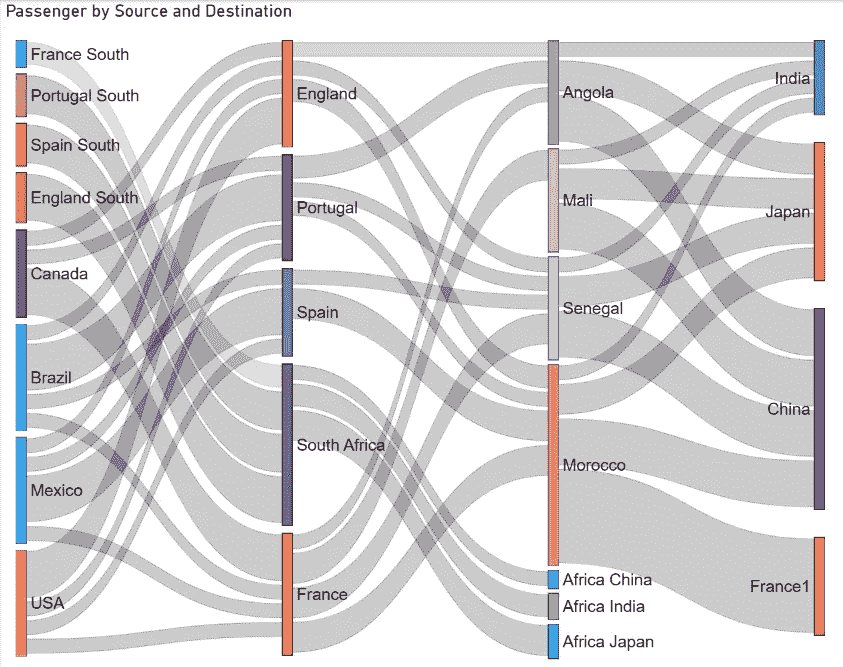

# 了解一个市场图表

Sankey 图表是一个漂亮的可视化图形，用于显示来自多个级别和多个目的地的数据流。被连接的事物被称为*节点*，连接被称为*链路*。

桑基图通常用于显示网页之间的网站/应用程序流量。

创建 Sankey 图有多种方法，如 Sankey generator 网站、Python/R 编程和可视化工具。在这些方法中，我认为 Power BI 对于表格数据是最方便的，因为它可以在短时间内创建一个 Sankey 图，而无需编码。此外，Power BI 创建的 Sankey 图易于调整并与表中的其他数据交互。

# 步骤摘要

1.  检索数据
2.  下载 Sankey visual
3.  创建桑基图表
4.  调整桑基图表

# 1.检索数据

我使用了一个样本数据集，即从一个国家旅行到另一个国家的乘客数量。

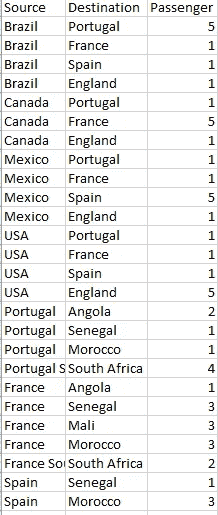

Dataset sample

打开电源 BI。单击主页选项卡，选择获取数据，然后选择文本/CSV。

> 主页选项卡>获取数据>文本/CSV

然后，选择下载的。csv 文件并加载数据。

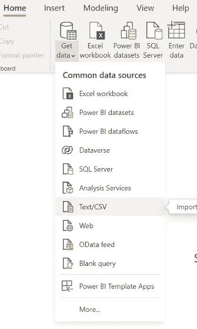

# 2.下载 Sankey visual

在右侧的可视化平原，点击 3 点，并选择“获得更多的视觉效果”

> V 可视化普通> 3 点>“获得更多视觉效果”

这将打开视觉市场。使用右侧的搜索区域搜索 Sankey Chart。单击 Sankey 图表产品(请确保它与下图相同)。然后，单击添加。

> 搜索桑基图>单击桑基图>添加

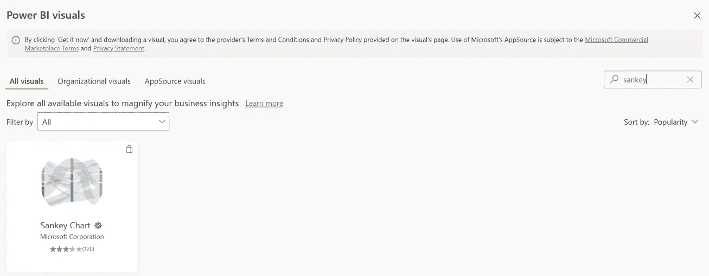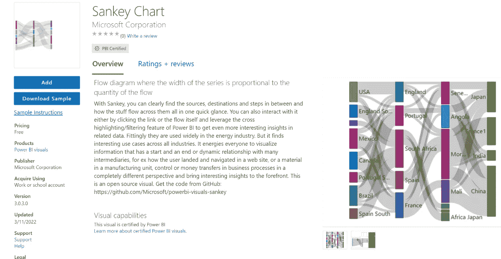

现在，您将在可视化效果平面中看到 Sankey 图标。

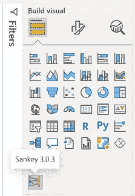

# 3.创建桑基图表

单击可视化效果平面中的 Sankey 图标。

您将看到一个空的可视化。

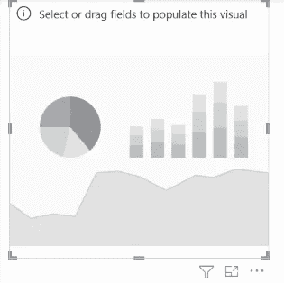

Empty visualization

在右侧的字段 plain 中，拖动要创建 Sankey 的 3 列。必须将这些列拖到正确类别的“来源”、“目的地”和“重量”中(重量必须是数字)。

❗确保在选择列之前已经选择了空可视化。

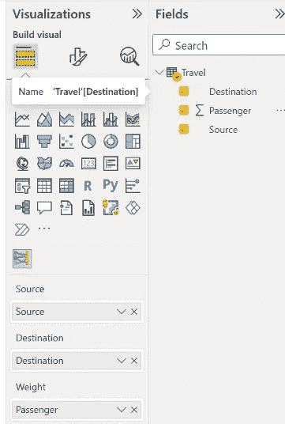

将创建一个桑基图。

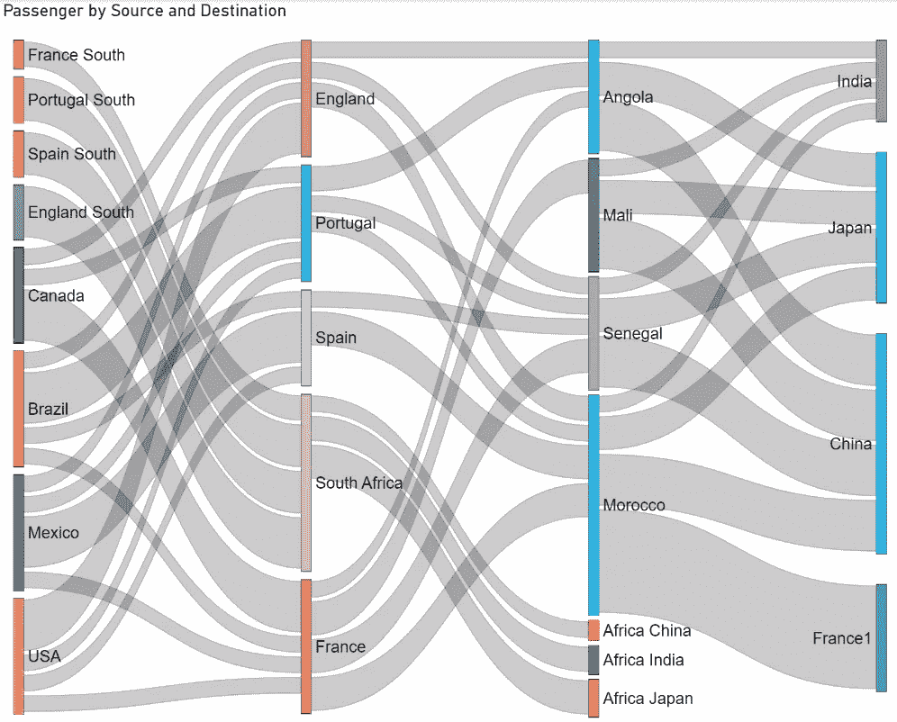

> 乘客的数量由节点间链接的权重表示，前往每个国家的总人数由节点大小表示。

> 单击三键图标>选择列

# 4.调整桑基图表

*   通过拖动角度或边来扩展图表。

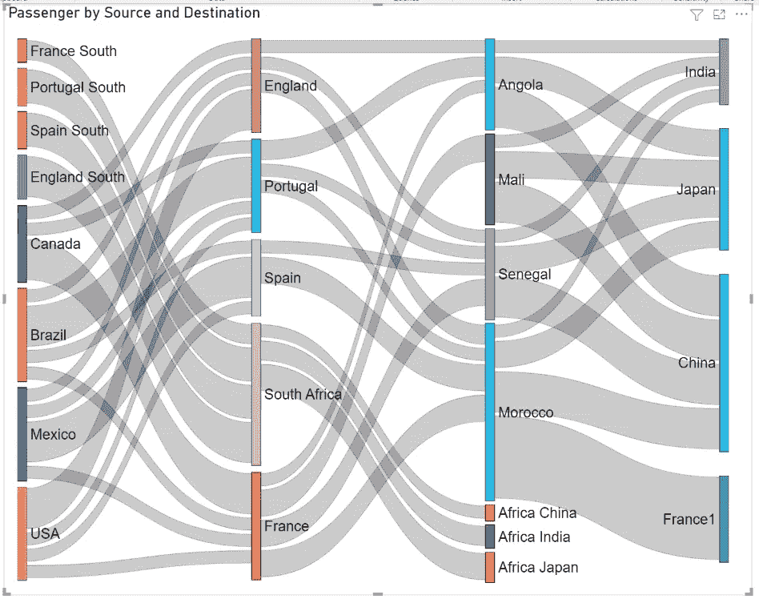

*   打开数据链接标签

> 可视化效果普通>数据链接标签打开

您可以通过选择桑基图表来实现这一点。然后，在可视化平原，点击格式化你的视觉图标。打开数据链接标签。您将在链接上看到显示其连接节点的文本。

*   节点和链接颜色变化

> 可视化效果普通>链接/节点>选择颜色

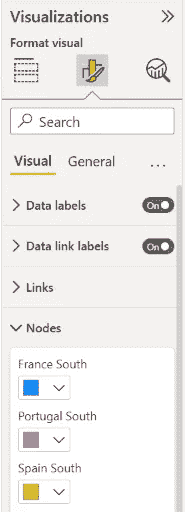

您可以在可视化平面中手动调整每个节点和链接的颜色。

正如你所看到的，从 Power BI 创建一个 Sankey 图是如此简单而美丽。

如果你喜欢这篇文章，请鼓掌关注我更多关于数据科学的文章。

 [## Mlearning.ai 提交建议

### 如何成为 Mlearning.ai 上的作家

medium.com](/mlearning-ai/mlearning-ai-submission-suggestions-b51e2b130bfb)