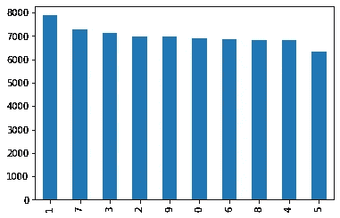
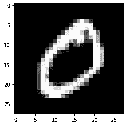

# 向深度学习第 1 部分问好

> 原文：<https://medium.com/mlearning-ai/saying-hello-world-to-deep-learning-part-1-cb6ac50c5768?source=collection_archive---------0----------------------->

## 在本文的第一部分，我们熟悉了 MNIST 数据集和 PyTorch。


The MNIST Dataset

# 那么什么是 MNIST 数据集呢？

MNIST 数据集是由数字 0-9 的黑白图像组成的数据集。在我们使用的版本中，我们有 70000 张图片，我们的首要任务是使用 PyTorch 对每张图片进行正确分类。

## 加载数据

```
from sklearn import datasets

data = datasets.fetch_openml(
    'mnist_784',
    version = 1,
    return_X_y = True
)
pixel_values, targets = data
```

这个代码块获取 MNIST 数据。 *pixel_values* 变量是每行存储的 70000 行 *28x28 = 784* 像素值的数据帧。*目标*保存每一行即每一幅图像的标签。

作为分类问题，我们来检查一下阶级不平衡。

```
targets.value_counts().plot.bar()
```



Number of instances of each class

似乎没问题！继续前进，

你可能已经注意到图像往往(大部分)是二维的。让我们尝试将代表每个图像的 784 像素的行转换为 28×28 像素。这些代码让我们可以对一张图片进行这样的操作，并将其可视化。

```
import matplotlib.pyplot as plt

single_image = pixel_values.loc[1,:].values.reshape(28,28)

plt.imshow(single_image,cmap = 'gray')
```



Image from the MNIST dataset

## PyTorch 之前有:降维+ KNN

技术上来说，在神经网络出现之前有 SVM。但是，这里有一种可能的方法可以解决我们的分类任务，甚至不涉及神经网络和 PyTorch。首先，让我们尽可能地将 28x28 像素缩小为一个良好的可绘制(x，y)格式。这是机器学习中的经典范例，有多种方法可以实现。为了更好地理解，我推荐这篇文章:

[](/mlearning-ai/practical-guide-to-dimesnioality-reduction-in-python-9da6c84ad8ee) [## 2022 年你应该知道的 9 种降维方法

### 降低数据维数所需的一切

medium.com](/mlearning-ai/practical-guide-to-dimesnioality-reduction-in-python-9da6c84ad8ee) 

现在，让我们使用 ***T 分布随机邻居嵌入*** 方法。

```
from sklearn import manifold
import pandas as pd
import numpy as np

tsne = manifold.TSNE(n_components = 2, random_state = 42)
reduced_pixels = tsne.fit_transform(pixel_values.iloc[:3500,:])

tsne_df = pd.DataFrame(
    np.column_stack((reduced_pixels,targets[:3500].astype(int))),
    columns = ['x','y','targets']
)

tsne_df.head(5)
```

n_components 是我们要将行转换成的组件数，在本例中为 2。对于此任务，我们将使用前 3500 个值。要绘制数据:

```
import seaborn as sns

grid = sns.FacetGrid(tsne_df,hue = 'targets',size = 8)

grid.map(plt.scatter,'x','y').add_legend()
```


Distribution of

我们可以简单地对减少的数据运行 K 最近邻算法。

```
from sklearn.neighbors import KNeighborsClassifier
from sklearn.model_selection import train_test_split

X = tsne_df.drop('targets',axis = 1)
y = tsne_df['targets']

X_train, X_test, y_train, y_test = train_test_split(
    X, y, test_size=0.33, random_state=42)

neigh = KNeighborsClassifier(n_neighbors=10)
neigh.fit(X_train, y_train)

print(f'The accuracy of the KNN approach is {neigh.score(X_test, y_test)}')
```

```
The accuracy of the KNN approach is 0.8900432900432901
```

哇哦。那不算太寒酸。这应该描述两件事:

1.  MNIST 数据集是一个简单的数据集。实际上，使用简单的工具就足够了。
2.  像素(也称为我们的“数据”)和我们赋予它的标签之间有一种内在的联系。那很好。数据和标签之间的关系很好。


Photo by [Ilya Pavlov](https://unsplash.com/@ilyapavlov?utm_source=medium&utm_medium=referral) on [Unsplash](https://unsplash.com?utm_source=medium&utm_medium=referral)

# PyTorch 和 Tensors

[PyTorch](https://pytorch.org) 是一个灵活的科学计算包，目标是基于梯度的深度学习。它的底层 API 紧跟 [NumPy](http://www.numpy.org/) 。

PyTorch 有它自己的数据类型，它称之为' ***张量*** '。它们本质上是***numpy ndarrays***，是 GPU 友好的。

## (GPU？什么-

在执行神经网络所需的特定类型的操作(矩阵乘法)时，GPU(图形处理单元)通常比 CPU 快得多。你的电脑上可能有。即使你没有，Kaggle 笔记本和 Google Colab 也提供免费的 GPU 使用。)

现在，回到火炬。如果您熟悉 Numpy ndarrays，那么这段代码对您来说会非常熟悉:

```
import torch

# Construct a bunch of ones
some_ones = torch.ones(2, 2)
print(some_ones)

# Construct a bunch of zeros
some_zeros = torch.zeros(3, 2)
print(some_zeros)

# Construct some normally distributed values
some_normals = torch.randn(2, 2)
print(some_normals)

#Get information about the tensors
print()
print(f'Dimensions of the tensor: {some_normals.shape}')
print(f"Datatype of tensor: {some_normals.dtype}")
```

```
tensor([[1., 1.],
        [1., 1.]])
tensor([[0., 0.],
        [0., 0.],
        [0., 0.]])
tensor([[-0.1676, -2.0426],
        [ 0.4518,  1.6082]])

Dimensions of the tensor: torch.Size([2, 2])
Datatype of tensor: torch.float32
```

*张量 _ 形状*给出了张量的维数，在这里，*火炬。Size([2，2])* 暗示我们有一个 2x2 矩阵。类似地， *tensor_name.dtype* 给出了 *tensor_name* 中对象的数据类型。张量和 n 数组是如此的相似，你可以把张量转换成 n 数组，几乎没有任何成本。

```
torch_tensor = torch.randn(5, 5) #Create a 5x5 tensor
numpy_ndarray = torch_tensor.numpy()
print(f'Type: {type(numpy_ndarray)}')
back_to_torch = torch.from_numpy(numpy_ndarray)
print(f'Type: {type(back_to_torch)}')
```

```
Type: <class 'numpy.ndarray'>
Type: <class 'torch.Tensor'>
```

## 张量的基本运算

在张量上可以执行五种基本操作。

1.  添加
2.  减法
3.  逐元素乘法
4.  分开
5.  矩阵乘法

我希望这里没有惊喜。这就是你实现它们的方式

```
a = torch.Tensor([2,2])
print(f'Tensor 1: {a}')

b = torch.Tensor([3,3])
print(f'Tensor 2: {b}')

c = a+b
print(f'Addition of two tensors: {c}')

c = a-b
print(f'Subtraction of two tensors: {c}')

c = a*b
print(f'Element wise Multiplication of two tensors: {c}')

c = a/b
print(f'Division of two tensors: {c}')

c = a@b
print(f'Matrix multiplication of two tensors: {c}')
```

```
Tensor 1: tensor([2., 2.])
Tensor 2: tensor([3., 3.])
Addition of two tensors: tensor([5., 5.])
Subtraction of two tensors: tensor([-1., -1.])
Element wise Multiplication of two tensors: tensor([6., 6.])
Division of two tensors: tensor([0.6667, 0.6667])
Matrix multiplication of two tensors: 12.0
```

## 矩阵乘法:很重要

*(重要到可以普及使用 GPU 来做的更快。)*

如果你不确定两个矩阵相乘的概念，现在是复习的时候了。

```
a = torch.randn(5, 5)
b = torch.randn(5, 5)

# Getting a whole row or column or range
first_row = a[0, :]
first_column = a[:, 0]
combo = a[2:4, 2:4]
print(combo.shape)

# Matrix multiplication: c_ik = a_ij * b_jk
c = a.mm(b)

# Matrix vector multiplication
c = a.matmul(b[:, 0])
```

在这个代码块中，我们首先声明两个 5x5 矩阵。 *Indexing [0，:]* 给出了矩阵的第一行。建议使用 ***a.mm(b)*** 代替 ***a@b*** 。

## 重塑尺寸

在本文的开始，我们使用 shape(28，28)来改变数组的维数。对张量进行类似的操作:

```
a = torch.rand(10)

print(a.shape)

print(a.unsqueeze(-1).shape) #Add an extra dimension
print(a.unsqueeze_(-1).shape) #Notice the _ (underscore)?
print(a.unsqueeze_(0).shape)

print(a.squeeze(0).shape)
print(a.squeeze().shape)#Remove the extra dimensions
```

```
torch.Size([10])
torch.Size([10, 1])
torch.Size([10, 1])
torch.Size([1, 10, 1])
torch.Size([10, 1])
torch.Size([10])
```

有几点需要注意:

1.  _(下划线)是一个原位运算符。使用 *a.squeeze_()* 和使用 *a = a.squeeze()是一样的。*这个操作符不是这两个函数独有的。
2.  使用 *a.squeeze()* 删除所有数值为 1 的尺寸。
3.  也可以用*。reshape()* 如之前张量上所示。

现在是张量特有的东西(关于时间)

## 使用图形处理器进行张量计算；

GPU 提高了矩阵运算的速度。但是要编写能够在 GPU 上工作的代码有点困难。幸运的是，代码已经为我们写好了，我们需要做的就是知道如何使用它。

```
import torch

a = torch.randn(2)
do_i_have_cuda = torch.cuda.is_available() #1.

if do_i_have_cuda:
  print('Using GPU')
  #We are 'sending' the tensor a to the GPU
  device = torch.device('cuda') #2.
  a = a.to(device) #3.
else:
  print('Using CPU')
  device = torch.device('cpu')
  a = a.to(device)
```

在这里，我们是:

1.  检查我们是否有 GPU 能力
2.  相应地设置我们的设备
3.  将张量“a”加载到相应的设备上，以便我们可以对其进行计算

## 差异化:

如果你上过微积分课程，你可能还记得微分技术，以及它在求函数最小值中的应用。我们将在训练神经网络时，要求找到损失函数的*最小值，*换句话说，找到使我们的神经网络出错次数最小化的正确数字。这使得寻找梯度的能力变得非常方便。如果你还不明白这是什么意思，把微分想象成我们可以对张量进行的另一种运算。


Andrew Ng has a plethora of great course on Deep Learning you can view on Coursera.

就代码而言，我们首先创建一个张量，我们可以对其执行梯度(客户端操作):

```
import torch

x = torch.randn(1, requires_grad=True)
print(f'The Tensor object: {x}')
print(f'Current gradient stored in x: {x.grad}')
```

```
The Tensor object: tensor([1.1863], requires_grad=True)
Current gradient stored in x: None
```

让我们创建一个函数，y = x

```
y = x**2
```

我们现在可以调用魔法， ***y.backward()*** ，计算 x 的微分(你也知道，就是 2*x)。我们将计算出的差异存储在 x 的 grad 属性中。

```
y.backward()
print(f'Current gradient stored in x: {x.grad}')
print(f'Value/attribute of y: {y}')
```

```
Current gradient stored in x: tensor([2.3725])
Value/attribute of y: tensor([1.4072], grad_fn=<PowBackward0>)
```

一些简单的计算会告诉你这些值都加起来了。最后，如果您计划在程序中的任何地方更改 x.grad 中的值，您必须首先再次将它设置为 ***None*** ，否则已经存储的结果将会干扰 grad，使其不一致(阅读:错误)。

```
x.grad = None #consider commenting this line out before running the code block to see what happens
y = x.exp()
y.backward()
print(y,x.grad)
```

在第二部分，我们将收集我们现在所知道的关于 MNIST 数据集和 PyTorch 的信息，并创建我们的第一个神经网络！您可以在此处查看:

[](/@saffand03/saying-hello-world-to-deep-learning-part-2-2aaf60a7482d) [## 向深度学习第二部分问好

### 在本文的第二部分，我们使用 PyTorch 为 MNIST 数据集创建了一个神经网络。

medium.com](/@saffand03/saying-hello-world-to-deep-learning-part-2-2aaf60a7482d) 

考虑关注我:[LinkedIn](https://www.linkedin.com/in/syed-affan-38b378216/)| |[GitHub](https://github.com/sulphatet)

[](/@saffand03) [## 赛义德·阿凡培养基

### 阅读赛义德·阿凡在媒介上的作品。印度的学生。我写的是机器学习等等。联系我关于…

medium.com](/@saffand03) [](/mlearning-ai/mlearning-ai-submission-suggestions-b51e2b130bfb) [## Mlearning.ai 提交建议

### 如何成为 Mlearning.ai 上的作家

medium.com](/mlearning-ai/mlearning-ai-submission-suggestions-b51e2b130bfb)