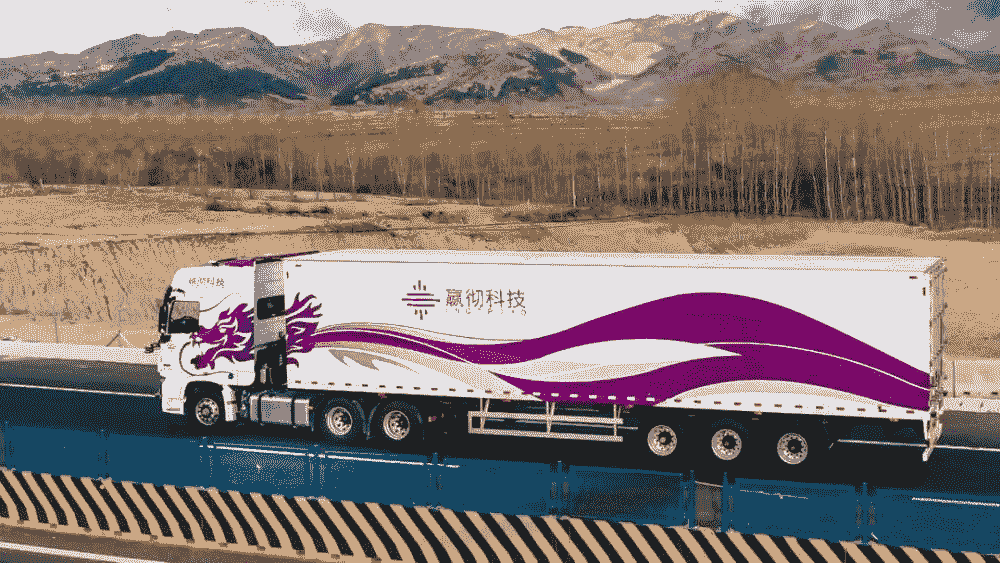

# 乘用车争议仍在继续，但自动驾驶卡车已经开始商业化

> 原文：<https://medium.com/mlearning-ai/scalable-labeled-data-is-indispensable-in-boosting-self-driving-truck-part2-5fb43b0981e2?source=collection_archive---------1----------------------->

## 可扩展的标签数据是推动自动驾驶卡车不可或缺的——第二部分

Inceptio Technology

# **自动驾驶卡车已经开始商业化**

在过去的几个月里，中国自动驾驶科技公司 Inceptio Technology 完成了新一轮 2.7 亿美元的融资，智加科技完成了新一轮数亿美元的融资并计划上市，途胜未来将在美股上市，飞步科技完成了 1 亿元的 B+轮融资。

在业务层面，智驾科技与一汽解放联合生产的可量产自动驾驶卡车已经小批量下线，Inceptio 科技宣布将在年内实现量产。

**干线技术在港口实现了完全无人驾驶。**一些物流公司也参与其中，自动驾驶卡车将很快投入车队应用。

在乘用车领域仍存在诸多争议的同时，自动驾驶技术在卡车领域已经显示出更多的优势和效益，**其在物流领域的商业化正在逐步开启。**

# 自动卡车的优势:效率提高，成本降低

自动驾驶作为一项创新技术，受到各方关注。全球科技巨头都不愿意错过这项可能改变出行未来的创新技术，已经开始了研究和测试。与此同时，创业公司不断出现，试图在时代潮流中抢占先机。

对于卡车来说，自动驾驶技术的好处更加明显。卡车与物流行业有着很深的联系。人力和油耗是物流行业中最高的两项成本，占比超过 50%。自动驾驶技术可以节省人力和油耗成本，对业务端的物流公司自然有吸引力。

“我们的客户是物流公司，这点很清楚。”智加科技中国区总经理李蓉告诉街面新闻，卡车是“生产资料”，自动驾驶可以让生产更安全，减少物流车队。

GLP 隐山资本董事总经理王珂表达了同样的观点。对于消费型乘用车，**自动驾驶更多的是提升驾驶体验；而商用车对于企业来说本质上是生产工具，更多的是注重效率的提高和成本的降低。**

虽然自动驾驶并非完全无人驾驶，但在高速干线上，即使是 L2 和 L3 辅助自动驾驶技术，也能在节省油耗、降低燃油成本的同时，降低特定场景下的人类劳动强度和事故率。

# 自驾车行业中的数据标注服务

在自动驾驶领域，数据标注场景通常包括变道超车、通过路口、无红绿灯控制的无保护左右转弯，以及一些复杂的长尾场景，如车辆闯红灯、行人过马路、路边以及违规停放的车辆等。

现在的人工智能也叫数据智能。在这个发展阶段，神经网络的层数越多，需要的标记数据量就越大。对于深度学习来说，数据只有贴好标签才有意义。

此前有媒体报道，一名外国用户在乘坐智能驾驶车辆时发生车祸。警方调查后发现，智能驾驶系统未能区分白色车辆和云的区别，没有识别障碍物。车辆未能及时刹车，进而引发悲剧后果。

在这个系统中，发送到智能系统的 AI 数据缺乏关于白色车辆和云的准确区分数据**，这是导致悲剧**的直接因素。

因此，获取**针对不同场景、不同需求的高质量 AI 数据**逐渐成为自动驾驶行业解决方案的共识。

## 常见的数据标注类型包括:

*   2D 包围盒
*   [车道标线](https://tinyurl.com/u7u4me)
*   [视频跟踪注释](http://tinyurl.com/wmu4yfhh)
*   点标注
*   [语义分割](https://tinyurl.com/48w576p7)
*   三维物体识别
*   3D 分割
*   传感器融合:传感器融合长方体/传感器融合分割/传感器融合长方体跟踪

# 结束

将你的数据标注任务外包给 [ByteBridge](https://tinyurl.com/2p8sbem6) ，你可以更便宜更快的获得高质量的 ML 训练数据集！

*   无需信用卡的免费试用:您可以快速获得样品结果，检查输出，并直接向我们的项目经理反馈。
*   100%人工验证
*   透明和标准定价:[有明确的定价](https://www.bytebridge.io/#/?module=price)(含人工成本)

为什么不试一试呢？

来源:https://baijiahao.baidu.com/s？id=1709210894858214158&wfr