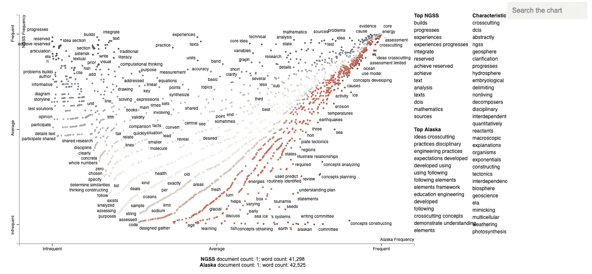
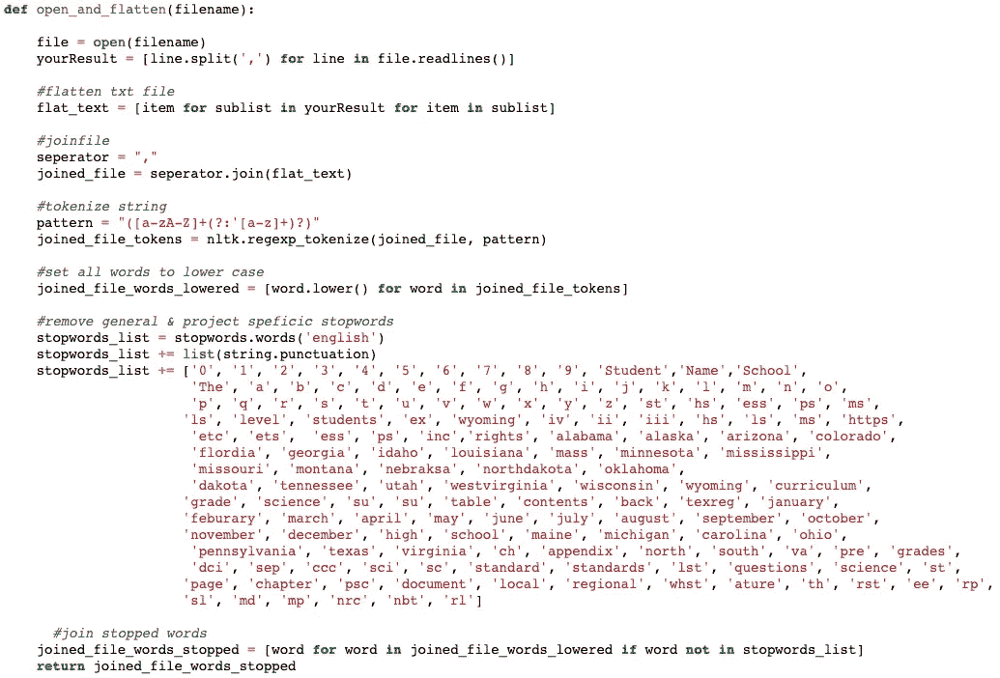
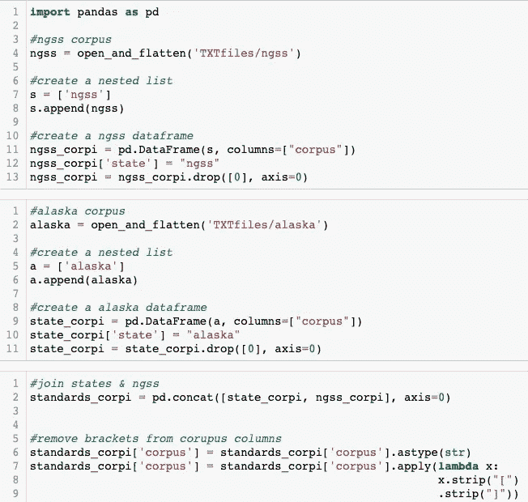
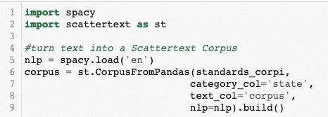
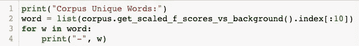
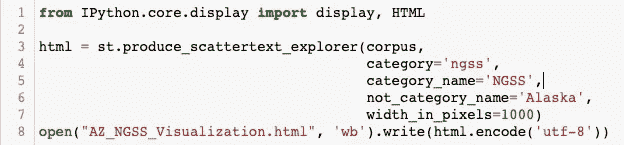

# 分散文本可视化

> 原文：<https://medium.com/mlearning-ai/scattertext-visualizations-ba6c5c773d90?source=collection_archive---------1----------------------->

## 一个优雅的，交互式的工具来提升你的文本分析

数据可视化最好是用数据讲述一个故事，既引人入胜又易于理解。Jason Kessler 创建的分散文本工具(查看原始文档[这里](https://github.com/JasonKessler/scattertext))就是这么做的。本指南将向您展示如何使用您的数据实现分散文本，并为您的工作带来视觉效果。

# 开始使用:

> 嘶！如果你不需要帮助格式化你的数据，跳到“把你的文本变成一个分散文本语料库”！

分散文本允许你在你的语料库中可视化独特的术语，以及它们的频率如何从一个类别到另一个类别的不同。在上面的例子中，我比较了 NGSS 制定的教育标准文件和阿拉斯加州制定的教育标准文件中使用的术语，但是*任何你想要比较的带有两个类别的*文本都可以。

## 格式化文本数据

在这个项目中，我使用的是原始形式的不适合建模的 pdf。为了快速格式化文本数据，我创建了一个自定义函数，该函数接收一个文件，降低单词，对单词进行标记，删除停用单词和标点符号，并返回一个干净单词的列表。

Custom function for cleaning and formatting text data

## 构建干净的数据框架

使用自定义函数，现在读入 PDF 并构建数据框。我添加了一些额外的步骤来清理我的数据，例如将文本列设置为字符串，以便从列表中删除创建数据框时出现的不需要的括号。

Read Data & Build Data Frame

# 把你的文本变成一个分散的文本集

## 建立语料库

你需要有空间和分散文本库。安装空间库的指南可以在[这里](https://spacy.io/usage/)和[这里](https://pypi.org/project/scattertext/0.0.2.6.0/)找到。一旦你安装了它们，你需要做的第一件事就是建立一个分散的文本语料库。

Create Scatterplot Corpus

从第 6 行开始，分解括号内的每个变量，使用的数据框的名称，包含分类信息的列的名称，最后包含文本数据的列的名称。

## 识别语料库中唯一的单词

一旦你建立了自己的语料库，你就可以使用 get _ scaled _ f _ scores _ vs _ background 方法快速找到对你的语料库来说非常独特的单词。

Print the Top 10 Corpus Unique Words

## 识别与类别最匹配的单词

您还可以使用词频来识别与语料库中给定类别最相关的单词。

Print the Top 20 Associate Words with a Category

> 注意:在尝试绘制散点图可视化之前，您需要对这两个类别进行词频统计！

## 构建交互式的分散文本可视化

终于，你们期待已久的时刻到了！如果您之前没有在 Jupyter 笔记本中运行 HTML，请确保您有 Ipython.core.display 导入显示& HTML，如下所示。

Build an Interactive Scattertext Visualization

从第 3 行开始，分解括号内的每个变量，你有你的空间语料库，你希望绘制的类别(注意，它是列值的名称，而不是列名)，你希望类别如何出现在你的视图中，你希望相反类别的名称如何出现在你的视图中，最后是你的像素数。

这可能需要一两分钟来运行，完成后将在 Jupyter 笔记本中返回一组数字。它还会将视觉效果保存到指定的 final。为了访问可视化转到文件夹，您在中创建了可视化并单击链接。

根据可视化的大小，加载它可能需要几秒到几分钟的时间。当它出现的时候，嘣！这就对了。一个漂亮的交互式文本可视化工具！

# 额外收获:主持你的可视化

最后一点:只存在于你的笔记本中的交互工具有什么好处？使用像 [tiiny.host](https://tiiny.host/login) 这样的网站来部署您的分散文本可视化，并通过一个可点击的可共享链接来托管它！

制图快乐！