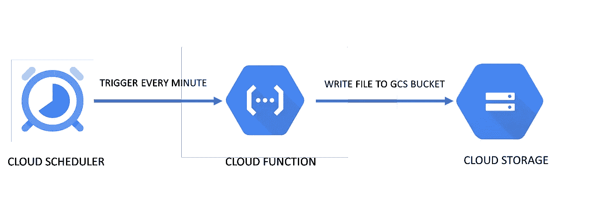
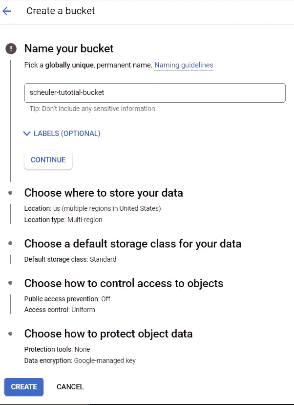
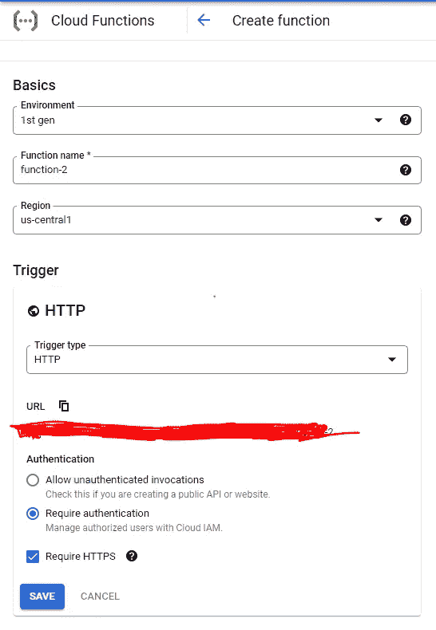
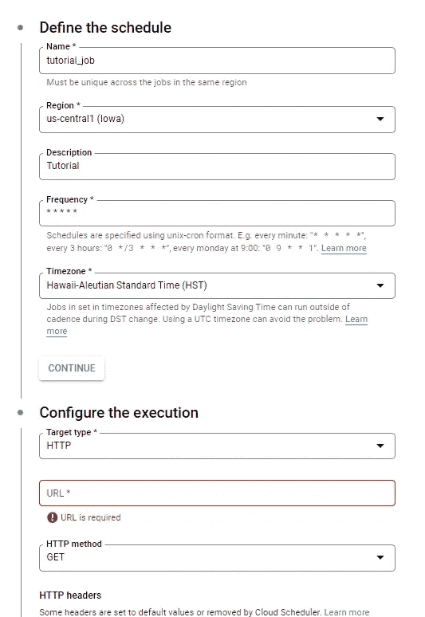
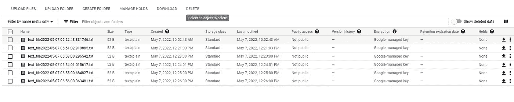

# 安排谷歌云功能定期运行

> 原文：<https://medium.com/mlearning-ai/scheduling-google-cloud-functions-to-run-periodically-4fd3e763e78f?source=collection_archive---------3----------------------->

> 周期性地触发 GCP 云功能

Photo by [alexandru vicol](https://unsplash.com/@alex_vicol?utm_source=medium&utm_medium=referral) on [Unsplash](https://unsplash.com?utm_source=medium&utm_medium=referral)

很多时候，我们需要定期运行一段代码。它可以在机器学习模型上执行推理、处理日志文件、调用 API 端点和存储结果等。手动运行此类作业效率非常低，因此我们寻找一种自动化的解决方案。这里有一个好消息。我们可以使用谷歌云平台的云调度器来安排 GCP 计算服务定期运行。万岁！！

在这篇文章中，我们将看到如何使用 GCP 的云调度器来调度谷歌云功能(T1)，这是一个由 GCP 提供的[无服务器计算服务(T3)。**注:**](/mlearning-ai/serverless-computing-your-new-friend-from-the-world-of-cloud-6606117deeaf)

1.  *本文假设您已经拥有一个 GCP 账户。如果你没有，请在这里* *注册* [*。在 GCP，激活后的前 90 天，您可以获得价值 300 美元的积分。*](https://cloud.google.com/)

*2。确保在您的 GCP 项目中使用* [*API 控制台*](https://console.developers.google.com/) *为 Google 云存储、功能和调度器* [*启用 API*](https://cloud.google.com/service-usage/docs/enable-disable)*。*

不要再耽搁了，让我们开始吧。

我们的任务

出于本文的目的，我们希望调度一个云函数，它每分钟在一个 ***google 云存储*** 桶中存储一个文本文件。云架构看起来是这样的:

Cloud Architecture (source: author)

我们将使用 GCP 的 3 个服务来完成我们的任务。

1.  **云调度器:**来自 GCP 云调度器文档-**云调度器是一款完全托管的企业级 cron 作业调度器。它允许您安排几乎任何作业，包括批处理、大数据作业、云基础架构操作等。您可以自动执行所有操作，包括失败时的重试，以减少手动操作和干预。”它基本上可以安排任何事情。在我们的例子中，我们使用它每 60 秒发送一次 HTTP 请求来触发我们的云功能。**
2.  ***云功能:**云功能允许我们在云中运行代码，无需管理服务器或容器。Cloud Functions 是一款可扩展、现收现付的功能即服务(FaaS)产品，帮助我们用简单、单一用途的代码构建和连接事件驱动的服务。可以使用 HTTP 请求、发布/订阅事件、云 Firestore 等来触发云功能。这里，我们将使用 HTTP 请求来触发我们的云功能。*
3.  ***云存储:**这是谷歌提供的一种存储服务，允许我们存储和检索我们的数据。在 GCS 中，我们将数据存储在桶中。*

***实现架构***

1.  ***创建一个谷歌云存储桶***

*在 GCP 控制台中，搜索云存储的存储。进入云存储部分后，点击 ***创建桶*** 。*

**

*Cloud Storage Creation (source: author)*

*给 bucket 一个合适的名称，并确保在计划运行云函数的同一区域创建 bucket。为了简单起见，我们让其余的设置保持原样，并点击**创建**。*

***2。配置云功能***

*在 GCP 控制台中，搜索云存储的存储。进入云存储部分后，点击 ***创建功能*** 。恰当地命名云函数。将 ***的触发类型设置为 HTTP。*** 你必须看到一个网址显示出来。这个 URL 将用于触发云功能。复制这个网址，因为我们很快就会用到它。勾选认证部分的 *'* ***要求认证*** *'* 选项。点击**保存**。*

**

*Cloud Function Configuration (source: Authour)*

*为了简单起见，我们不会涉及**运行时、构建、连接和安全设置**。现在点击下一步。*

*3.**编写功能代码***

*现在我们将编写代码来存储所需的文本文件。我们将使用内联源代码编辑器窗口来编写代码。*

**

*Inline Code Editor (source: author)*

*首先，我们将选择**运行时环境**作为 Python 3.9，因为我们将用 Python 编码。*

*我们有两个文件，main.py 和 requirements.txt。*

***main.py** 文件包含每当函数被触发时将被执行的代码。当然，它有一个名为“hello_word”的函数。如果我们看到**入口点**字段，我们将在那里找到函数名。hello_word 函数是代码的入口点。我们可以更改这个函数的名称，但是我们需要确保在**入口点**函数名称选项卡中相应地更新它。在这里，我们将使用“hello-world”这个名称。*

***requirements.txt:** 这是我们声明需要安装在云函数环境中以执行我们的函数的库的地方。默认情况下，环境[预装了一堆库](https://cloud.google.com/functions/docs/writing/specifying-dependencies-python#python38)。既然，我们将使用 ***云客户端库*** 为 ***Google 云存储 API*** *，*我们需要将它添加到 requirements.txt 中*

*请在下面找到完整的代码。*

*现在我们可以点击**部署**按钮。*

*部署通常只需要几分钟，因为云功能环境已经建立，所有的需求都已经安装。*

*函数名称旁边的绿色对勾表示该函数已成功部署。*

**

*Function Deployed (source: author)*

***4。调度功能***

*在 GCP 控制台中，搜索**云调度器**的存储。进入云调度器部分后，点击 ***创建作业*** 。恰当地命名工作。*

**

*Scheduler(source:author)*

*在**下定义作业**部分，给出一个合适的名称，并使用 [unix-cron 格式](https://cloud.google.com/scheduler/docs/configuring/cron-job-schedules?authuser=2&_ga=2.31043967.-1173050656.1648539756&_gac=1.248893941.1650463643.Cj0KCQjw3v6SBhCsARIsACyrRAm38_2oMi078HoUjTF87cat_MwgO8osjfQCpRxIKHF5jDXbW5Rxo9gaAkgAEALw_wcB#defining_the_job_schedule)，指定调度频率。因为我们想安排我们的函数每分钟运行一次，所以我们使用*** * * ***作为频率。选择合适的时区。*

*现在，在配置执行部分，选择 **HTTP** 作为目标类型。粘贴云函数的 URL(我们之前复制的那个)并在 HTTP 方法中选择 **GET** 。*

*现在点击**创建。***

*这应该每 60 秒触发一次我们的云功能。但是，我们可以点击调度程序作业页面中的**立即运行**，立即运行该功能。*

*您应该能够在云存储桶中看到一个文本文件，它是在您单击 **run now** 时创建的。如果出现错误，请检查日志进行诊断。*

*您应该会看到每 60 秒钟就有新文件上传到 bucket 中。*

**

*A new file getting added after every 60 seconds(source: author)*

***暂停云调度器***

*强烈建议在不需要时暂停调度程序作业。否则，它将继续触发您的功能，并不断增加成本。*

***结论***

*恭喜你！！您已经使用 GCP 云调度器和云功能成功调度了您的代码。定期运行代码并存储其结果有无数的用例。现在，使用 cloud scheduler 来调度其他类型的任务对你来说应该不是什么难事。我希望你喜欢这篇文章。下一篇文章再见。*

****你可能也会喜欢我的这些文章:****

* [## 无服务器计算—您来自云计算世界的新朋友

### 它在你需要的时候服务，并且你可以随时付款

medium.com](/mlearning-ai/serverless-computing-your-new-friend-from-the-world-of-cloud-6606117deeaf)  [## 在提到埃隆·马斯克的推特上用 LDA 进行主题建模

### 发现推文中的潜在话题，了解人们在 Twitter 上谈论埃隆·马斯克

medium.com](/mlearning-ai/topic-modelling-with-lda-on-the-tweets-mentioning-elon-musk-687076a2c86b)  [## Mlearning.ai 提交建议

### 如何成为 Mlearning.ai 上的作家

medium.com](/mlearning-ai/mlearning-ai-submission-suggestions-b51e2b130bfb)*