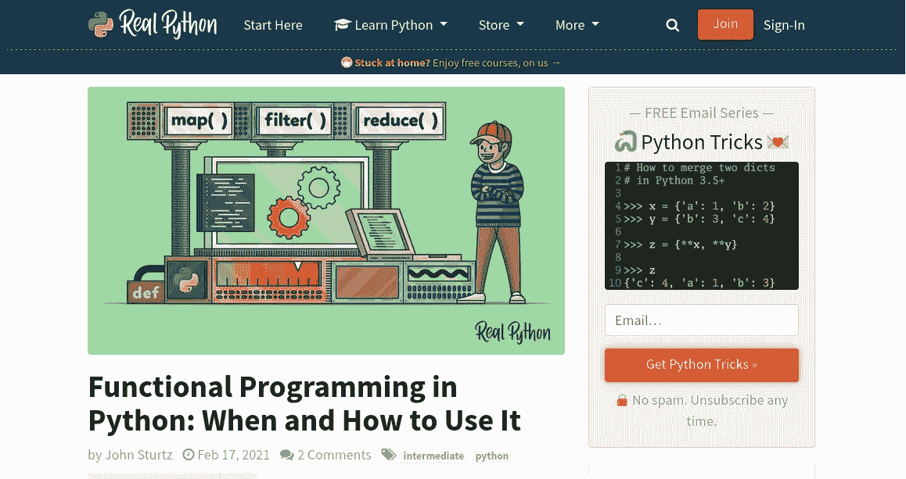
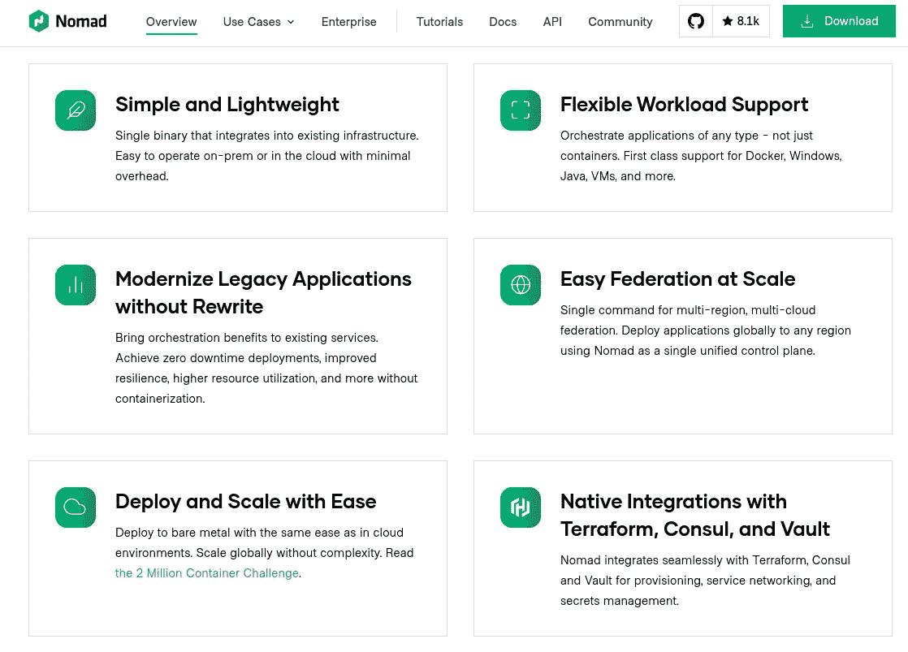
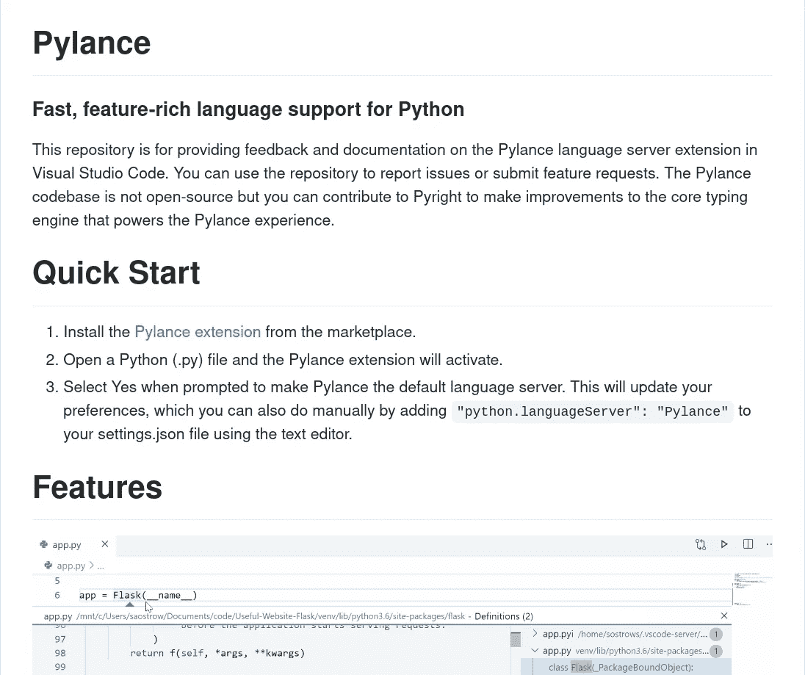

# 科学短片#1:函数式编程、Nomad & Pylance

> 原文：<https://medium.com/mlearning-ai/science-shorts-1-functional-programming-nomad-pylance-906e238ed725?source=collection_archive---------3----------------------->

有用的`python`函数为“大数据”处理做准备， *Nomad* 相对于 *Kubernetes* 和 *Visual Studio Codes* 的下一代代码完成 *Python* 的优势。

# 范围

链接到关于*数据科学*的三个有趣而广泛的主题，从理解`python`的关键特性作为一种准备处理“大数据”的方法，到使用 *Dask* 和 *PySpark* 等库。 *Nomad* 作为*的替代产品，Kubernetes* 作为容器编排器，涵盖了*数据科学*的全部活动，从*数据摄取*到模型部署再到*数据可视化*。最后，介绍一下*微软*的下一代*代码*完成引擎，它是对之前*语言服务器协议* (LSP)的扩展。

# 介绍

以下三篇文章是从我的*袖珍*清单中随机选取的，这份清单是我过去 5 年在*数据科学*领域策划的；动机和背景在以前的帖子中讨论过: [*数据科学短片*:我的*口袋*清单](https://aero-data-science.medium.com/science-shorts-an-introduction-to-my-pocket-list-fb915c4569f2)介绍。

# 用 Python 进行函数式编程

Real Python article on Functional Programming | Screenshot by Author | Article and Artwork by Real python

## 摘要

[*RealPython*](https://realpython.com/) (万物`python`的优秀资源)最近发表了一篇关于 Python 中 [*函数式编程的文章。我并不提倡在*数据科学*中使用函数式方法，但是这篇文章详细讨论了`python`的特性，了解这些特性是很有用的，比如`lambda`函数、`map`、`filter`和`reduce.`的使用*](https://realpython.com/python-functional-programming/)

## 语境

这些函数本身很有用，但是它们也是对使用 *Spark* 尤其是 *PySpark* 进行分布式计算的一个很好的介绍。例如，`map`将函数应用于可迭代或可迭代集合中的每个项目:

假设每个 iterable(一个`set`、`list`或其他 iterable)驻留在不同的节点上，并且您需要对每个项应用一个函数。这很容易成为潜在的并行操作，因为该函数可以独立地应用于每个节点，并且如果需要，可以在最后收集。类似地，`filter`函数可以应用于每个节点，如果需要合并结果，它类似于`reduce`函数。

用 [*PySpark*](https://spark.apache.org/docs/0.9.0/python-programming-guide.html) 分发数据的行为是通过一个 *SparkContext* ( `sc`)及其`parallelize`函数来完成的，如下例所示:

这两个例子之间有许多关键的变化；首先创建了一个局部`SparkContext`，细节将在以后的帖子中展开。和前面的例子一样，定义了一个函数将数字 3 加到一个示例数组中。 *Spark* 的优势在于将计算分布在许多节点上，在本例中，它是通过`sc.parrallelize`函数完成的，该函数返回一个*弹性分布式数据集* (RDD)。这实际上将数据分布在可用的节点上。

`rdd.map()`功能与`python`中的`map()`功能完全相同。关键区别在于 iterable 仍然是分布式的，这就是为什么在`for`循环中打印之前必须使用`.collect()`来收集它。这表明理解和利用分布式计算的敲门砖是理解`python`的内置函数`map`、`filter`和`reduce`(技术上必须从`functools`导入)。

# 使用 Nomad 进行容器编排

Container Orchestration with Nomad | Screenshot by Author | Article and Artwork by HashiCorp

## 摘要

[*Nomad*](https://www.nomadproject.io/) 是类似于[*Kubernetes*](https://kubernetes.io/)*(K8s)的工作负载和容器编制器。有专门的文档来[解释差异](https://www.nomadproject.io/docs/nomad-vs-kubernetes)。本质上， *Kubernetes* 主要使用基于`docker`的容器，提供工作负载协调、服务发现、秘密管理和其他相关服务来实现端到端能力。*相比之下，Nomad* 支持广泛的容器和虚拟机架构，但只专注于工作负载协调。它使用相关技术，例如用于服务网格的 [*Consul*](https://www.consul.io/) 和用于秘密管理的 [*Vault*](https://www.vaultproject.io/) ，但是这些是独立的实体，没有捆绑在一起。*

## *语境*

*当前的“行业标准”平台基于 *Kubernetes* ，由 *Google* 创建，目前由 [*云本地计算基金会*](https://www.cncf.io/) (CNCF)管理。重要的是要注意其他容器编排器的存在，在 *Nomad* 的情况下，它尊重 *Unix* 单一目的程序的哲学。在实践中，这意味着单个二进制文件可以用于生产、开发甚至“边缘”。*

*相比之下，有大量的 *Kubernetes* 发行版，其中一些使用了 [*Hashicorp*](https://www.hashicorp.com/) 元素，如 *Consul* 和 *Vault* ，由来自*Canonical*(*Ubuntu*的开发者)的[*Charmed Kubernetes*](https://ubuntu.com/kubernetes/features)等多个提供者提供。边缘设备(即*物联网* (IoT))有*牧场主*(最近被 *SUSE* 收购)的`[k3s](https://k3s.io/)`或 *Canonical 的`[microk8s](https://microk8s.io/)`。*对于开发，相同的工具可以在本地机器或[*Docker Desktop*](https://www.docker.com/products/docker-desktop)(仅用于 *Windows* 和 *MacOS* )上使用，这提供了单个 *K8s* 节点。对于 *Nomad* ，所有用例只有一个二进制文件。*

*虽然，对于数据科学本身来说，平台本身可能不是首要考虑的问题，但是理解高级系统是一个好的实践，T42 数据科学家必须与之集成。在这种情况下， *Nomad* 提供了扩展到 10，000 个节点的能力，而 *Google* 和 *Kubernetes* 只能实现集群规模的五分之一。*

# *pylance:Visual Studio 代码中的下一代 Python 支持*

**

*Pylance GitHub Repo README.md | Screenshot by Author*

## *摘要*

*2020 年 6 月， *Visual Studio Code* 团队宣布发布他们的 [*Pylance 语言服务器*](https://github.com/microsoft/pylance-release) (PLS)，作为对长期支持 *Python* 和 [*语言服务器协议*](https://microsoft.github.io/language-server-protocol/) (LSP)的最终替代。它的优势已经在*媒体*上 [*对数据科学*](https://towardsdatascience.com/pylance-the-best-python-extension-for-vs-code-ae299f35548c) 和其他地方进行了广泛的讨论。值得注意的是，最初的 LSP 被其他编辑器通过插件广泛使用。*

**Pylance* 和 LSP 之间的关键区别是在存根文件( [PEP-0561](https://www.python.org/dev/peps/pep-0561/) )中使用了 *Python* 类型信息，存根文件具有扩展名`.pyi`，可以包含关于函数或类的丰富信息。这使得 *Pylance* 能够支持严格的类型检查和潜在的模块自动导入。*

## *语境*

*LSP 的当前实现是有效的，但是不支持一些常见的*数据科学*到 *Python* 的方法。对存根文件的支持意味着社区可以以一种标准的方式提供其中的一些特性，编辑器可以利用这些特性。很高兴看到 *VS 代码*回应来自*人工智能* (AI)的代码完成引擎的挑战，如 [*风筝*](https://www.kite.com/) 。*

# *结论*

*我的袖珍列表中的三篇文章已经被分享、总结并提供了背景。在`python`中使用`map`、`filter`和`reduce`，为分布式计算做好准备。当前无处不在的 *Kubernetes* 平台的替代方案，使用一个潜在的更轻、更简单和更可扩展的系统，使用 *Nomad* 。最后，一篇关于 *Pylance* 优于 LSP 的有趣文章。*