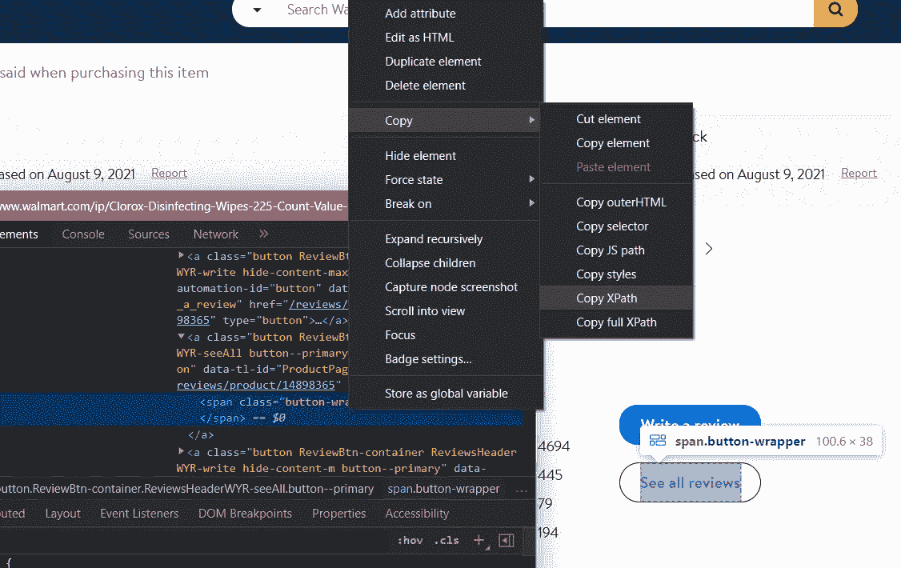
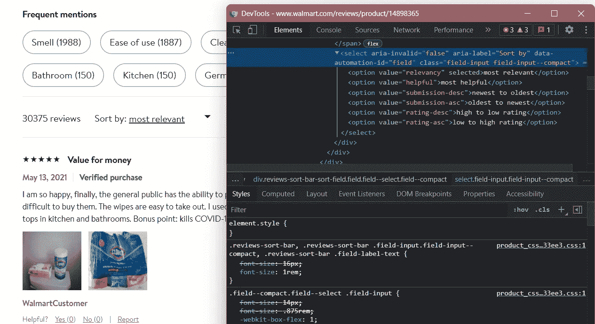
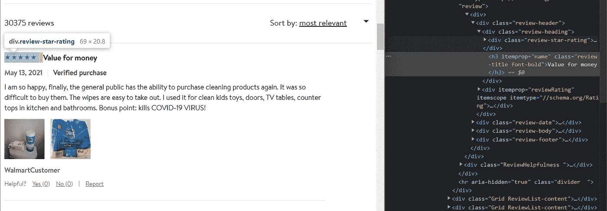
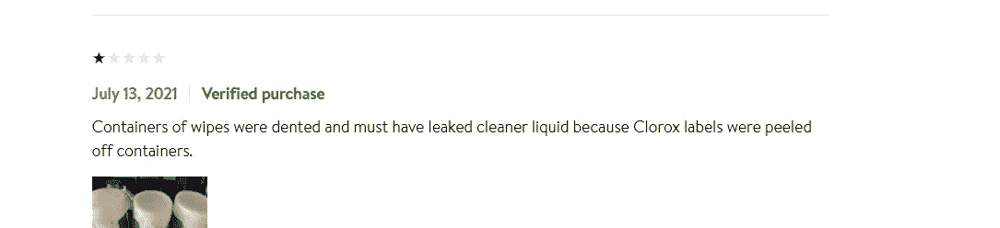

# 使用 Selenium 抓取沃尔玛产品评论

> 原文：<https://medium.com/mlearning-ai/scraping-walmart-product-reviews-using-selenium-a8c22ca37479?source=collection_archive---------1----------------------->


Photo by [Markus Winkler](https://unsplash.com/@markuswinkler?utm_source=medium&utm_medium=referral) on [Unsplash](https://unsplash.com?utm_source=medium&utm_medium=referral)

## 二手熊猫，美丽心灵&硒网络驱动

本文将着重于构建一个 web scraper，它模拟了在沃尔玛上抓取产品评论所必需的一组浏览器动作。 [Selenium](https://www.browserstack.com/selenium) 提供了一些很棒的功能，帮助我们自动测试网页。对于我们的用例，我们将使用其中一些功能来自动化我们的刮刀，而不是让它需要人力。该数据可进一步用于 [BERT](https://en.wikipedia.org/wiki/BERT_(language_model)) 分析和其他 NLP 用例。

 [## 硒:定义，如何工作，为什么你需要它

### Selenium 实现了 web 浏览器的自动化。它最著名的是支持快速、可重复的网络应用测试，这允许…

www.browserstack.com](https://www.browserstack.com/selenium) 

Web 抓取是以自动方式收集结构化 web 数据的过程。web 抓取的一些主要使用案例包括价格监控、价格情报、新闻监控、潜在客户挖掘、市场调研等等。如果你曾经从一个网站上复制并粘贴信息，你已经完成了与任何网页抓取器相同的功能，只是在微观的手动范围内。

在`[requests](https://pypi.org/project/requests/)`库上工作的网页抓取器是半自动的，通常是针对特定问题的硬编码。另一方面，机器人用于有 T2 的大型网站，模拟浏览器行为。对于本文，我们将使用 chromedriver 来集成我们的浏览器和脚本。试着想象一下，雇佣一个人来完成从沃尔玛 1000 多页中获取对你产品的评论的任务。

你可以**下载**脚本并**对任何产品执行**这里:[https://github.com/preetshah7/walmart_scarper](https://github.com/preetshah7/walmart_scarper)

下面是我们的 web scraper 的一步一步的概要:

1.  设置 Selenium 驱动程序并在浏览器上获取产品 URL
2.  通过定位点击标签获得评论页面
3.  循环浏览审核所需的页数
4.  用所有评审属性清理数据并呈现输出

# 设置 Selenium 驱动程序并在浏览器上获取产品 URL

首先，我们将安装这个刮刀所需的库。

```
pip install selenium
pip install beautifulsoup4
```

在这里获取 selenium 的驱动程序:[chromedriver.chromium.org/downloads](https://chromedriver.chromium.org/downloads)

现在，通过将我们先前下载的驱动程序路径配置到 selenium webdriver 中来创建`browser`对象。使用`get`属性打开我们的产品 URL。

我们已经成功地在 Selenium 上设置并运行了一个基本操作。

[](https://pypi.org/project/beautifulsoup4/) [## beautifulsoup4

### 美汤是一个库，可以很容易的从网页上抓取信息。它位于 HTML 或 XML 之上…

pypi.org](https://pypi.org/project/beautifulsoup4/) 

# 通过定位点击标签获得评论页面

## 转到“查看所有评论”页面



Inspect the elements and copy the Xpath

为了执行所有的点击动作，我们使用 Selenium 的[动作链](https://www.selenium.dev/selenium/docs/api/py/webdriver/selenium.webdriver.common.action_chains.html)。

使用隐式等待命令让网页在出错前加载&从 URL 获取产品 id。

## 从下拉列表中选择“从最新到最早”



The Dropdown list

找到下拉列表的 Xpath 并使用`Select`，它模拟了从列表中选择元素的手动操作。

我们已经自动执行了进入评论页面的操作。

# 循环浏览审核所需的页数



Tags for the different review attributes

我们的审查需要 5 个属性:审查日期，审查人姓名，审查标题，审查机构和评级。我们可以很容易地找到每个标签。

> 评论的标题是一项艰巨的任务，因为有遗漏的价值。我尝试了很多东西，但最后，我使用了包含评论标题下标题标签的列表长度作为布尔值，以决定是否通过标题或 nan 值追加我们的平铺列表。



Reviews without a title

此外，我们实施以下步骤:

*   使用`browser`对象在所需范围内循环查看页面。我们可以设置循环浏览的页数。
*   使用`browser`的`page_source`属性创建一个 BeautifulSoup 对象。
*   初始化循环中所有审核属性的列表。通过使用`soup.findAll.`找到属性标签，在列表理解中添加列表
*   为我们的列表创建一个字典，最后通过这个字典添加我们之前生成的熊猫数据帧。设置`ignore_index=True.`

We have successfully made a DataFrame of the reviews

> 我得到一个大小不匹配的错误，因为“评论”列表的大小不匹配。我注意到该页面的评论评级比评论数量(平均评级等)多。我在父类上实现了一个匹配，以获得实际的评分值。

# 用所有评审属性清理数据并呈现输出

数据帧看起来不干净，也不容易查询。这里一个聪明的做法是将“日期”列转换成日期时间索引。我查询过 2010 年 12 月**以后的数据，比如**。方法从我们的数据中删除不需要的子字符串。

这样，我们就有了最终的输出。我们已经成功地创建了一个全自动的网页抓取器来抓取产品评论。输出:

Final Output

查看此视频，更好地了解铲运机的运行方式:

> 提示:如果你是新手，我建议你使用以下任何一种浏览器——Chrome、Edge、Firefox 或 Safari。我浪费了相当长的时间用 chromedriver 运行 Brave，因为它们具有相同的架构，所以我将二进制文件设置为 Brave，后来意识到同一网站的标签在上面的命名不同。

*   如果你还想在 Brave 上试试，你可以这样开始:

Credits: Stackoverflow

*   有时，隐式等待方法被证明是低效的。因此，您可以使用 waits 方法显式显示一个元素，当加载该元素时，脚本会进一步执行。方法如下:

# 摘要

以下是我们构建 web scraper 所遵循的一步一步步骤的总结:

1.  设置 Selenium 驱动程序并在浏览器上获得产品 URL
2.  通过定位点击标签获得评论页面
3.  循环浏览审核所需的页数
4.  用所有的评审属性清理数据并呈现输出

# 未来的工作

*   我们可以整合多个网购平台。
*   对于其他平台，按钮的标签和类名会有所不同。因此，我们可以将它们添加到脚本中，并通过查询 URL 的字符串来使它们工作。
*   我们可以传递产品名称并创建一个动作链，在搜索栏中键入它，而不是解析网站。

# 参考

*   [Selenium ActionChains 文档](https://www.selenium.dev/selenium/docs/api/py/webdriver/selenium.webdriver.common.action_chains.html)
*   [https://beautiful-soup-4.readthedocs.io/en/latest/](https://beautiful-soup-4.readthedocs.io/en/latest/)
*   [https://www.youtube.com/watch?v=SuV3uvzr6lI](https://www.youtube.com/watch?v=SuV3uvzr6lI)