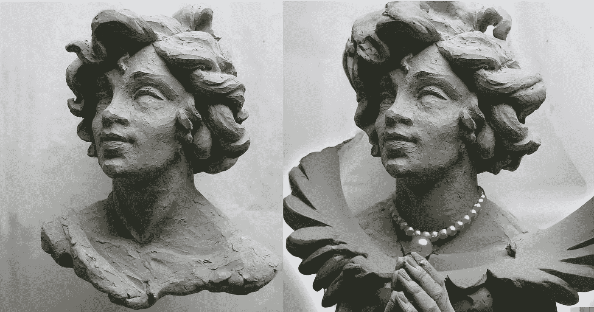

# 用 DALL E 2 雕刻

> 原文：<https://medium.com/mlearning-ai/sculpting-with-dall-e-2-41d4bf708678?source=collection_archive---------3----------------------->

## [机器学习艺术](https://mlearning.substack.com)

## 2022 年开始制作人工智能艺术

[Created with DALL·E, an AI system by OpenAI](https://mlearning.substack.com)

本文描述了由 **DALL E 2 驱动的新雕刻工艺。**这是项目 [myFatherintheCloud.ai 的一部分](/mlearning-ai/how-i-use-gpt3-in-my-art-61e0a2d07f2)我将向你展示最新的[扩散模型](/mlearning-ai/the-gan-is-dead-long-live-the-dall-e-2-5a7e4d847179)如何处理生成不存在的雕塑碎片。