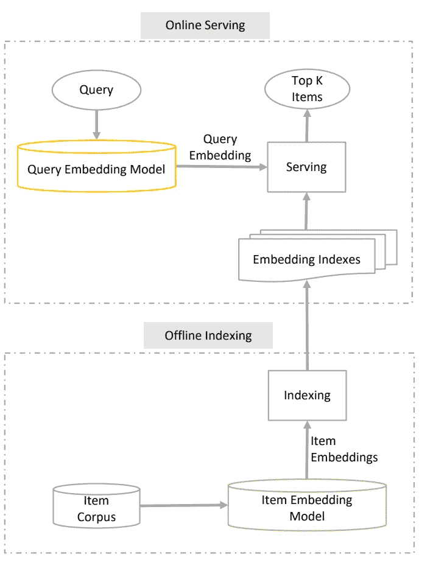
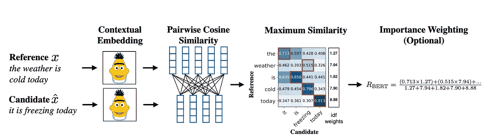
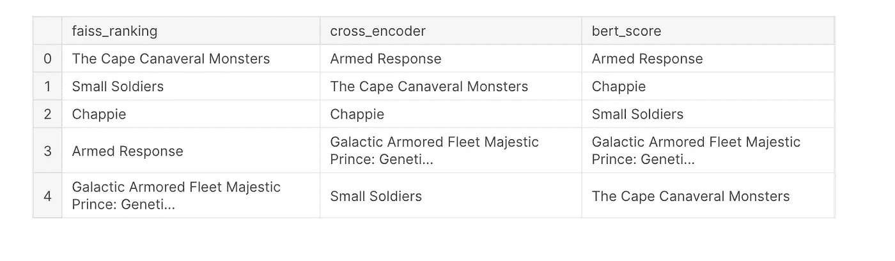
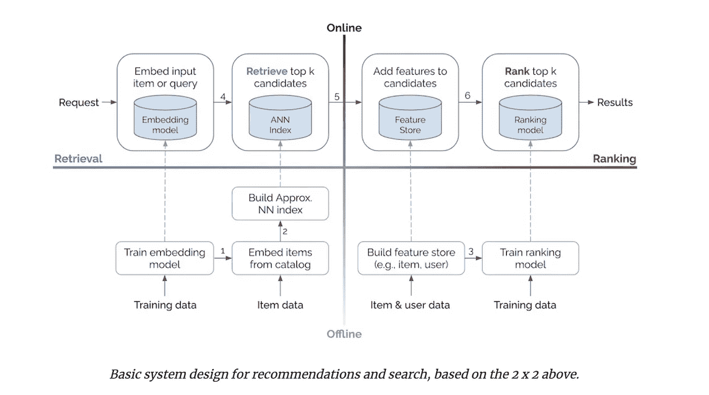
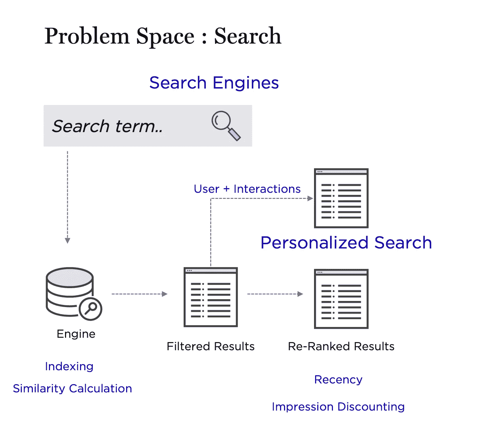
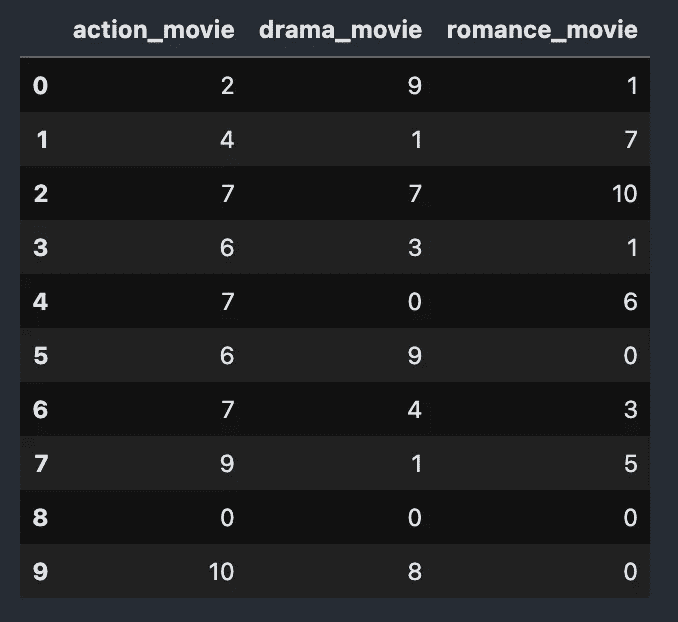
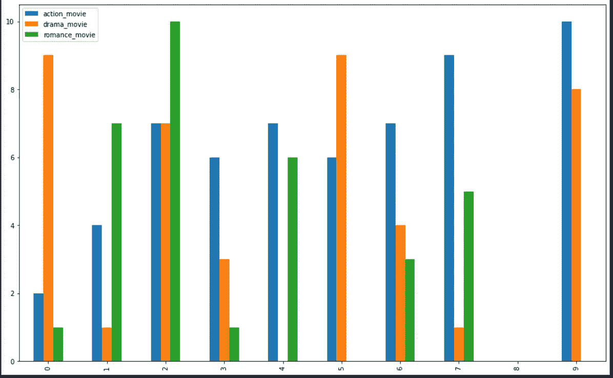
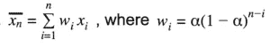
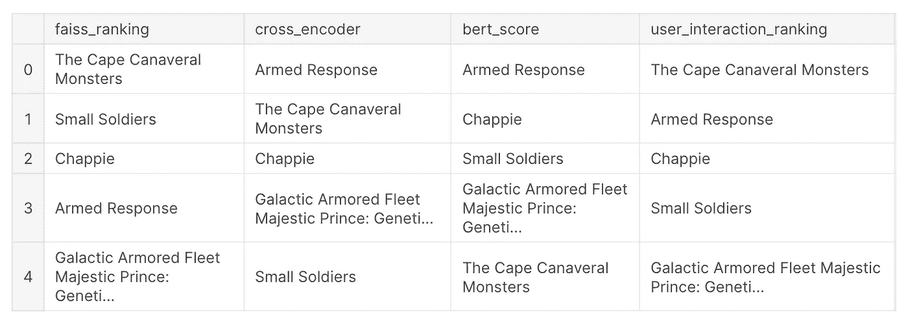

# 搜索、排名和推荐

> 原文：<https://medium.com/mlearning-ai/search-rank-and-recommendations-35cc717772cb?source=collection_archive---------0----------------------->

## 重新排列搜索结果和个性化推荐的简单方法。

这篇文章是我上一篇文章****的延续，用 S-BERT 进行语义搜索就是你所需要的全部****

**[](/mlearning-ai/semantic-search-with-s-bert-is-all-you-need-951bc710e160) [## 使用 S-BERT 进行语义搜索是您所需要的

### 从头开始构建内部语义搜索引擎—快速而准确

medium.com](/mlearning-ai/semantic-search-with-s-bert-is-all-you-need-951bc710e160) 

我们在上一篇文章中提到的内容:



The architecture we have already discussed

*   搜索类型:不对称和对称
*   基于点积和余弦积的模型
*   嵌入存储(FAISS)
*   合成查询生成
*   双编码器微调

我们留下了一些重要的问题:

*   结果重新排序的方法
*   结果的质量，如何内联到用户查询。
*   如何在推荐结果中融入用户行为

# 入门:概述

搜索排名和推荐是主要互联网公司非常感兴趣的基本问题，包括网络搜索引擎、内容发布网站和市场。然而，尽管有一些共同的特征，但在这一领域并不存在一刀切的解决方案。考虑到需要分级、个性化和推荐的内容的巨大差异，每个市场都有一些独特的挑战。

搜索和推荐有很多共同点。他们帮助用户了解新产品，并需要在很短的时间内检索和排列数百万个产品(<150ms). They’re trained on similar data, have content and behavioral-based approaches, and optimize for engagement (e.g., click-through rate) and revenue (e.g., conversion, gross merchandise value).

**)尽管如此，搜索在一个关键方面有所不同——它将用户的查询作为额外的输入。**(将搜索视为推荐，将查询视为额外的上下文。)这是福也是祸。这是一个福音，因为查询提供了更多的上下文来帮助我们帮助用户找到他们想要的东西；这是一个祸根，因为用户希望结果与他们的查询相符。

搜索和推荐系统的一个常见架构由以下组件组成:

*   候选生成
*   得分
*   重新排名

在上一篇文章中，我们了解了如何通过更好地理解数据和微调我们的模型来创建一个**概念搜索**，从而为用户搜索查询生成更好的候选。

然而，检索系统可能检索与搜索查询不相关的文档。因此，在第二阶段，我们使用基于**交叉编码器**的**重排序器**，其对给定搜索查询的所有候选项的相关性进行评分。

## 交叉编码器

C.e 对给定的输入和候选标签进行完全的(交叉的)自我注意，并且倾向于获得比他们的对手高得多的准确度。每当我们有一组预定义的想要评分的句子对时，就可以使用交叉编码器。

基于交叉编码器的重排序器可以显著改善用户的最终结果。查询和可能的文档被同时传递到 transformer 网络，然后 transformer 网络输出一个介于 0 和 1 之间的分数，表示该文档与给定查询的相关程度。

因为我们处理的是电影情节，所以我传递了用户查询并检索了情节。

[](https://github.com/99sbr/semantic-search-with-sbert) [## 99sbr/带 sbert 的语义搜索

### 使用 S-BERT 构建语义搜索，并以无人监管的方式微调您的模型

github.com](https://github.com/99sbr/semantic-search-with-sbert) 

卡格尔内核:[https://www.kaggle.com/sbrvrm/search-ranking](https://www.kaggle.com/sbrvrm/search-ranking)

```
def cross_score(model_inputs):
    scores = cross_model.predict(model_inputs)
    return scores

model_inputs = [[query,item['Plot']] for item **in** results]
scores = cross_score(model_inputs)
*#Sort the scores in decreasing order*
ranked_results = [{'Title': inp['Title'], 'Score': score} for inp, score **in** zip(results, scores)]
ranked_results = sorted(ranked_results, key=lambda x: x['Score'], reverse=True)
```

之前:

```
query="Artificial Intelligence based action movie"
results=search(query, top_k=5, index=index, model=model)Results:
'Title': 'The Cape Canaveral Monsters'
'Title': 'Small Soldiers'
'Title': 'Chappie'
'Title': 'Armed Response'
'Title': 'Galactic Armored Fleet Majestic Prince: Genetic Awakening'
```

使用交叉编码器并将结果与分数排序后:

```
'Title': 'Armed Response'
'Title': 'The Cape Canaveral Monsters'
'Title': 'Chappie'
'Title': 'Galactic Armored Fleet Majestic Prince: Genetic Awakening'
'Title': 'Small Soldiers'
```

## BERT-score ( **Bert 令牌嵌入+令牌 IDF 权重**)

BERTScore 利用来自 BERT 的预训练上下文嵌入，并通过余弦相似度匹配候选和参考句子中的单词。它已被证明与人类对句子级和系统级评估的判断相关。此外，BERTScore 还计算精确度、召回率和 F1 值，这对于评估不同的语言生成任务非常有用。



Bert score

以我们的查询作为参考，以结果作为候选，我们计算 BERT 得分 f1。

```
ranked_results_bert = []

for cand **in** results:
    P, R, F1 = score([cand['Plot']], ref, lang='en')
    ranked_results_bert.append({'Title': cand['Title'], 'Score': F1.numpy()[0]})Results:'Title': 'Armed Response'
'Title': 'Chappie'
'Title': 'Small Soldiers'
'Title': 'Galactic Armored Fleet Majestic Prince: Genetic Awakening'
'Title': 'The Cape Canaveral Monsters'
```



Re-ranking Summary

下图大致代表了我们在本系列中所涉及的内容，我们没有讨论的是在显示结果或基于过去的搜索执行新的推荐时考虑用户行为。



credit: Eugene Ryan

# 使用嵌入的搜索中的个性化



Capturing User Interactions in Personalized Search

现在，了解用户行为可以通过他过去的项目交互/搜索或类似的兴趣用户来完成，众所周知，每个人都是基于内容的协作推荐者。这些不仅有助于推荐，也有助于排名结果。

*在我们跳到任何公式之前，让我们明白仅仅推荐东西也依赖于项目的新近性和频率。用户最近浏览或观看的电影类型反映了他最近的品味和兴趣领域，因此我们可能希望在推荐结果项目时给它一个权重，同时将频率因素考虑在内*。

仅以电影为例。**用户 A** 已经观看或与 **3 种类型**的电影互动，比如动作片、剧情片和爱情片。

下面的数据显示了每周与每种电影类型的互动历史。这清楚地表明，用户的口味更倾向于动作片，而对爱情片的亲和力下降了。



10-week User history

我们使用指数最近加权平均公式来汇总用户浏览历史。下面是为您推荐的**(RFY 车型)**配方:



RFY Weightage Formula

这符合我们的假设，即最近的浏览数据对下一个动作的预测贡献最大。
***x(i)是我们的项目向量，w(i)是基于其新近性分配的权重。***

**对于α= 0.5，较高的值“*I”*将被分配较高的权重。** 我修改了上面的一点点，在得到加权向量之前，在所有项目权重上添加了 softmax。

```
***************  method-1   ****************
>> softmax(np.asarray([weight(10), weight(8), weight(0)]))
array([0.43589772, 0.29958783, 0.26451446])
```

我只计算了最近的浏览数据，并计算了电影各自类型的权重。但它没有考虑过去 9 周的时间。因此，让我们考虑给出距离分数的东西，记住完整的用户观看历史数据分布，即 **z 分数。**

> action _ movie _ zscore = stats . zscore(user _ watch _ hist[' action _ movie '])[-1][-1]drama _ movie _ zscore = stats . zscore(user _ watch _ hist[' drama _ movie '])[-1]romance _ movie _ zscore = stats . zscore(user _ watch _ hist[' romance _ movie '])[-1]

```
***************  method-2   ****************
>> x = np.asarray([action_movie_zscore, drama_movie_zscore, romance_movie_zscore])
>> softmax(x)
array([0.56467654, 0.38601828, 0.04930517])
```

Z-score 更易于计算和维护，并且是反映当前观察值离平均值有多远的强大指标。
从方法-1 和方法-2 的 softmax 输出中可以清楚地看出，后者在其得分中具有更多的用户行为相关性。
**基于 z 分数的 softmax 方法**的额外好处是针对目录中新添加或最近添加的流派。假设你有一个新的流派，那么你添加一个对应于该流派的 z 值“0”。

```
>> x = np.asarray([action_movie_zscore, drama_movie_zscore, romance_movie_zscore, 0])
>> softmax(x)
array([0.49878136, 0.34097171, 0.04355148, 0.11669544])
```

从权重分数可以看出，它赋予了比言情电影更多的权重，所以你最终的推荐在推荐上会有多样性和新鲜感。

```
 from sentence_transformers import SentenceTransformer, util#Compute embeddings of retrieved candidate movie plots
embeddings = model.encode(candidate_plots)#Compute cosine-similarities for each plot with user vector
cosine_scores = util.pytorch_cos_sim(**user_encoded_vector**, embeddings)#Find the pairs with the highest cosine similarity scores
titles = [x[‘Title’] for x in results]ranked_user_behaviour = [{‘Title’:x ,’Score’: y} for x,y in zip(titles,cosine_scores.numpy()[0])]
ranked_user_behaviour = sorted(ranked_user_behaviour, key=lambda x: x[‘Score’], reverse=True)
```



Comparison Table

我们使用用户行为( **user_encoded_vector** )来重新排列显示给**用户 A** 的输出。

当他返回主页时，我们使用相同的 **user_encoded_vector** 获取最近邻居的电影，并推荐他观看。推荐会有很多动作片、戏剧和浪漫片。

```
#codet=time.time()
query_vector = user_encoded_vector
top_k = index.search(query_vector, 20)
top_k_ids = top_k[1].tolist()[0]
top_k_ids = list(np.unique(top_k_ids))
[fetch_movie_info(idx) for idx **in** top_k_ids]#output>>>> Recommendation Results in Total Time: 0.03316307067871094[{'Title': 'Key Witness'},
 {'Title': 'The Good Mother'},
 {'Title': 'Fire on the Amazon'},
 {'Title': 'Bang'},
 {'Title': 'How to Make a Monster'},
 {'Title': 'Hammers Over the Anvil'},
 {'Title': 'The Nursemaid Who Disappeared'},
 {'Title': 'Third Person'},
 {'Title': 'You Were Never Really Here'},
 {'Title': 'Shadow Dancing'},
 {'Title': 'Remembrance'},
 {'Title': 'Small Town Murder Songs'},
 {'Title': 'Eadweard'},
 {'Title': 'Caught in the Web'},
 {'Title': 'Bounty Hunters'},
 {'Title': 'Fulltime Killer'},
 {'Title': 'Amar'},
 {'Title': 'SMS'},
 {'Title': 'JAKQ Dengeki Tai'},
 {'Title': 'Gekijō-ban Tiger & Bunny -The Beginning'}]
```

代码:

[](https://github.com/99sbr/semantic-search-with-sbert/blob/main/search-ranking.ipynb) [## 99sbr/带 sbert 的语义搜索

### 使用 S-BERT 构建语义搜索，并以无人监督的方式微调您的模型

github.com](https://github.com/99sbr/semantic-search-with-sbert/blob/main/search-ranking.ipynb) 

## 接下来呢？

*   BERT4Rec:来自 Transformer 的双向编码器表示的顺序推荐
*   使用用户数据训练 PRM(个性化重新排序模型)
*   通过增强用户地理和元特征来解决冷启动问题
*   图表:从用户或项目的邻居处学习
*   项目 2 项目相似性
*   基于 RFM 的客户细分，实现有针对性的推荐和品牌推广。**