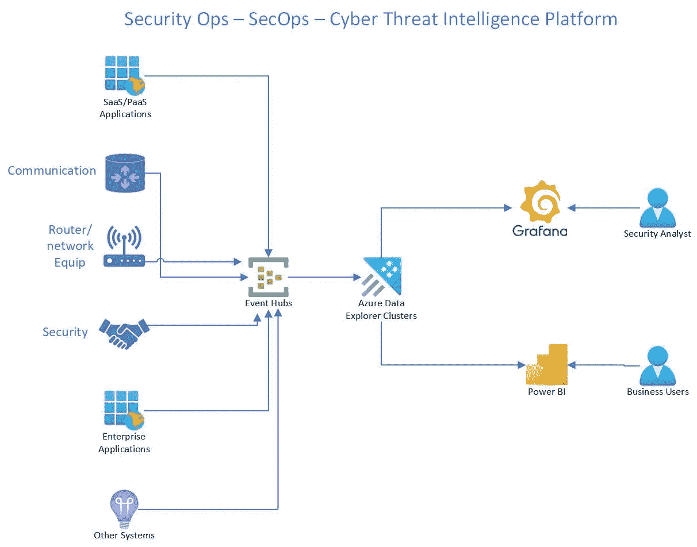
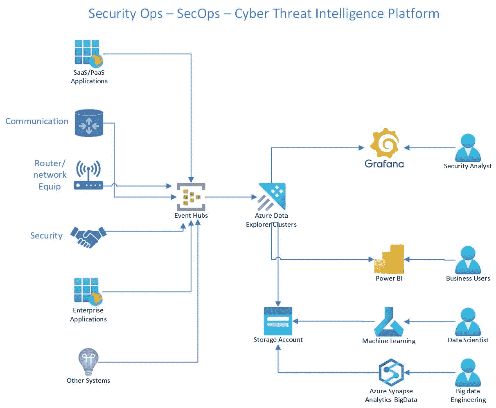

# 使用 Azure Data Explorer 的 SecOps 分析平台架构(Azure Synapse Analytics 的一部分)

> 原文：<https://medium.com/mlearning-ai/secops-analytics-platform-architecture-using-azure-data-explorer-part-of-azure-synapse-analytics-db0a55ca0a5b?source=collection_archive---------3----------------------->

# 构建您自己的安全分析平台

# 用例

*   鉴于网络安全是所有组织的一个大问题，我们需要建立一个平台来分析安全事件，并为安全团队采取行动提供见解。
*   没有一个组织会局限于一种工具来运行他们的业务
*   对于组织中使用的所有系统和工具来说，安全性是一个大问题
*   目标是从不同工具中收集所有安全事件，并对其进行分析，以便为安全团队提供见解
*   能够进行网络威胁分析，并为安全团队提供见解
*   向 CISO 和安全团队提供网络威胁情报
*   构建安全分析平台也面临许多挑战
*   大多数人关注技术空间
*   有些是在基础设施领域
*   有些是在应用领域
*   我们如何构建能够涵盖以上所有内容的东西
*   我们如何处理物理、虚拟和网络安全
*   假设我们所有的东西都在计算机上运行，我们如何构建一个可以分析所有安全事件的平台

# 目标

*   构建一个平台，可以分析来自不同工具和来源的所有安全事件
*   能够敏捷地添加新的资源和工具
*   能够敏捷地发现新的威胁和洞察
*   能够进行根本原因分析
*   不是一个完整的解决方案，而是一个可用于构建完整解决方案的平台
*   能够长时间存储大量数据
*   能够进行实时特别分析
*   没有预烤仪表板，但能够建立自己的仪表板
*   能够发现新的使用案例和威胁

# 体系结构

# 建筑说明

*   上面的建筑从左到右
*   左边是我们所有的来源
*   来源可以是任何系统或应用程序
*   收集的所有数据都流经事件中心，事件中心的作用类似于摄取代理
*   活动中心可以根据需要进行扩展。
*   从事件中心 Azure data explorer 有一个连接器来拉事件中心数据并存储在临时表中
*   然后我们可以用适当的模式转换成最终的表
*   现在有很多可能的模式改变
*   我们可以将数据作为动态模式，然后转换成最终的模式以适应源，从而保留业务逻辑
*   Azure Data explorer 可以选择只通过配置来存储热和冷数据
*   Azure data explorer 的规模也可以根据需要进行调整
*   使用 Azure Data explorer 将冷数据引入查询也非常简单
*   为规模和灵活性而设计
*   成本优化设计
*   不需要做 ETL/ELT 工作
*   如果需要，我们可以使用带有 Azure data explorer 连接器的 Azure Synapse Spark 来扩展数据处理
*   下面你会看到 Azure data explorer 的架构扩展到大规模机器学习
*   还能够使用 spark 集群处理大数据

*   大多数即席分析都可以使用 Azure data explorer 来执行
*   库斯托语是一种非常强大的语言
*   也有能力做机器学习，如预测，异常检测，聚类
*   如果你想根据数据的大小和复杂程度建立自己的模型，你可以使用 Azure Synapse Spark 和 Azure data explorer connector
*   现在，为什么我们需要多种选择，不是所有机器学习或深度学习的用例都需要大量数据，在这种情况下，Azure 机器学习更快，并提高生产率
*   如果数据集大小增加，那么我们必须使用 Azure Synapse Spark 来获得并行性和规模
*   上述架构也可以是市场上现有网络安全工具的扩展

原文[samples 2022/secopsplatform . MD at main balakreshnan/samples 2022(github.com)](https://github.com/balakreshnan/Samples2022/blob/main/SecOps/secopsplatform.md)

 [## Mlearning.ai 提交建议

### 如何成为 Mlearning.ai 上的作家

medium.com](/mlearning-ai/mlearning-ai-submission-suggestions-b51e2b130bfb)