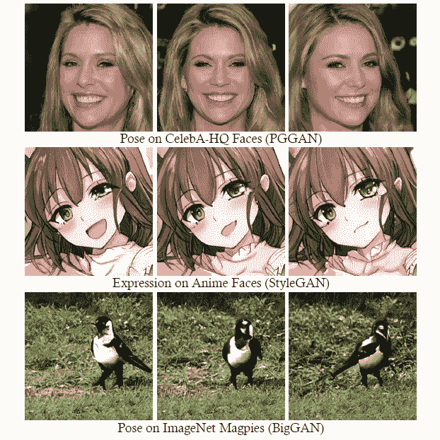

# SeFa——在潜在空间中寻找语义向量

> 原文：<https://medium.com/mlearning-ai/sefa-finding-semantic-vectors-in-latent-space-for-gans-9573c557f21e?source=collection_archive---------1----------------------->

## 论文解释:SeFa——GANs 中潜在语义的封闭形式分解

Closed-Form Factorization of Latent Semantics in GANs

# 动机

GANs 中的生成器通常以随机采样的潜在向量 *z* 作为输入，生成高保真图像。**通过改变潜在向量 *z* ，我们可以改变输出图像。**