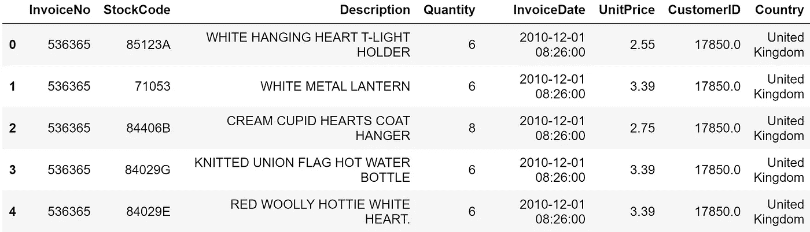
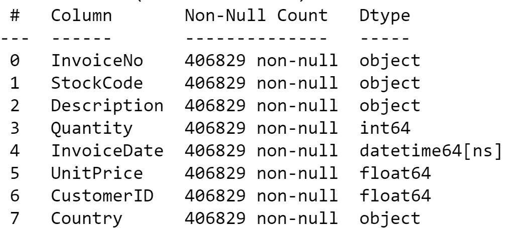
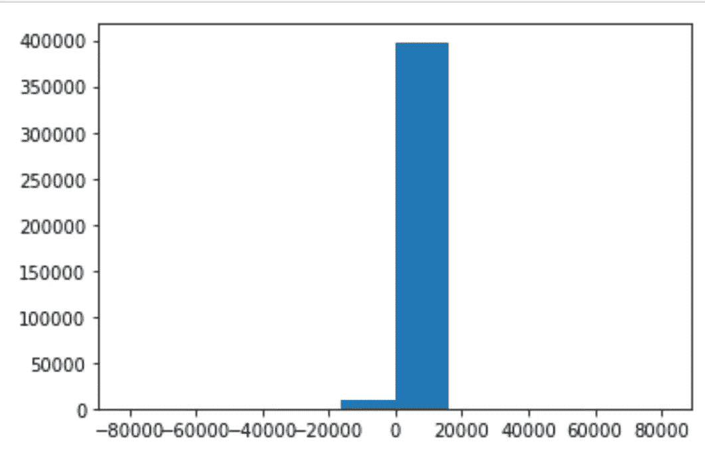
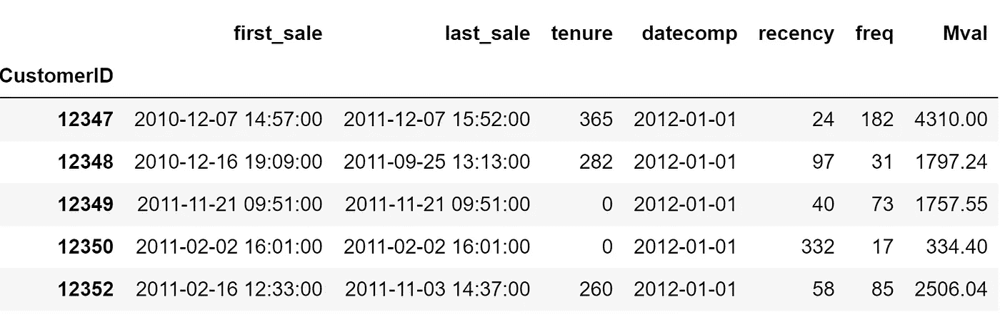
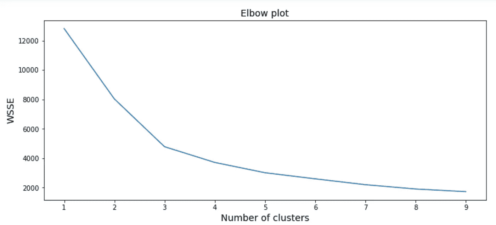
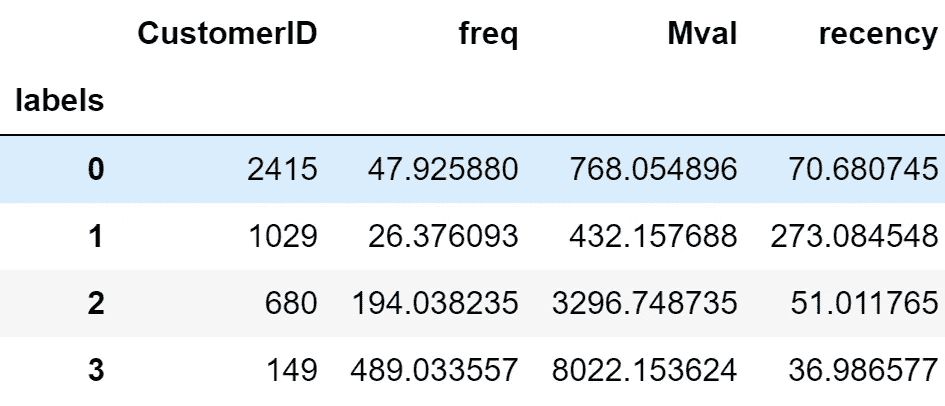
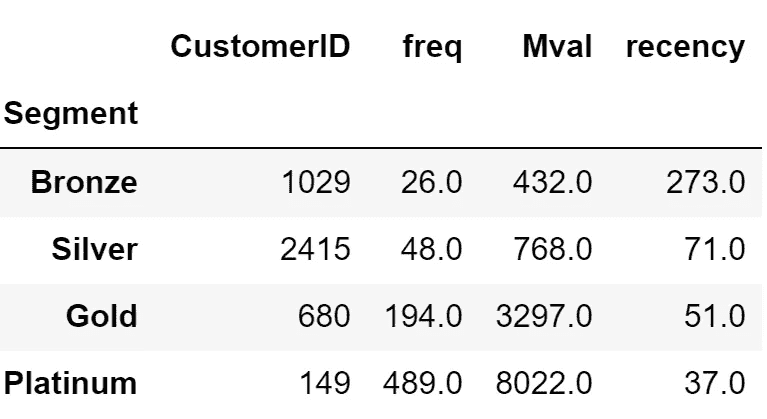

# 使用 RFM 框架进行细分(新近性、频率、货币价值)

> 原文：<https://medium.com/mlearning-ai/segmentation-using-the-rfm-framework-recency-frequency-monetary-value-8bb19ea3b51a?source=collection_archive---------7----------------------->

获取大量客户交易数据集，并基于新近性、频率和货币价值进行细分。

***项目概述-:*** 使用来自在线零售商的交易数据集，根据最近(他们订购的时间)、频率(他们订购的频率)和货币价值(由他们的收入定义)对客户进行细分。该项目概述了从数据清理到结果解释的整个工作流程

***业务需求-:*** 细分客户以识别最具持续价值的客户。

***所用手法-:*** K 表示聚类。尝试通过算法识别细分市场，而不是通过传统分析为每个指标创建十分位数。k 均值创建最明显的聚类/分段，在聚类内具有最大的相似性，在聚类之间具有最大的差异

***步骤 1-:探索性数据分析和数据清理***

导入模块和加载数据

```
import pandas as pd
import matplotlib.pyplot as plt
from sklearn.cluster import KMeans
from sklearn.preprocessing import StandardScaler
import datetime
import seaborn as snsdata=pd.read_excel('onlineretail.xlsx')
data.shape
```

加载数据并运行 shape 方法显示了大约 541，000 个事务，包含 8 列数据

```
data.head()
```



fig 1-: sample 5 rows of the data frame

***处理缺失值***

```
data.dropna(inplace=True)
data.info()
```



fig 2-: Dropping missing values

***处理明显异常值***

```
***#Looking at the distribution for the sales quantity column***
plt.hist(data.Quantity)
plt.show()
```



fig 3-: distribution of sales Quantity

```
Q3=data.Quantity.quantile(0.95)
Q1=data.Quantity.quantile(0.05)
print(Q1," ",Q3)
1.0 36.0
```

*   看起来销售数量列有异常值
*   负的数量看起来像退货。对于这第一次通过，我们将删除它们
*   大多数订单都在 15000 英镑以下或左右
*   95%是每张发票 36 个订单。
*   对于这一轮，我们将筛选数据集，使其少于 1，000 个订单

***步骤 2-:创建指标并创建模型***

***创建新近度量***

```
sales=data.loc[(data.Quantity>=0)&(data.Quantity<1000),:].copy()***#Getting the first and last invoicedate***
sales.sort_values(by=['CustomerID','InvoiceDate'],inplace=True)
first_sale=sales.groupby('CustomerID')['InvoiceDate'].first()
last_sale=sales.groupby('CustomerID')['InvoiceDate'].last()***#Creating merging the dataframes with the last and 1st Date***
sale_date=pd.concat([first_sale,last_sale],axis=1)***#Defining the recency metric*** sale_date['datecomp']=datetime.datetime.strptime('2012-01-01','%Y-%m-%d')sale_date['recency']=(sale_date.datecomp-sale_date.last_sale).dt.days
```

***创建频率度量***

```
***#Creating the frequency Metric***
freq=sales.groupby('CustomerID')['InvoiceNo'].count()***# Adding the Frequency metric to the main dataset*** sale_date['freq']=freq
```

***创建货币价值指标***

```
***#Create a Monetary Value metric***
sales['Monetaryval']=sales.Quantity*sales.UnitPrice
Mval=sales.groupby('CustomerID')['Monetaryval'].sum()***#Adding the Monetary value Metric to the dataset*** sale_date['Mval']=Mval
sale_date
```



fig 4-: Final dataset with Recency, Frequency and Monetary Value

```
***#Selecting only the needed features***
select_df=sale_date.loc[:,['recency','freq','Mval']].copy()***#Standardizing and scaling data***
X=StandardScaler().fit_transform(select_df)***#Running with multiple values for clusters*** ssd=[]
K=range(1,10)
for k in K:
    model=KMeans(n_clusters=k)
    model.fit(X)
    ssd.append(model.inertia_)***#Plotting the number of clusters versus the Within Cluster Sum of Square Errors*** plt.figure(figsize=(12,5))
plt.plot(K,ssd)
plt.xlabel('Number of clusters',fontsize=14)
plt.ylabel('WSSE',fontsize=14)
plt.title('Elbow plot',fontsize=14)
```

*   以多个 K 值或集群运行。
*   然后绘制 K 值对 WSSE 的曲线图。
*   选择 K 值，其中 WSSE(聚类相似性的度量)的增量增益开始变平



Fig 5-: Identifying optimal number of clusters

*   K=3 时明显的肘点
*   另一个肘点为 K=4(不那么明显)

```
***#Running the model with 4 clusters***
model=KMeans(n_clusters=4)
model.fit(X)***#Adding the cluster labels to the dataset*** select_df['labels']=model.labels_***#Lets look at the clusters*** select_df.groupby('labels')['CustomerID','freq','Mval','recency'].agg({'CustomerID':'count','freq':'mean','Mval':'mean','recency':'mean'})
```



Fig 6-: Making sense of the clusters

分类 3 订购频率最高，价值最高，并且是最新的→白金

*   分类 2 的订购频率稍低，价值略低于分类 3，最近订购频率稍低→黄金
*   集群 0 在所有 3 项指标上都低于 2 和 3→银牌
*   第 1 类非常罕见的购物者→青铜

***最终命名的星团***



Fig 7-: Named clusters

***步骤 3-:可能的业务结果***

*   向黄金级和白金级客户提供目标优惠。向该细分市场独家推出新产品。针对店内信用卡的白金和金卡客户
*   使用优惠来增加银卡客户的新客户。这一细分市场拥有最多的客户，在这里增加频率将对底线产生重大影响。目标电子邮件活动

[](/mlearning-ai/mlearning-ai-submission-suggestions-b51e2b130bfb) [## Mlearning.ai 提交建议

### 如何成为 Mlearning.ai 上的作家

medium.com](/mlearning-ai/mlearning-ai-submission-suggestions-b51e2b130bfb)