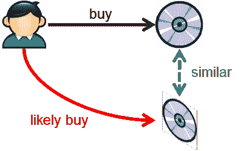

# 从数百种可用算法中选择最佳推荐算法

> 原文：<https://medium.com/mlearning-ai/selecting-the-best-recommendation-algorithm-out-of-hundreds-available-dd826934431a?source=collection_archive---------2----------------------->

## 介绍

构建一个 ***推荐引擎*** 是大多数数据科学家在某个时候做过的事情。T4 绝对不缺乏解决这个商业问题的方法。每当新手开始查阅文献时，他/她都会创建一长串算法和框架。作为一名数据科学家，**归零一个最适合你项目的算法是你的主要任务**。为此，你可以参加考试或实验(或者两者都参加)。

Courtesy — [https://www.mageplaza.com/blog/product-recomendation-how-amazon-succeeds-with-it.html](https://www.mageplaza.com/blog/product-recomendation-how-amazon-succeeds-with-it.html)

## 实验 vs 考试

实验包括**尝试不同的算法，观察哪一个是最好的**。这种试凑法在许多工程研究中使用。这一切都归结于**使用哪个指标来确定最佳指标**。A/B 测试是一种方法，但是必须正确地进行，它才有意义。这也需要大量的资源。如果测试是不可能的，你可以使用一个理论尺度，正如我的这篇文章所描述的。

Courtesy — [https://waat.eu/knowledge-hub/a-b-testing-tools-comparison-google-optimize-vs-optimizely/](https://waat.eu/knowledge-hub/a-b-testing-tools-comparison-google-optimize-vs-optimizely/)

考试是你在真正尝试这些方法之前所做的反思。根据过去的经验，您可能会偏爱某些算法。您的数据的形状和大小可能只允许几个模型。您的业务案例可能需要给予某些因素比其他因素更高的重要性。您的利益相关者/客户可能对分析的了解非常有限，需要每个人都能理解的算法。有无限可能。在下一节中，我将描述一个检查的思维过程，在可用的算法中执行第一级过滤。

## 项目-项目与用户-用户与混合

推荐引擎大致分为**项目-项目、用户-用户和混合**类别。

A) **项目-项目方法(也称为基于内容的过滤)基于项目的相似性**。这种相似性可以通过多种产品特性来描述。例如，在对象的情况下，它可以是形状、大小、颜色、品牌等。在电影的情况下，它可以是类型、持续时间、语言、制作人等。技术细节我就不多说了。对于逐项销售方法，向顾客推销的最后一个故事变成了‘你喜欢这些产品，你可能会喜欢与这些产品非常相似的其他产品，为什么不试试呢？’。

Courtesy — [http://blog.guillaumeagis.eu/recommendation-algorithms-with-apache-mahout/](http://blog.guillaumeagis.eu/recommendation-algorithms-with-apache-mahout/)

B) **用户-用户方法(也称为协同过滤)基于客户/用户的相似性**。在这里，**销售故事变成了‘像你这样的顾客，你为什么不也试试他们呢？**’。现在，这种相似性既可以用显性特征来描述，也可以用隐性特征来描述。例如，我们可以使用年龄、性别、职业、政治倾向等特征将相似的客户分组。这是一个明显的相似之处。另一方面，我们可以分析数据来识别具有相似消费模式的客户，并将他们分组在一起。这是一种隐含的相似性。

Courtesy — [https://indatalabs.com/blog/big-data-behind-recommender-systems](https://indatalabs.com/blog/big-data-behind-recommender-systems)

C) **混合方法，顾名思义，是以上两种**的某种混合。我们不会在本文中讨论这种混合是如何发生的。

使用混合算法可能很诱人，因为它们看起来更全面。它们确实考虑了用户相关和项目相关两个方面。但是如果可解释性也是你关心的问题之一，它们就不是最好的选择。如果你的算法对于非数据科学社区来说是一个黑匣子，没有人会买你的结果。至少截至 2021 年，大多数跨国公司的大多数高级人员接触分析的机会非常有限。同样，在混合算法中，**定制的空间非常有限**。您不能总是调整它们来满足您的需求，这会影响您的最终输出。

Courtesy — [https://www.netsolutions.com/insights/building-recommendation-engine/](https://www.netsolutions.com/insights/building-recommendation-engine/)

**用户对用户方法的推荐对客户来说并不总是有意义**，因为他/她不认识其他与他/她相似的人。因此，**转换率可能会更低**。但是**任何转换都将是一个巨大的胜利**，因为它将标志着客户进入一个全新的空间，这个空间在未来可能会扩大。另一方面，**项目-项目方法的推荐可能有更高的成功率**。但是他们不一定会是大赢家。事实上，在许多情况下，它们将充当快捷方式而不是推荐，因为客户可能知道它们。

你选择其中一类算法的决定将基于对你、你的团队和你的组织来说什么是重要的。根据我的专业经验，我有一个重要的建议。在 B2B 业务中，当你向客户提供推荐时，只有当你有一个交流你的销售故事的互动渠道时，你才可能想去做用户对用户的推荐(这些推荐出现的原因)。否则，你的推荐很可能会被称为荒谬。你仍然可以在没有销售故事的情况下追求用户对用户。但是请记住这个事实。

## 结论

现在你应该已经意识到**决定最终使用哪种算法是非常主观的**。人们无法为此提供一个循序渐进的框架。但是，如果你是一名从事推荐引擎工作的数据科学家，并且在这方面需要帮助，请随时给我留言，安排一次讨论。

最后，我想说**没有“最好”的算法，只有最合适的算法**。作为技术爱好者，我们往往对复杂和精密的方法更感兴趣。但是记住底线非常重要— **最终目标是为企业创造价值**，而不是在数据科学家同事面前炫耀。