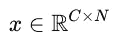
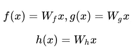
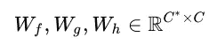
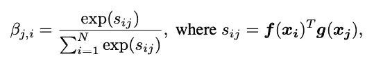
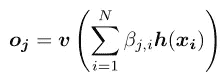
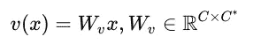
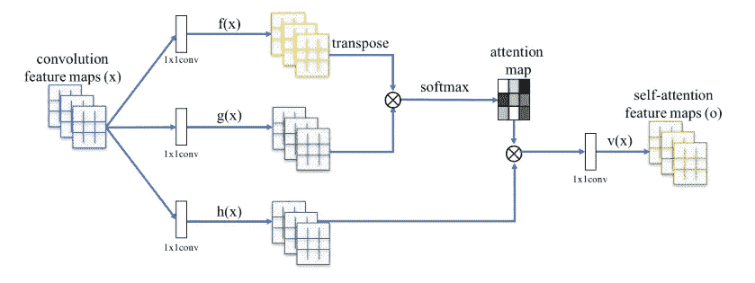
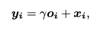
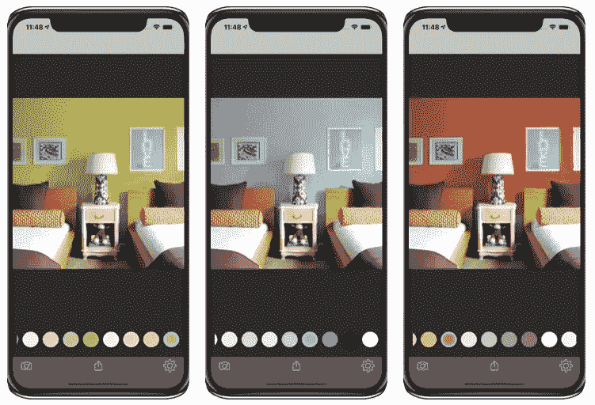

# 卷积神经网络中的自注意

> 原文：<https://medium.com/mlearning-ai/self-attention-in-convolutional-neural-networks-172d947afc00?source=collection_archive---------0----------------------->

我最近在一个网络中加入了自我关注，我训练它来[检测墙壁](https://apps.apple.com/us/app/wall-color-ai/id1440854963)，它提高了墙壁分割的骰子分数。我写这篇短文来总结 CNN 的自我关注。我写下这些笔记，主要是为了让我可以回过头来回忆我所做的事情，但我希望你也会觉得有用。

# 为什么自我关注

自我注意在[这篇文章](https://arxiv.org/pdf/1805.08318.pdf)中有描述。它增加了 CNN 的感受野，而没有增加与非常大的核大小相关的计算成本。

# 它是如何工作的

*   重塑先前隐藏图层中的要素，以便:

其中， *C* 是通道的数量， *N* 是所有其他维度的乘积(我们将在后面看到代码)

*   对 *x* 执行 1x1 卷积，以获得*，f，g 和 h。*这将使通道数从 *C* 变为 *C*:*

*   计算 *f(x)* 和*g(x)*中像素位置之间的一系列 softmax 权重

这些权重被称为“注意力图”，本质上是量化图像中像素 *j* 相对于像素 *i.* 的“重要性”。由于这些权重(β)是在特征集的整个高度和宽度上计算的，感受野不再局限于小核的大小。

*   将自我关注层的输出计算为:

这里， *v* 是另一个 1x1 卷积的输出。请注意，输出的通道数与自我关注层的输入特征数相同。

这是论文中的一张图，它将这些操作可视化

通常，我们设置:C* = C/8。

*   最后一步，我们将输入特征 *x、*添加到输出的加权版本中(伽马是另一个可学习的标量参数):

# Pytorch 实现

以下简短高效的实现来自 [Fast.ai](http://fast.ai)

第 4 行:定义三个 1x1 的 conv 层来创建， *f(x)，g(x)，h(x)* 。这些通常被称为查询、键和值(见第 14 行)

第 13 行:整形为一个大小为 *C x N* 的张量。

第 15 行:按照上面的定义计算 softmax 注意力权重(“bmm”是 torch 中的批量矩阵乘法)。

第 17 行:恢复要素的原始形状

这种实现与论文中描述的算法有些不同(但等效)，因为它将 1x1 卷积 *v(x)* 和 *h(x)* 组合在一起，并调用 is *h(x)* 或“值”。组合的 1x1 conv 层具有 C 个输入通道和 C 个输出通道。这种实现等效于本文中的算法，因为学习两个背对背的 1x1 conv 层等效于学习一个兼容大小的 conv 层。

# 样本结果

我在 UNet 架构中使用了自我关注层，替换了 UNet 模块中的 conv 层。自我关注层的引入提高了分割墙壁的骰子点数。下面是“[墙色 AI](https://apps.apple.com/us/app/wall-color-ai/id1440854963#?platform=iphone) ”应用的一个例子:

Source: [Wall Color AI App](https://apps.apple.com/us/app/wall-color-ai/id1440854963#?platform=iphone)

 [## Mlearning.ai 提交建议

### 如何成为 Mlearning.ai 上的作家

medium.com](/mlearning-ai/mlearning-ai-submission-suggestions-b51e2b130bfb) 

[成为 ML 写手](/mlearning-ai/mlearning-ai-submission-suggestions-b51e2b130bfb)