# Unity 中具有强化学习的自动驾驶汽车

> 原文：<https://medium.com/mlearning-ai/self-driving-car-with-reinforcement-learning-in-unity-88458d13fcd1?source=collection_archive---------4----------------------->

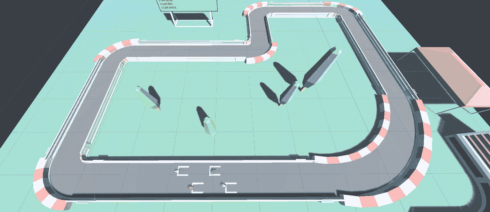

T 他的文章将强调(深度)强化学习解决复杂任务的能力，如让智能体能够自主驾驶而不会与其他物体相撞。这篇文章是一个学术项目的总结，因此我不打算深入研究 Unity 环境，因为基础知识可以在几个在线教程中找到。

# 技术

由于想法是创建一个 3D 环境并使用先进的深度强化学习算法，该项目基于 [Unity](https://unity.com) 及其强大的软件包 [MLAgents](https://github.com/Unity-Technologies/ml-agents) 。所有的脚本都是按照 Unity 的要求用 C#写的。

# 代理人

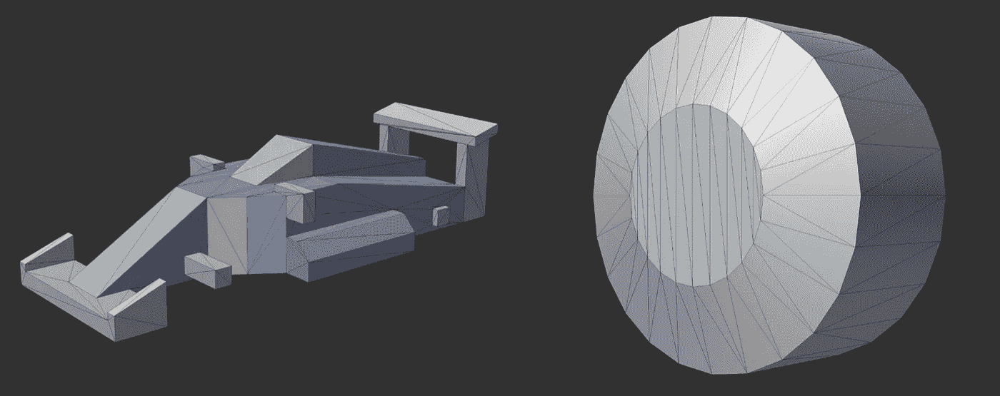

Car model components.

代理是来自[赛车套件](https://www.kenney.nl/assets/racing-kit)的简单车模，一个车身，四个轮子。在此基础上设计了*控制器*和*传感器*。这两者对于在训练期间和之后获得正确的运动都是必须的。从脚本的角度来看，所有的控制逻辑都在附加到汽车的`CarDriver.cs`内部。另一方面，传感器一经配置，就由 Unity 管理。

## 控制

术语“控制”通常指代理如何在特定环境中移动。首先要说的是关于*对撞机。*碰撞器只是一种为了响应物理碰撞而近似包裹物理对象的方法。

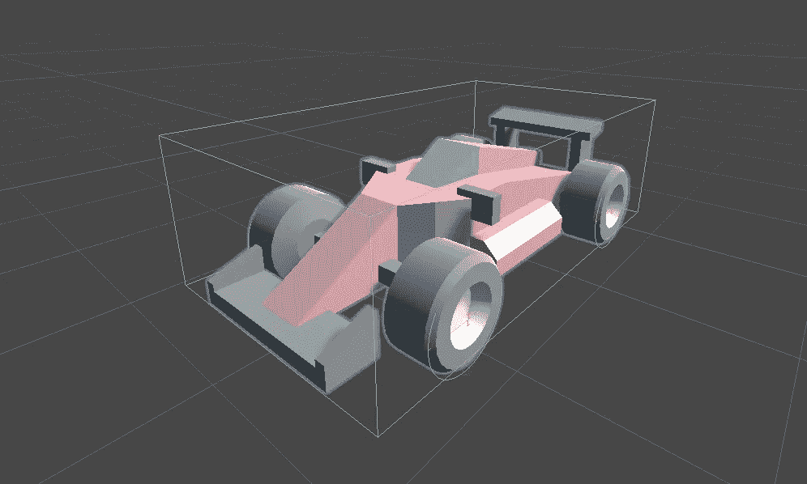

Car colliders.

因此，每个车轮都有一个碰撞器，以便感知道路并对物理力做出反应。此外，车身也有一个碰撞器，以感知与墙壁和其他汽车的碰撞。

可以用不同的方式实现对汽车的控制。在这种情况下，定义为*电机力*和*转向力*的两个力被施加到适当的车轮上(更准确地说，施加到它们的碰撞器上)。

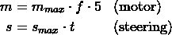

在汽车对象的 Unity 检查器中，可以选择驱动轮和方向盘。运动的所有逻辑都在位于`CarDriver.cs`的函数 **FixedUpdate()，**中，该函数在每一帧中按照独立的间隔被多次调用。因此，在此功能中，每个车轮都被施加了特定的力，即取决于车轮的马达或转向力。

通过查看脚本，您可以注意到，当电机力输入为零时，还有另一个值用于实施制动。就是这样。现在，汽车有了控制和车轮的视觉旋转(像阿克曼转向)。

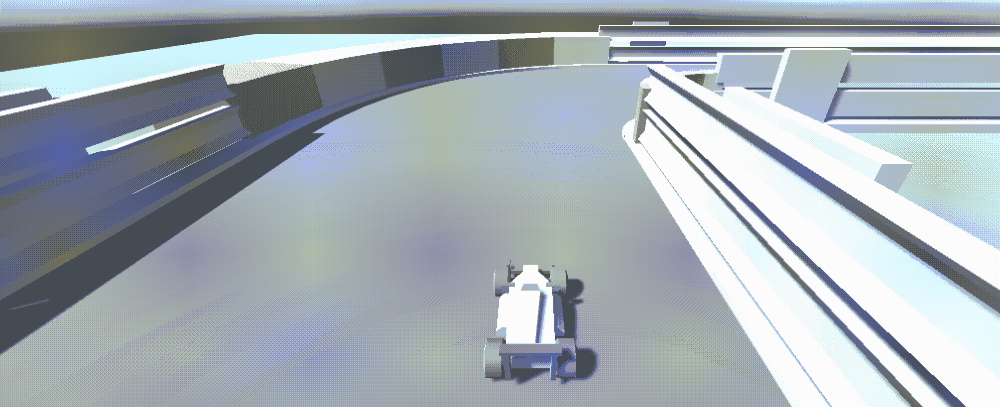

Agent’s control.

## 传感器

为了完成运动，我们只需要一些传感器来感知场景中的三个主要物体:汽车、墙壁、检查站。Unity 有一个名为`RayPerceptionSensorComponent3D`的内置组件，它定义了一个带有原点的传感器。也可以选择每个方向的光线投射数量和许多其他参数。

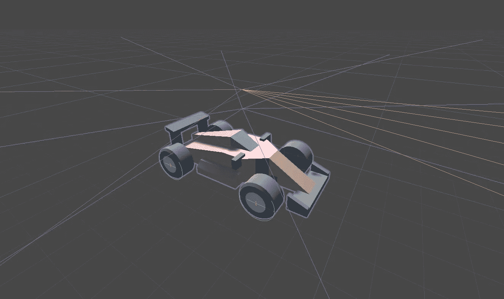

Car sensors.

汽车模型上装有三个传感器。为了便于理解，我给它们都添加了一些颜色:蓝色代表墙壁和汽车；红色和橙色传感器是检查站用的。

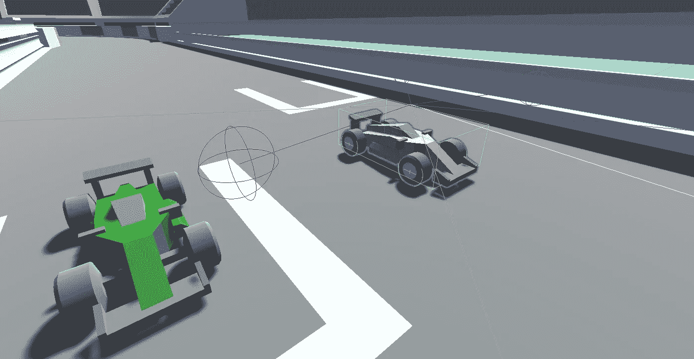

Wall and car hit with the blue sensor (it’s red because of the hit).

*更多观察:*

定义观察值是培训的重要一步。传感器的所有观测值由 Unity 管理，即它们已经是神经网络的输入。此外，我们只是增加了 6 个观察值:3 个是速度向量，3 个是从赛车到下一个检查点的距离向量。这些参数是任意的，所以你应该理解学习环境，并根据代理学习任务所需的信息来选择观察值。

# 学问

一旦代理配置了控件和一些传感器，我们就可以设计训练轨道和测试轨道。前者更复杂，以便帮助概括过程。

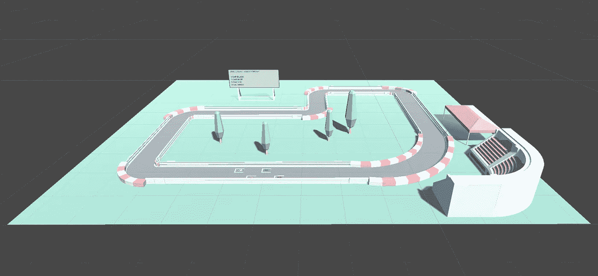

Training track.

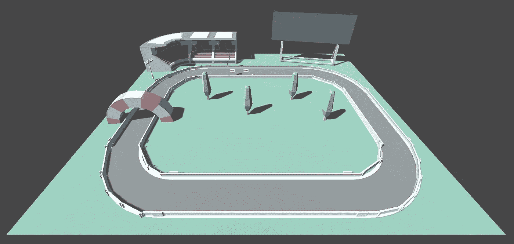

Testing track.

这块板只是显示一些圈速信息的一种方式。在两条轨道上都有看不见的检查点，用来跟踪正确的方向。我们可以称之为检查点系统。

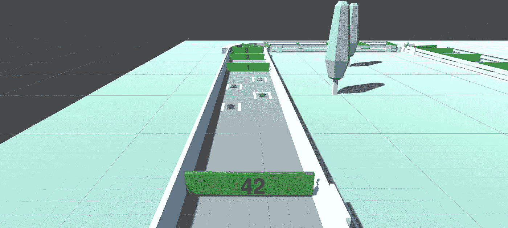

Checkpoint system.

如果汽车通过正确的检查点，它将获得正奖励。另一方面，如果它与墙壁、其他汽车相撞，或者仅仅是通过观察，它会得到负面的回报。后者有助于加快圈速，不要让车停留在同一个位置。这一集在最大步数或汽车完成一圈后结束。最后，考虑多个代理，因为它们的行为影响模型更新。

## 深度 RL 算法

MLAgents 包提供 PPO 和 SAC 作为深度 RL 算法。两者都被用来选择最适合我们任务的。总的来说，选择时可以考虑一些经验条件。例如，SAC 更适合于慢步骤环境，并且采样效率高；PPO 更稳定，学习更快。

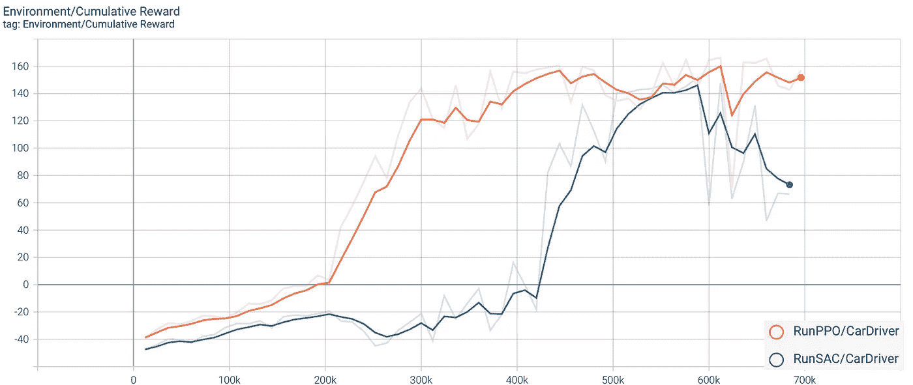

Cumulative reward.

通过仅评估累积奖励，在 700.000 步上进行比较。从图中可以看出，PPO 曲线总是在 SAC 曲线的上方，SAC 曲线大约在 420.000 步之后才开始为正。此外，PPO 在 22 分钟内结束，而 SAC 为 1 小时 21 分钟。结论是 PPO 被证明是最好的:22 分钟的学习时间有可能获得好的结果。

下面你可以看到最终的评估，以便在测试轨道上建立最佳的概括。橙色的车有 PPO 型号，白色的有 SAC 型号。正如你所注意到的，尽管起步位置不同，橙色的那辆车跑得更快，也更有能力完成这一圈。

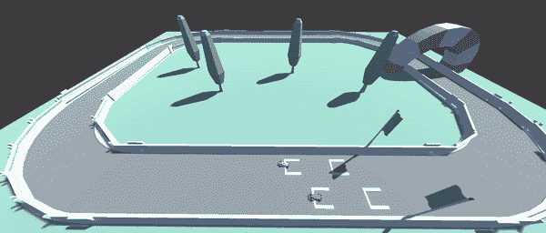

Generalization results.

 [## GitHub - monidp9/IR-Project :"智能机器人"学术项目

### 此时您不能执行该操作。您已使用另一个标签页或窗口登录。您已在另一个选项卡中注销，或者…

github.com](https://github.com/monidp9/IR-Project) 

## [**成为 MLearning.ai** 的作家 ](https://mlearning.substack.com/about)

 [## Mlearning.ai 提交建议

### 如何成为 Mlearning.ai 上的作家

medium.com](/mlearning-ai/mlearning-ai-submission-suggestions-b51e2b130bfb)