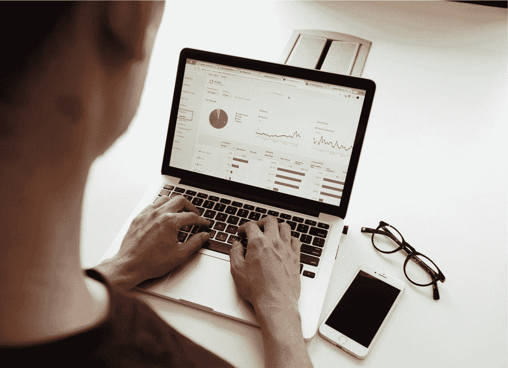

# 成为数据分析师的自我指南

> 原文：<https://medium.com/mlearning-ai/self-guide-to-become-a-data-analyst-9991e5ee70b4?source=collection_archive---------6----------------------->

数据分析师是 21 世纪的工作。如果你正在寻找如何成为一名数据分析师。这里有一个成为数据分析师必须知道或做的事情的指南。

Image by [Campaign Creators](https://unsplash.com/@campaign_creators) on [Unsplash](http://www.unsplash.com)

以下是成为数据分析师必须知道的要点。

## 数学和统计

数学和统计学是数据分析的基础。你必须熟悉的一些数学概念是统计、概率、代数、微积分、线性代数和离散数学。你可以对这些概念有一个基本的了解。这些概念将帮助你在成为数据分析师的后期处理一些复杂的算法。

> 如果你喜欢它的内容，请点击博客。
> 
> 如果你想看更多我的博客，请关注我，因为这对我意义重大。
> 
> 如果你觉得你的朋友喜欢，请与他们分享，谢谢。

## 擅长

了解 Excel 的基础知识很有必要。你不需要成为 excel 专家。对于数据分析师来说，从初级到中级已经足够了。您必须了解 excel 中的基本公式、工作表、使用图表和模板以及格式化数据。这些可以帮助你进行基本的 excel 操作。

## Python 编程

作为一名数据分析师，必须精通 python 编程的基础知识。他/她必须熟悉语法、算法和数据结构。数据分析师必须知道如何使用最先进的库，如 Pandas、Numpy 和 Scipy。

## SQL 和数据库

作为数据分析师，必须熟悉 SQL 查询和常用的数据库命令。他/她必须能够对数据库执行 SQL 操作。数据分析师必须熟悉与数据库和表相关的命令。

## 电源 BI / Tableau

它们用于数据可视化。数据分析师必须知道如何充分利用 PowerBI 或 Tableau。数据分析师必须学会如何生成报告和可视化。他/她必须能够处理数据建模、查询和转换数据。

## 数据准备和验证

作为数据分析师，使您的数据适合问题是您将面临的一个关键。你必须知道如何为问题准备数据。您必须了解并执行数据收集、发现、分析、清理、转换、验证和发布。

## **机器学习库**

你必须知道机器学习的基础知识，知道如何使用最先进的机器学习库，如 sci-kit-learn、Pytorch 和 TensorFlow。

## 探索性分析和建模

数据分析师必须知道回归、聚类和分类等算法。

## 数据叙事

它是关于使用人际交流来帮助观众发展与信息的联系。

[将](https://drive.google.com/file/d/1xxBhMMLGNpcuaXi5B32HgOawBkYdcxY1/view)链接到参考资料

> 这是我在 LinkedIn 上的简介: [Sundar Balamurugan](https://www.linkedin.com/in/sundar-balamurugan-76a50212a/)

 [## Mlearning.ai 提交建议

### 如何成为 Mlearning.ai 上的作家

medium.com](/mlearning-ai/mlearning-ai-submission-suggestions-b51e2b130bfb)