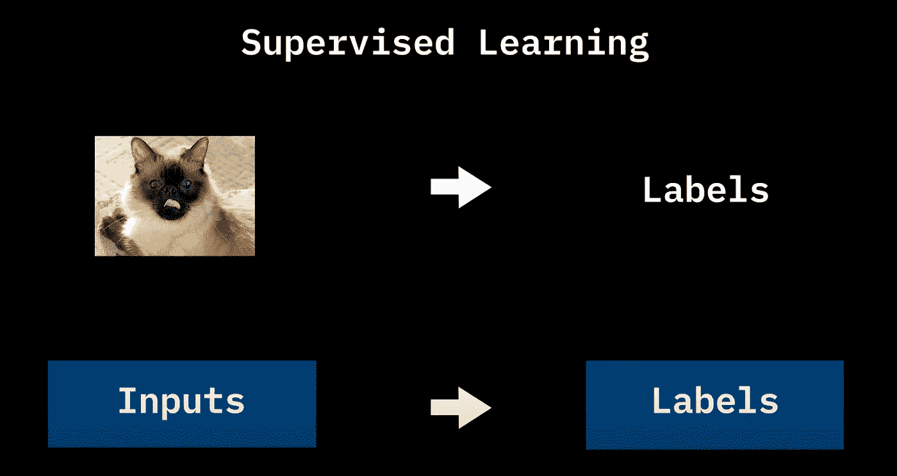
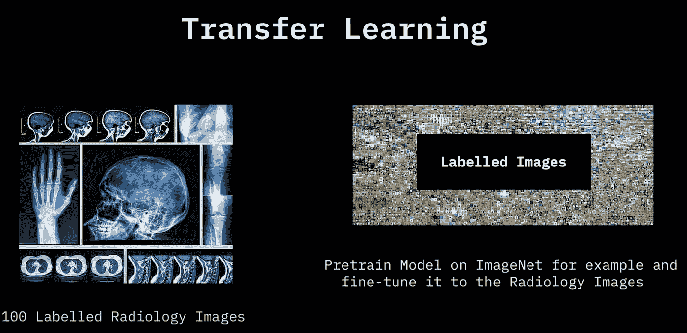
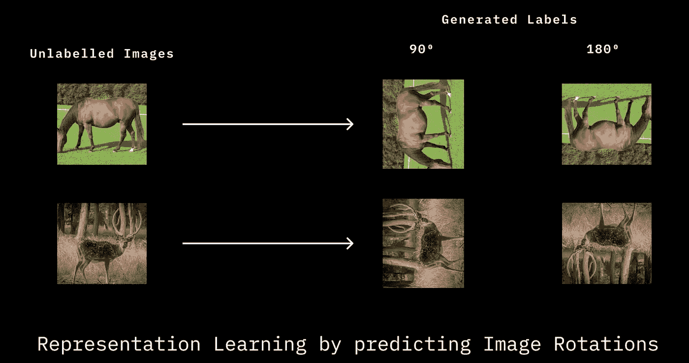

# 自我监督学习简单的解释

> 原文：<https://medium.com/mlearning-ai/self-supervise-learning-d5f2d718678f?source=collection_archive---------5----------------------->

# 为什么要自我监督学习？

> **监督学习**

要讨论自我监督学习，首先，我们需要回顾一下我们在训练模型时所做的事情。我们使用带标签的数据来训练模型，通过迭代地最小化输出标签之间的预测结果来完成分类或回归任务。通过回顾监督学习的过程，我们可以看到模型性能与训练数据集的数量和质量高度相关。

> **如果我们的领域只有很少的数据**

获取大量带标签的数据集并不总是容易的，如果特定领域需要，可能会花费大量的时间和金钱。

> **转移学习**

为了解决我们领域中缺乏标注数据集的问题，出现了一种叫做迁移学习的方法。首先，我们可以在已经存在但有一些与我们的领域相关的大型标记数据集上训练我们的模型。然后，我们使用我们良好的训练模型，通过固定模型的下层来重新训练我们有限数量的数据集。这就是所谓的微调过程。这背后的想法是，模型可以学习如何从现有的大型数据集中提取特征，并在我们的领域中拟合结果。如果我们直接在少量领域数据集上训练我们的模型，这也可以避免过度拟合。

但是显然可以看到，预训练模型所使用的必要数据集与我们的领域没有直接关系。这里出现了一个想法，“如果我们从未标记的数据集训练我们的预训练模型会怎么样？”。

# 什么是自我监督学习？

> **如果我们在预训练模型上学习的数据不需要标记**会怎样

这是自我监督学习的承诺，在许多领域获得巨大的未标记数据集要容易得多。

> **自我监督学习是如何工作的？**

我们获取未标记的数据，并迫使模型从我们主要关心的数据中学习特征表示，我们的目标是获得良好的特征表示，我们可以重用它来微调下游任务。

> **模型如何从数据中学习伟大的表现？**

学习良好表示的一个很好的例子是，我们有从多个角度旋转的图像，我们让我们的模型学习预测图像旋转的角度。

通过分类旋转的程度，模型必须学习图像的表示，例如腿必须与身体连接或者头必须在身体的前面。

# 自我监督学习的好处

噪声数据比正式的标记数据更容易获得。像 NLP 这样的领域需要从一个热点向量预先训练模型，这意味着我们拥有的数据集与其所有向量元素是离散的，不像图像数据集。特征表示更像是数学意义的连续向量。将向量从离散转换为连续需要更多的数据，因为单热向量中的元素不表示它们之间的任何因果关系，这意味着我们需要准备更多的训练过程数据，以给模型提供更多的信息，这就是为什么我们需要自我监督学习。

参赛:https://www.youtube.com/watch?v=bfCs3wqRSQY

 [## Mlearning.ai 提交建议

### 如何成为 Mlearning.ai 上的作家

medium.com](/mlearning-ai/mlearning-ai-submission-suggestions-b51e2b130bfb)