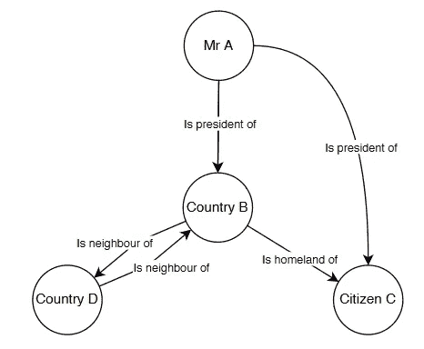
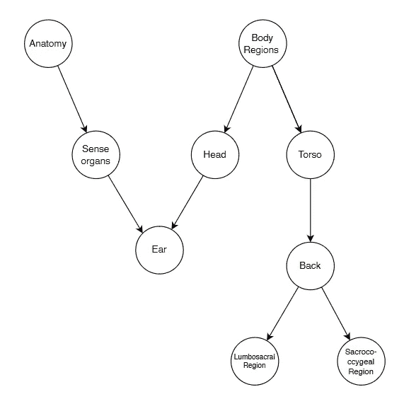

# Python 中基于知识图的语义搜索

> 原文：<https://medium.com/mlearning-ai/semantic-search-via-knowledge-graphs-cc9da99dab4d?source=collection_archive---------2----------------------->

## 你所需要的是获得一个关于你为什么应该关心它们的基本直觉+一个 python 空间片段

语义搜索是一种类似于模糊搜索的艺术——主要区别在于，语义搜索不是搜索近似的**字符串**匹配，而是专注于搜索近似的**概念**匹配。一个理想的语义搜索引擎不会局限于只看拼写错误——它将能够理解查询的意图，即使被查询的文档不包含用于表达信息需求的特定短语，或者如果这些短语在不同的上下文中出现为*假朋友*。

这篇博文的结构如下:

*   *语义搜索及其重要性*
*   *什么是知识图？*
*   *用 Python 构建知识图*
*   *PudMed 对知识图的应用*
*   *结论*


A knowledge graph, at least according to Stable Diffusion

# 语义搜索及其重要性

为了给出语义搜索的结果的具体例子，考虑以下内容:

*   查询:病变
*   收藏:
    –D1:肿瘤微环境
    –D2:模仿一只知更鸟
    –D3:垂怜经·埃利森的早期背景和类型定义的问题
    –D4:头颈部肿瘤患者的第二肿瘤
*   关联函数 R:
    –R(D1):= 1
    –R(D2):= 0
    –R(D3):= 0
    –R(D4):= 1

对于人类来说，这是一个相当简单的查询，唯一的先决条件是知道*肿瘤*是*肿瘤*的另一个词，并且它们都是*病变*的一个子类(并且*病变*与 *eleison* 无关，尽管 Levenshtein 距离很小)。然而，我们仍然需要一种在搜索功能中编码这些知识的方法。

# 什么是知识图？

知识表示的最有用的形式之一是知识图。知识图由一组节点和一组连接它们的边组成，每个节点对应一个标签。每个边缘都有一个属性标签——例如，痤疮可能与肿瘤有关，因为两者都是病变的子类。



A knowledge graph with non-transitive relations. Even though Mr A
is president of Country B and Citizen C, he doesn’t have a defined relationship with
Country D

知识图还可以包含一些额外的信息，比如节点之间的关系(例如一个节点是另一个节点的实例)。还可以用其他元数据对其进行注释，比如谁创建了它或者它是在哪里创建的。关系的本质很少是对称的，但是可以是非传递性的，也可以是传递性的。这意味着不仅需要使用有向边来区分它们的边，而且我们还必须在元数据中存储关于特定图的机制的信息。



Fragment of PubMed’s knowledge graph of MeSH headings. The re-
lationships between nodes are unlabeled, but transitive. *Ear* is a descendant of all
the nodes above it — so not only Sense organs and Head, but also Body regions and
Anatomy. Lumbosacral Region, on the other hand, is a descendant of Body regions, but
not of Anatomy.

# 构建知识图表

构建知识图谱最值得信赖的方法是使用人类专家。然而，我们在精确度上获得的东西，在回忆上失去了——人类可以分析并找到其中联系的概念数量是有限的，潜在边缘的数量随着概念的数量呈指数增长。因此，对于基于专家的图形创建来说，手工处理每个可能的边是不切实际的。

为了规避这个问题，我们可以使用众包。众包是一个利用群体的集体智慧来解决问题的过程，在这个过程中，人们被给予一项任务并因其贡献而获得报酬，或者志愿者因其参与而获得奖励。在这种情况下，参与者可以访问一个大的知识图，该知识图包括带有标签的节点和边。然后，他们可以分析这些概念和关系，以确定哪些节点是相关的以及它们是如何相关的，从而创建一个知识图。这种方法已经成功地应用于许多不同的领域，如医学或地理学。

我们也可以选择另一种方法，基于顶点的方法。我们可以输入尽可能多的特定节点的信息，合并不同实体之间多余的顶点，而不是管理边。这种方法降低了我们的召回率，因为我们可能会忘记添加现有的连接，但更具可伸缩性。

最后，有许多自动方法可供我们选择。最常用的是基于自然语言处理(NLP)算法和知识库表示，将每个连接存储为(主语、谓语、宾语)三元组。我们可以使用自然语言处理技术的组合——实体识别、实体链接、依存分析和词性标注——从文本源中提取它们。

要将 spaCy 用于此目的，首先需要安装库并下载一个预先训练好的模型。这可以使用以下命令来完成:

```
pip install spacy
python -m spacy download en_core_web_md
```

一旦安装了 spaCy 并下载了预先训练的模型，就可以开始从文本中提取知识三元组了。以下是如何做到这一点的示例:

```
import spacy
```

```
nlp = spacy.load('en_core_web_md')

def extract_triplets(sentence):
    doc = nlp(sentence)  # Parse the sentence with spaCy
    triplets = []
    for noun_chunk in doc.noun_chunks:  # Iterate over the noun chunks in the sentence
        # Extract the text of the noun chunk and use it as the subject of the triplet
        subject = noun_chunk.text
        # Find the verb that governs the noun chunk and use it as the predicate of the triplet
        for token in noun_chunk.root.children:
            if token.dep_ == "ROOT":
                predicate = token.text
        # Find the direct object of the verb and use it as the object of the triplet
        for token in noun_chunk.root.children:
            if token.dep_ == "dobj":
                object = token.text
        triplets.append((subject, predicate, object))
    return triplets

# Define a sentence to parse
sentence = "The quick brown fox jumps over the lazy dog."

# Extract the triplets from the sentence
triplets = extract_triplets(sentence)

# Print the triplets
for triplet in triplets:
    print(triplet)
```

这段代码将识别句子中每个名词块的主语、谓语和宾语，并将它们作为三元组列表返回。对于给定的句子，此代码将输出以下三元组:

```
('The quick brown fox', 'jumps', 'the lazy dog')
```

请记住，这只是一个简单的例子，三元组提取逻辑的实际实现将取决于您的特定用例以及您正在处理的文本。

# PudMed 对知识图的应用

在生物医学出版物领域，PubMed 的搜索引擎使用知识图进行同义词和依存关系识别。他们的知识图(包括但不限于医学主题词、网格)以树的形式存储，其中一部分显示在图上。这个 KG 没有链接到其边的依赖类型，因为它们都表示相同的关系——从 X 指向 Y 的边意味着“Y 属于 X”。

PubMed 的搜索引擎在索引新文档和查询预先存在的集合时都使用它的 KG。当新的生物医学文章出现在 MEDLINE 数据库中时，使用 PubTator 注释服务对它们进行分析。这样，每个文档都被映射到预定义的 MEDLINE 词汇表的网格标签和副标题，以及

*   不同的拼写，
*   药品品牌和通用名，
*   出版物类型，
*   药理作用术语，
*   补充概念和物质名称，
*   同义词。

在查询期间，PubMed 也使用这种方法——这次是为了增强用户对知识图的同义词顶点的请求。例如，如果用户搜索“牙痛”，PubMed 会将其翻译为以下查询:“牙痛”[网状术语]或“牙痛”[所有字段]或“牙痛”[所有字段]或“牙痛”[所有字段]

然而，为了替换一个单词，它需要以完全相同的形式包含在同义词列表中——例如，牙痛不会被识别为牙痛的同义词。幸运的是，NLP 的最新进展帮助我们缓解了这个问题。

# 结论

总之，这篇博文讨论了语义搜索及其潜在的好处。它解释了理想的语义搜索引擎应该能够理解查询背后的意图，即使被查询的文档不包含查询中使用的特定短语。这篇博文还讨论了知识图通过对概念之间关系的知识进行编码，在改善语义搜索方面可以发挥的作用。

这篇博客文章提供了几种构建知识图表的方法，包括使用人类专家、众包和基于自然语言处理算法的自动方法。它还讨论了 PubMed 的搜索引擎如何使用知识图，通过将文档映射到预定义的词汇和用同义词增强用户查询来改善其结果。总的来说，这篇博文对语义搜索的概念以及知识图在改进语义搜索中的作用进行了有益的介绍。

[在 Twitter 上关注我](http://twitter.com/wwydmanski)了解更多机器学习！

[](/mlearning-ai/mlearning-ai-submission-suggestions-b51e2b130bfb) [## Mlearning.ai 提交建议

### 如何成为 Mlearning.ai 上的作家

medium.com](/mlearning-ai/mlearning-ai-submission-suggestions-b51e2b130bfb)